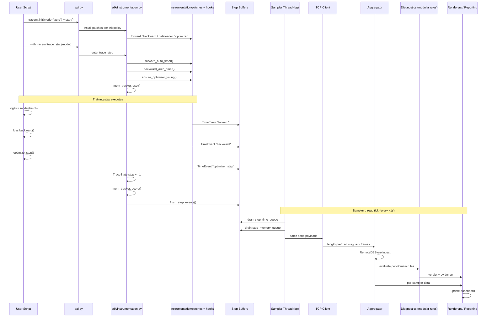
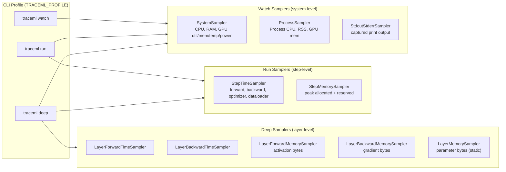
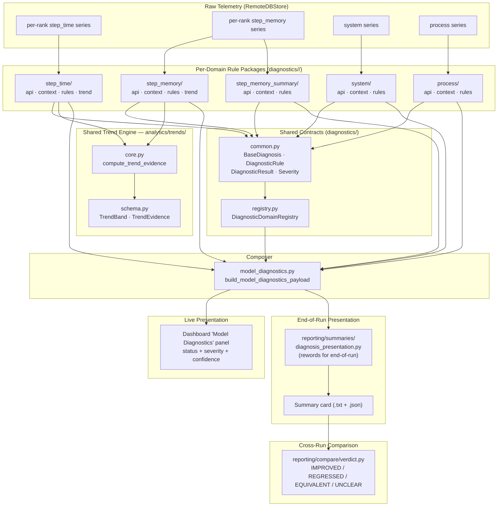
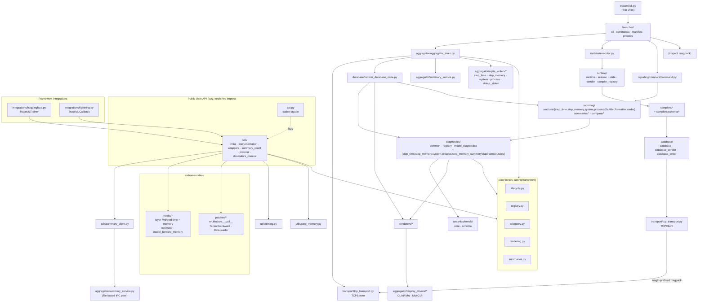
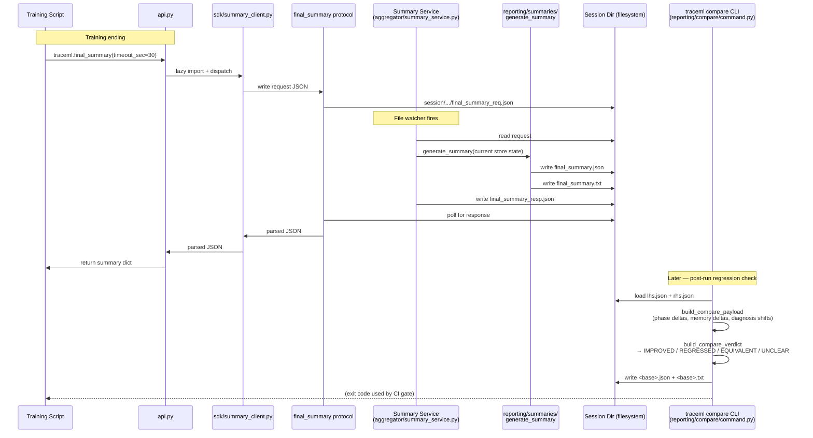
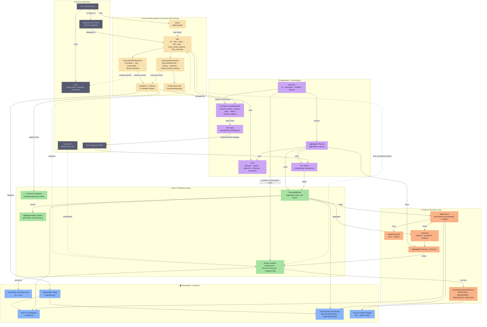

# TraceML Architecture Diagrams

**Generated:** 2026-04-07 · **Rewritten:** 2026-05-01 for v0.2.13 main
**Version:** 0.2.13 (upstream `traceopt-ai/traceml@main`)
**Purpose:** Visual documentation for codebase understanding, technical papers, and investor/partner presentations.

All diagrams are in Mermaid syntax (GitHub renders natively). SVG exports in this folder are regenerated from these sources via `mmdc` (see "How to re-export SVGs" at the bottom).

**Companion docs:** [Architecture overview](../developer_guide/architecture.md) · [Code walkthroughs](../deep_dive/code-walkthroughs.md) · [PyTorch Q&A](../deep_dive/pytorch-qa.md)

**What changed since v0.2.9:**
- `utils/hooks/` + `utils/patches/` consolidated into a new top-level `instrumentation/` package
- New `sdk/` package owning the explicit `init()` / `start()` / `wrap_*()` API surface
- New `core/` package (lifecycle, registry, telemetry, rendering, summaries) — cross-cutting framework
- `aggregator/summaries/` + top-level `compare/` consolidated into a new `reporting/` package (`reporting/sections/`, `reporting/summaries/`, `reporting/compare/`)
- `cli.py` split into a `launcher/` package (cli, commands, manifest, process)
- Diagnostics fully refactored into per-domain rule-based subpackages: each of `step_time`, `step_memory`, `step_memory_summary`, `system`, `process` now exposes `{api,context,rules}.py` and registers with `diagnostics/registry.py` (PR #91)
- `aggregator/sqlite_writers/` split per-domain
- Samplers gained a `schema/` subpackage and `runtime_context.py` / `system_manifest.py` helpers

---

## 1. System Architecture (High-Level)

**SVG:** [`01-system-architecture.svg`](01-system-architecture.svg)

Three-process design: a **CLI launcher** spawns (a) an **aggregator process** (TCP server, store, renderers, summary service, modular rule-based diagnostics engine) and (b) N **training ranks** via `torchrun`. Each rank runs an independent TraceMLRuntime with samplers shipping telemetry over TCP.

```mermaid
graph TB
    subgraph CLI["CLI Launcher (launcher/cli.py)"]
        PARSE["Parse Args<br/>watch | run | deep | compare | inspect"]
        MANIFEST["Write Manifest<br/>+ Code Manifest (AST scan)"]
        SPAWN["Spawn Processes"]
    end

    subgraph AGG["Aggregator Process (aggregator/aggregator_main.py)"]
        TCP_SERVER["TCP Server :29765"]
        REMOTE_DB["RemoteDBStore"]
        SQLITE["SQLite Writers<br/>(per-domain)"]
        subgraph DIAG["Diagnostics Engine (diagnostics/)"]
            REGISTRY["registry.py<br/>DiagnosticDomainRegistry"]
            COMMON["common.py<br/>BaseDiagnosis + DiagnosticRule"]
            DIAG_ST["step_time/<br/>api+context+rules"]
            DIAG_SM["step_memory/<br/>api+context+rules"]
            DIAG_SMS["step_memory_summary/<br/>api+context+rules"]
            DIAG_SYS["system/<br/>api+context+rules"]
            DIAG_PROC["process/<br/>api+context+rules"]
            COMPOSER["model_diagnostics.py<br/>composer"]
        end
        subgraph RENDERERS["Renderers + Reporting"]
            R_STEP["renderers/<br/>step time + memory"]
            R_LAYER["renderers/<br/>layer time + memory"]
            R_SYS["renderers/<br/>system + process"]
            R_DIAG["renderers/<br/>diagnostics panel"]
            R_REPORT["reporting/sections/<br/>per-domain builders"]
        end
        subgraph DISPLAY["Display Drivers"]
            CLI_DRIVER["CLI Driver (Rich)"]
            NICEGUI["NiceGUI :8765"]
        end
        SUMMARY_SVC["Summary Service<br/>aggregator/summary_service.py<br/>(file-based request/response)"]
    end

    subgraph RANK0["Training Rank 0"]
        RUNTIME0["TraceMLRuntime<br/>runtime/runtime.py"]
        SAMPLERS0["Samplers (profile-gated)<br/>via runtime/sampler_registry.py"]
        TCP_CLIENT0["TCP Client"]
    end

    subgraph RANKN["Training Rank N"]
        RUNTIME1["TraceMLRuntime"]
        SAMPLERS1["Samplers"]
        TCP_CLIENT1["TCP Client"]
    end

    subgraph USER["User Training Script"]
        IMPORT["import traceml"]
        INIT["traceml.init(mode=auto|manual|selective)<br/>+ traceml.start()"]
        TRACE_STEP["traceml.trace_step(model)"]
        TRACE_MODEL["traceml.trace_model_instance(model)"]
        WRAPPERS["traceml.wrap_dataloader_fetch / wrap_forward<br/>wrap_backward / wrap_optimizer"]
        FINAL_SUM["traceml.final_summary()"]
    end

    PARSE --> MANIFEST --> SPAWN
    SPAWN -->|"subprocess"| AGG
    SPAWN -->|"torchrun"| RANK0
    SPAWN -->|"torchrun"| RANKN

    USER --> SAMPLERS0
    SAMPLERS0 --> TCP_CLIENT0
    SAMPLERS1 --> TCP_CLIENT1
    TCP_CLIENT0 -->|"length-prefixed msgpack"| TCP_SERVER
    TCP_CLIENT1 -->|"length-prefixed msgpack"| TCP_SERVER

    TCP_SERVER --> REMOTE_DB
    REMOTE_DB --> SQLITE
    REMOTE_DB --> DIAG
    DIAG --> RENDERERS
    REMOTE_DB --> RENDERERS
    RENDERERS --> DISPLAY
    REMOTE_DB --> SUMMARY_SVC

    FINAL_SUM -.->|"file-based IPC"| SUMMARY_SVC
```



**Key design principles:**
- No shared memory between processes — all communication via TCP or file-based IPC
- **Fail-open:** training continues if aggregator crashes
- Per-rank autonomy: each rank runs its own sampler thread
- `traceml.init(...)` is the explicit initialization handshake (auto/manual/selective patch policy)
- `traceml.final_summary()` is the programmatic handshake with the summary service

---

## 2. Data Flow — Per Training Step

**SVG:** [`02-data-flow.svg`](02-data-flow.svg)

What happens during one `trace_step(model)` call. Step boundaries are set by the context manager; per-phase timing is captured by hooks and patches installed by `traceml.init(...)` (or lazily on first decorator use); samplers drain step buffers into queues on a background thread.



**Key design principles:**
- **Non-blocking GPU timing** — CUDA events resolved asynchronously; no `cudaDeviceSynchronize()`
- Events buffered in deques, drained by sampler thread — training never waits on telemetry
- `traceml.init(mode=...)` decides which patches install at startup (auto = all, manual = none, selective = explicit set)
- Diagnostics re-evaluated each tick on the fresh RemoteDBStore state via the modular rule-based engine

---

## 3. Sampler Architecture — Profile Modes

**SVG:** [`03-sampler-architecture.svg`](03-sampler-architecture.svg)

Each CLI profile enables a superset of the previous mode's samplers. All share the same `BaseSampler` interface (DB + incremental sender). Profile-to-sampler wiring lives in `runtime/sampler_registry.py`.



**Overhead budget:**
- `watch`: ~0% — system polls only
- `run`: <1% — CUDA events are non-blocking
- `deep`: 2–5% — per-layer hooks have measurable overhead

---

## 4. Diagnostics Pipeline

**SVG:** [`04-diagnostics-pipeline.svg`](04-diagnostics-pipeline.svg)

**Modular rule-based engine (refactored in PR #91, v0.2.13).** Raw per-rank time-series from `RemoteDBStore` flow through per-domain `{api, context, rules}.py` packages, each registered with `diagnostics/registry.py`. The composer in `model_diagnostics.py` merges domain verdicts into one payload for live UI, end-of-run summary, and cross-run compare.



**Diagnosis kinds:**

| Domain | Kinds (typical) |
|---|---|
| step_time | `BALANCED`, `INPUT_BOUND`, `COMPUTE_BOUND`, `WAIT_HEAVY`, `INPUT_STRAGGLER`, `COMPUTE_STRAGGLER`, `STRAGGLER`, `NO_DATA` |
| step_memory | `BALANCED`, `HIGH_PRESSURE`, `IMBALANCE`, `CREEP_EARLY`, `CREEP_CONFIRMED`, `NO_DATA` |
| step_memory_summary | end-of-run reword of step_memory verdicts with severity/confidence |
| system | host-level utilization/temperature/power thresholds (issued in v0.2.13) |
| process | per-process GPU underutilization detection (issued in v0.2.13) |

Each verdict carries `severity` (info/warn/crit), `confidence`, and an `evidence` payload (window size, worst rank, gap, trend %).

---

## 5. Module Dependencies (main, v0.2.13)

**SVG:** [`05-module-dependencies.svg`](05-module-dependencies.svg)

How the major modules depend on each other in the v0.2.13 layout. The **dashed edges** indicate lazy imports — `import traceml` does NOT pull torch until a training API is actually called. The package surface is split across `api.py` (façade), `sdk/` (real implementation), `instrumentation/` (hooks + patches), `core/` (cross-cutting framework), `runtime/` (per-rank), `aggregator/` (server), `reporting/` (summaries + compare), and `launcher/` (CLI).



---

## 6. Summary Service + Compare Flow

**SVG:** [`06-summary-compare-flow.svg`](06-summary-compare-flow.svg)

Shows how the training script requests a finalized summary mid-run or at end-of-run, and how two saved summaries flow through `traceml compare` to produce a regression verdict. In v0.2.13 the public entry point is `traceml.final_summary()` (lazy-resolved through `api.py` to `sdk/summary_client.py`), and compare lives at `reporting/compare/`.



**Why file-based IPC?** The existing TCP channel is one-way (ranks → aggregator). Adding bidirectional RPC would complicate transport. Files on the shared session root are simpler, debuggable with `ls`, and robust to aggregator restarts.

---

## 7. Layered View — Frontend / Backend / Data / Agents

**SVG:** [`07-layered-view.svg`](07-layered-view.svg)

The previous six diagrams are organized by **process boundaries** (§1, §5), **sequence** (§2, §6), **profile** (§3), or **subsystem** (§4). This §7 is **orthogonal** — same system, grouped by *concern tier* (presentation / application / analysis / data / instrumentation / external). Use this lens when explaining TraceML to an audience that thinks in 3-tier / backend-frontend terms.



**What each tier owns:**

| Tier | Responsibility | Example signals that a component belongs here |
|---|---|---|
| **Frontend / Presentation** | Anything a human looks at | Rich tables, web charts, text summary cards, compare reports |
| **Application / Orchestration** | Process lifecycle, wiring, transport, cross-cutting framework | Spawns subprocesses, manages TCP, drives sampler thread, owns `core/` |
| **Analysis / Business Logic** | Turns numbers into verdicts | Uses thresholds/policy, produces `INPUT_BOUND`/`REGRESSED`/`CREEP_CONFIRMED` etc. |
| **Data / Persistence** | Where telemetry actually lives | Deques, per-domain SQLite writers, JSON files on disk |
| **Instrumentation Agents** | In-process code that watches training | SDK, hooks, patches, samplers — runs *inside* the training Python process |
| **External Interfaces** | What TraceML does not own | PyTorch itself, user's training code, loopback network, filesystem |

**Why this view matters:**

- **Onboarding a web/backend engineer:** they can look at one tier at a time. Everything below the "Application" line would be familiar to them (DB, server, cache, queue analogues); everything above is "UX"; the "Agents" tier is the unusual piece that makes TraceML what it is.
- **Scoping contribution work:** most `good first issue` work touches one tier cleanly. Issue #18 (OOM attribution) is **Agents**. Issue #24 (runtime resilience) is **Agents ∩ Application**. Phase-2 (test infrastructure) will mostly add to **Data + Analysis** tier boundaries.
- **Design review leverage:** if a proposed change leaks across three tiers, that's a red flag. E.g., if a new metric requires changes in Samplers + Database + Diagnostics + Reporting + Dashboard, ask whether you're adding an orthogonal concern instead of reusing existing machinery.

**Cross-reference to the process-centric §1:** every component in §7 maps 1:1 to §1. Use §1 when the question is "which process runs this?" and §7 when the question is "which concern tier does this belong to?". They're complementary, not competing.

---

## 8. Extraction Mechanisms — How TraceML Pulls Each Metric

**SVG:** [`08-extraction-mechanisms.svg`](08-extraction-mechanisms.svg)

A **lookup chart**, not an architecture diagram. Each row is a complete answer to the question *"how does TraceML obtain this specific number?"* Read left-to-right: **what is observed → which TraceML file does the work → which external API is actually called.**

This is the diagram to open when you want to understand *how* — the rest of the diagrams answer *where* and *when*.

> Every row was verified line-by-line against the v0.2.13 source. Rows marked ⚠ flag scaffolding that exists in the codebase but is not currently wired (no caller / no consuming sampler).

```mermaid
graph LR
    subgraph METRIC["📊 What TraceML observes"]
        M01["Forward time<br/>per step (auto)"]
        M02["Backward time<br/>per step (auto)"]
        M03["Dataloader<br/>fetch time"]
        M04["Optimizer<br/>step time"]
        M05["Forward time<br/>per layer"]
        M06["Backward time<br/>per layer"]
        M07["Peak GPU memory<br/>per step"]
        M08["Parameter bytes<br/>per layer (static)"]
        M09["Activation bytes<br/>per layer (forward)"]
        M10["Gradient bytes<br/>per layer (backward)"]
        M11["⚠ Whole-model<br/>forward peak memory<br/>(scaffolding only)"]
        M12["Host CPU% / RAM"]
        M13["Per-GPU util / mem<br/>temp / power"]
        M14["Per-process<br/>CPU / RSS"]
        M15["Per-process<br/>GPU memory"]
        M16["Stdout / stderr<br/>from training"]
        M17["Custom timed regions<br/>(user-defined)"]
    end

    subgraph MECH["🔧 TraceML mechanism (file in src/traceml/)"]
        X01["instrumentation/patches/<br/>forward_auto_timer_patch.py"]
        X02["instrumentation/patches/<br/>backward_auto_timer_patch.py"]
        X03["instrumentation/patches/<br/>dataloader_patch.py"]
        X04["instrumentation/hooks/<br/>optimizer_hooks.py"]
        X05["instrumentation/hooks/<br/>layer_forward_time_hooks.py"]
        X06["instrumentation/hooks/<br/>layer_backward_time_hooks.py"]
        X07["utils/step_memory.py<br/>StepMemoryTracker"]
        X08["utils/layer_parameter_memory.py<br/>collect_layer_parameter_memory"]
        X09["instrumentation/hooks/<br/>layer_forward_memory_hooks.py"]
        X10["instrumentation/hooks/<br/>layer_backward_memory_hooks.py"]
        X11["instrumentation/hooks/<br/>model_forward_memory_hooks.py<br/>⚠ no sampler · attach_*() never called"]
        X12["samplers/system_sampler.py<br/>(rank-0 only)"]
        X13["samplers/system_sampler.py<br/>(rank-0 only)"]
        X14["samplers/process_sampler.py"]
        X15["samplers/process_sampler.py"]
        X16["runtime/stdout_stderr_capture.py<br/>+ samplers/stdout_stderr_sampler.py"]
        X17["sdk/instrumentation.py<br/>@trace_time decorator"]
    end

    subgraph SCAFF["⚙️ Shared scaffolding (utils/)"]
        S1["timing.py<br/>timed_region() · TimeEvent<br/>event.elapsed_time() · time.time()"]
        S2["cuda_event_pool.py<br/>pool of torch.cuda.Event<br/>(enable_timing=True, max=2000)"]
        S3["layer hooks bypass timed_region<br/>and call time.perf_counter() directly"]
    end

    subgraph API["🐍 External API actually called"]
        A01["monkey-patch<br/>nn.Module.__call__"]
        A02["monkey-patch<br/>torch.Tensor.backward<br/>+ torch.autograd.backward"]
        A03["monkey-patch<br/>DataLoader.__iter__"]
        A04["torch.optim.optimizer.<br/>register_optimizer_step_pre/post_hook"]
        A05["module.register_forward_pre_hook<br/>+ module.register_forward_hook"]
        A06["module.register_full_backward_pre_hook<br/>+ register_full_backward_hook"]
        A07["torch.cuda.reset_peak_memory_stats<br/>+ max_memory_allocated/reserved"]
        A08["model.named_modules()<br/>+ p.parameters(recurse=False)<br/>+ p.element_size() * p.nelement()"]
        A09["module.register_forward_hook<br/>→ output.numel() * .element_size()"]
        A10["module.register_full_backward_hook<br/>→ grad_output.numel() * .element_size()"]
        A11["model.register_forward_pre_hook<br/>+ register_forward_hook<br/>+ torch.cuda.reset_peak_memory_stats<br/>+ max_memory_allocated/reserved"]
        A12["psutil.cpu_percent(interval=None)<br/>psutil.virtual_memory()"]
        A13["pynvml.nvmlDeviceGet:<br/>UtilizationRates · MemoryInfo<br/>Temperature · PowerUsage<br/>PowerManagementLimit"]
        A14["psutil.Process(pid).cpu_percent<br/>+ memory_info().rss"]
        A15["torch.cuda.memory_allocated(i)<br/>+ memory_reserved(i)<br/>+ get_device_properties(i).total_memory"]
        A16["sys.stdout / sys.stderr swap<br/>with StringIO subclass"]
        A17["wraps user fn in<br/>timed_region(name, scope, use_gpu)"]
    end

    M01 --> X01 --> A01
    M02 --> X02 --> A02
    M03 --> X03 --> A03
    M04 --> X04 --> A04
    M05 --> X05 --> A05
    M06 --> X06 --> A06
    M07 --> X07 --> A07
    M08 --> X08 --> A08
    M09 --> X09 --> A09
    M10 --> X10 --> A10
    M11 -.->|"orphan"| X11 -.-> A11
    M12 --> X12 --> A12
    M13 --> X13 --> A13
    M14 --> X14 --> A14
    M15 --> X15 --> A15
    M16 --> X16 --> A16
    M17 --> X17 --> A17

    X01 -.->|"uses"| S1
    X02 -.->|"uses"| S1
    X03 -.->|"uses"| S1
    X04 -.->|"uses"| S1
    X04 -.->|"uses"| S2
    X05 -.->|"uses"| S2
    X05 -.->|"and"| S3
    X06 -.->|"uses"| S2
    X06 -.->|"and"| S3
    X17 -.->|"uses"| S1
    S1 -.->|"GPU timing via"| S2

    classDef metric fill:#89b4fa,stroke:#89b4fa,color:#1e1e2e
    classDef metricOrphan fill:#89b4fa,stroke:#f38ba8,stroke-width:3px,stroke-dasharray:5 3,color:#1e1e2e
    classDef mech fill:#f9e2af,stroke:#f9e2af,color:#1e1e2e
    classDef mechOrphan fill:#f9e2af,stroke:#f38ba8,stroke-width:3px,stroke-dasharray:5 3,color:#1e1e2e
    classDef scaff fill:#cba6f7,stroke:#cba6f7,color:#1e1e2e
    classDef scaffNote fill:#fab387,stroke:#fab387,color:#1e1e2e
    classDef api fill:#a6e3a1,stroke:#a6e3a1,color:#1e1e2e
    classDef apiOrphan fill:#a6e3a1,stroke:#f38ba8,stroke-width:3px,stroke-dasharray:5 3,color:#1e1e2e

    class M01,M02,M03,M04,M05,M06,M07,M08,M09,M10,M12,M13,M14,M15,M16,M17 metric
    class M11 metricOrphan
    class X01,X02,X03,X04,X05,X06,X07,X08,X09,X10,X12,X13,X14,X15,X16,X17 mech
    class X11 mechOrphan
    class S1,S2 scaff
    class S3 scaffNote
    class A01,A02,A03,A04,A05,A06,A07,A08,A09,A10,A12,A13,A14,A15,A16,A17 api
    class A11 apiOrphan
```



**The two extraction strategies in one chart:**

1. **PyTorch interception** (rows 1–11, 17) — TraceML hijacks PyTorch itself. Either by **monkey-patching** core methods (rows 1–3: `nn.Module.__call__`, `Tensor.backward`, `DataLoader.__iter__`) or by **registering official hooks** (rows 4–6, 9–11: `register_optimizer_step_*_hook`, `register_forward_*_hook`, `register_full_backward_*_hook`). Memory is read directly from CUDA's bookkeeping (rows 7, 11: `reset_peak_memory_stats` + `max_memory_allocated/reserved`) or computed from tensor metadata (rows 8–10: `numel * element_size`). Row 17 (`@trace_time`) lets users opt into the same timing infrastructure for their own functions.

2. **OS-level polling** (rows 12–16) — TraceML asks the operating system, not PyTorch. `psutil` for CPU/RAM/process metrics; `pynvml` (NVIDIA Management Library) for GPU utilization/temperature/power straight from the driver; `sys.stdout`/`stderr` swap for log capture.

**Why GPU timing has its own scaffolding:** rows 1–6 all need wall-clock GPU timing without blocking the training step. A simple CPU stopwatch doesn't work because GPU work is asynchronous — the kernel launch returns immediately while the GPU is still computing. The solution is `utils/cuda_event_pool.py`: a reusable pool of `torch.cuda.Event(enable_timing=True)` objects (max 2000). Each timed region records a start and end event into the pool; later, `event.elapsed_time(other_event)` returns the GPU duration in milliseconds. Events are resolved asynchronously by the sampler thread, so training never blocks on a `cudaDeviceSynchronize`.

**Two CPU clocks live side by side:** `utils/timing.py`'s `timed_region()` uses `time.time()` (wall-clock seconds), but the layer-level forward/backward time hooks bypass `timed_region()` and call `time.perf_counter()` directly — which is monotonic and immune to wall-clock adjustments. Both still produce numbers in the same TimeEvent dataclass; the choice exists because the layer hooks have their own pre/post buffer and don't need the broader `timed_region()` lifecycle.

**Row 11 is dead code in v0.2.13:** `instrumentation/hooks/model_forward_memory_hooks.py` defines `attach_model_forward_memory_hooks()` and a `model_forward_memory_queue`, but a codebase grep finds *no callers and no consuming sampler*. The hook would have given a finer-grained reading than `StepMemoryTracker` (forward-only peak vs whole-step peak) but the wiring is incomplete on main. Today, row 7 (`utils/step_memory.py`) is the only memory-peak signal that actually reaches the dashboard.

**The mental shortcut:** if the metric is something PyTorch knows about (a tensor, a module call, a CUDA allocation), it's pulled by `instrumentation/` + `utils/`. If it's something the OS knows about (CPU%, GPU driver state, stdout), it's pulled by a sampler with `psutil`/`pynvml`/`sys`.

---

## How to Use These Diagrams

### In GitHub README/docs
Mermaid is natively rendered by GitHub. Copy any code block above into a `.md` file.

### To re-export SVGs

```bash
# Option A: Mermaid CLI (used to generate the SVGs in this folder)
npm install -g @mermaid-js/mermaid-cli
# Or use a per-invocation puppeteer config to enable --no-sandbox in containers:
cat > /tmp/puppeteer-config.json <<'EOF'
{ "args": ["--no-sandbox", "--disable-setuid-sandbox", "--disable-dev-shm-usage"] }
EOF
mmdc -p /tmp/puppeteer-config.json -i ARCHITECTURE_DIAGRAMS.md -o out.pdf  # bulk export
# Or per-block: extract each ```mermaid block to a .mmd file and run:
mmdc -p /tmp/puppeteer-config.json -i 01-system-architecture.mmd -o 01-system-architecture.svg

# Option B: one-off via mermaid.live
# Paste any ```mermaid block into https://mermaid.live and download SVG

# Option C: via omm (oh-my-mermaid) — scans whole repo
omm scan    # regenerates .omm/ from current codebase
omm view    # browser viewer
```

### In a research paper (LaTeX)
Export SVGs to PDF:
```bash
inkscape <file>.svg --export-type=pdf
# or
cairosvg <file>.svg -o <file>.pdf
```

### In presentations
SVGs can be imported directly into Google Slides, Keynote, or PowerPoint.

---

## What Changed from the Previous Version (v0.2.9 → v0.2.13 main)

- **Updated** — System Architecture (§1) now shows the modular rule-based Diagnostics Engine (5 domains + registry + composer) and the new explicit `traceml.init()`/`start()` initialization API.
- **Updated** — Data Flow (§2) shows the `api.py → sdk/instrumentation.py` indirection and the explicit init step.
- **Updated** — Sampler Architecture (§3); profiles still gate the same sampler families, total **10 sampler classes** (was 11 in v0.2.9 — `ModelForwardMemorySampler` no longer exists; the corresponding hook in `instrumentation/hooks/model_forward_memory_hooks.py` is unwired in v0.2.13). Deep mode is `watch + run + 5 layer samplers = 10` total.
- **Rewritten** — Diagnostics Pipeline (§4) reflects PR #91's modular rule-based engine with per-domain `{api,context,rules}.py` packages, the `registry.py` extension point, and new `system` + `process` + `step_memory_summary` domains.
- **Rewritten** — Module Dependencies (§5) reflects the new top-level packages (`instrumentation/`, `core/`, `sdk/`, `reporting/`, `launcher/`) and the consolidated reporting/compare path.
- **Updated** — Summary + Compare Flow (§6) routes through `sdk/summary_client.py` and reads compare from `reporting/compare/`.
- **Updated** — Layered View (§7) labels reflect the v0.2.13 file paths and add the SDK + `core/` cross-cutting framework boxes.
