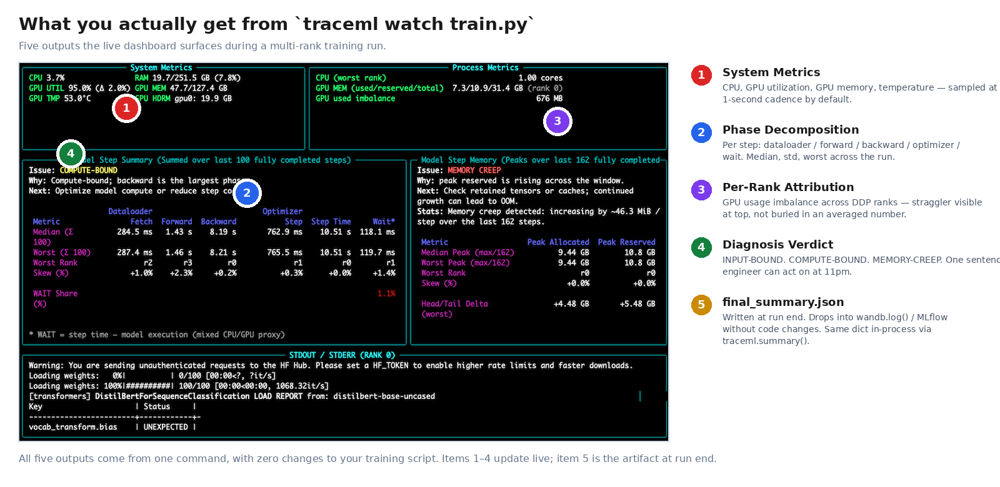
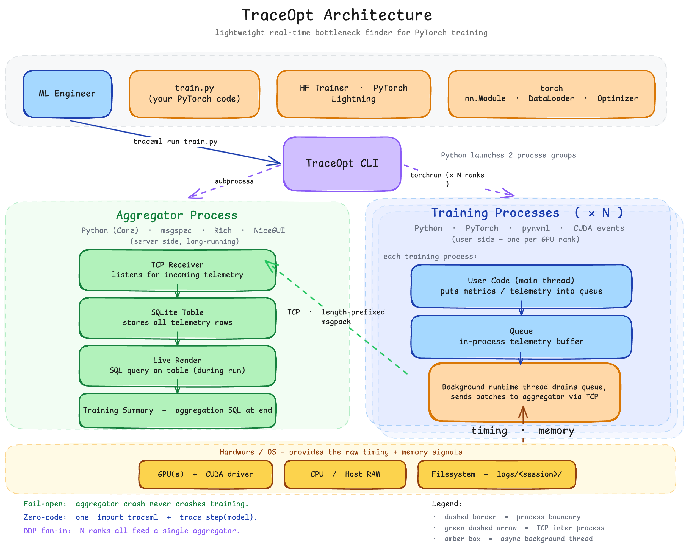

# TraceML, the hands-off PyTorch diagnostic tool

*What we built to close the training observability gap — and what it costs to ship a profiler that doesn't ask.*

**By Dr. Abhijeet Pendyala**

---

A few weeks ago, [a previous post](https://medium.com/@abhinavsriva/the-training-observability-gap-why-we-need-better-monitoring-5ae3d3a470cd) named the training observability gap — the structural blind spot between system monitors that don't speak training-loop semantics, framework profilers too heavy to leave on, and experiment trackers that track outcomes but not efficiency. **This post is what we built to fill it.**

A correct PyTorch training loop and a 2–5× faster PyTorch training loop are indistinguishable in code. Both compile, both train, both produce loss curves that descend, both pass code review. The only difference is utilization: one runs the GPU at 30% of its available throughput, the other at near-saturation. There is no compiler warning. There is no test that fails. **The slowness is silent.**

TraceML is the layer that makes the silence audible — without asking you to instrument your own code. You type one line —

```bash
traceml watch train.py
```

— and the tool produces a phase decomposition, per-rank attribution on multi-GPU, system metrics, and a verdict like *INPUT-BOUND: dataloader is 47% of step time. workers=2, expected ≥ 4×num_gpus.* The training script doesn't change. The model doesn't get wrapped. Your `for batch in loader:` loop stays exactly as you wrote it.

This post walks the path from the line you type to the verdict you get back: how the system is shaped, where the cost lives, and what it earns. The interesting question isn't whether a hands-off profiler is possible. The interesting question is what it costs to ship one — and what the cost buys.

## §1 — From `train.py` to a verdict

Strip away the imports, the boilerplate, the configuration — what's left is your training loop. Maybe it's a HuggingFace `Trainer.train()`. Maybe it's a Lightning `Trainer.fit()`. Maybe it's a hand-rolled `for batch in loader:` block over a few hundred lines. TraceML attaches *there*, not above it. The user's diff is zero lines.

What `traceml watch train.py` produces is the form the previous post described — *Step 42 on GPU5 took 2.5s where 1.2s for loading data, 1.0s for computing, 0.3s waiting on all-reduce* — concretized into five outputs:

- **Phase decomposition** per step — forward, backward, dataloader, optimizer, host-to-device, all-reduce — measured continuously across the run, not in a captured 5-step window.
- **Per-rank attribution** on DDP. Rank 0 step time vs rank 3 step time, side by side. Skew is the first thing you see, not the last.
- **System metrics** — GPU utilization, memory, temperature, power; host CPU and RAM — sampled at 1-second cadence by default.
- **A diagnosis** — one of `BALANCED`, `INPUT-BOUND`, `COMPUTE-BOUND`, `INPUT STRAGGLER`, `COMPUTE STRAGGLER`, `WAIT-HEAVY`, `MEMORY CREEP`. Each carries severity, confidence, and an evidence payload.
- **A `final_summary.json`** at the end. A dict, not a flame graph. Drops directly into `wandb.log()` or MLflow without a single character of glue.



*Figure 1. The five outputs in one screen — annotated. Items 1–4 update live during the run; item 5 is the artifact written when the run ends.*

The asymmetry against `torch.profiler` isn't *5% easier*. It's *works without code changes* vs *requires code changes*. That's not a UX-spectrum point. They are two different products. Every wrapper-based tool fights for a `with`-block in your inner loop. Every wrapper-based tool loses some fraction of users who run it once, decide the diff is annoying, and remove it the next morning. The hands-off path doesn't lose those users — there is no diff to remove.

## §2 — Hands-off vs wrapper-based: the architectural fork

The "lightweight" claim from the previous post isn't a configuration choice. It's an architectural fork. Most observability tools live *above* the user's training script — they ask you to wrap, log, capture, decorate, or instrument. TraceML lives *below* it.

> **The design philosophy in one sentence:**
>
> *"You look into the loss, you know what the loss is, you say 'I will log it here.' We are not saying to the user that you need to know how to set up a timer and all that. We will do it. This is a hands-off, hands-off thing. For DeepSpeed and all these, they give you wrappers. Optimizers also have autocast as a wrapper — essentially nothing else. The gradient autocast that exists is a wrapper, nothing else."*

Read the second half of that twice. *Optimizers have autocast as a wrapper — essentially nothing else.* The framework you trust to do mixed-precision math correctly is, structurally, a wrapper that asks you to put your forward inside it. DeepSpeed wraps your optimizer because the framework that asks you to swap `optimizer.step()` for its own can do real work — sharding gradients, offloading parameters, fusing kernels. Gradient accumulation wraps your backward. W&B asks you to call `wandb.log({...})` per metric per step. The framework that asks. The wrapper that wraps.

These tools earn the wrapper they impose. The user pays the integration cost and gets something back. But the wrapper is also a posture: *we run alongside your training script, on the surface, where you can see us — and where you have to feed us.* That posture is fine for an optimizer that genuinely rewrites the math. It's wrong for a profiler. A profiler should not require the patient to wire the instrument.

TraceML wraps nothing. It patches PyTorch's class slots from below — `nn.Module.__call__` for forward, the autograd path for backward, `DataLoader.__iter__` for input, `torch.distributed.all_reduce` for collectives, `Tensor.to` for host-to-device (the last two are landing in nearby releases). One install at import time, and every PyTorch op in the interpreter emits events. The user wrote no code to make this happen.

> ***This is why hands-off is a moat, not a feature.***

Wrapper-based observability is straightforward to build. The PyTorch surface is public, integration patterns are well-documented, and the events to capture are the same ones every other tool already captures — a small team can ship a working version in a quarter. Hands-off instrumentation is different. It requires sustained coupling to PyTorch internals: which class slots stay stable across releases, which patches interact poorly with FSDP, which sequence of events fires correctly under `torch.compile`. That depth accumulates over years of version-pin work and patches that worked on PyTorch 2.3 but broke on 2.4. **It is not reproducible in a quarter — and that's the moat.**

If you remember nothing else from this post, remember this: *the wrapper wraps. The instrument watches — and doesn't ask.*

## §3 — Two processes, one TCP cable



*Figure 2. The whole physical layout in one diagram. The CLI spawns two process groups: an aggregator (TCP receiver, SQLite store, live renderer, summary writer) and N training processes that each emit telemetry over TCP. Hardware is at the bottom; principles — fail-open, zero-code, DDP fan-in — are at the bottom. Full architecture docs: [traceopt-ai.github.io/traceml/developer_guide/architecture/](https://traceopt-ai.github.io/traceml/developer_guide/architecture/).*

The picture is two cooperating processes and a TCP cable. That's the entire physical layout, and the entire reason the architecture is shaped the way it is.

When you run `traceml watch train.py`, the CLI launcher spawns two peers: an **aggregator process**, which owns the unified telemetry store and drives the display, and a `torchrun` worker group, where each worker imports an executor, reads TraceML config from environment variables, starts a `TraceMLRuntime`, and hands control to your script via `runpy.run_path(script, run_name="__main__")`. From the script's perspective nothing wraps it — `__main__` behaves exactly as `python train.py` would.

Inside the training process, samplers — step-time, step-memory, layer-level, system, process — write into per-rank bounded `Database`s (a `collections.deque` with O(1) append and O(1) eviction at `maxlen`). A `DBIncrementalSender` reads the new-row count, ships only what's new over local TCP, and never blocks on the aggregator. The wire format is a 4-byte big-endian length prefix followed by a `msgspec`-encoded payload — *length-prefixed msgpack frames over a local loopback socket. No shared memory, no queues on disk, no external broker.*


*Figure 3. From `traceml.init()` to a verdict — the per-step telemetry sequence. Ten participants, one round trip per step. The `Training step executes` band marks where the user's training step runs (forward/backward/optimizer); the `Sampler thread tick` band marks where the background sampler drains queues, ships them over loopback TCP, the aggregator ingests, and the diagnostics engine produces the verdict that updates the dashboard. Fail-open, bounded overhead, process isolation, out-of-process UI — the four principles enforced against every PR.*

Four design principles, graded against every PR, are what make this architecture deployable on production training jobs:

1. **Fail-open.** Sampler exception → logged, next tick retries. Aggregator crash → dashboard goes dark, training keeps running. TCP send failure → telemetry loss only. Hook attachment failure on an unsupported PyTorch version → logged, training proceeds with reduced visibility. Every path is wrapped in a `_safe()` helper that swallows exceptions to a per-component log.
2. **Bounded overhead.** Every new sampler, patch, or hook justifies its overhead against a default budget of sub-1% of step time. The fast path on the disabled side is sub-microsecond; the hot path is a CUDA event from a reusable pool plus two `event.record()` calls plus one `deque.append()`.
3. **Process isolation.** No shared memory between training ranks and the aggregator. TCP and environment variables only — which is what makes "aggregator crashes don't crash training" actually true.
4. **Out-of-process UI.** The aggregator is a separate process. Its crash kills the dashboard, not the model.

The contract is one-way:

> **TraceML degrades; the user's job does not.**

The architecture is one process for instrumentation, one for display, and a TCP cable between them. **The training run is never the price.**

## §4 — What you actually do

Three commands. One install. No script edits.

```bash
pip install traceml-ai
```

Then, against any existing training script:

- **`traceml watch train.py`** — runs your script with auto-instrumentation, shows the live CLI dashboard during the run, writes `final_summary.json` at the end. The everyday command.
- **`traceml run train.py`** — same instrumentation, no live dashboard. The CI mode and the unattended-run mode. Same `final_summary.json` artifact at the end.
- **`traceml deep train.py`** — higher sampling fidelity for short windows when the verdict is ambiguous. *(Note: `deep` is being consolidated as the rule-based diagnostics engine subsumes the bespoke deep-mode samplers in upcoming releases. Treat its API as soft.)*

The output is a dict. `final_summary.json` carries phase decomposition, the verdict, and wall-clock delta against baseline:

```json
{
  "verdict": "INPUT-BOUND",
  "verdict_detail": "dataloader is 47% of step time",
  "phase_breakdown_pct": {
    "forward": 0.31, "backward": 0.18,
    "dataloader": 0.47, "optimizer": 0.04
  },
  "ranks": 4,
  "steps_observed": 1840
}
```

`traceml.summary()` returns the same dict in-process, so it drops into `wandb.log({"traceml": traceml.summary()})` without a single integration line. The same dict pretty-prints to a human-readable text summary at run end — three diagnosis blocks (system, step time, step memory), each with the scope, the stats it was computed over, a one-line "why" explaining the verdict, and the named verdict itself. That text summary is what stacks 50-runs-deep into a quarterly FinOps narrative. A CI job can fail a PR whose `verdict` regressed from `BALANCED` to `INPUT-BOUND`. `traceml compare run_a.json run_b.json` produces a regression verdict — `IMPROVED`, `REGRESSED`, `EQUIVALENT`, or `UNCLEAR` — that a release gate can read with one `jq`.

The mental model: TraceML is **tool-zero** in the perf stack. PyTorch Profiler tells you which CUDA kernel took 40 microseconds. Nsight Systems shows you the kernel timeline. NCCL Flight Recorder tells you which rank dropped a collective. Those tools fix runs. TraceML *routes* runs — it tells you which of the 200 jobs running on your cluster this week deserves the next hour of an expensive engineer's attention. Triage is the product. The fix happens in the deep profilers, where it belongs.

## §5 — What it costs and what it doesn't do

**Overhead.** Sub-2% on multi-GPU runs at typical logging frequencies, against 5–15% for `wandb.log`-heavy configurations at typical logging frequencies. The full benchmark methodology — workload matrix, warm-up handling, variance — lands in a dedicated post in three weeks. The number to put in a budget conversation today is **<2% on multi-GPU at default settings**, climbing toward 2–5% on `deep` mode where you've explicitly traded overhead for per-layer detail.

**The economics.** Those overhead numbers are not abstract. A 200-GPU H100 cluster at $3/GPU-hour neocloud rates accrues ~$3.7M/year of training spend at 70% utilization. A 10% silent slowdown across that cluster is ~$370k/year. The gap between TraceML's sub-2% overhead and a `wandb.log`-heavy 5–15% is between $60k and $400k/year on the same hardware. TraceML pays for itself if it surfaces a single half-percent improvement in step time.

**What it doesn't do.** TraceML is triage, not deep-dive. *Nsight Systems tells you which CUDA kernel took 40 microseconds. TraceML tells you that your dataloader is starving the GPU because `num_workers=0`.* Those are different products with different customers and different right answers. We are not building a kernel-trace viewer. When the verdict says *forward is 70% of step and we don't know which layer*, the correct next move is `torch.profiler` with a kernel trace, not a deeper TraceML.

**What's not in v0.2.13.** Frontier-scale pretraining (1000+ GPUs with bespoke per-cluster instrumentation), inference workloads, `torch.compile` graph internals. These are 2027 problems, and we name them out loud rather than blur the line.

**Where it is today.** ~9,200 PyPI downloads with mirrors, ~2,800 human-actor downloads after de-bot filtering, 150 GitHub stars, 12 forks, 9 months since first public release — driven entirely by organic discovery, no marketing spend. We have an active inbound proof-of-concept conversation with a large US-based technology company running distributed training at scale; the conversation arrived in customer-discovery shape, not feature-pitch shape — meaning the prospect revealed latent needs (multi-node JSON summaries, OTLP-style telemetry export, tail-able files) that confirmed the roadmap rather than reshaping it. That conversation, more than the stars, is shaping v0.3.

## What's next

> **Coming next:** if you want to know why this works at all — why we patch `Tensor.to` instead of asking you to wrap things, and what we found when we measured what `model.to(device)` actually does on the wire *before training even starts* — that's Post 02: *The PyTorch method that fires before your first training step.* The substrate-proof piece. The empirical surprise that made the TLS gate load-bearing. The reason this whole architecture is shaped the way it is. Landing in two weeks.

---

**Try it:**

```bash
pip install traceml-ai
traceml watch train.py
```

Repo: [github.com/traceopt-ai/traceml](https://github.com/traceopt-ai/traceml). The CLI is open source, Apache-2.0-licensed, free for individual use forever.

**Design Partners:** if you run multi-GPU PyTorch training and want to shape how TraceML evolves to your specific pain points, we'd love to talk.

**Contributors:** deep in PyTorch internals — NCCL, FSDP, custom kernels, the autograd dispatcher, the `torch.compile` graph layer? Join us. The architecture is documented at [traceopt-ai.github.io/traceml/developer_guide/architecture/](https://traceopt-ai.github.io/traceml/developer_guide/architecture/). Issues, PRs, and traces welcome.

— *Dr. Abhijeet Pendyala*
