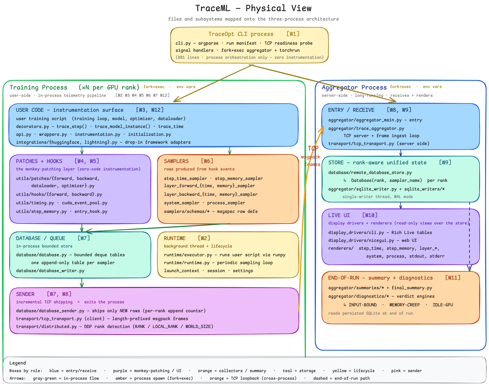

# TraceML Code Walkthroughs

File-by-file readings of the TraceML codebase. **Companion file** to [learning-qa.md](learning-qa.md), which covers the conceptual Q&A on OS basics, networking, Python internals, CUDA, distributed training, and TraceML architecture.

Walkthroughs assume the vocabulary from those Q&As — when a walkthrough cross-references e.g. `Q5 (OS fundamentals)`, the link jumps straight to the relevant Q&A entry.

## Physical view — visual map

The diagram below maps every file and subsystem in TraceML onto the three-process runtime that gets spawned by `traceml watch|run|deep`. Each box is annotated with the walkthrough number (`[W1]` … `[W12]`) it belongs to — use it as a legend while reading the page.



> Editable source: [`architecture_physical_view.excalidraw`](../assets/architecture_physical_view.excalidraw) — open in [excalidraw.com](https://excalidraw.com) to edit.

**How to read it.** Three columns mirror the three real processes:

- **TraceOpt CLI process (top, amber)** — `cli.py` only. Pure orchestration: argparse, run manifest, TCP readiness probe, signal handlers, `fork+exec` of the aggregator and training processes. Zero instrumentation. ~101 lines. Maps to **[W1]**.
- **Training process (left, blue zone — `xN` per GPU rank, spawned via `fork+exec` from the CLI)** — where every per-rank file lives. Top-to-bottom mirrors the order of the walkthroughs:
  - *USER CODE — instrumentation surface* (light green) — the public API the user actually touches: `decorators.py` (`trace_step`, `trace_model_instance`, `trace_time`), `api.py`, the `wrappers.py` proxies, plus the framework adapters (`integrations/huggingface.py`, `integrations/lightning.py`). Maps to **[W3, W12]**.
  - *PATCHES + HOOKS* (purple) — the monkey-patching layer. Auto-timer patches in `utils/patches/` (`forward_*`, `backward_*`, `dataloader_*`, `h2d_*`) and per-layer memory hooks in `utils/hooks/`. This is how zero-code instrumentation actually works. Maps to **[W4, W5]**.
  - *SAMPLERS* (orange) — read-only views over hook events that emit structured rows: `step_time_sampler`, `step_memory_sampler`, `layer_forward_*`, `layer_backward_*`, `system_sampler`, `process_sampler`. Schemas live in `samplers/schemas/`. Maps to **[W6]**.
  - *DATABASE / QUEUE* (teal) — in-process bounded store. One append-only `deque` table per sampler, fixed `maxlen` for O(1) eviction. `database/database.py`, `database/database_writer.py`. Maps to **[W7]**.
  - *RUNTIME* (yellow) — background thread + lifecycle. `runtime/executor.py` runs the user script via `runpy`; `runtime/runtime_loop.py` drives periodic sampler ticks; `launch_context` and `session/settings` hold per-run state. Maps to **[W2]**.
  - *SENDER* (pink) — incremental TCP shipping. `database/database_sender.py` reads only the new rows since the last append counter; `transport/tcp_transport.py` (client side) handles length-prefixed msgpack frames; `transport/distributed.py` does DDP rank detection from `RANK` / `LOCAL_RANK` / `WORLD_SIZE`. Maps to **[W7, W8]**.
- **Aggregator process (right, green zone — also spawned via `fork+exec` from the CLI)** — server-side, long-running, reads + renders. Never blocks training:
  - *ENTRY / RECEIVE* (blue) — `aggregator/aggregator_main.py` is the entry point; `transport/tcp_transport.py` (server side) accepts ranks. Maps to **[W6, W9]**.
  - *STORE — rank-aware unified state* (teal) — `database/remote_database_store.py` keeps each rank's tables separate (`_dbs[rank][sampler_name]`); reuses the same bounded `Database` class the rank side uses. Single-writer thread, `WAL` mode for the SQLite write-out. Maps to **[W9]**.
  - *LIVE UI* (purple) — display drivers (`aggregator/display_drivers/cli.py`, `nicegui.py`) own the layout and orchestrate the renderers (`renderers/step_time.py`, `step_memory.py`, `layer_*`, `system.py`, `process.py`, `stdout.py`, `stderr.py`), which read from the unified store. Maps to **[W10]**.
  - *END-OF-RUN — summary + diagnostics* (orange) — `aggregator/summaries/*` and `aggregator/diagnostics/*` produce the verdict block on shutdown. Input-bound / memory-creep / idle-GPU heuristics. Reads persisted SQLite at end of run. Maps to **[W11]**.

**Edges (the arrows between boxes):**

- **Gray-green** = in-process data flow inside a single rank (sampler → database → sender).
- **Amber** = process spawn via `fork+exec` from the CLI (CLI → aggregator, CLI → each training rank).
- **Orange dashed** = TCP loopback, cross-process. The only network edge in the system; carries length-prefixed msgpack frames from each rank's sender to the aggregator's receive loop. Loopback because aggregator and training run on the same machine.
- **Dashed** = end-of-run path (SQLite writer → diagnostics on shutdown). Not on the steady-state hot path.

**How to use this diagram while reading the walkthroughs:** find the file you're about to read in the diagram, note which column and which `[W#]` cluster it sits in, then jump to that walkthrough below. The columns answer "*which process does this run in?*"; the colors answer "*which architectural role does this play?*"; the `[W#]` tags answer "*where in this page is it explained in detail?*"

---

## How this file is organized

One walkthrough per file in the codebase, numbered **W1, W2, …** (independent of the Q-numbers in the Q&A file, so the two sequences never collide). Each walkthrough has:

- **Short answer** — what this file does in 2–4 sentences
- **Long answer** — section-by-section reading with line numbers, code refs, and cross-links to the conceptual Q&A
- **How this file maps to earlier Q&A concepts** — explicit pointers to which Q's are reified in this code
- **Concepts introduced** — for future cross-referencing

New walkthroughs append at the bottom; the TOC tracks them. A trailing template at the end of this file shows the format.

---

## Architecture diagram ↔ source code map

The architecture diagram (`traceml/docs/assets/Architecture_excali_b.png`) shows three runtime entities — the **TraceOpt CLI**, the **Aggregator process** (server-side, long-running), and the **Training Processes ×N** (user-side, one per GPU rank) — plus an in-process telemetry pipeline (User Code → Queue → Background runtime thread → TCP) inside each rank.

The **physical view** below opens up each of those three boxes and overlays the actual files inside, grouped by subsystem and color-coded by role. Each box carries a `[W#]` tag pointing to the matching walkthrough. The interactive Excalidraw source is [here](https://excalidraw.com/#json=8O-QQPD_ybJwRAuSOpP1F,ORTOD0vk4o4Ak7WOF6W7aw) (zoom in to read the file lists).


Mapping each block to actual files:

| Diagram block | Files | Walkthrough |
|---|---|---|
| **TraceOpt CLI** (subprocess spawner) | [cli.py](https://github.com/Pendu/traceml/blob/main/src/traceml/cli.py) | W1 ✅ |
| **Per-rank runtime + queue + sender** | `runtime/` (executor, runtime, launch_context, session, settings) | W2 |
| **User-facing instrumentation API** | `decorators.py`, `instrumentation.py`, `wrappers.py`, `initialization.py`, `api.py` | W3 |
| **Patches + timing primitives** | `utils/patches/*`, `utils/timing.py`, `utils/cuda_event_pool.py`, `utils/step_memory.py` | W4 |
| **Per-layer hooks (forward/backward time + memory)** | `utils/hooks/*` | W5 |
| **Samplers (collectors that produce rows)** | `samplers/*`, `samplers/schema/*` | W6 |
| **In-process Database / queue** | `database/database.py`, `database_sender.py`, `database_writer.py`, `remote_database_store.py` | W7 |
| **TCP transport** (rank → aggregator) | `transport/tcp_transport.py`, `transport/distributed.py` | W8 |
| **Aggregator core** (TCP receiver + SQLite Table) | `aggregator/aggregator_main.py`, `trace_aggregator.py`, `sqlite_writer.py`, `sqlite_writers/*` | W9 |
| **Live Render (display drivers + renderers)** | `aggregator/display_drivers/*`, `renderers/*` | W10 |
| **Training Summary + diagnostics** | `aggregator/summaries/*`, `final_summary.py`, `diagnostics/*` | W11 |
| **Framework integrations** | `integrations/huggingface.py`, `integrations/lightning.py` | W12 |

Total source: ~30k LOC across ~80 files. This table doubles as the roadmap for the remaining walkthroughs.

## Roadmap (W2 onward)

The walkthroughs follow the data flow left-to-right, matching how the diagram reads (CLI → spawned ranks → telemetry capture → transport → aggregator → display → summary). Each entry uses the same format as W1 and cross-links back to relevant Q-entries (`learning-qa.md`) and P-entries (`pytorch-qa.md`).

Three "must-do" walkthroughs that give 80% of the architecture: **W2** (closes the loop with W1 — what `torchrun` actually spawned), **W4** (the monkey-patching machinery — demystifies zero-code instrumentation), **W9** (the other side of the TCP wire). W11 (summaries + diagnostics) is the largest, most self-contained, and most "feature work" — fine to defer.

## Table of Contents

- [W1: cli.py — top-level launcher and process orchestrator](#w1-clipy-top-level-launcher-and-process-orchestrator)
- [W2: Per-rank runtime — executor, runtime loop, launch context, session](#w2-per-rank-runtime-executor-runtime-loop-launch-context-session)
- [W3: User-facing API — decorators, instrumentation, wrappers](#w3-user-facing-api-decorators-instrumentation-wrappers)
- [W4: Patches + timing primitives — how zero-code instrumentation actually works](#w4-patches-timing-primitives-how-zero-code-instrumentation-actually-works)
- [W5: Per-layer hooks — forward/backward time and memory hooks](#w5-per-layer-hooks-forwardbackward-time-and-memory-hooks)
- [W6: Samplers + schemas — turning hook events into structured rows](#w6-samplers-schemas-turning-hook-events-into-structured-rows)
- [W7: Database + sender — bounded in-memory store and incremental TCP shipping](#w7-database-sender-bounded-in-memory-store-and-incremental-tcp-shipping)
- [W8: Transport — TCP server/client, msgpack framing, DDP rank detection](#w8-transport-tcp-serverclient-msgpack-framing-ddp-rank-detection)
- [W9: Aggregator core — TCP receive, frame dispatch, SQLite writes](#w9-aggregator-core-tcp-receive-frame-dispatch-sqlite-writes)
- [W10: Display drivers + renderers — terminal and web UI from SQL](#w10-display-drivers-renderers-terminal-and-web-ui-from-sql)
- [W11: Summaries + diagnostics — end-of-run analysis](#w11-summaries-diagnostics-end-of-run-analysis)
- [W12: Framework integrations — HuggingFace Trainer and PyTorch Lightning adapters](#w12-framework-integrations-huggingface-trainer-and-pytorch-lightning-adapters)

---

## W1: cli.py — top-level launcher and process orchestrator

**Date:** 2026-04-24
**File:** [traceml/src/traceml/cli.py](https://github.com/Pendu/traceml/blob/main/src/traceml/cli.py) (881 lines)
**Reads cleanly with:** [Q1](learning-qa.md#q1-what-is-a-subprocess), [Q5](learning-qa.md#q5-os-fundamentals-kernel-process-internals-pipes-sockets), [Q7](learning-qa.md#q7-spawning-fork-exec-and-multiprocessing-start-methods), [Q10](learning-qa.md#q10-what-is-tcp-concretely-and-whats-a-port), [Q11](learning-qa.md#q11-what-is-a-cuda-context-and-why-is-it-fork-unsafe)
**Origin:** suggested follow-up in the Q&A flow once Q1–Q12 were in place — the CLI is the cleanest place to see every concept land in real code.

### Short answer

`cli.py` is the orchestration layer. It does five things in order:

1. Parse user CLI args.
2. Write a session manifest.
3. Spawn the aggregator subprocess and wait for it to be TCP-ready.
4. Spawn torchrun (which spawns N training ranks).
5. Supervise both — install signal handlers, watch for either to exit, update the manifest with final status.

The actual work — telemetry collection, rendering, training — happens in the spawned children. `cli.py` itself does no instrumentation; it's a 100% process-management module.

### Long answer

#### File-level shape (lines 1–23)

Imports include `subprocess` (process spawning, [Q1](learning-qa.md#q1-what-is-a-subprocess)), `signal` (Unix signal handling, [Q5](learning-qa.md#q5-os-fundamentals-kernel-process-internals-pipes-sockets)), `socket` (TCP readiness probe, [Q10](learning-qa.md#q10-what-is-tcp-concretely-and-whats-a-port)), `struct` (binary frame headers in the inspect command, Q5 framing), `msgspec` (decoding inspect frames).

Three constants up top:

- `DEFAULT_TCP_READY_TIMEOUT_SEC = 15.0` — how long we wait for the aggregator to start listening.
- `DEFAULT_SHUTDOWN_TIMEOUT_SEC = 5.0` — how long we wait for graceful SIGTERM before escalating to SIGKILL.
- `INTERRUPTED_EXIT_CODE = 130` — Unix convention: 128 + signal number. SIGINT is signal 2 → exit code 130.

#### Tiny utilities (lines 26–104)

- `_utc_now_iso()` — wall-clock timestamp for manifests. Always UTC to avoid timezone bugs across nodes.
- `_write_json_atomic(path, payload)` — **critical pattern for long-running services** ([Q3](learning-qa.md#q3-what-does-long-running-mean)): write to a temp file in the same directory, fsync to disk, then `os.replace` to swap atomically. Why: if you `open(path, 'w')` and crash mid-write, the manifest is half-written and unreadable. With this pattern you always have either the old version or the new version, never a corrupt one. `os.replace` is atomic on POSIX as long as src and dst are on the same filesystem (hence "same directory" temp).
- `_load_json_or_warn(path)` — defensive read: missing file → empty dict; corrupt file → preserved as `.corrupt` and returns empty dict. Long-running services must tolerate self-inflicted bad state from previous crashes.
- `_resolve_existing_script_path` — validates the user-supplied script path exists. Resolves to absolute so child processes see a stable path even if cwd shifts.

#### torchrun command builder (lines 107–114)

`_build_torchrun_base_cmd(nproc_per_node)` constructs `[python, -m, torch.distributed.run, --nproc_per_node=N]`. Two important details:

- Uses `sys.executable` (the current Python interpreter) instead of bare `python` — so the child runs in the same conda env / virtualenv as the parent. This survives fork+exec because env vars / paths inherited at spawn time point at the right interpreter.
- `torch.distributed.run` is the underlying module that the `torchrun` console script wraps. Calling the module directly avoids `PATH` shenanigans.

#### Artifact collection (lines 117–134)

`_collect_existing_artifacts` returns paths only if they exist on disk. Used at end-of-run to populate the manifest's "artifacts" field with whatever the aggregator actually wrote (DB, summary card, code manifest).

#### Validation (lines 137–152)

`_validate_launch_args` rejects mutually-exclusive flag combos early. Currently the only rule is "summary mode requires history" — because the final summary is generated from the persisted SQLite DB; without history, there's nothing to summarize. Catching this in the CLI keeps runtime/aggregator code mode-agnostic.

#### Code manifest (lines 155–189)

`write_code_manifest` runs static AST analysis on the user's training script and saves a JSON manifest. Wrapped in a broad try/except — if AST analysis fails, write a minimal fallback manifest. **The CLI flow must never break** because of analysis bugs: telemetry is always supposed to be additive (the fail-open principle, [Q8](learning-qa.md#q8-why-traceml-uses-subprocesses-expanded)).

#### Run manifest (lines 192–285)

Two functions: `write_run_manifest` (initial write) and `update_run_manifest` (atomic in-place update of status / artifacts). The manifest is the single source of truth for "what is this run doing?" — read by the dashboard, post-run summary tools, and debugging forensics.

Status field transitions: `starting → running → completed | failed | interrupted`. All atomic via `_write_json_atomic`.

#### Process group termination (lines 287–321)

`terminate_process_group(proc, timeout)` — escalating shutdown:

1. `os.killpg(proc.pid, SIGTERM)` — sends SIGTERM to the **whole process group**. Because the child was started with `start_new_session=True`, its PID equals its PGID, so `killpg` targets all processes in that session. This is critical: torchrun spawns N child workers; if you SIGTERM only the torchrun process, the workers become orphans. Group-kill catches everyone.
2. `proc.wait(timeout=timeout_sec)` — give children up to 5 seconds to clean up gracefully. This is when they flush logs, close sockets, write summaries.
3. `os.killpg(proc.pid, SIGKILL)` — if they didn't comply, signal 9 cannot be caught or ignored; the kernel just terminates them. Use last because you lose any cleanup.

The fallback `proc.terminate()` / `proc.kill()` is for cases where killpg fails (e.g., PID race after process already exited).

#### TCP readiness probe (lines 324–354)

`wait_for_tcp_listen(host, port, proc, timeout)` — busy-poll loop:

- Tries `socket.create_connection((host, port), timeout=0.25)` every 50 ms.
- Returns `True` as soon as a connection succeeds (server is `listen`-ing and ready to `accept`).
- Returns `False` if the aggregator process exits during the wait (`proc.poll() is not None`).
- Times out after 15 seconds.

This is how the CLI knows the aggregator is actually listening *before* launching training. Important: just spawning the aggregator process doesn't mean it's ready — Python imports take time, the aggregator does its own setup before calling `socket.bind` and `socket.listen`. Without this probe, ranks would race, hit "connection refused," and fail before the aggregator caught up.

#### Signal handlers (lines 357–392)

`install_shutdown_handlers(get_procs, manifest_path)` registers a single `_handler` for both SIGINT (Ctrl-C) and SIGTERM (kill command). When fired:

1. Re-entry guard via the `already_handled` dict closure. If the user mashes Ctrl-C twice, the second one bypasses cleanup and exits immediately with code 130.
2. Update the manifest to `status="interrupted"` so post-run tools know this didn't complete cleanly.
3. Walk the list of children (`get_procs()` returns a tuple of Popen handles) and `terminate_process_group` each.
4. `raise SystemExit(130)` — exits with the standard "interrupted by SIGINT" code.

The `get_procs` callable indirection is a clever pattern: `train_proc` and `agg_proc` are created *later* in `launch_process`, after handlers are installed. A closure that captured them at handler-installation time would see `None`. The lambda `lambda: (train_proc, agg_proc)` re-evaluates the names every time the handler fires, so it sees whatever values are bound at that moment.

#### Subprocess spawners (lines 395–436)

Two near-identical functions:

- `start_aggregator_process(env, cwd)` — spawns `python aggregator_main.py` with the prepared env and cwd.
- `start_training_process(train_cmd, env, cwd)` — spawns the user's command (typically a torchrun invocation).

Both use:

- `start_new_session=True` — child becomes its own session leader, with its own process group ID = its own PID. This is what makes `os.killpg(pid, sig)` work later.
- Explicit `cwd` — child's working directory is set explicitly, so it doesn't depend on whatever shell-relative state the parent has.
- Inherited stdin/stdout/stderr (default behavior) — the child's prints and tracebacks show up in the user's terminal directly (stdio inheritance from [Q5](learning-qa.md#q5-os-fundamentals-kernel-process-internals-pipes-sockets)).

#### The orchestrator: `launch_process` (lines 439–634)

**Step 1 — env setup (452–476).** Copy the parent's env, then layer TraceML config on top: `TRACEML_DISABLED`, `TRACEML_PROFILE`, `TRACEML_SCRIPT_PATH`, `TRACEML_TCP_HOST`, `TRACEML_TCP_PORT`, etc. Also captures a `LaunchContext` (the launching cwd) and merges it in. **This is how config crosses the fork+exec boundary**: env vars survive exec ([Q7](learning-qa.md#q7-spawning-fork-exec-and-multiprocessing-start-methods)), so children read them after starting fresh with no shared memory.

**Step 2 — paths and manifests (478–508).** Resolves session root (`logs_dir/session_id`), creates the aggregator dir and DB path, writes the code manifest, writes the initial run manifest with `status="starting"`.

**Step 3 — special path: `--disable-traceml` (513–533).** If the user disabled TraceML, skip the aggregator entirely and just torchrun their script natively. Still installs shutdown handlers and updates the manifest. This is for benchmarking ("what's the overhead of TraceML?") and for users who want to keep the same launcher CLI without telemetry.

**Step 4 — validate UI mode (535–540).** Defensive check; should already be caught by argparse `choices=`, but belt-and-suspenders.

**Step 5 — build the train_cmd (542–547).** Note this isn't `python train.py` — it's `python -m torch.distributed.run ... runtime/executor.py -- <user-script-args>`. The runtime executor is what actually runs the user's script *with TraceML's runtime monkey-patches in place* ([Q9](learning-qa.md#q9-what-are-hooks-and-what-does-injecting-hooks-in-process-mean)). The `--` separates executor args from user-script args.

**Step 6 — pre-allocate Popen variables and install handlers (549–554).** `agg_proc` and `train_proc` start as `None`. The handler's lambda captures them by name (not value), so the handler sees current values whenever it fires.

**Step 7 — start aggregator and wait for TCP readiness (556–587).** Spawn aggregator → check it's TCP-ready → if not, terminate it and exit with `status=failed`. If yes, manifest goes to `status="running"` and we proceed.

**Step 8 — start training (589–593).** Spawn torchrun (which fork+execs N training workers, each running `executor.py`).

**Step 9 — supervisory loop (595–634).** While both processes are alive:

- Poll training. If exited, tear down the aggregator (gracefully via SIGTERM/SIGKILL escalation), update manifest with final status (`completed` / `failed`) and artifacts, exit with the training's return code.
- Poll aggregator. If exited unexpectedly, log a warning, mark telemetry status as `degraded` in the manifest, **but keep training going** — fail-open. Set `agg_proc = None` so we don't try to kill it again later.
- `time.sleep(1.0)` — poll once a second. Crude but fine: this loop isn't latency-sensitive; we just need to react eventually when training ends.

#### Top-level dispatch (lines 637–704)

- `run_with_tracing(args, profile)` — entry for `traceml watch|run|deep`. Sets `args.profile`, validates the script path, calls `launch_process`.
- `run_inspect(args)` — debug command that decodes binary msgpack log files. Reads 4-byte length prefix (`struct.unpack("!I", header)`), reads payload, decodes — exactly the framing format from [Q5](learning-qa.md#q5-os-fundamentals-kernel-process-internals-pipes-sockets). Useful for debugging telemetry pipeline issues offline.
- `run_compare(args)` — calls into a separate `traceml.compare.command` module to diff two summary JSONs.

#### CLI parser (lines 707–854)

Standard `argparse` setup with subcommands `watch`, `run`, `deep`, `compare`, `inspect`. Most args are shared via `_add_launch_args`. Notable defaults:

- `--tcp-host=127.0.0.1` (localhost, [Q10](learning-qa.md#q10-what-is-tcp-concretely-and-whats-a-port))
- `--tcp-port=29765` (high-numbered ephemeral-ish range, chosen to avoid common conflicts)
- `--mode=cli` (Rich terminal UI by default)
- `--nproc-per-node=1` (single-GPU by default; user bumps to 4/8 for multi-GPU)
- `--args nargs=REMAINDER` — captures everything after `--args --` as user-script args.

#### Entry point (lines 857–881)

`main()` parses args and dispatches to one of the `run_*` functions. The `if __name__ == "__main__": main()` guard makes `python -m traceml.cli` work; the `traceml` console script declared in `pyproject.toml` points at `main` too.

### How this file maps to earlier Q&A concepts

- **[Q1](learning-qa.md#q1-what-is-a-subprocess) (subprocess)** → `start_aggregator_process` and `start_training_process` are the literal `subprocess.Popen` calls referenced in Q1.
- **[Q5](learning-qa.md#q5-os-fundamentals-kernel-process-internals-pipes-sockets) (OS)** → signals (`signal.SIGINT/SIGTERM/SIGKILL`), process groups (`start_new_session=True`, `os.killpg`), TCP probe (`socket.create_connection`).
- **[Q7](learning-qa.md#q7-spawning-fork-exec-and-multiprocessing-start-methods) (spawning)** → fork+exec happens twice: once for aggregator (fresh Python), once for torchrun (which itself fork+execs N more workers).
- **[Q9](learning-qa.md#q9-what-are-hooks-and-what-does-injecting-hooks-in-process-mean) (hooks/injection)** → not in cli.py directly, but lives in the spawned process via `runtime/executor.py` which the train_cmd references.
- **[Q10](learning-qa.md#q10-what-is-tcp-concretely-and-whats-a-port) (TCP/ports)** → `tcp_host`, `tcp_port`, the readiness probe, `socket.create_connection`.
- **[Q11](learning-qa.md#q11-what-is-a-cuda-context-and-why-is-it-fork-unsafe) (CUDA fork-safety)** → The aggregator is spawned *before* any CUDA work, and torchrun fork+execs fresh interpreters per rank, so there's no CUDA-fork hazard anywhere in this file.
- **[Q12](learning-qa.md#q12-what-is-nccl-all-reduce-and-why-is-it-a-barrier) (NCCL)** → not in cli.py directly, but `torch.distributed.run` (torchrun) sets up the env vars NCCL needs (`MASTER_ADDR`, `MASTER_PORT`, `RANK`, `WORLD_SIZE`).

### Concepts introduced

Orchestration vs work, atomic file replace (`os.replace` on same filesystem), fail-open supervisor loop, TCP readiness probing, signal-handler closure pattern (lambda capturing late-bound names), env vars as config-across-exec mechanism, manifest-driven state machine, escalating shutdown (SIGTERM → wait → SIGKILL), session leader / process group, argparse subcommands and REMAINDER, the launcher pattern (CLI as a "do nothing but coordinate" process).

---


## W2: Per-rank runtime — executor, runtime loop, launch context, session

**Date:** 2026-04-25
**Files:**
- [traceml/src/traceml/runtime/executor.py](https://github.com/Pendu/traceml/blob/main/src/traceml/runtime/executor.py) (471 lines)
- [traceml/src/traceml/runtime/runtime.py](https://github.com/Pendu/traceml/blob/main/src/traceml/runtime/runtime.py) (299 lines)
- [traceml/src/traceml/runtime/launch_context.py](https://github.com/Pendu/traceml/blob/main/src/traceml/runtime/launch_context.py) (104 lines)
- [traceml/src/traceml/runtime/session.py](https://github.com/Pendu/traceml/blob/main/src/traceml/runtime/session.py) (13 lines)
- [traceml/src/traceml/runtime/settings.py](https://github.com/Pendu/traceml/blob/main/src/traceml/runtime/settings.py) (48 lines)
- [traceml/src/traceml/runtime/config.py](https://github.com/Pendu/traceml/blob/main/src/traceml/runtime/config.py) (10 lines)
- [traceml/src/traceml/runtime/stdout_stderr_capture.py](https://github.com/Pendu/traceml/blob/main/src/traceml/runtime/stdout_stderr_capture.py) (50 lines)

**Reads cleanly with:** [W1](#w1-clipy-top-level-launcher-and-process-orchestrator), [Q1](learning-qa.md#q1-what-is-a-subprocess), [Q5](learning-qa.md#q5-os-fundamentals-kernel-process-internals-pipes-sockets), [Q7](learning-qa.md#q7-spawning-fork-exec-and-multiprocessing-start-methods), [Q9](learning-qa.md#q9-what-are-hooks-and-what-does-injecting-hooks-in-process-mean), [Q10](learning-qa.md#q10-what-is-tcp-concretely-and-whats-a-port), [Q11](learning-qa.md#q11-what-is-a-cuda-context-and-why-is-it-fork-unsafe)

**Origin:** the natural follow-up to W1 — once the CLI fork+execs `python -m torch.distributed.run runtime/executor.py -- <user-args>`, what happens inside the spawned worker? This walkthrough closes that loop.

### Short answer

`runtime/` is the **per-rank in-process agent**. `executor.py` is the entry point for each torchrun worker: it reads env vars set by the CLI, starts a `TraceMLRuntime`, then `runpy.run_path`s the user's script in the same process so hooks and tracebacks see real call frames. `runtime.py` owns a single background sampler thread that ticks every second, writes rows to per-sampler in-memory databases, and ships incremental batches to the aggregator over loopback TCP. `launch_context.py` is the small but load-bearing trick that makes `runpy` look exactly like `python train.py` to the user's code (right `sys.argv`, right `sys.path[0]`, right cwd).

### Long answer

The split between executor and runtime is worth naming up front:

- **`executor.py`** is the **process lifecycle**: env → start runtime → run user script → stop runtime → exit. It's mostly orchestration, no telemetry.
- **`runtime.py`** is the **telemetry agent**: build samplers, run a tick loop in a background thread, ship batches to the aggregator. It does no user-script execution.

Same idea as W1's split between cli.py and the children, but one level deeper: cli.py spawns processes, executor spawns a thread.

#### executor.py — the per-rank entry point (lines 1–471)

This is the file `torchrun` actually invokes. It runs **once per rank**, in the rank's own freshly exec'd Python interpreter ([Q7](learning-qa.md#q7-spawning-fork-exec-and-multiprocessing-start-methods)).

##### Env-var driven config (lines 194–246)

`read_traceml_env()` reads every TraceML setting from `os.environ`. There is no command-line parsing here — the CLI already parsed args in W1, then layered them into env. Why env vars and not CLI args? Because torchrun is in the middle: CLI builds a torchrun command, torchrun fork+execs N worker processes, and the cleanest way to ship config across that double-exec boundary is env (env survives `execve`, which is exactly the property exploited in W1's Step 1). Each rank reads the same env, so all ranks agree on TCP host/port, profile, session id.

Notable bits: `TRACEML_DISABLED=1` short-circuits to `NoOpRuntime`, `TRACEML_UI_MODE` is preferred but `TRACEML_MODE` is accepted for backward compat, and `TRACEML_SESSION_ID` is the shared id that lets all ranks write into the same `logs/<session_id>/` directory.

##### Argv splitting (lines 249–263)

`extract_script_args()` finds `--` in `sys.argv` and returns everything after it. The convention `traceml run train.py --args -- --epochs 10` survives all the way through:

- CLI captures user-script args via `argparse` REMAINDER (W1).
- CLI builds train_cmd = `[python, -m, torch.distributed.run, ..., executor.py, --, *user_args]`.
- torchrun forwards args after `--` to its target script.
- executor sees `sys.argv = [executor.py, --, --epochs, 10]` and slices everything after `--`.

This is the invisible plumbing that makes `traceml run` indistinguishable from `python` from the user's perspective.

##### `NoOpRuntime` (lines 177–191)

The fail-open primitive: a class with `start()` and `stop()` that do nothing. Used in two cases:

- `TRACEML_DISABLED=1` (intentional bypass).
- `TraceMLRuntime` constructor or `start()` raised (unintentional but not fatal).

The point: `main()` never branches on "is TraceML on or off?" — it always calls `runtime.start()` / `runtime.stop()`. The polymorphism removes the entire failure mode where a TraceML bug crashes user training. Compare the docstring on `start_runtime`: "fail-open by design. If TraceML cannot initialize, the user script still runs." This is the same fail-open principle from W1's supervisor loop, applied one level deeper.

##### `start_runtime` / `stop_runtime` (lines 287–346)

Symmetric. Start builds settings from cfg, instantiates `TraceMLRuntime`, calls `.start()`. If anything raises, write to `runtime_error.log` and return `NoOpRuntime`. Stop calls `.stop()`, catches everything, writes to the same log on failure.

The two-log split (lines 50–51, `torchrun_error.log` vs `runtime_error.log`) matters: when a user's training crashes, you want to find their traceback without TraceML's internal failures muddying the file. And when TraceML itself fails, you want the infrastructure log clean of user noise.

##### `run_user_script` and `runpy.run_path` (lines 349–365)

This is where TraceML's "in-process" architecture pays off. Three options were available:

1. **`subprocess.Popen([python, train.py])`** — clean isolation, but you lose the ability to install hooks in the user's process. TraceML's whole value prop is auto-instrumentation, so this is dead on arrival.
2. **The exec-on-source pattern** (calling Python's `exec` builtin on the read script contents) — runs in the current globals, breaks `if __name__ == "__main__"`, doesn't set `__file__` properly. Brittle.
3. **`runpy.run_path(path, run_name="__main__")`** — chosen. Runs the script as if it were `__main__`, so the user's `if __name__ == "__main__":` guard fires. Gives the script its own module globals (no leakage from TraceML). And it runs **in the same process and same Python interpreter**, so the patches and hooks installed by `TraceMLRuntime.start()` apply to the user's `import torch; model(x)` call.

The wrapping `script_execution_context` context manager handles the rest of the "look like a normal script launch" work — see launch_context.py below.

##### `main()` and exit-code coercion (lines 402–467)

Three exception classes, three policies:

- `KeyboardInterrupt` (Ctrl-C) → log it, exit 130 (W1's `INTERRUPTED_EXIT_CODE` convention: 128 + SIGINT signal number 2).
- `SystemExit` → coerce `.code` (None → 0, int → int, anything else → 1). Only log if exit code != 0. Why coerce? `sys.exit("oops")` sets `code="oops"`, which the kernel can't accept — must become an int.
- Any other `Exception` → set `error`, exit 1, write the crash report **after** stopping the runtime (so the runtime's TCP shutdown happens before the crash is reported, ensuring final telemetry gets flushed).

The `finally: stop_runtime(...)` is the critical bit: even if the user crashes, runtime stops cleanly, telemetry flushes, sampler thread joins. Without this, samplers would be killed by interpreter teardown mid-flush and data would be lost.

#### runtime.py — the agent and its sampler thread (lines 1–299)

`TraceMLRuntime` is the per-rank agent. The class docstring says it loud: **agent-only**. No TCP server. No unified store. No UI. Just collect telemetry locally, ship over TCP. The other side of the wire (aggregator) is W9.

##### Constructor (lines 79–118)

A few things happen in order, and the order matters:

1. **Hydrate settings + global config** (84–92). The `config` singleton from `runtime/config.py` (a dead-simple module-level instance — see below) gets `enable_logging`, `logs_dir`, `session_id` written into it. Other parts of the codebase read this singleton without needing to thread settings through every call. This is "global mutable config" — defensible here because there's exactly one runtime per process and it's set once at startup.

2. **DDP detection** (96–97). `get_ddp_info()` reads `LOCAL_RANK`, `RANK`, `WORLD_SIZE` env vars (set by torchrun) and returns `(is_ddp, local_rank, world_size)`. This is what determines whether to skip rank-redundant samplers (host metrics on rank 1, 2, …) and what `rank` to stamp on telemetry rows. Detail in W8.

3. **Stop event** (100). A `threading.Event` shared between `start()`, `stop()`, and the sampler loop. `Event.wait(timeout)` is the cleanest way to do "sleep N seconds, but wake up immediately if asked to stop" — beats `time.sleep` which blocks uninterruptibly.

4. **Build samplers** (103) — see `_build_samplers` below.

5. **Build TCP client + attach senders** (106–111). Every rank gets its own `TCPClient` connecting to `host:port` (typically `127.0.0.1:29765`). Even rank 0 sends over loopback TCP to the aggregator on the same machine — the comment at lines 17–19 explicitly justifies this:

   > Even for WORLD_SIZE=1, telemetry is sent over loopback TCP to keep the same code-path and allow future remote aggregators without refactoring.

   The choice trades a small amount of overhead (kernel TCP stack on loopback, [Q10](learning-qa.md#q10-what-is-tcp-concretely-and-whats-a-port)) for a single uniform code path. No special-case "if rank 0, write to memory; else send TCP" branching anywhere.

6. **Sampler thread object** (114–118) — created but **not started** in `__init__`. Started later in `start()`. Why split? Because `__init__` runs during `start_runtime()` from executor, and we want the option to fall back to `NoOpRuntime` if construction fails *without* leaking a half-started thread.

##### `_build_samplers` (lines 120–158) — profile-driven assembly

This is the dispatch table for `traceml watch | run | deep`. Three profiles, increasing depth:

- **watch** → SystemSampler (rank 0 only) + ProcessSampler (all ranks) + StdoutStderrSampler (CLI mode only). Cheapest. No hooks installed on the model.
- **run** → watch + StepTimeSampler + StepMemorySampler. Adds step-level timing. Requires `trace_step()` boundaries from the user (W3).
- **deep** → run + 5 layer samplers (LayerMemory, LayerForwardMemory, LayerBackwardMemory, LayerForwardTime, LayerBackwardTime). Most expensive. Requires `trace_model_instance()` to attach forward/backward hooks (W5).

Two subtle policies in here:

- `not (self.is_ddp and self.local_rank != 0)` — host system metrics (CPU%, RAM, GPU utilization across all GPUs) are collected only on rank 0 in DDP. Avoids 8 ranks all running `pynvml` against the same GPU and flooding the aggregator with redundant rows.
- `if self.mode == "cli": StdoutStderrSampler` — only capture stdout/stderr when the CLI driver is the one rendering, because in CLI mode the Rich UI takes over the terminal and user prints would otherwise be lost. In dashboard mode the user's stdout flows to terminal naturally.

##### `_attach_senders` (lines 160–172)

Each sampler that supports incremental sending owns a `DBIncrementalSender` (W7) created at sampler-construction time. Construction time doesn't know the TCP client or the rank. So this method walks samplers and **late-binds** those two. After this:

```
sampler.db                          # in-memory rows for this sampler
sampler.sender                      # DBIncrementalSender for this sampler
sampler.sender.sender = tcp_client  # transport handle
sampler.sender.rank   = local_rank  # rank stamp
```

The first `.sender` is the sender object on the sampler; the second `.sender` is the transport handle inside the sender. Naming collision, but that's the actual code.

##### `_tick` (lines 174–227) — the heart of the agent

Two phases per tick:

**Phase 1 — sample + flush local writers (193–206).** For each sampler: call `.sample()` (which appends rows to its in-memory DB), then call `db.writer.flush()`. Both wrapped in `_safe(...)` — any sampler exception is logged and swallowed. One sampler crashing must never stop the others.

**Phase 2 — batch TCP send (208–227).** Walk samplers, collect ready payloads via `sender.collect_payload()` (returns `None` if there's nothing new or if GPU events haven't resolved yet — see W4 on CUDA event timing). Then **one** `TCPClient.send_batch(batch)` call instead of N independent `send()` calls.

The batching matters. The docstring (lines 182–190) is explicit: "N syscalls per tick" → "1 syscall." Each `socket.send` is at minimum a `write` syscall — a context switch into the kernel ([Q5](learning-qa.md#q5-os-fundamentals-kernel-process-internals-pipes-sockets)). For `deep` profile with 8 samplers ticking at 1Hz, that's 8 vs 1 syscall per second. Negligible at low cadence; matters more if interval is dropped to 100ms or if a future profile has more samplers.

Samplers whose GPU events haven't resolved skip this tick by returning `None`. They get picked up next tick. This is essential for layer time samplers ([P51](pytorch-qa.md#p51-which-torchcuda-apis-does-traceml-rely-on-and-how-stable-are-they-across-pytorch-versions)) where `cudaEventQuery` may say "not yet" — detail in W4.

##### `_sampler_loop` (lines 229–236)

```
while not self._stop_event.is_set():
    self._tick()
    self._stop_event.wait(float(self._settings.sampler_interval_sec))
self._tick()  # final tick
```

`Event.wait(timeout)` returns early if the event is set, so `stop()` makes the loop terminate within milliseconds rather than waiting up to a full interval. The trailing `self._tick()` after the loop is a final flush — catches any rows produced between the last in-loop tick and the stop signal.

##### `start` and `stop` (lines 238–289)

`start()`: optionally redirect stdout/stderr (CLI mode), then start the sampler thread. The thread is daemon (`daemon=True` in __init__) — if the user's script exits and somehow doesn't go through `stop()`, the daemon thread won't keep the process alive past interpreter shutdown.

`stop()`: set the event, join the thread with a timeout of 5× the sampler interval (so a stuck sampler doesn't hang shutdown forever), close the TCP client, restore stdout/stderr. All best-effort — `_safe` everywhere. The "forever" hang case is logged as a WARNING but execution continues.

Thread lifecycle is deliberately simple: **one** thread, **one** `start()`, **one** `stop()`, no thread pools, no asyncio, no nested executors. Easier to reason about than the alternative.

#### launch_context.py — making `runpy` indistinguishable from `python` (lines 1–104)

Small file, big role. The user wrote `train.py` assuming three things:

1. `sys.argv[0]` is the script path, `sys.argv[1:]` are their args.
2. `sys.path[0]` is the script's directory, so `from utils import foo` works for sibling files.
3. `os.getcwd()` is the directory they typed `traceml run` in, so `open("data/train.csv")` finds their data.

`runpy.run_path` alone gives them (1) but not (2) or (3). The CLI was invoked from the user's cwd, but torchrun's worker may have been spawned elsewhere; `sys.path[0]` will be wherever the executor lives in the installed package, not the user's project.

`script_execution_context` (66–104) is the context manager that fixes all three for the duration of the user's script run, then restores them. Three steps in `try`:

```
sys.argv = [resolved_script_path, *script_args]
sys.path[0] = script_dir
os.chdir(launch_context.launch_cwd)
```

And in `finally`, restore old values. This is critical for `stop_runtime` and any post-run code that runs in the executor's normal context.

The `LaunchContext` dataclass itself (26–63) is a tiny serializer for one piece of state: the cwd at the moment the CLI was invoked. Captured in the parent (`LaunchContext.capture()`), serialized to env via `to_env()` → `TRACEML_LAUNCH_CWD`, deserialized in the child via `from_env()`. This is the same env-vars-as-config-across-exec mechanism W1 discussed, used for one specific piece of state that must survive the double exec (CLI → torchrun → worker).

The `frozen=True` on the dataclass is a small safety net: once you capture the launch cwd, no part of the runtime can mutate it.

#### session.py — session id generation (lines 1–13)

13 lines, almost too small to walk through, but worth noting because the design is interesting in its smallness.

```python
def _generate_session_id():
    ts = datetime.datetime.now().strftime("%Y%m%d_%H%M%S")
    rand = uuid.uuid4().hex[:6]
    return f"session_{ts}_{rand}"
```

Format: `session_20260424_153045_a1b2c3`. Timestamp gives sortability (lexicographic = chronological), short uuid suffix avoids collisions when two runs start in the same second.

Important: `get_session_id()` calls `_generate_session_id()` **every time**. There's no caching. This is by design: the CLI in W1 generates the id once and ships it via `TRACEML_SESSION_ID` to all children. If the executor or aggregator called `get_session_id()` independently they'd get *different* ids, and rank 0's data would land in a different directory from rank 1's. The fact that every consumer reads the env var instead of calling this function is the actual contract; the function exists for the CLI's first-time generation only.

#### settings.py — frozen config dataclasses (lines 1–48)

Two dataclasses, both `frozen=True`:

- `TraceMLTCPSettings(host, port)` — TCP-specific.
- `TraceMLSettings(profile, mode, sampler_interval_sec, render_interval_sec, num_display_layers, logs_dir, enable_logging, remote_max_rows, tcp, session_id, history_enabled, db_path)` — top-level.

Frozen so that nothing downstream can accidentally mutate config mid-run. The executor's `build_runtime_settings` is the only place that constructs these from cfg dicts; runtime, aggregator, and samplers all read.

The split (`TCPSettings` nested under `Settings`) keeps related fields grouped. Adding e.g. `db_settings = TraceMLDBSettings(...)` later wouldn't change the runtime API.

#### config.py — runtime-global mutable config (lines 1–10)

```python
class TraceMLConfig:
    def __init__(self):
        self.enable_logging: bool = False
        self.logs_dir: str = "./logs"
        self.num_display_layers = 10
        self.session_id: str = ""

config = TraceMLConfig()
```

The mutable counterpart to `settings.py`. `TraceMLRuntime.__init__` writes into this singleton (lines 86–88 of runtime.py). Other modules import `from traceml.runtime.config import config` and read fields. This is a deliberate choice over passing `settings` everywhere: convenient for module-level utilities (loggers, samplers) that don't otherwise want to thread settings through.

The risk: writing to `config` from anywhere other than runtime startup creates spooky action at a distance. The convention is "runtime sets, everyone else reads."

#### stdout_stderr_capture.py — terminal capture for CLI mode (lines 1–50)

The reason this exists: in CLI mode, the aggregator's Rich live display owns the terminal. If the user's `print("loss:", loss)` writes to stdout, Rich either overwrites it or interleaves it badly. `StreamCapture` is a `StringIO` subclass that the runtime swaps in for `sys.stdout` and `sys.stderr` while training runs. The `StdoutStderrSampler` (in `_build_samplers`) periodically reads the buffer and ships captured text as telemetry rows; the aggregator then renders them in a dedicated stdout/stderr pane next to the live tables.

Class design: classmethods `redirect_to_capture` / `redirect_to_original` flip `sys.stdout` / `sys.stderr` atomically under a class-level `_lock`. The `_redirected` flag prevents double-redirection if `start()` is called twice. The original streams are remembered as `sys.__stdout__` / `sys.__stderr__` (Python's untouched-since-startup references) rather than `sys.stdout`, so even if some other library has already redirected, restoring still works.

The capture instance has its own `_local_lock` because `write()` can be called from any thread (the sampler thread reads the buffer; the user's training thread writes to it). `super().flush()` after every write is necessary because StringIO buffers internally — without flush the sampler would see stale state.

In dashboard mode this whole machinery is bypassed (`if self.mode == "cli":` guards in `start()` and `stop()`) — the web UI doesn't fight the user for stdout.

### How this file maps to earlier Q&A concepts

- **[W1](#w1-clipy-top-level-launcher-and-process-orchestrator) (CLI launcher)** → the executor is exactly what W1's `train_cmd` invokes through torchrun. This walkthrough is the answer to "what runs inside the spawned worker."
- **[Q1](learning-qa.md#q1-what-is-a-subprocess) (subprocess)** → the executor is itself a subprocess (spawned by torchrun, which was spawned by the CLI). It does **not** spawn further subprocesses; everything happens in-process.
- **[Q5](learning-qa.md#q5-os-fundamentals-kernel-process-internals-pipes-sockets) (OS basics)** → `threading.Event`, daemon threads, file descriptor inheritance for stdout/stderr capture, syscall reduction via batched TCP send.
- **[Q7](learning-qa.md#q7-spawning-fork-exec-and-multiprocessing-start-methods) (fork/exec)** → env vars are the only config that survives torchrun's `execve`. `LaunchContext` serializes the user's cwd into `TRACEML_LAUNCH_CWD` so it crosses the boundary.
- **[Q9](learning-qa.md#q9-what-are-hooks-and-what-does-injecting-hooks-in-process-mean) (in-process hook injection)** → `runpy.run_path` is the chosen mechanism. Because it runs in the executor's interpreter, monkey-patches installed by `TraceMLRuntime.start()` apply to the user's `model(x)` call. This is the entire reason the executor exists rather than just `subprocess.Popen([python, train.py])`.
- **[Q10](learning-qa.md#q10-what-is-tcp-concretely-and-whats-a-port) (TCP/ports)** → every rank, including rank 0, ships telemetry over loopback TCP to keep the code path uniform. The 1-syscall batched send is the throughput optimization.
- **[Q11](learning-qa.md#q11-what-is-a-cuda-context-and-why-is-it-fork-unsafe) (CUDA fork-safety)** → torchrun fork+execs each worker with a fresh interpreter, so each rank initializes its own CUDA context cleanly. The executor inherits a clean process; no fork hazard inside this scope.

### Concepts introduced

`runpy.run_path` as the in-process script-launch primitive, `NoOpRuntime` polymorphism for fail-open instrumentation, env-var-as-IPC across `execve`, `LaunchContext` and the cwd-preservation contract, frozen settings vs mutable runtime-global config, sampler-thread tick loop with `Event.wait(timeout)` for cancellable sleeping, batched TCP send (N syscalls → 1) for sampler ticks, profile-driven sampler assembly (watch / run / deep), rank-aware sampler selection (skip system sampler on rank ≥ 1), late binding of TCP client + rank into pre-built senders, two-log error policy (`torchrun_error.log` for user, `runtime_error.log` for infra), session id generated once in CLI and propagated via env, stdout/stderr capture with thread-safe `StreamCapture` for CLI-mode UI coexistence.

---

## W3: User-facing API — decorators, instrumentation, wrappers

**Date:** 2026-04-25
**Files:**
- [traceml/src/traceml/__init__.py](https://github.com/Pendu/traceml/blob/main/src/traceml/__init__.py) (22 lines)
- [traceml/src/traceml/api.py](https://github.com/Pendu/traceml/blob/main/src/traceml/api.py) (179 lines)
- [traceml/src/traceml/initialization.py](https://github.com/Pendu/traceml/blob/main/src/traceml/initialization.py) (354 lines)
- [traceml/src/traceml/instrumentation.py](https://github.com/Pendu/traceml/blob/main/src/traceml/instrumentation.py) (288 lines)
- [traceml/src/traceml/wrappers.py](https://github.com/Pendu/traceml/blob/main/src/traceml/wrappers.py) (294 lines)
- [traceml/src/traceml/decorators.py](https://github.com/Pendu/traceml/blob/main/src/traceml/decorators.py) (36 lines)

**Reads cleanly with:** [Q9](learning-qa.md#q9-what-are-hooks-and-what-does-injecting-hooks-in-process-mean), [P9](pytorch-qa.md#p9-how-does-state_dict-work-and-what-does-it-preserve-what-does-it-skip), [P12](pytorch-qa.md#p12-whats-the-difference-between-children-modules-named_modules), [P14](pytorch-qa.md#p14-what-does-lossbackward-actually-do-step-by-step), [P48](pytorch-qa.md#p48-what-is-_call_impl-and-why-does-traceml-monkey-patch-around-it-instead-of-just-using-public-hooks), [P49](pytorch-qa.md#p49-whats-the-exact-firing-order-of-forward_pre_hook-forward_hook-backward_pre_hook-backward_hook), [W2](#w2-per-rank-runtime-executor-runtime-loop-launch-context-session)

**Origin:** This is the contact surface — the only TraceML code a user actually types into their training script. W1 covered how the CLI launched the process; W2 covered what the runtime did inside the spawned rank. This walkthrough maps every entry point a user can touch (`import traceml`, `trace_step`, `wrap_optimizer`, `trace_time`) to the patches/hooks it triggers and explains how the "zero-code" claim is actually realized.

### Short answer

Five files, three layers:

1. **`__init__.py` + `api.py`** — the public surface. `import traceml` exposes ten symbols (`init`, `trace_step`, `trace_model_instance`, `wrap_*`, `final_summary`). `api.py` is a thin lazy-loader: every public function is a one-line stub that imports its real implementation on first call, so `import traceml` itself stays cheap and side-effect-free.
2. **`initialization.py`** — the patch policy state machine. `traceml.init(mode=...)` installs the global monkey-patches (DataLoader, forward, backward) exactly once per process, with three modes: `auto` (everything), `manual` (nothing), `selective` (per-feature opt-in). The frozen `TraceMLInitConfig` is the source of truth that `instrumentation.py` and `wrappers.py` both consult to avoid double-instrumentation.
3. **`instrumentation.py` + `wrappers.py` + `decorators.py`** — the two parallel instrumentation paths. `instrumentation.py` holds the in-script context managers (`trace_step`, `trace_time`, `trace_model_instance`) used by the **automatic** path. `wrappers.py` holds the **manual** counterparts (`wrap_forward`, `wrap_backward`, `wrap_optimizer`, `wrap_dataloader_fetch`) for users who want explicit control. `decorators.py` is a 36-line legacy shim — importing it auto-runs `init(mode='auto')` to preserve v0.1-era behavior.

The key invariant binding all three layers: **patches are global and per-process; wrappers are per-instance.** `init()` chooses which path is canonical; `wrappers.py` refuses to wrap an instance whose feature is already globally patched, and `instrumentation.py` consults the same config to decide whether `trace_step` should also install the global optimizer hook. There is no shared state beyond `TraceMLInitConfig` and the `_traceml_*_patched` sentinel attributes on the patched classes.

### Long answer

#### `__init__.py` and `api.py` — public surface and lazy-loading (api.py 179 lines)

The package `__init__.py` re-exports nine functions plus `__version__`. None of them do work at import time — they're all bound to `api.py` stubs that defer the real import:

```python
def trace_step(*args, **kwargs):
    from traceml.instrumentation import trace_step as _trace_step
    return _trace_step(*args, **kwargs)
```

Why this matters: `import traceml` should not pull in `torch.nn`, `torch.optim`, or any of the patch modules. Many users `import traceml` from a file that also runs in non-training contexts (config validators, test runners, doc tooling). `api.py` keeps that import cheap — the heavy graph (`instrumentation` → `utils.hooks.*` → `torch.nn`) is only walked the first time the user actually calls a tracing function.

This is the architectural answer to "how is one `import traceml` enough?": **it isn't, on its own** — a bare `import traceml` does *nothing*. The "zero-code" claim is realized differently depending on which path the user takes:

- **CLI path (`traceml watch script.py`)** — the runtime executor (W2) calls `traceml.init(mode='auto')` programmatically before running the user's script, so by the time user code executes, the global patches are already live.
- **Library path (`import traceml; traceml.init()`)** — explicit. One extra line.
- **Legacy path (`from traceml.decorators import trace_step`)** — `decorators.py` calls `enable_legacy_decorator_auto_init()` at module-import time (line 29), which runs `init(mode='auto')` if init has not already happened. This preserves the v0.1 contract where importing the decorator was the only signal needed.

Each path lands at the same `init()` function, with a different `_source` label for diagnostics.

`api.py` also exposes `final_summary()` (lines 46–61), the read-side companion that talks to the aggregator's HTTP endpoint to fetch the post-run summary JSON. It belongs here for symmetry — it's part of the user's call surface — but it has nothing to do with instrumentation; it's a client to the aggregator process W2 spawned.

#### `initialization.py` — the patch policy state machine (354 lines)

This file owns one piece of process-global state: `_INIT_CONFIG: Optional[TraceMLInitConfig]` (line 75), guarded by `_INIT_LOCK`. Everything else is helpers that read or write it.

##### `TraceMLInitConfig` — frozen config record (lines 37–71)

A `@dataclass(frozen=True)` with four boolean-ish fields: `mode`, `patch_dataloader`, `patch_forward`, `patch_backward`, plus a `source` string for diagnostics ("user", "traceml.decorators", etc.). Frozen because it's a process-wide invariant — once init has run, this object should never mutate. The `same_effective_configuration` method (lines 62–71) deliberately ignores `source` so re-importing a legacy decorator after an explicit `init()` is a no-op rather than a conflict.

##### Mode validation: `_canonical_mode` and `_build_config` (lines 78–161)

`_canonical_mode` accepts `"auto" | "manual" | "selective" | "custom"` and normalizes `custom` → `selective`. The aliasing exists because the public docs once used `mode="custom"` and the library can't break old code.

`_build_config` is the validation core. It enforces three rules that catch user mistakes early:

1. **Overrides only with `selective`** (lines 114–119) — passing `patch_forward=True` with `mode='auto'` is rejected. `auto` and `manual` mean *everything* and *nothing*; mixing in per-feature flags is ambiguous.
2. **`selective` requires at least one override** (lines 139–143) — `mode='selective'` with no flags is meaningless. The error explicitly redirects: "Use `mode='manual'` for no automatic patches."
3. **`selective` must enable at least one patch** (lines 149–153) — passing all three as `False` is the same as `manual` and is rejected for the same reason.

This validation exists because patch policy bugs are silent: if `init()` accepts an under-specified config, the user gets no instrumentation and a clean dashboard with zero rows, and they blame TraceML for being broken. Loud errors at init-time are much better.

##### `_apply_requested_patches` (lines 164–207)

Lazy-imports each patch module only if its flag is set, then calls the module-level `patch_*()` function. The lazy import is what makes `import traceml` cheap — `forward_auto_timer_patch` is the first thing that pulls in `torch.nn` for monkey-patching purposes.

The exception handling is deliberate: any patch failure raises `RuntimeError` and aborts init. Comment on line 204 — "partial patch installation can lead to inconsistent tracing behavior" — means if `patch_forward` succeeded but `patch_backward` raised, you'd get forward timings without matching backward timings, producing nonsense diagnostics. The fail-open principle from W1's CLI does *not* apply at init time; init must be all-or-nothing.

The actual `patch_*()` functions live in `utils/patches/` and are W4's territory — this file just decides *which* ones to call.

##### `init()` — the gate (lines 224–304)

The locking pattern (lines 280–303) is the interesting bit:

```python
with _INIT_LOCK:
    if _INIT_CONFIG is not None:
        if _INIT_CONFIG.same_effective_configuration(requested):
            return _INIT_CONFIG
        raise RuntimeError(...)  # different config = error
    _apply_requested_patches(requested)
    _INIT_CONFIG = requested
    return requested
```

Three behaviors: **first call** applies patches and stores config; **same-config repeat call** returns silently; **different-config repeat call** raises. The repeat-call tolerance matters because the runtime executor calls `init()` and a user's `train.py` might also call it explicitly — both paths arriving at `mode='auto'` should be a no-op the second time, not a crash. The error case catches a genuine bug: a notebook that imports `traceml.decorators` (legacy auto path) and then calls `traceml.init(mode='manual')` would get inconsistent semantics, so we refuse.

`enable_legacy_decorator_auto_init` (lines 329–343) is the function that `decorators.py` calls at import time. Its only job: if init has not run, install `mode='auto'`. If init has run (e.g., the runtime executor already called it), do nothing. This is what lets a single legacy script (`from traceml.decorators import trace_step`) and a CLI run (`traceml watch script.py`) both work without colliding — the CLI's executor wins the race, and the legacy decorator import sees `is_initialized() == True` and bows out.

#### `instrumentation.py` — `trace_step`, `trace_model_instance`, `trace_time` (288 lines)

This is the **automatic** path's user-facing surface. The three functions here all assume that *if* automatic patches are installed, this is the right place to bracket step boundaries and emit attribution events.

##### `TraceState` — process-local step counter (lines 96–105)

A class with one attribute, `step = 0`. It exists at module scope so anything in the runtime can read "what step are we on?" without threading it through call stacks. Lightning callbacks, HF Trainer integration (W12), and the layer hooks (W5) all read `TraceState.step` to attribute their events to the right step.

It's a class rather than a module-level int because Python rebinds module-level integers on assignment (creating a new local), but a class attribute mutates in place across importing modules. This is a small but real Python gotcha — `TraceState.step += 1` from `trace_step` is visible to `from traceml.instrumentation import TraceState; TraceState.step` in another module.

##### `trace_step(model)` — the step boundary context manager (lines 108–167)

The single most important entry point. It does five things in order, all wrapped in defensive try/except so user exceptions propagate but instrumentation errors don't kill training:

```python
mem_tracker = StepMemoryTracker(model)            # line 138
mem_tracker.reset()                               # line 142 - mark step start
with timed_region("_traceml_internal:step_time", scope="step", use_gpu=False):
    with forward_auto_timer(), backward_auto_timer():
        if _should_auto_install_optimizer_timing():
            ensure_optimizer_timing_installed()
        yield                                     # user training step runs
        step_completed = True
TraceState.step += 1                              # line 157 - advance counter
mem_tracker.record()                              # line 160 - capture peak
flush_step_events(model, TraceState.step)         # line 165 - drain hook buffers
```

A few things deserve unpacking:

- **`forward_auto_timer()` / `backward_auto_timer()`** are not the global patches — those are installed by `init()` and live for the whole process. These are *enable/disable gates* (W4 territory) that flip a flag on the already-patched `nn.Module.__call__` so it actually emits timing only inside `trace_step`. Without this, every forward pass anywhere in your code (including model construction or evaluation-mode inference) would emit step-time events. The pattern is "patch once, gate per-step."
- **`_should_auto_install_optimizer_timing()`** (lines 66–93) is the bridge to `initialization.py`. It reads `get_init_config()` and returns `True` for `mode='auto'`, `False` for `manual`/`selective`. Optimizer timing is installed *here*, not in `init()`, because it's lazy: we only install the global `Optimizer.register_step_pre_hook` when the user actually opens their first step. That means a user who imports torch but never runs a step pays no cost for the optimizer hook.
- **`flush_step_events(model, TraceState.step)`** (line 165) is what makes per-layer event attribution work. The layer hooks (W5) buffer events into per-module deques during the step; `flush_step_events` drains those deques into samplers tagged with the now-incremented step number. Without this, you'd see layer events but they wouldn't know which step they belong to — the hook fires before the optimizer increments the step counter.
- **`step_completed` flag** (lines 139, 154, 156) — only advance the step counter if the user's `yield`-ed body returned without raising. If their forward pass crashed, we still want `mem_tracker.record()` and `flush_step_events` to capture diagnostic state for the *failed* step, but we don't want to advance into the next step.

The choice of "context manager that takes the model" is deliberate. It looks like overkill — why not `with trace_step():`? — but the model is needed for both the per-step memory tracker (`StepMemoryTracker(model)` walks parameters to compute per-layer memory deltas) and `flush_step_events(model, step)` (which iterates `model.modules()` to drain hook buffers). Decoupling step-boundary timing from model-bound state was apparently considered and rejected; it would have required a side-channel registry. See [P12](pytorch-qa.md#p12-whats-the-difference-between-children-modules-named_modules) for why iterating `model.modules()` is the obvious primitive here.

##### `trace_model_instance(model, ...)` — manual hook attachment (lines 170–242)

Used by HF Trainer / Lightning integrations (W12) and by `traceml deep` mode. Six independently-toggleable hook families:

- `trace_layer_forward_memory` → `attach_layer_forward_memory_hooks`
- `trace_layer_backward_memory` → `attach_layer_backward_memory_hooks`
- `trace_layer_forward_time` → `attach_layer_forward_time_hooks`
- `trace_layer_backward_time` → `attach_layer_backward_time_hooks`
- `trace_execution` → `attach_execution_entry_hooks`
- `sample_layer_memory` → static `collect_layer_parameter_memory` (one-shot, not a hook)

The `include_names` / `exclude_names` / `leaf_only` parameters are forwarded to each hook attacher and stored on the model as `_traceml_*` attributes (lines 197–199) so subsequent passes (e.g., recursive sub-modules) can read them. **`leaf_only=True` is the sane default** — attaching forward hooks to every container (`nn.Sequential`, `nn.ModuleList`) doubles or triples event volume because parent modules see every child's forward through their own `_call_impl` chain. See [P48](pytorch-qa.md#p48-what-is-_call_impl-and-why-does-traceml-monkey-patch-around-it-instead-of-just-using-public-hooks) and [P49](pytorch-qa.md#p49-whats-the-exact-firing-order-of-forward_pre_hook-forward_hook-backward_pre_hook-backward_hook).

The early return on line 189–190 — `if _traceml_disabled() or _traceml_profile() != "deep"` — is the gate for "only attach per-layer hooks in `traceml deep` mode." Forward/backward time at the layer granularity is the most expensive instrumentation TraceML offers (one CUDA event per layer per step); cheap modes skip it.

The whole function is wrapped in a top-level try/except (lines 192–242) that prints to stderr — fail-open. If hook attachment fails on layer 47 of a 200-layer transformer, the user gets reduced visibility but training continues.

##### `trace_time(name, scope, use_gpu)` — function decorator (lines 245–280)

The simplest entry point. Returns a decorator that wraps `func` in `timed_region(name, scope, use_gpu)`. Two validations:

- `_traceml_disabled()` short-circuits to identity (returns `func` unchanged) — zero overhead when disabled.
- `scope` must be `"step"` or `"global"`; raises `ValueError` otherwise. Step-scoped timings get attributed to `TraceState.step`; global timings are flat in the timeline.

`use_gpu=True` enables CUDA event recording around the function (W4 — `cuda_event_pool.py`). Important: **only use `use_gpu=True` for functions that actually issue CUDA work**. Wrapping a pure-CPU function with `use_gpu=True` records two CUDA events with no kernels between them — meaningless timing data but real overhead from the events themselves.

#### `wrappers.py` — manual instrumentation (294 lines)

The mirror universe of `instrumentation.py`. Where `trace_step` assumes global patches are in place, `wrappers.py` *replaces* those patches with per-instance proxies. This is for users who:

- Run untrusted/sandboxed code where global monkey-patching is forbidden
- Have their own instrumentation framework and need TraceML events emitted explicitly
- Want to instrument only one model in a multi-model pipeline (e.g., trace the actor in actor-critic but not the critic)

##### Conflict detection (lines 35–94)

Five `_ensure_*_wrapper_allowed` helpers, all reading sentinel attributes set by the patch modules:

- `DataLoader._traceml_patched`
- `nn.Module._traceml_forward_patched`
- `torch._traceml_backward_patched`
- `torch.optim.Optimizer._traceml_opt_hooks_installed`

If the global patch is active and the user calls `wrap_forward(model)`, we raise `RuntimeError` with a clear message: "Disable the automatic path for this feature before using the wrapper." Two parallel instrumentations of the same call site would emit *both* sets of events, doubling the timing data. Better to refuse loudly.

The `_ensure_dataloader_wrapper_allowed` (lines 55–70) is more nuanced: it only refuses for actual `torch.utils.data.DataLoader` instances or their iterators. Custom dataloaders (anything else implementing `__iter__`) are still allowed, because the global DataLoader patch only intercepts torch's own class.

##### The wrapper proxies (lines 97–158)

Three proxy classes:

- **`_WrappedDataLoaderIterator`** — wraps an iterator's `__next__` in `timed_region("_traceml_internal:dataloader_next", scope=STEP)`. Same event name as the patch path, so downstream samplers don't care which path produced the event.
- **`_WrappedDataLoaderFetch`** — wraps a loader, returning `_WrappedDataLoaderIterator` from `__iter__`. The `__getattr__` (line 137) forwards unknown attributes to the underlying loader so user code (`loader.dataset`, `loader.batch_size`, etc.) works unchanged.
- **`_WrappedBackwardHandle`** — wraps a loss tensor. `loss.backward()` becomes timed; everything else (`.item()`, `.detach()`, `.cpu()`) is forwarded via `__getattr__`. Same `_traceml_internal:backward_time` event as the global backward patch.

##### `wrap_forward` and `wrap_optimizer` — in-place mutation (lines 190–286)

These don't return proxies — they mutate the instance:

```python
model.forward = _wrapped_forward          # method reassignment
optimizer.step = _wrapped_step
```

The reason: `optimizer.step` is called by `torch.cuda.amp.GradScaler.step(optimizer)` and other tools that introspect the optimizer object and call `.step()` directly. A proxy class would break `isinstance(optimizer, torch.optim.Adam)` checks. **Object identity must be preserved.** The trade-off: idempotency requires the `_traceml_*_instance_wrapped` flag to be checked explicitly (lines 202, 263), and the original methods are stashed on `_traceml_original_*` for potential unwrap.

This is the same identity-preservation rationale that drives the global forward patch (`nn.Module.__call__` patched in place rather than wrapping the class) — see [P48](pytorch-qa.md#p48-what-is-_call_impl-and-why-does-traceml-monkey-patch-around-it-instead-of-just-using-public-hooks).

The error handling on lines 222–227 and 279–284 is unusually strict — if reassignment fails, raise `RuntimeError` with "fatal" in the message. Why fatal here when everywhere else is fail-open? Because a half-wrapped optimizer is worse than an un-wrapped one: the user *thinks* they have timing data, gets some events, and silently misses gradient steps. Failing loudly forces them to fix the environment.

#### `decorators.py` — legacy compatibility shim (36 lines)

The smallest and most historically interesting file. Three things happen at import time:

1. `from traceml.initialization import enable_legacy_decorator_auto_init` (line 21)
2. `from traceml.instrumentation import (TraceState, trace_model_instance, trace_step, trace_time)` (lines 22–27) — re-export the real implementations
3. `enable_legacy_decorator_auto_init()` (line 29) — install `mode='auto'` if not yet initialized

That single function call on line 29 is the entire legacy contract: in v0.1, `from traceml.decorators import trace_step` was the only API, and importing it had to "just work" with full instrumentation. The new SDK separates init from instrumentation cleanly, but for old user code that file's import side-effect must remain. The `enable_legacy_decorator_auto_init` name is deliberately verbose so anyone grepping the codebase understands this is *legacy compatibility*, not the canonical path.

#### How the three paths compose

A user can hit `trace_step(model)` having reached it by any of three routes:

1. **CLI auto path:** `traceml watch script.py` → executor calls `traceml.init(mode='auto')` → user code does `with traceml.trace_step(model):` → `_should_auto_install_optimizer_timing()` returns `True` → optimizer hook installed → forward/backward gates flip on → step events emitted.
2. **Library manual path:** user does `traceml.init(mode='manual')` then wraps each piece manually with `wrap_forward`, `wrap_backward`, `wrap_optimizer` → `trace_step` still works for step boundaries, but `_should_auto_install_optimizer_timing()` returns `False` so the global optimizer hook is *not* installed (the user's `wrap_optimizer` handles it instead).
3. **Legacy import path:** user does `from traceml.decorators import trace_step` → import side-effect runs `init(mode='auto')` → identical to path 1 from there.

The single piece of state that disambiguates them is `_INIT_CONFIG.mode`. `instrumentation.py` is mode-aware exactly once — at the optimizer-hook decision in `_should_auto_install_optimizer_timing` — and `wrappers.py` is mode-blind (it only checks the per-feature `_traceml_*_patched` flags, which are set by the patches themselves, not by the mode string).

### How this file maps to earlier Q&A concepts

- **[Q9](learning-qa.md#q9-what-are-hooks-and-what-does-injecting-hooks-in-process-mean) (hooks/monkey-patching)** → `init()` in `initialization.py` is the literal entry point that injects in-process patches into `torch.nn.Module`, `torch.utils.data.DataLoader`, and `torch.optim.Optimizer`. This is "the thing W1 said happens in the spawned process."
- **[P9](pytorch-qa.md#p9-how-does-state_dict-work-and-what-does-it-preserve-what-does-it-skip) (state_dict)** → `wrap_forward` sets `_traceml_forward_instance_wrapped` and `_traceml_original_forward` as plain attributes (lines 220–221). They're not registered parameters or buffers, so `state_dict()` ignores them — checkpoints stay clean. This is why side-channel registry is unnecessary.
- **[P12](pytorch-qa.md#p12-whats-the-difference-between-children-modules-named_modules) (named_modules)** → `trace_model_instance` and the layer-hook attachers iterate `model.named_modules()` filtered by `leaf_only` and `include_names`/`exclude_names`. The `leaf_only=True` default avoids the parent-module double-counting trap.
- **[P14](pytorch-qa.md#p14-what-does-lossbackward-actually-do-step-by-step) (loss.backward)** → `_WrappedBackwardHandle.backward` (line 149) is the manual interception point for the same backward path that the global `backward_auto_timer_patch` instruments automatically.
- **[P48](pytorch-qa.md#p48-what-is-_call_impl-and-why-does-traceml-monkey-patch-around-it-instead-of-just-using-public-hooks) (`_call_impl`)** → `wrap_forward` mutates `model.forward` in place rather than subclassing, for the same identity-preservation reason TraceML patches `nn.Module.__call__` instead of subclassing.
- **[P49](pytorch-qa.md#p49-whats-the-exact-firing-order-of-forward_pre_hook-forward_hook-backward_pre_hook-backward_hook) (hook firing order)** → `trace_model_instance` attaches forward/backward time and memory hooks; their firing order around a step's forward and backward passes determines event sequencing in samplers.
- **[W2](#w2-per-rank-runtime-executor-runtime-loop-launch-context-session) (runtime executor)** → the runtime is what calls `traceml.init(mode='auto')` programmatically before running the user's script. That call is the bridge from the spawned-process side to the user-API side covered here.

### Concepts introduced

Patch policy state machine (`auto` / `manual` / `selective`), frozen process-local config (`TraceMLInitConfig`), idempotent init with conflict detection, lazy public API surface (cheap `import traceml`), legacy import-side-effect compatibility shim, three parallel instrumentation paths reaching one set of internal events, in-place method reassignment for object-identity preservation, conflict sentinel attributes (`_traceml_*_patched`), patch-vs-wrapper duality (global per-process vs per-instance), per-step gating of always-on patches (`forward_auto_timer` / `backward_auto_timer` enable/disable around an installed patch), step-completion flag for failed-step diagnostics, lazy optimizer-hook installation (defer until first `trace_step`), `TraceState` as a process-shared class-attribute counter, `leaf_only` as the default for layer-iteration in mixed container/leaf models.

---

## W4: Patches + timing primitives — how zero-code instrumentation actually works

**Date:** 2026-04-25
**Files:**
- [traceml/src/traceml/utils/patches/forward_auto_timer_patch.py](https://github.com/Pendu/traceml/blob/main/src/traceml/utils/patches/forward_auto_timer_patch.py) (63 lines)
- [traceml/src/traceml/utils/patches/backward_auto_timer_patch.py](https://github.com/Pendu/traceml/blob/main/src/traceml/utils/patches/backward_auto_timer_patch.py) (88 lines)
- [traceml/src/traceml/utils/patches/dataloader_patch.py](https://github.com/Pendu/traceml/blob/main/src/traceml/utils/patches/dataloader_patch.py) (34 lines)
- [traceml/src/traceml/utils/timing.py](https://github.com/Pendu/traceml/blob/main/src/traceml/utils/timing.py) (256 lines)
- [traceml/src/traceml/utils/cuda_event_pool.py](https://github.com/Pendu/traceml/blob/main/src/traceml/utils/cuda_event_pool.py) (71 lines)
- [traceml/src/traceml/utils/step_memory.py](https://github.com/Pendu/traceml/blob/main/src/traceml/utils/step_memory.py) (105 lines)
- [traceml/src/traceml/utils/entry_hook.py](https://github.com/Pendu/traceml/blob/main/src/traceml/utils/entry_hook.py) (50 lines)
- [traceml/src/traceml/utils/flush_buffers.py](https://github.com/Pendu/traceml/blob/main/src/traceml/utils/flush_buffers.py) (37 lines)

**Reads cleanly with:** [W1](#w1-clipy-top-level-launcher-and-process-orchestrator), [W3](#w3-user-facing-api-decorators-instrumentation-wrappers), [Q9](learning-qa.md#q9-what-are-hooks-and-what-does-injecting-hooks-in-process-mean), [Q15](learning-qa.md#q15-what-is-a-cuda-stream-and-how-does-it-differ-from-a-cpu-thread), [P14](pytorch-qa.md#p14-what-does-lossbackward-actually-do-step-by-step), [P25](pytorch-qa.md#p25-how-does-num_workers-0-actually-work-threads-processes-ipc), [P48](pytorch-qa.md#p48-what-is-_call_impl-and-why-does-traceml-monkey-patch-around-it-instead-of-just-using-public-hooks), [P51](pytorch-qa.md#p51-which-torchcuda-apis-does-traceml-rely-on-and-how-stable-are-they-across-pytorch-versions)

**Origin:** the natural follow-on to [W3](#w3-user-facing-api-decorators-instrumentation-wrappers) — once `trace_step` and `trace_model_instance` are demystified, the next question is "but how does `import traceml; traceml run train.py` actually time the forward pass without me changing my code?" This walkthrough is the answer.

### Short answer

This is the magic layer. Three of PyTorch's hottest entry points — `nn.Module.__call__`, `Tensor.backward` / `torch.autograd.backward`, and `DataLoader.__iter__` — are replaced *in-place* on the class object, so every forward, every backward, and every batch-fetch in the process flows through TraceML's timing wrapper. The wrapper is a single context manager — `timed_region` — that records a CPU timestamp pair and (optionally) a pair of CUDA events drawn from a pool of 2000 reusable events. Per-step events accumulate in a thread-local buffer and ship out as one `StepTimeBatch` per optimizer step. Two pieces of bookkeeping make the patches safe in production: thread-local **enable flags** (timing only fires inside `trace_step`, not at module construction) and thread-local **depth counters** (only the outermost `nn.Module.__call__` gets timed, so `model(x)` doesn't fan out into one event per submodule).

### Long answer

This walkthrough has two halves. First, the **timing primitives** — `timed_region`, the CUDA event pool, the step buffer, the step-memory tracker — because the patches are thin clients of these primitives. Then the **patches themselves** — forward, backward, dataloader — and the entry hooks that tag the "current execution layer."

#### timing.py — the unified pipeline (lines 1–256)

The module's docstring sets the contract: **one ordered event stream per rank**, two scopes (`STEP` and `GLOBAL`), STEP events buffered until step boundary, GLOBAL events enqueued immediately. In v0.2.5 the GLOBAL path is essentially a stub (line 127–129: `pass # TODO: implement sampler`), but the abstraction is wired so that init/checkpoint timing can land on the same rails later.

**`TimeEvent` dataclass (lines 43–90).** Each event carries:
- `cpu_start` / `cpu_end` — wall clock from `time.time()`, captured synchronously
- `gpu_start` / `gpu_end` — `torch.cuda.Event` handles, recorded asynchronously on the current CUDA stream
- `gpu_time_ms` — initially `None`, filled later by `try_resolve()`
- `resolved: bool` — whether this event's GPU side has been read out yet

The `try_resolve` method (lines 65–90) is the non-blocking handoff. CUDA events can be queried for completion without forcing a stream synchronization (`gpu_end.query()` returns immediately with True/False). Only when the end-event has actually fired on the GPU do we (a) compute `gpu_start.elapsed_time(gpu_end)` (in milliseconds), (b) return both events to the pool, (c) drop the references, (d) flip `resolved=True`. **This is what keeps TraceML out of the critical path:** the runtime never calls `torch.cuda.synchronize()`. The forward call returns to Python the moment the kernels are *enqueued*; the GPU time is filled in a sampler tick later. See [Q15](learning-qa.md#q15-what-is-a-cuda-stream-and-how-does-it-differ-from-a-cpu-thread) for why streams + events let you do this and [P51](pytorch-qa.md#p51-which-torchcuda-apis-does-traceml-rely-on-and-how-stable-are-they-across-pytorch-versions) for the API stability discussion. The non-CUDA branch (line 87) just sets `resolved=True` and skips elapsed-time computation.

**Two queues + one buffer (lines 108–111).** This is the heart of the pipeline:

```python
_GLOBAL_TIME_QUEUE: Queue = Queue(maxsize=2048)
_STEP_TIME_QUEUE:   Queue = Queue(maxsize=2048)
_STEP_BUFFER: Deque[TimeEvent] = deque()
```

The two `Queue`s are thread-safe handoffs to the runtime sampler thread. The bare `deque` is *not* thread-safe in the general case, but it's used as a single-producer single-consumer buffer here: events go in on whichever thread is running the patched forward/backward, and they're drained inside `flush_step_time_buffer` on the same thread that called `trace_step.__exit__` (the training thread). No cross-thread access during normal operation.

**`record_event` / `flush_step_time_buffer` (lines 148–180).** These are the producer side. `record_event` routes by scope: STEP goes into `_STEP_BUFFER` (cheap append, no queue contention), GLOBAL goes immediately into the GLOBAL queue. At step boundary, `flush_step_time_buffer(step)` drains the deque, stamps each event's `step` field, packages them into a `StepTimeBatch(step=step, events=[...])`, and `put_nowait`s the batch onto `_STEP_TIME_QUEUE`. The `Full` exception path (line 142) is fail-open: drop the batch, log to stderr, training continues. This is the same fail-open philosophy as cli.py ([W1](#w1-clipy-top-level-launcher-and-process-orchestrator)).

The reason for buffering until step boundary, rather than enqueueing each event immediately, is **atomicity**: a step's forward + backward + dataloader-fetch + optimizer events are conceptually one unit. Aggregating them as a batch lets the consumer reason about complete steps; partial steps from a dropped queue are easier to detect.

**`timed_region` — the universal timing context manager (lines 183–256).** Every patch in this directory ultimately calls this context manager. It does five things in order:

1. **Disabled-fast-path** (lines 198–200): if `TRACEML_DISABLED=1`, yield and return — zero overhead, zero allocation.
2. **CPU start** (line 202): `cpu_start = time.time()`. Wall clock; nanosecond precision is unnecessary because we're measuring milliseconds-to-seconds of work.
3. **GPU start** (lines 205–212): if CUDA is available and the caller wants GPU timing, acquire two events from the pool and `start_evt.record()` on the current stream. Wrapped in try/except — if event creation fails (e.g., CUDA OOM at event-creation time, which is extremely rare but possible), fall back to CPU-only timing.
4. **`yield`** (line 224): user code runs. The comment "User code ALWAYS runs" is load-bearing — even if step 3 raised and got caught, the yield still happens. **Timing is best-effort; the wrapped operation is mandatory.**
5. **Teardown** (lines 226–256): record `cpu_end`, record `end_evt` on the stream, build the `TimeEvent`, call `record_event`. The whole teardown is wrapped in *another* try/except so a teardown bug can't crash training. Note that `finally` runs even on exception, so when the user's forward raises, we still record what we can — the recorded interval is "time until the exception fired," which is the right answer for a partial forward.

The asymmetry between the two try blocks matters: the first (lines 213–220) catches setup errors and degrades gracefully; the second (lines 226–256) catches teardown errors and just logs. **Neither branch ever swallows the user's exception** — if the user's code raises inside the `yield`, the `finally` runs, the teardown attempts to record what it can, then the exception propagates naturally up the call stack.

#### cuda_event_pool.py — the recycling layer (lines 1–71)

Why a pool exists: `torch.cuda.Event(enable_timing=True)` allocates a CUDA event handle, which involves a driver call. Doing this twice per `timed_region` invocation (start + end), inside every forward of every step, would be visible overhead. Pre-allocate, reuse, recycle.

**Implementation (lines 15–48).** A `deque(maxlen=2000)` plus a `threading.Lock`. `acquire` pops from the deque if available, else allocates a fresh event. `release` appends back if there's room (the maxlen bound is a safety valve — if we ever leak events faster than we recycle, the pool never grows unbounded). `enable_timing=True` is the critical kwarg: without it, you cannot call `gpu_start.elapsed_time(gpu_end)`, only check completion. See [P51](pytorch-qa.md#p51-which-torchcuda-apis-does-traceml-rely-on-and-how-stable-are-they-across-pytorch-versions) for the full surface area TraceML depends on.

**Sizing (line 52): `max_size=2000`.** This is enough to absorb a few hundred per-step events (dataloader, forward, backward, optimizer, plus per-layer hooks from [W5](#w5-per-layer-hooks-forwardbackward-time-and-memory-hooks)) across many in-flight steps without ever blocking the producer or hitting the allocation path. The lock ensures the pool is safe to share across the training thread and any sampler / runtime thread that resolves events asynchronously.

The lifecycle ties back to `try_resolve` in timing.py: events are only returned to the pool *after* their elapsed time has been read out, which in turn happens only after the GPU has finished the work they bracket. So an event is "out" exactly during the window from `start_evt.record()` to the next sampler tick that observes `end_evt.query() == True`.

#### step_memory.py — peak-memory bracketing (lines 1–105)

Different shape from timing, same pipeline pattern. A `StepMemoryEvent` (lines 17–28) records peak allocated and peak reserved bytes for one step on one device. The mechanism (lines 49–73):

- **`reset()`**: `torch.cuda.reset_peak_memory_stats(device)` at step start. PyTorch's caching allocator tracks a high-water mark; this zeros it.
- **`record()`**: `torch.cuda.max_memory_allocated(device)` and `torch.cuda.max_memory_reserved(device)` at step end. These read the high-water mark since the last reset. See [P33](pytorch-qa.md#p33-how-does-pytorch-report-gpu-memory-memory_allocated-max_memory_allocated-the-caching-allocator) for what "allocated" vs "reserved" mean — allocated is bytes handed out to live tensors, reserved is bytes the caching allocator has claimed from the driver.

This is genuinely cheap — two driver-state reads per step, no per-tensor accounting. The non-CUDA branch (lines 74–76) emits a sentinel event with zeros, so the schema stays consistent and the renderer doesn't have to special-case "no GPU."

The buffer (`_temp_step_memory_buffer: Dict[model_id, StepMemoryEvent]`, line 12) keys by `id(model)`. This matters when a process holds multiple models (rare but possible — a discriminator + generator, an actor + critic). Each `StepMemoryTracker` is bound to one model; the buffer keeps their events distinct until flush. `flush_step_memory_buffer(model, step)` (lines 88–105) pops the latest event for that model, stamps the step number, and `put_nowait`s onto `step_memory_queue`. Same fail-open `Full` handler as timing.

#### Patches: forward, backward, dataloader

The three patches all follow the same five-step recipe:

1. Save the original method as a module-level constant.
2. Define a wrapper that consults a thread-local enable flag and a thread-local depth counter.
3. If disabled or non-outermost, delegate to the original.
4. Otherwise, increment depth, time via `timed_region`, decrement depth in `finally`.
5. A `patch_*()` function that replaces the class-level method exactly once (idempotency via a sentinel attribute).

The repetition is intentional — each patch needs its own thread-local state because forward and backward run nested but independently, and one might be disabled while the other is on.

##### forward_auto_timer_patch.py (lines 1–63)

```python
_ORIG_MODULE_CALL = nn.Module.__call__   # save the original
...
nn.Module.__call__ = _traceml_module_call  # replace it on the class
```

This is class-level monkey-patching: every existing `nn.Module` *instance*, plus every instance created in the future, picks up the new `__call__` method via Python's normal method-resolution-order lookup. There's no per-model registration; the patch is a single global mutation. See [P48](pytorch-qa.md#p48-what-is-_call_impl-and-why-does-traceml-monkey-patch-around-it-instead-of-just-using-public-hooks) for why patching `__call__` (which delegates to `_call_impl` internally) is the right insertion point — it's the single funnel through which `model(x)` flows, and it sits *outside* the public `forward_pre_hook` / `forward_hook` chain so it can wrap the entire hook execution as one event.

The wrapper logic (lines 24–39):

```python
def _traceml_module_call(self, *args, **kwargs):
    if not _enabled():
        return _ORIG_MODULE_CALL(self, *args, **kwargs)
    if _depth() > 0:
        return _ORIG_MODULE_CALL(self, *args, **kwargs)
    _set_depth(_depth() + 1)
    try:
        with timed_region("_traceml_internal:forward_time", scope="step", use_gpu=True):
            return _ORIG_MODULE_CALL(self, *args, **kwargs)
    finally:
        _set_depth(_depth() - 1)
```

The **enable flag** (line 25) ensures we only time inside an active `trace_step` — without it, every `nn.Linear(...)` constructor in your script would also be timed (constructors don't trigger `__call__`, but `model.apply(init_fn)` and similar do). The **depth check** (line 29) is the submodule-spam guard: `model(x)` invokes the top-level module's `__call__`, which during `forward()` invokes child `__call__`s, which invoke grandchild `__call__`s. Without depth, you'd record one event per node in the module tree. With depth, only the outermost call (depth transitions 0 → 1) opens a `timed_region`; everything inside reuses the original method directly. The result is one `forward_time` event per top-level forward, which is what the step-time renderer wants. Per-layer breakdowns are a separate concern — handled by explicit hooks in [W5](#w5-per-layer-hooks-forwardbackward-time-and-memory-hooks).

The **thread-local storage** (`_TLS = threading.local()`, line 7) means depth and enable are per-thread, not global. If two threads happen to both run forward (rare in standard single-thread training, but real for some inference servers), they don't interfere with each other's depth counters. See [P25](pytorch-qa.md#p25-how-does-num_workers-0-actually-work-threads-processes-ipc) for how DataLoader workers achieve their own isolation via processes.

The `forward_auto_timer` context manager (lines 50–63) is the on-switch — `trace_step` ([W3](#w3-user-facing-api-decorators-instrumentation-wrappers)) enters it before stepping forward and exits after, flipping `_traceml_forward_enabled` on and off and resetting depth to 0 on exit (a defensive cleanup in case an unbalanced exception left depth nonzero).

The **idempotency sentinel** (lines 44–47) — `nn.Module._traceml_forward_patched = True` — prevents double-patching if `patch_forward()` is called twice (e.g., the runtime initializes once, then a Lightning callback initializes again). Double-patching would either lose the original (if you save `nn.Module.__call__` after it's already been replaced) or stack two wrappers (if the second call doesn't notice the first ran). Either way, broken; the sentinel makes the patch a no-op on subsequent calls.

##### backward_auto_timer_patch.py (lines 1–88)

Same shape, but **two entry points get patched** because PyTorch exposes two ways to trigger backward ([P14](pytorch-qa.md#p14-what-does-lossbackward-actually-do-step-by-step)):

- `loss.backward()` → `torch.Tensor.backward` (the method)
- `torch.autograd.backward(tensors, grads)` → `torch.autograd.backward` (the function)

Most user code uses the first; some libraries use the second. Patching both ensures coverage. They share the same thread-local state (`_BACKWARD_TLS`, line 8) and both delegate to the same `timed_region(name="_traceml_internal:backward_time", scope="step", use_gpu=True)`. The depth check matters less here than in forward (nested backwards are unusual) but the symmetric structure is kept for safety against e.g. higher-order gradient computation that recurses into `backward`.

One subtle detail: **the `name` is the same string for both entry points** (line 39 and line 57). If a user manages to invoke both in one step (you wouldn't, normally), they'd both attribute to "backward_time," which is the right semantic — backward is backward, regardless of how it was triggered.

##### dataloader_patch.py (lines 1–34)

The most surgical of the three. `DataLoader.__iter__` is a generator function that yields batches. The patch replaces it with a wrapper generator (lines 8–22):

```python
def _traceml_dataloader_iter(self):
    it = _ORIG_DATALOADER_ITER(self)
    while True:
        try:
            with timed_region(name="_traceml_internal:dataloader_next",
                              scope="step", use_gpu=False):
                batch = next(it)
        except StopIteration:
            break
        yield batch
```

The structure is "drive the original iterator manually so we can wrap each `next()` call." Notice `use_gpu=False`: dataloader work is CPU-bound (file I/O, decoding, augmentation, optional `pin_memory` host→pinned-host copy) — see [P25](pytorch-qa.md#p25-how-does-num_workers-0-actually-work-threads-processes-ipc) and [P26](pytorch-qa.md#p26-what-is-pin_memorytrue-and-when-does-it-help). Charging CUDA events for this would just add noise. The CPU wall clock is what matters: high `dataloader_next` time means workers can't keep up with GPU compute, which is a classic input-pipeline bottleneck.

**No enable flag here** — every `DataLoader.__iter__` in the process is wrapped, always. This is intentional: dataloader fetch happens *inside* `trace_step` (via the for-loop driving training), so only step-scoped events get buffered; events outside any active step still go through the patch but their `record_event` call routes to the STEP buffer regardless. (Subtle: this means dataloader fetches that happen outside `trace_step` — e.g., a sanity-check pass before training — would accumulate in the buffer and only flush on the *next* `flush_step_time_buffer` call. In practice negligible because users either wrap everything or nothing.) **No depth check** because `DataLoader.__iter__` doesn't recurse.

The `StopIteration` handling (lines 19–20) is mandatory: `for batch in dataloader` relies on `StopIteration` to terminate. If we let it propagate out of `timed_region` it would still work, but catching it explicitly makes the intent clear and lets us `break` cleanly out of the `while True`.

#### entry_hook.py — execution-layer tagging (lines 1–50)

This file is a different beast. It uses **public PyTorch hooks** (not patches) to maintain a thread-local "what layer is currently executing" marker, exposed as `EXECUTION_LAYER.current` (imported from `traceml.utils.shared_utils`).

The pattern (lines 36–50):

- For every leaf module (`if any(module.children()): continue` skips containers, line 42),
- Register a **forward pre-hook** that sets `EXECUTION_LAYER.current = f"forward_{name}"` *before* the layer runs.
- Register a **forward hook** that, on the layer's output tensor, attaches a **backward hook** via `output.register_hook(BackwardEntryHook(name))`. This backward hook fires when the autograd engine reaches that tensor's gradient computation, and sets `EXECUTION_LAYER.current = f"backward_{name}"`.

The clever bit: PyTorch doesn't expose a "before-backward-of-this-module" hook directly. But you *can* register a hook on a tensor that fires when its gradient is computed. By attaching one to each layer's output during the forward, you get a callback right when autograd is about to descend into that layer's grad function. This is roughly the same trick the per-layer backward-time hooks in [W5](#w5-per-layer-hooks-forwardbackward-time-and-memory-hooks) build on. See [P49](pytorch-qa.md#p49-whats-the-exact-firing-order-of-forward_pre_hook-forward_hook-backward_pre_hook-backward_hook) for the exact firing order of these hooks.

The `_traceml_exec_hook` flag on the tensor (line 32) prevents double-registration if the same output flows through multiple layers (e.g., residual connections). The `_execution_entry_hook_registry` dict keyed on `id(model)` (lines 7, 38, 50) prevents re-attachment if `attach_execution_entry_hooks` is called twice for the same model.

`EXECUTION_LAYER.current` is consumed by the error logger ([Q9](learning-qa.md#q9-what-are-hooks-and-what-does-injecting-hooks-in-process-mean)): when a sampler or hook raises, the error log gets tagged with which layer was executing at the time. So if a NaN appears in `decoder.attn.q_proj`, the traceback includes that name even if Python's stack trace bottomed out in some opaque autograd internal.

#### flush_buffers.py — the step-boundary fanout (lines 1–37)

Tiny but central. `flush_step_events(model, step)` is called by `trace_step.__exit__` ([W3](#w3-user-facing-api-decorators-instrumentation-wrappers)) and synchronously drains every per-step buffer in the runtime: layer forward memory, layer backward memory, layer forward time, layer backward time, model forward memory, step memory, step time. Six layer-level flushes plus two step-level. After this call returns, all events for the just-completed step are in their respective queues (or dropped, fail-open) and ready for the runtime sampler thread to pick up. The disabled-fast-path at line 28 short-circuits when `TRACEML_DISABLED=1` — zero per-step overhead in the bypass case.

Order doesn't strictly matter for correctness (each flush touches a different buffer) but the convention is layer-first, then aggregates — matches the natural "details first, summary last" reading order of the renderers.

#### Why this design — the pieces add up

Putting the architecture together:

1. The **patches** (forward, backward, dataloader) are the zero-code observation points. They fire on every meaningful boundary in PyTorch's training inner loop without the user knowing.
2. The **enable flags** are the on-switch wired by `trace_step` — no observation outside an active step.
3. The **depth counters** prevent submodule spam — one event per outermost forward/backward, not one per layer.
4. The **`timed_region` context manager** unifies CPU + CUDA timing into one event type and one buffer.
5. The **CUDA event pool** keeps the per-event allocation cost amortized to zero.
6. The **step buffer + flush** model batches a step's events atomically and hands them to the sampler thread via `put_nowait` — no blocking on the training thread, no synchronization with the GPU.
7. The **entry hooks** provide layer-name attribution for diagnostics, complementing (not replacing) the per-layer measurement hooks in [W5](#w5-per-layer-hooks-forwardbackward-time-and-memory-hooks).
8. The **flush fanout** in flush_buffers.py is the single line `trace_step` calls to close out a step.

The end-to-end result: your `for batch in loader: model(batch); loss.backward(); optimizer.step()` loop, unmodified, produces a stream of `StepTimeBatch`es and `StepMemoryEvent`s on internal queues. The samplers ([W6](#w6-samplers-schemas-turning-hook-events-into-structured-rows)) drain those queues and turn them into rows for the Database ([W7](#w7-database-sender-bounded-in-memory-store-and-incremental-tcp-shipping)).

### How this file maps to earlier Q&A concepts

- **[Q9](learning-qa.md#q9-what-are-hooks-and-what-does-injecting-hooks-in-process-mean) (hooks / monkey-patching)** → this directory *is* the canonical TraceML answer to "what does in-process injection look like?" Three class-level method replacements (`nn.Module.__call__`, `Tensor.backward`, `DataLoader.__iter__`) plus PyTorch's public hook API in `entry_hook.py`.
- **[Q15](learning-qa.md#q15-what-is-a-cuda-stream-and-how-does-it-differ-from-a-cpu-thread) (CUDA streams)** → `start_evt.record()` / `end_evt.record()` enqueue markers on the current stream; `gpu_end.query()` / `start.elapsed_time(end)` read them out without blocking the launching CPU thread. This is the entire reason TraceML can time GPU work without inserting a `torch.cuda.synchronize()`.
- **[P14](pytorch-qa.md#p14-what-does-lossbackward-actually-do-step-by-step) (loss.backward)** → backward_auto_timer_patch patches both `torch.Tensor.backward` and `torch.autograd.backward` because P14 explains they're two callable surfaces over the same underlying engine.
- **[P25](pytorch-qa.md#p25-how-does-num_workers-0-actually-work-threads-processes-ipc) (DataLoader workers)** → dataloader_patch wraps `__iter__` rather than the workers themselves, so it works identically for `num_workers=0` (synchronous fetch on the main thread) and `num_workers>0` (workers in subprocesses, IPC over pipes). The CPU wall clock around `next(it)` captures the user-visible "time the consumer waited for a batch."
- **[P33](pytorch-qa.md#p33-how-does-pytorch-report-gpu-memory-memory_allocated-max_memory_allocated-the-caching-allocator) (caching allocator)** → step_memory.py uses `reset_peak_memory_stats` / `max_memory_allocated` / `max_memory_reserved`, the three caching-allocator query APIs, to bracket peak memory per step at zero per-tensor cost.
- **[P48](pytorch-qa.md#p48-what-is-_call_impl-and-why-does-traceml-monkey-patch-around-it-instead-of-just-using-public-hooks) (`_call_impl`)** → forward_auto_timer_patch replaces `nn.Module.__call__` (which is what `_call_impl` is bound to). P48 explains why patching here, rather than just using `forward_pre_hook` / `forward_hook`, gives a single funnel that wraps the *entire* hook chain as one timed region.
- **[P49](pytorch-qa.md#p49-whats-the-exact-firing-order-of-forward_pre_hook-forward_hook-backward_pre_hook-backward_hook) (hook firing order)** → entry_hook.py uses `register_forward_pre_hook` (fires before forward) and chains a tensor-level `register_hook` (fires during backward) to mark execution-layer state at exactly the right moments.
- **[P51](pytorch-qa.md#p51-which-torchcuda-apis-does-traceml-rely-on-and-how-stable-are-they-across-pytorch-versions) (torch.cuda API surface)** → this directory exercises the entire surface: `torch.cuda.Event(enable_timing=True)`, `event.record()`, `event.query()`, `start.elapsed_time(end)`, `torch.cuda.current_device()`, `torch.cuda.is_available()`, plus the memory APIs in step_memory.py. CLAUDE.md flags this as the brittle area; this walkthrough is exactly where the brittleness lives.

### Concepts introduced

Class-level monkey-patching of dunder methods, idempotent patching via sentinel attributes (`_traceml_forward_patched`), thread-local enable flags as instrumentation on/off switches, thread-local depth counters for outer-most-only timing (avoiding submodule event spam), the `timed_region` universal context manager (CPU + optional GPU bracketing in one shape), CUDA event pooling with bounded recycling (`maxlen=2000` deque + lock), non-blocking GPU resolution via `event.query()` instead of `synchronize()`, fail-open `put_nowait` on bounded queues with stderr drop logging, separate STEP and GLOBAL queue scopes with deferred flush at step boundary, peak-memory bracketing via `reset_peak_memory_stats` / `max_memory_allocated` / `max_memory_reserved`, tensor-level backward hooks via `output.register_hook` chained from a forward hook, execution-layer thread-local marker for crash attribution, two-part safety pattern (setup-failure fallback + teardown try/except) that keeps user exceptions intact while allowing instrumentation to fail silently.

---

## W5: Per-layer hooks — forward/backward time and memory hooks

**Date:** 2026-04-25
**Files:**
- [traceml/src/traceml/utils/hooks/layer_forward_time_hooks.py](https://github.com/Pendu/traceml/blob/main/src/traceml/utils/hooks/layer_forward_time_hooks.py) (267 lines)
- [traceml/src/traceml/utils/hooks/layer_backward_time_hooks.py](https://github.com/Pendu/traceml/blob/main/src/traceml/utils/hooks/layer_backward_time_hooks.py) (264 lines)
- [traceml/src/traceml/utils/hooks/layer_forward_memory_hook.py](https://github.com/Pendu/traceml/blob/main/src/traceml/utils/hooks/layer_forward_memory_hook.py) (190 lines)
- [traceml/src/traceml/utils/hooks/layer_backward_memory_hook.py](https://github.com/Pendu/traceml/blob/main/src/traceml/utils/hooks/layer_backward_memory_hook.py) (222 lines)
- [traceml/src/traceml/utils/hooks/model_forward_memory_hook.py](https://github.com/Pendu/traceml/blob/main/src/traceml/utils/hooks/model_forward_memory_hook.py) (115 lines)
- [traceml/src/traceml/utils/hooks/optimizer_hook.py](https://github.com/Pendu/traceml/blob/main/src/traceml/utils/hooks/optimizer_hook.py) (101 lines)
- [traceml/src/traceml/utils/layer_parameter_memory.py](https://github.com/Pendu/traceml/blob/main/src/traceml/utils/layer_parameter_memory.py) (54 lines)

**Reads cleanly with:** [Q9](learning-qa.md#q9-what-are-hooks-and-what-does-injecting-hooks-in-process-mean), [Q15](learning-qa.md#q15-what-is-a-cuda-stream-and-how-does-it-differ-from-a-cpu-thread), [P12](pytorch-qa.md#p12-whats-the-difference-between-children-modules-named_modules), [P33](pytorch-qa.md#p33-how-does-pytorch-report-gpu-memory-memory_allocated-max_memory_allocated-the-caching-allocator), [P49](pytorch-qa.md#p49-whats-the-exact-firing-order-of-forward_pre_hook-forward_hook-backward_pre_hook-backward_hook), [P52](pytorch-qa.md#p52-how-does-traceml-measure-per-layer-memory-and-whats-the-relationship-to-torchcudamemory_allocated), [W4](#w4-patches-timing-primitives-how-zero-code-instrumentation-actually-works)

**Origin:** [W4](#w4-patches-timing-primitives-how-zero-code-instrumentation-actually-works) covered the whole-model `__call__` patch — the *outer* timing boundary. This walkthrough is the inner counterpart: the per-leaf-module hooks that PyTorch fires *inside* that boundary, one pair per layer per pass. P49 nailed down the firing order conceptually; here we look at the concrete hook objects, the FIFO pairing trick, and why memory hooks are post-only while time hooks are pre+post.

### Short answer

`utils/hooks/` contains the per-leaf-module instrumentation: pre/post hook callables that PyTorch's `Module._call_impl` invokes around every forward and backward pass of every leaf submodule. Each `attach_*_hooks` function walks `model.named_modules()` once at attach time, filters to leaves via `get_hookable_modules`, and registers callables built around closures over `model_id` and `layer_name`. Hook callbacks push lightweight events into module-global buffers; **these buffers are flushed to a `queue.Queue` only at step boundaries** by `flush_*_buffers`, which the runtime calls from inside the `trace_step` context manager ([W3](#w3-user-facing-api-decorators-instrumentation-wrappers)). This separates the latency-sensitive hot path (record a few floats and one CUDA event) from the consumer ([W6](#w6-samplers-schemas-turning-hook-events-into-structured-rows)), and is the per-layer counterpart of W4's whole-model `__call__` patch.

### Long answer

#### The shape every file shares

All six hook files are variations on the same five-part skeleton, so it's worth fixing the template before going through them individually:

1. A **module-global `Queue`** with a small `maxsize` — the boundary between hook code (producer) and sampler ([W6](#w6-samplers-schemas-turning-hook-events-into-structured-rows)) (consumer). `put_nowait` + `except Full: pass` means the producer never blocks; if the consumer falls behind, the oldest unflushed step's events get dropped silently. **This is the fail-open principle from [W1](#w1-clipy-top-level-launcher-and-process-orchestrator) all the way down at the leaf level.**
2. A **registry dict `{model_id: True}`** keyed by `id(model)` — used to make `attach_*_hooks` idempotent. Calling it twice on the same model is a no-op. (Calling it on two distinct model instances still works — `id()` is unique per live object.)
3. A **per-model in-flight buffer** (sometimes a list, sometimes a `Dict[layer_name, deque]`) that hooks write into during the step.
4. A pair of **hook callables** — classes with `__init__` capturing `model_id, layer_name, on_gpu`, and `__call__` taking PyTorch's hook signature. Wrapped in a try/except printing `[TraceML]` to stderr, so a hook bug never propagates into user training (same broad-except discipline as W4).
5. A **`flush_*_buffers(model, step)` function** called at step boundaries (from `trace_step` exit / runtime tick). It moves the in-flight buffer into a single `*StepEvent` dataclass and pushes it onto the Queue.

The dataclasses (`LayerForwardTimeEvent`, `LayerBackwardMemoryEvents`, etc.) are deliberately **transient internal types** — they live in the producer-side process memory only, never get serialized over TCP. The samplers ([W6](#w6-samplers-schemas-turning-hook-events-into-structured-rows)) consume them, aggregate (sum across invocations, resolve GPU events) and only *then* materialize the rows that go into the Database ([W7](#w7-database-sender-bounded-in-memory-store-and-incremental-tcp-shipping)).

#### `shared_utils.get_hookable_modules` — the layer selector

Every `attach_*_hooks` uses `get_hookable_modules(model, include_names, exclude_names, leaf_only=True)` (defined in `utils/shared_utils.py`, lines 11–37). Two important behaviors:

- It iterates `model.named_modules()` — **all** descendants, root included, in pre-order (see [P12](pytorch-qa.md#p12-whats-the-difference-between-children-modules-named_modules) for `named_children` vs `named_modules`).
- With `leaf_only=True` (the default), the predicate is `if any(module.children()): continue` — a leaf is anything with no children iterators. So `Linear`, `LayerNorm`, `Conv2d` get hooks; `Sequential`, `TransformerBlock`, the root model do not.

The "leaf only" choice is load-bearing. If you hooked container modules too, every forward through a `TransformerBlock` would record both the block's time and the time of every leaf inside it, double- or triple-counting. Restricting to leaves means the per-layer telemetry sums to a sensible total (modulo activation checkpointing, which re-runs forwards). This is also how the parameter memory file ([`layer_parameter_memory.py`](https://github.com/Pendu/traceml/blob/main/src/traceml/utils/layer_parameter_memory.py)) avoids overcounting — it uses the same leaf rule (`if any(module.children()): continue`) and `parameters(recurse=False)`.

`include_names` / `exclude_names` are substring filters (note `inc in name`, not exact match) — useful for cutting noise like `"dropout"` from a transformer or restricting hooks to `"attn"` blocks while debugging.

#### `layer_forward_time_hooks.py` — pre + post pair, FIFO matched

This is the most representative file; the other three layer-level hook files are simplifications.

**Two hook classes (lines 133–212):**

- `LayerForwardTimePreHook.__call__(module, inputs)` — records `cpu_start = time.perf_counter()`, calls `gpu_start = get_cuda_event(); gpu_start.record()` if the model is on CUDA, and *appends* the start record to a `deque` keyed by `(model_id, layer_name)`.
- `LayerForwardTimePostHook.__call__(module, inputs, output)` — records `cpu_end`, **`popleft()`s** the matching start record from the same deque, computes `cpu_duration_ms`, records `gpu_end`, and constructs a `LayerForwardTimeEvent`.

The deque + `append`/`popleft` is **FIFO pairing** — and it's the answer to a subtle question: *what happens when the same module is called more than once in a single forward?*

There are three real ways this happens:

1. **Shared submodules.** A weight-tied embedding+lm_head, or any module reused at multiple positions in the graph. PyTorch fires the pre-hook each time the module is entered, the post-hook each time it returns.
2. **Recurrent / iterated modules.** A loop `for _ in range(T): h = cell(x, h)` re-enters `cell` once per timestep.
3. **Activation checkpointing.** During backward, the saved-tensors machinery re-runs forward to regenerate activations — the *same* leaf modules fire forward hooks again later in the step.

Naively using a single `start` field per `(model_id, layer_name)` would clobber the second invocation's start before the first's post-hook ran. Using a deque means: each pre-hook `append`s, each post-hook `popleft`s — invocations are paired in execution order. As long as forwards and backwards on a given module are LIFO/FIFO-balanced (which they are within a single backward graph), the deque drains cleanly each step.

Subtle implication for the Python runtime: this only works because **CPython hook execution is single-threaded under the GIL**. There is no race between two threads racing into the same `(model_id, layer_name)` deque, so a plain `collections.deque` (already thread-safe for `append`/`popleft`, but we don't even need that) is fine. Multi-stream CUDA execution doesn't change this — the hook *callbacks* are still issued sequentially from the Python main thread, even though the kernels they wrap may overlap on different streams ([Q15](learning-qa.md#q15-what-is-a-cuda-stream-and-how-does-it-differ-from-a-cpu-thread)).

**The CUDA event dance (lines 79–104, `try_resolve`):**

The hook does *not* call `torch.cuda.synchronize()` or `gpu_end.synchronize()` — that would gate CPU on GPU completion and serialize what's supposed to be an async pipeline. Instead:

- Pre-hook: pull a recycled `torch.cuda.Event` from the pool ([W4](#w4-patches-timing-primitives-how-zero-code-instrumentation-actually-works) covered `cuda_event_pool`) and `record()` it on the current stream — this enqueues a marker; the call returns immediately.
- Post-hook: pull another event, `record()` it.
- The event is filed into `_layer_forward_time_event_buffer` with `resolved=False`.
- `try_resolve()` is called *later* by the sampler ([W6](#w6-samplers-schemas-turning-hook-events-into-structured-rows)). It calls `gpu_end.query()` which is non-blocking — returns True if the GPU has actually reached that marker, False otherwise. Only when True does the sampler call `gpu_start.elapsed_time(gpu_end)` (which is also non-blocking once both events have completed) and free the events back to the pool.

This is the per-layer realization of the pattern `Q15 → P51` describes for the timing primitives. Net cost in the hot path: two pool dequeues, two `record()` calls, a `time.perf_counter()`, and a deque append. No syncs, no allocations beyond the tiny start-record dict.

**`flush_layer_forward_time_buffers(model, step)` (215–241):**

`pop` the per-model events list; resolve the device by sniffing the first parameter's `.device`; wrap into `LayerForwardTimeStepEvent(model_id, step, device, layers)`; `put_nowait` onto the queue with `except Full: pass`. Note: GPU events here are not yet resolved — the sampler resolves them lazily on the next tick, so flushing never blocks on GPU work.

**`attach_layer_forward_time_hooks` (244–267):**

Idempotency check via the registry, then a single pass over `get_hookable_modules`. For each leaf, `register_forward_pre_hook` and `register_forward_hook` — see [P49](pytorch-qa.md#p49-whats-the-exact-firing-order-of-forward_pre_hook-forward_hook-backward_pre_hook-backward_hook) for the firing order PyTorch guarantees around `forward()`. Note `on_gpu` is computed *once at attach time* via `model_is_on_cuda(model)` and baked into every hook's closure — so if you do `model.cpu()` after attaching, the hooks will keep allocating CUDA events and break. The patches in [W4](#w4-patches-timing-primitives-how-zero-code-instrumentation-actually-works) attach hooks lazily on first forward, which sidesteps this for normal flows.

#### `layer_backward_time_hooks.py` — same shape, backward variant

Structurally identical (267 → 264 lines is mostly the same code with renamed buffers/classes). Three differences worth flagging:

1. **`register_full_backward_pre_hook` / `register_full_backward_hook`** (lines 257–262). The `_full_` variant is the modern PyTorch API; the older `register_backward_hook` had subtle bugs around in-place ops and is deprecated. Using the full variant is mandatory for correct grad attribution across modules with non-trivial input/output structure.
2. **Hook signatures.** Pre-hook is `(module, grad_output)`; post-hook is `(module, grad_input, grad_output)`. The grads here are tuples-of-tensors, not single tensors — see [P14](pytorch-qa.md#p14-what-does-lossbackward-actually-do-step-by-step) for what `grad_input`/`grad_output` mean in autograd terms.
3. **Backward is async too.** Because `loss.backward()` enqueues kernels on the same CUDA stream, the pre/post markers wrap exactly the GPU work for that module's `Function.backward`, even though the pre-hook returns to Python before any of those kernels actually run on the device. The `try_resolve` machinery is identical to the forward case.

The deque-FIFO pairing matters even more in backward — autograd executes the modules in **reverse topological order of the forward graph**, so a shared `Linear` at positions 5 and 12 in the forward gets backward-fired in opposite order. The deque handles this naturally as long as PyTorch fires pre/post for each invocation as a pair, which it does.

#### `layer_forward_memory_hook.py` — post-only, simpler

This file (and its backward sibling) is meaningfully simpler than the timing files for one reason: **memory is a snapshot, not an interval**. There's no "memory before forward minus memory after forward" you want to attribute to a layer — you want the size of the activation tensors that layer just produced. So:

- Single hook class (`LayerForwardMemoryHook`), `register_forward_hook` only — no pre-hook needed.
- The hook's job is to walk `output` (which may be a `Tensor`, list/tuple/dict of tensors, or arbitrary structure), accumulate `tensor.numel() * tensor.element_size()` for each tensor (lines 99–119), and append `(layer_name, total_bytes)` to a per-model list buffer.
- `flush_*` and `attach_*` are the same shape as before.

A few details:

- `tensor.numel() * tensor.element_size()` computes the **logical** tensor size in bytes (4 bytes/elem for float32, 2 for fp16/bf16). This is *not* the same as caching-allocator-allocated bytes for that tensor — see [P33](pytorch-qa.md#p33-how-does-pytorch-report-gpu-memory-memory_allocated-max_memory_allocated-the-caching-allocator) and [P52](pytorch-qa.md#p52-how-does-traceml-measure-per-layer-memory-and-whats-the-relationship-to-torchcudamemory_allocated). The allocator may pad for alignment, may keep a free block in reserve, etc. TraceML's per-layer memory is therefore an *attribution*, not an audit — useful for "which layer's activations are biggest?", not for explaining `torch.cuda.memory_allocated` to the byte. P52 spells out this distinction.
- It only walks the top-level output structure, not nested dicts of dicts. Good enough for the standard cases (`(loss, logits)`, BERT-style `(seq_out, pooled_out, hidden_states)`).
- `if total_bytes > 0` skips no-output layers (e.g. modules that just print and return None).

#### `layer_backward_memory_hook.py` — measures gradient activation sizes

Mirrors the forward version, but hooks `register_full_backward_hook` and reads `grad_output` (lines 124–149). Only `grad_output` is summed — `grad_input` is the *input* to the layer's backward, which would double-count when the previous layer's `grad_output` is summed at the next hook. Adds a small `_accumulate_tensor_bytes` helper that recurses into nested containers (more permissive than the forward version, line 90+) — gradients can be more deeply nested in transformer architectures.

This is gradient *activation* memory (the size of `dL/dy` flowing through the graph), not parameter-gradient memory (the `.grad` attribute living next to each parameter). The latter equals the parameter memory by definition and is captured statically by `layer_parameter_memory.py`.

#### `model_forward_memory_hook.py` — model-level peak via `max_memory_allocated`

Different beast: this hooks the **root model** only (`register_forward_pre_hook`/`register_forward_hook` directly on `model`, not via `get_hookable_modules`), and uses the caching allocator's high-water mark instead of summing tensors:

- **Pre-hook (lines 36–51):** `torch.cuda.reset_peak_memory_stats(device)` — zeroes the running max.
- **Post-hook (54–81):** reads `torch.cuda.max_memory_allocated(device)` and `max_memory_reserved(device)`, packages into `ModelForwardMemoryEvent`.

This gives a true caching-allocator reading of forward-pass peak memory, which is the number you'd compare against your GPU's total VRAM. It's the complement to the per-layer attribution: per-layer memory tells you *what to optimize*, model-level peak tells you *if you'll OOM*. See [P33](pytorch-qa.md#p33-how-does-pytorch-report-gpu-memory-memory_allocated-max_memory_allocated-the-caching-allocator) for what `memory_allocated` vs `memory_reserved` actually count and why they can diverge significantly.

Note one quirk: the hook stores `step=-1` and `flush_*` patches it to the actual step. That's because the hook fires *during* forward, before the step counter has been incremented to its final value at step boundary — so the step assignment is deferred to the flush call where `TraceState.step` is authoritative.

#### `optimizer_hook.py` — global wrap of `optimizer.step`

The other six files attach hooks to a specific `model` instance. This one is different: it calls **PyTorch's global optimizer-step hook registry** (lines 4–7):

```python
from torch.optim.optimizer import (
    register_optimizer_step_post_hook,
    register_optimizer_step_pre_hook,
)
```

These global registrars (added in PyTorch 1.13ish) install a callback that fires for **every optimizer instance**'s `.step()` — Adam, SGD, AdamW, custom optimizers — with no per-instance attachment. It's the cleanest way to time `optimizer.step()` without monkey-patching every Optimizer subclass.

Mechanism (lines 31–87):

- `pre_hook(optimizer, args, kwargs)` records `cpu_start`, allocates two CUDA events from the pool, records `gpu_start`, and stashes everything in `_OPT_INFLIGHT[id(optimizer)]`.
- `post_hook(optimizer, args, kwargs)` pops the in-flight record, records `gpu_end`, builds a `TimeEvent(name="_traceml_internal:optimizer_step", scope=TimeScope.STEP)` and calls `record_event(evt)` (the timing primitive from [W4](#w4-patches-timing-primitives-how-zero-code-instrumentation-actually-works)).
- `_HANDLES` and `torch.optim.Optimizer._traceml_opt_hooks_installed` give double idempotency: module-level guard plus class-attribute guard. The class attribute is a defensive measure against re-imports — if the runtime gets reloaded mid-session, the second installation is skipped.

The reserved name `"_traceml_internal:optimizer_step"` is a sentinel — the `:` prefix marks it as TraceML-managed so user-level analysis can filter it out from `trace_time`-decorated user functions. Goes through the same `record_event` path, so optimizer time appears alongside forward/backward in the unified time table.

Why a hook here and not a patch on `optimizer.step` directly? Because `Optimizer.step` is a method that subclasses override freely — patching the base class might not catch a custom optimizer's overridden step. The hook registry hooks the wrapper inside `Optimizer._optimizer_step_code` (PyTorch's own wrapping point) which fires for all subclasses by design. **Closer to a public extension point than a monkey-patch** — same outcome as the patches in W4, but using PyTorch's own mechanism.

#### `layer_parameter_memory.py` — static, called once

Tiny file (54 lines), no hooks at all. `collect_layer_parameter_memory(model)` walks `model.named_modules()`, skips containers (`if any(module.children()): continue`), and sums `p.element_size() * p.nelement()` over `module.parameters(recurse=False)` — the *non-recursive* form, so each parameter is counted exactly once at its owning leaf.

This is run **once per model** by the model-queue sampler ([W6](#w6-samplers-schemas-turning-hook-events-into-structured-rows)) — parameter counts don't change during training (modulo LoRA adapters being added/removed mid-run, which TraceML doesn't try to track). The result is a static `Dict[layer_name, bytes]` that the renderer joins with the dynamic forward/backward memory tables to show "this layer has 16 MB of params + 64 MB of activations".

The companion `model_queue` at the top is the inbox for "new model registered, please collect its parameter memory" — populated by `trace_model_instance` ([W3](#w3-user-facing-api-decorators-instrumentation-wrappers)) when the user wraps a model.

### How this code maps to earlier Q&A concepts

- **[Q9](learning-qa.md#q9-what-are-hooks-and-what-does-injecting-hooks-in-process-mean) (hooks)** → every file is the literal answer to "what is injecting hooks in-process". The `register_forward_hook`/`register_full_backward_hook`/`register_optimizer_step_pre_hook` calls are the entry points; the closures-over-`model_id`-and-`layer_name` are the per-layer dispatch.
- **[Q15](learning-qa.md#q15-what-is-a-cuda-stream-and-how-does-it-differ-from-a-cpu-thread) (CUDA streams)** → `event.record()` enqueues a marker on the current stream and returns; `event.query()` is non-blocking; `elapsed_time` works once both events are reached. The whole "hook returns immediately, sampler resolves later" dance is built on this.
- **[P12](pytorch-qa.md#p12-whats-the-difference-between-children-modules-named_modules) (named_modules)** → `get_hookable_modules` and `collect_layer_parameter_memory` both rely on `named_modules()` returning every descendant in pre-order, with a leaf check via `any(module.children())`.
- **[P33](pytorch-qa.md#p33-how-does-pytorch-report-gpu-memory-memory_allocated-max_memory_allocated-the-caching-allocator) (caching allocator)** → `model_forward_memory_hook.py` uses `reset_peak_memory_stats` + `max_memory_allocated` as a true allocator-level peak; the per-layer files use `numel * element_size` for tensor-level attribution. The two answer different questions.
- **[P49](pytorch-qa.md#p49-whats-the-exact-firing-order-of-forward_pre_hook-forward_hook-backward_pre_hook-backward_hook) (hook firing order)** → reified in: time hooks register pre+post pairs (so the conceptual order matters); memory hooks register post-only (so the order is moot). The FIFO deque pairing in `layer_forward_time_hooks` only works because PyTorch's documented invariant — pre fires before post for the same invocation, even on shared modules — holds.
- **[P52](pytorch-qa.md#p52-how-does-traceml-measure-per-layer-memory-and-whats-the-relationship-to-torchcudamemory_allocated) (per-layer memory)** → directly described by `layer_forward_memory_hook.py`'s `_tensor_size` and the design note that this is attribution, not audit; the model-level hook is what reconciles to allocator-level numbers.
- **[W4](#w4-patches-timing-primitives-how-zero-code-instrumentation-actually-works) (patches + timing primitives)** → these per-layer hooks plug *into* the timing primitives (`get_cuda_event`, `record_event`, `TimeEvent`) and are *attached by* the patches. The whole-model `__call__` patch wraps; these hooks fire *inside* that wrap, one pair per leaf per pass.

### Concepts introduced

Per-leaf-only hook attachment (skip containers via `any(module.children())`), idempotent attach pattern (`{model_id: True}` registry keyed by `id(model)`), FIFO deque pairing for shared/re-entered modules (`append` in pre, `popleft` in post), bounded `Queue.put_nowait` + `except Full: pass` as fail-open backpressure, transient internal dataclasses (`*Event`, `*StepEvent`) that never cross process boundaries, async CUDA event timing in hooks (`record` in hook, `query`/`elapsed_time` in sampler) with explicit `try_resolve` lazy resolution, post-only memory hooks vs pre+post time hooks (snapshot vs interval), tensor-attribution memory (`numel * element_size`) vs allocator peak (`max_memory_allocated`), full backward hook API (`register_full_backward_*`), `grad_output`-only summation to avoid double-count, global optimizer-step hook registry (`register_optimizer_step_pre_hook` for cross-subclass instrumentation), reserved internal names (`_traceml_internal:`) for samplers to filter, double idempotency guards (module-level + class-attribute), step-tag patching at flush time (`step=-1` → real step at flush), `on_gpu` baked at attach time as a known limitation.

---

## W6: Samplers + schemas — turning hook events into structured rows

**Date:** 2026-04-25
**Files in scope:**
- [traceml/src/traceml/samplers/base_sampler.py](https://github.com/Pendu/traceml/blob/main/src/traceml/samplers/base_sampler.py) (83 lines)
- [traceml/src/traceml/samplers/step_time_sampler.py](https://github.com/Pendu/traceml/blob/main/src/traceml/samplers/step_time_sampler.py) (128 lines)
- [traceml/src/traceml/samplers/step_memory_sampler.py](https://github.com/Pendu/traceml/blob/main/src/traceml/samplers/step_memory_sampler.py) (68 lines)
- [traceml/src/traceml/samplers/layer_forward_memory_sampler.py](https://github.com/Pendu/traceml/blob/main/src/traceml/samplers/layer_forward_memory_sampler.py) (76 lines)
- [traceml/src/traceml/samplers/system_sampler.py](https://github.com/Pendu/traceml/blob/main/src/traceml/samplers/system_sampler.py) (221 lines)
- [traceml/src/traceml/samplers/process_sampler.py](https://github.com/Pendu/traceml/blob/main/src/traceml/samplers/process_sampler.py) (236 lines)
- [traceml/src/traceml/samplers/runtime_context.py](https://github.com/Pendu/traceml/blob/main/src/traceml/samplers/runtime_context.py) (74 lines)
- [traceml/src/traceml/samplers/utils.py](https://github.com/Pendu/traceml/blob/main/src/traceml/samplers/utils.py) (101 lines)
- [traceml/src/traceml/samplers/schema/step_time_schema.py](https://github.com/Pendu/traceml/blob/main/src/traceml/samplers/schema/step_time_schema.py) (112 lines)
- [traceml/src/traceml/samplers/schema/system.py](https://github.com/Pendu/traceml/blob/main/src/traceml/samplers/schema/system.py) (183 lines)
- (skimmed) `layer_forward_time_sampler.py`, `layer_backward_time_sampler.py`, `layer_backward_memory_sampler.py`, `model_forward_memory_sampler.py`, `stdout_stderr_sampler.py`, `layer_memory_common.py`, `layer_time_common.py`

**Reads cleanly with:** [W1](#w1-clipy-top-level-launcher-and-process-orchestrator), [W4](#w4-patches-timing-primitives-how-zero-code-instrumentation-actually-works), [W5](#w5-per-layer-hooks-forwardbackward-time-and-memory-hooks), [Q3](learning-qa.md#q3-what-does-long-running-mean), [Q9](learning-qa.md#q9-what-are-hooks-and-what-does-injecting-hooks-in-process-mean), [P51](pytorch-qa.md#p51-which-torchcuda-apis-does-traceml-rely-on-and-how-stable-are-they-across-pytorch-versions), [P52](pytorch-qa.md#p52-how-does-traceml-measure-per-layer-memory-and-whats-the-relationship-to-torchcudamemory_allocated)

**Origin:** W4 and W5 produce raw events (CUDA event pairs, hook callbacks, peak-memory snapshots) and shove them into thread-safe queues. Something has to drain those queues, resolve still-pending GPU timings, aggregate within-step duplicates, and turn the result into typed rows. That layer is `samplers/`. It's the boundary between "timing primitives" (W4/W5) and "in-memory storage" (W7) — a small but load-bearing seam.

### Short answer

Each sampler is a class that exposes a single `sample()` method. The runtime loop (W2) calls `sample()` periodically. There are two flavors:

1. **Event-driven samplers** — drain queues populated by hooks/patches. They run at every tick, but do work only when a step has fully resolved (i.e., GPU events are recorded).
2. **Time-based samplers** — poll the OS / NVML / `torch.cuda.*` directly, no upstream queue. They run on a wall-clock cadence.

Both inherit from `BaseSampler`, which gives them an in-memory `Database`, an incremental TCP sender, and a logger. The shape of the rows they emit is fixed by msgspec/dataclass schemas in `samplers/schema/`. The rule across the board: never raise into the training loop, never block, log and continue.

### Long answer

#### `base_sampler.py` — the abstract base (lines 1–83)

This is the smallest interesting file in the directory. The contract it imposes on subclasses is exactly four things:

1. A `sampler_name` (used as a logical identity for the local DB and TCP payloads — see W7/W8).
2. A default `table_name` (the table inside this sampler's `Database` that `_add_record()` writes to).
3. An optional `max_rows_per_flush` (caps how many rows the sender ships per TCP flush; `-1` means "all new rows since last flush").
4. An implementation of `sample()`.

The constructor at lines 40–58 wires those choices into three objects:

```python
self.db = Database(sampler_name=self.sampler_name)
self.sender = DBIncrementalSender(db=self.db, sampler_name=self.sampler_name)
if max_rows_per_flush != -1:
    self.sender.max_rows_per_flush = int(max_rows_per_flush)
self.enable_send: bool = True
```

Each sampler owns its own `Database` (W7 covers this — bounded `deque` per table). Each sampler also owns its own `DBIncrementalSender`, which tracks an append counter and only ships new rows on each flush. The `enable_send` flag exists so the runtime can selectively disable transport per sampler (e.g., for a sampler that's meant to write only to a per-rank file and not cross the TCP wire).

`_add_record(payload, table_name=None)` at lines 60–73 is the only persistence path: build a dict, hand it to `self.db.add_record(table, payload)`. `sample()` is the only abstract method (line 75) — everything else is non-prescriptive on purpose. The docstring at the top is explicit: "It intentionally does not impose lifecycle or aggregation behavior on concrete samplers." The base class is a *capability provider*, not a template-method pattern.

This minimalism is why the directory has 12 sampler files but they all read similarly: the boilerplate (DB, sender, logger, table) is collapsed into four lines of `super().__init__(...)`.

#### Two sampler flavors

Before reading specific samplers, here's the dichotomy:

| Flavor | Triggered by | Drains | Example |
|---|---|---|---|
| Event-driven | hook/patch firing inside training (W4/W5) | a `Queue` populated by hooks | `StepTimeSampler`, `StepMemorySampler`, `LayerForward/BackwardMemorySampler`, `LayerForward/BackwardTimeSampler`, `ModelForwardMemorySampler`, `StdoutStderrSampler` |
| Time-based | runtime tick (every `TRACEML_INTERVAL` seconds) | OS / NVML / `torch.cuda.*` directly | `SystemSampler`, `ProcessSampler` |

In both cases the runtime loop calls `sample()` at the same cadence. The difference is what `sample()` does inside — event-driven samplers may exit early (queue empty / earliest step not yet resolved), time-based samplers always emit a row.

#### `step_time_sampler.py` — representative event-driven sampler (lines 1–128)

This is the most architecturally interesting sampler because it has to deal with the CPU/GPU clock asymmetry from W4. Walking through it:

**State (lines 27–34).** Inherits `BaseSampler` with `sampler_name="StepTimeSampler"` and `table_name="StepTimeTable"`. Holds a private `_pending: Deque[StepTimeBatch]`. The shared queue (the producer side, owned by W4's timing module) is read-only as far as the sampler is concerned; the sampler maintains its own ordered FIFO buffer of batches it has drained but not yet emitted.

**Why the local FIFO?** Because GPU events from the most recent step might not have resolved yet. CUDA events are async — when a `torch.cuda.Event` is recorded on a stream, you can't read its elapsed time until the GPU has actually executed past that point. So the sampler can drain a step's batch from the queue but still need to wait one or more ticks before all events in it report a finite `gpu_time_ms`. The deque preserves step-arrival order so we never emit step `N+1` before step `N`. See [P51](pytorch-qa.md#p51-which-torchcuda-apis-does-traceml-rely-on-and-how-stable-are-they-across-pytorch-versions) on why CUDA event resolution is async.

**`_ingest_queue` (lines 36–43).** Drains the global step-time queue (W4) into the local deque. Uses `append_queue_nowait_to_deque` from `utils.py` — a non-blocking drain that stops on `Empty`. The non-blocking part matters: if the runtime loop blocked on `Queue.get()` it would stall the whole sampler thread.

**`_step_is_resolved` (lines 49–53).** `all(evt.try_resolve() for evt in batch.events)`. The `try_resolve()` returns True iff that event's GPU side has finished — for CPU-only events it's always True, for GPU events it polls the underlying CUDA event. This is the gate.

**`_build_step_payload` (lines 55–88).** Within a single step, the same named region (e.g., `"forward"`) can fire multiple times — gradient accumulation is the obvious case. The sampler aggregates by `(name, device, is_gpu)`:

```python
key = (str(evt.name), str(evt.device), bool(is_gpu))
sum_ms[key] += duration_ms
n_calls[key] += 1
```

Then it transposes that flat keyspace into the nested map shape the schema demands: `events[event_name][device] = {is_gpu, duration_ms, n_calls}`. Two notes:

- For GPU events, `duration_ms = evt.gpu_time_ms` (CUDA event-pair elapsed). For CPU events, `duration_ms = (cpu_end - cpu_start) * 1000`. Both go into the same `duration_ms` field, disambiguated by the `is_gpu` flag. This is documented in the schema header as a deliberate clock-mixing decision.
- `ts_max = max(evt.cpu_end for evt in batch.events)` is used as the step's wall-clock timestamp. The "end of the last region in the step" is a reasonable proxy for "when did this step happen" and aligns with how downstream renderers want to plot per-step series.

**`sample()` itself (lines 104–128).** The orchestrator:

```python
self._ingest_queue()
while self._pending:
    batch = self._pending[0]
    if not self._step_is_resolved(batch):
        return
    self._pending.popleft()
    ts, events = self._build_step_payload(batch)
    self._save_step(step=int(batch.step), timestamp=ts, events=events)
```

Note the `peek-then-pop` pattern: only resolve and emit the head of the queue. If the head step isn't ready yet, return immediately — even if later steps in the deque happen to be ready, we don't reorder. This guarantees the emitted stream is monotonically increasing in `step`, which downstream code (incremental sender, aggregator's per-step renderers) relies on.

The whole `sample()` body is wrapped in `try/except` and any exception is logged. This is the fail-open principle the entire codebase enforces ([W1](#w1-clipy-top-level-launcher-and-process-orchestrator) discusses it for the orchestrator level): a sampler bug must not break training.

#### `step_memory_sampler.py` — drain-all variant (lines 1–68)

Where `StepTimeSampler` has two-phase resolution (drain, then wait for GPU), `StepMemorySampler` is simpler because peak-memory readings (from W4's `step_memory.py` tracker) are synchronous — `torch.cuda.max_memory_allocated()` returns immediately ([P33](pytorch-qa.md#p33-how-does-pytorch-report-gpu-memory-memory_allocated-max_memory_allocated-the-caching-allocator)).

`sample()` (lines 60–67) just drains the entire `step_memory_queue` and persists every event:

```python
for event in drain_queue_nowait(step_memory_queue):
    sample = self._event_to_sample(event)
    if sample is None:
        continue
    self._add_record(sample.to_wire())
```

`_event_to_sample` (lines 34–58) defensively pulls each field via `getattr(event, "...", None)` — a forward-compat pattern: if the W4 event grows new fields, the sampler doesn't need to change; if it loses a field, we get None instead of an AttributeError. It returns None when both `peak_allocated` and `peak_reserved` are missing (no useful row to emit).

No deque, no resolution dance, no within-step aggregation. One queue event → one DB row. This is the canonical pattern for "drain everything that's ready, ship it." Most samplers (model-forward-memory, layer-forward-memory, layer-backward-memory) use exactly this template.

#### `layer_forward_memory_sampler.py` — per-layer with cap (lines 1–76)

Same drain-all skeleton as `StepMemorySampler` but with two interesting tweaks.

**Tweak 1 — `max_rows_per_flush=5` (line 28).** Layer memory rows can be wide (one row per forward pass, payload contains an entry per layer in the model). For a model with 100+ layers being trained at 50 steps/sec, the row volume can spike. Capping flush size to 5 rows/tick smooths the TCP traffic without changing total throughput — the in-memory `Database` still holds everything, the sender just spreads it out. See [W7/W8] for how this knob feeds into the incremental sender.

**Tweak 2 — payload aggregation (line 48).** A single forward-pass event contains a `layers: List[Tuple[str, float]]` of per-layer memory observations. `aggregate_layer_memory_payload_max` (in `layer_memory_common.py`) collapses repeated observations of the same layer name within one pass by **max**, not sum:

```
Memory is a capacity metric, so repeated observations within a step do not
add together. We conservatively track the maximum observed value per layer.
```

Compare to `layer_time_common.py`'s `aggregate_layer_time_payload`, which **sums** CPU time across calls. Time is additive, memory is a peak — different aggregation semantics for different physical quantities. This is the kind of distinction the schema layer makes explicit ([P52](pytorch-qa.md#p52-how-does-traceml-measure-per-layer-memory-and-whats-the-relationship-to-torchcudamemory_allocated) discusses why per-layer memory is a "max" at all).

The four layer samplers (`layer_forward_time`, `layer_backward_time`, `layer_forward_memory`, `layer_backward_memory`) all follow this template. The time variants borrow `layer_time_common.py` (which mirrors `StepTimeSampler`'s try-resolve pattern because per-layer GPU events are also async-resolved); the memory variants borrow `layer_memory_common.py`.

#### `system_sampler.py` — representative time-based polling sampler (lines 1–221)

No upstream queue. This sampler reads from the OS (psutil) and the NVIDIA driver (NVML) directly every tick.

**Initialization (lines 57–74)** is split into four `_init_*` methods plus a manifest write. Each `_init` is wrapped in `try/except` with a logged error and a sensible default — the sampler can degrade gracefully:

- `_init_cpu` warms up `psutil.cpu_percent(interval=None)`. The first call returns 0.0 because psutil computes a delta; you have to prime it.
- `_init_ram` caches `psutil.virtual_memory().total` (it's a fixed quantity for the process lifetime).
- `_init_gpu` calls `nvmlInit()` and `nvmlDeviceGetCount()`. If NVML isn't available (no driver, no GPU), it sets `gpu_available=False` and the sampler runs CPU/RAM-only.
- `write_system_manifest_if_missing` writes a one-shot system description to disk (CPU core count, RAM total, GPU count) so post-run analysis knows what hardware ran the job.

`max_rows_per_flush=1` (line 61). Because system metrics are emitted once per tick and the volume is tiny, capping at 1 keeps the wire footprint trivially small.

**`_sample_gpus` (lines 145–195)** is the substantive work per tick: iterate GPUs by index, query NVML for util/mem/temp/power, append a `GPUMetrics` dataclass. The crucial detail is the **per-GPU** `try/except` (lines 158–193): if GPU 1 fails to read, we still get GPU 0 and GPU 2, with a zeroed placeholder for GPU 1 to preserve index alignment. The class docstring guarantees this: *"Ordering of GPU metrics is stable (index == GPU id)."* That stability matters for the renderers — they index into the list by GPU position.

**`sample()` (lines 197–221)** is a flat assemble-and-store:

```python
sample = SystemSample(
    sample_idx=self.sample_idx,
    timestamp=time.time(),
    cpu_percent=self._sample_cpu(),
    ram_used=self._sample_ram(),
    ram_total=self.ram_total_memory,
    gpu_available=self.gpu_available,
    gpu_count=self.gpu_count,
    gpus=self._sample_gpus(),
)
self._add_record(sample.to_wire())
```

No conditional gating. Every tick produces exactly one row. That's the time-based contract.

#### `process_sampler.py` — time-based with CUDA-fork-safety (lines 1–236)

Same time-based shape as `SystemSampler` but with one wrinkle that's specific to PyTorch DDP: **don't touch CUDA before `dist.init_process_group()` has completed** ([Q11](learning-qa.md#q11-what-is-a-cuda-context-and-why-is-it-fork-unsafe)). Initializing a CUDA context in the wrong window can hang or duplicate device contexts.

The defensive logic lives in three methods:

- `_init_gpu_state` (lines 110–116) sets all GPU-related fields to `None`/`0` **without calling any `torch.cuda.*` API**. Just placeholder fields.
- `_cuda_safe_to_touch` (lines 144–152) returns True only if either (a) we're not in DDP at all, or (b) `dist.is_available()` and `dist.is_initialized()`. The DDP detection comes from `runtime_context.py` reading `RANK/LOCAL_RANK/WORLD_SIZE` env vars (set by torchrun, see W1).
- `_ensure_cuda_device` (lines 154–174) is the lazy initializer: the first time `_cuda_safe_to_touch()` returns True, this method picks the right device index (`local_rank` for DDP, 0 for single-process), calls `torch.cuda.set_device`, and caches the result. After that, subsequent ticks skip straight to sampling.

The actual sampling at lines 176–204 wraps `torch.cuda.memory_allocated`, `memory_reserved`, and `get_device_properties(i).total_memory` in `with torch.cuda.device(i):` to be explicit about which device it's reading from. See [P51](pytorch-qa.md#p51-which-torchcuda-apis-does-traceml-rely-on-and-how-stable-are-they-across-pytorch-versions) on why these specific APIs.

The takeaway: time-based samplers can still need awareness of *when* in the process lifecycle they're running. `SystemSampler` queries NVML (a different driver-level path that doesn't go through PyTorch's CUDA context) so it has no such constraint. `ProcessSampler` queries `torch.cuda.*` so it has to wait until CUDA context creation is sanctioned.

#### `runtime_context.py` — env-derived rank/session glue (lines 1–74)

Tiny helper module. One frozen dataclass `SamplerRuntimeContext` and one factory `resolve_runtime_context()`. The factory reads `TRACEML_LOGS_DIR`, `TRACEML_SESSION_ID`, `RANK`, `LOCAL_RANK`, `WORLD_SIZE` from the environment (set by W1's CLI before spawning) and wraps them. Two derived properties:

- `session_root` = `logs_dir / session_id`
- `rank_root` = `session_root / local_rank` (per-rank artifact directory)
- `is_ddp_intended` = `world_size > 1`

`ProcessSampler` and `StdoutStderrSampler` are the current consumers. The point of factoring this out is that env parsing is brittle (missing vars, non-integer values) and centralizing it in `_env_int(name, default)` (lines 15–22) means every sampler gets the same fail-soft behavior. This is the env-vars-as-config-across-exec pattern from W1 hitting the consumer side.

#### `utils.py` — non-blocking queue drain + atomic file writes (lines 1–101)

Three primitives, all infrastructure-grade:

- **`drain_queue_nowait(queue_obj, *, skip_none=True)`** (lines 19–44). Loops `queue.get_nowait()` until `Empty`, returning a list of items. Uses `get_nowait()` rather than `queue.empty()` because `empty()` has weak concurrency semantics under Python's GIL — between the empty check and the actual get, another producer could have inserted an item and you'd race. The pattern "try to pop; catch Empty as the loop terminator" is the idiomatic way to do non-blocking drains in Python's `queue` module.
- **`append_queue_nowait_to_deque(...)`** (lines 47–57). Same drain logic but appending into a caller-owned deque instead of returning a list. This is what `StepTimeSampler._ingest_queue` uses to keep its private FIFO.
- **`write_json_atomic`** (lines 60–85) and **`ensure_session_dir`** (lines 88–101). The same temp-file-then-`os.replace` pattern from W1 ([Q3](learning-qa.md#q3-what-does-long-running-mean) on long-running services), used by the system manifest and a few other samplers that drop JSON sidecar files.

Nothing exotic, but every sampler depends on these helpers.

#### Schemas — the row-shape contract

Two representative schemas, two different style choices.

**`schema/step_time_schema.py` (112 lines).** The header docstring is worth reading on its own — it documents the exact shape of one row, the aggregation rules (sum within a step, group by `(name, device)`), the clock conventions (CPU wall vs CUDA event time), and the forward-compatibility rule ("consumers should treat unknown keys as forward-compatible extensions"). The shape:

```python
{
    "seq": int,
    "timestamp": float,
    "step": int,
    "events": {
        "<event_name>": {
            "<device>": {
                "is_gpu": bool,
                "duration_ms": float,
                "n_calls": int
            }
        }
    }
}
```

Implementation is a frozen `@dataclass` with `to_wire()` and `from_wire()` methods. Frozen because once a sample exists it should never mutate (it's a record). `to_wire()` returns a plain dict suitable for the underlying serialization format (msgspec/JSON over TCP — see W8). `from_wire()` reverses the conversion when the aggregator deserializes ingested frames.

**`schema/system.py` (183 lines).** Same pattern (frozen dataclass + `to_wire`/`from_wire`) but with a more compact wire format for the per-GPU section: each `GPUMetrics` is encoded as a fixed-order **list** of floats `[util, mem_used, mem_total, temp, power, power_limit]` rather than a dict. The trade-off is documented at lines 138–143:

```
- Top-level remains a dict for readability and extensibility
- GPU metrics are encoded as a list of fixed-order lists
  to minimize payload size and serialization cost
```

For high-cardinality nested fields (per-GPU, per-layer), positional lists save roughly 30–50% of bytes vs. repeated dict keys after msgpack encoding. The dataclass is still the in-memory representation; the list is purely a wire-time concern. `from_wire` (lines 79–100, 159–183) reconstructs the dataclass from positional indices.

The remaining schemas (`step_memory.py`, `process.py`, `layer_forward_backward_time.py`, `layer_forward_backward_memory.py`, `layer_memory.py`) all follow one of these two templates. The common pattern: **dataclass for code, dict/list for transport, explicit conversions both ways**. No inheritance, no reflection, no metaclasses — boring and fast.

#### What's downstream

Once `sampler._add_record(payload)` writes to its private `Database`, three things happen — all covered by later walkthroughs:

- W7 will explain how `Database` actually stores rows (bounded `deque` per table, append counters for incremental shipping).
- W8 will show how `DBIncrementalSender` reads the append counter, slices off only new rows, and frames them onto the TCP wire.
- W9 will show the aggregator's side: TCP receive, frame dispatch, `from_wire(...)` deserialization, SQLite insert.

The schema modules walked through here are the *only* shared contract across that whole pipeline. Both ends `import` them; if you change a schema, both ends need to redeploy.

### How this file maps to earlier Q&A concepts

- **[Q3](learning-qa.md#q3-what-does-long-running-mean) (long-running)** → every sampler's `sample()` is wrapped in broad `try/except`, log-and-continue. A sampler bug cannot crash the training process, by design.
- **[Q9](learning-qa.md#q9-what-are-hooks-and-what-does-injecting-hooks-in-process-mean) (hooks/injection)** → event-driven samplers are the direct consumers of the queues populated by W4's patches and W5's hooks. The producer side is in-process monkey-patches; the consumer side is these samplers.
- **[Q11](learning-qa.md#q11-what-is-a-cuda-context-and-why-is-it-fork-unsafe) (CUDA context)** → `ProcessSampler._cuda_safe_to_touch()` and lazy `_ensure_cuda_device()` exist because touching `torch.cuda.*` before `dist.init_process_group()` completes can hang DDP. The sampler defers all CUDA reads until that's safe.
- **[W4](#w4-patches-timing-primitives-how-zero-code-instrumentation-actually-works) (patches/timing)** → `StepTimeSampler._step_is_resolved` is the consumer of the CUDA-event-pair primitives W4 records. The async resolution pattern (`evt.try_resolve()`) is why this sampler needs a private FIFO.
- **[W5](#w5-per-layer-hooks-forwardbackward-time-and-memory-hooks) (per-layer hooks)** → `Layer*MemorySampler` and `Layer*TimeSampler` drain queues populated by W5's forward/backward hooks. The `aggregate_layer_*_payload_*` helpers encode the difference between sum-over-calls (time) and max-over-calls (memory).
- **[P33](pytorch-qa.md#p33-how-does-pytorch-report-gpu-memory-memory_allocated-max_memory_allocated-the-caching-allocator) (caching allocator)** → `StepMemorySampler`'s `peak_allocated`/`peak_reserved` fields come from `torch.cuda.max_memory_allocated`/`max_memory_reserved`; both report caching-allocator state, not raw cuMemAlloc.
- **[P51](pytorch-qa.md#p51-which-torchcuda-apis-does-traceml-rely-on-and-how-stable-are-they-across-pytorch-versions) (`torch.cuda.*` stability)** → `ProcessSampler` is the file most exposed to `torch.cuda.*` API churn (`set_device`, `device(i)`, `memory_allocated`, `memory_reserved`, `get_device_properties`, `device_count`, `is_available`). If those signatures change across PyTorch releases, this sampler is the one to update.
- **[P52](pytorch-qa.md#p52-how-does-traceml-measure-per-layer-memory-and-whats-the-relationship-to-torchcudamemory_allocated) (per-layer memory)** → `aggregate_layer_memory_payload_max` is the canonical reason TraceML's per-layer memory is a max-over-calls. Repeated forward passes within a step don't accumulate memory — the activation buffer is reused.

### Concepts introduced

Sampler base class as capability provider (DB + sender + logger + table), event-driven vs time-based sampler dichotomy, peek-then-pop FIFO ordering (preserves monotonic step emission), step-resolution gate (`try_resolve()` for async CUDA events), within-step aggregation rules (sum for time, max for memory), `getattr`-with-default forward-compat for queue events, `max_rows_per_flush` knob (smooths bursty wire traffic without changing total throughput), per-GPU index alignment with zero placeholders (stable list indices for renderers), CUDA-fork-safety gate before `dist.init_process_group`, lazy CUDA device pinning (`_ensure_cuda_device`), runtime context as env-vars-to-dataclass adapter, `drain_queue_nowait` over `queue.empty()` (correct concurrency semantics under GIL), wire-format dual encoding (dict for top-level extensibility, positional list for high-cardinality inner records), schema modules as the only shared contract between sampler-side and aggregator-side.

---

## W7: Database + sender — bounded in-memory store and incremental TCP shipping

**Date:** 2026-04-25
**Files:**
- [traceml/src/traceml/database/database.py](https://github.com/Pendu/traceml/blob/main/src/traceml/database/database.py) (222 lines)
- [traceml/src/traceml/database/database_sender.py](https://github.com/Pendu/traceml/blob/main/src/traceml/database/database_sender.py) (123 lines)
- [traceml/src/traceml/database/database_writer.py](https://github.com/Pendu/traceml/blob/main/src/traceml/database/database_writer.py) (128 lines)
- [traceml/src/traceml/database/remote_database_store.py](https://github.com/Pendu/traceml/blob/main/src/traceml/database/remote_database_store.py) (229 lines)

**Reads cleanly with:** [W1](#w1-clipy-top-level-launcher-and-process-orchestrator), [W4](#w4-patches-timing-primitives-how-zero-code-instrumentation-actually-works), [W6](#w6-samplers-schemas-turning-hook-events-into-structured-rows), [Q2](learning-qa.md#q2-what-is-server-side-vs-user-side), [Q3](learning-qa.md#q3-what-does-long-running-mean), [Q4](learning-qa.md#q4-what-is-a-gpu-rank), [Q10](learning-qa.md#q10-what-is-tcp-concretely-and-whats-a-port)

**Origin:** With samplers from [W6](#w6-samplers-schemas-turning-hook-events-into-structured-rows) emitting structured rows, the natural next question is "where do those rows live, and how do they leave this process without blocking training?" That's exactly what this directory answers.

### Short answer

This directory is the boundary between "telemetry produced inside the training process" and "telemetry consumed by the aggregator." `Database` is a bounded, append-only deque-per-table store that samplers write into in O(1). `DBIncrementalSender` ships only newly-appended rows over TCP, using a monotonic append counter (not array indices) to be safe under deque eviction. `DatabaseWriter` does the same delta logic but to a per-rank MessagePack file on disk. `RemoteDBStore` is the aggregator-side mirror — it holds one `Database` per `(rank, sampler)` so each rank's data stays separate and the same renderers can read either side of the wire. This is the **Queue** block in the architecture diagram on the rank side, and the in-memory tier of the **SQLite Table** block on the aggregator side (the actual SQLite write happens in [W9](#w9-aggregator-core-tcp-receive-frame-dispatch-sqlite-writes)).

### Long answer

#### `database.py`: the bounded deque-per-table store (lines 1–222)

The whole abstraction is a dictionary of `collections.deque(maxlen=N)`. Each sampler owns one `Database`; each "table" inside it is a single deque. There is no schema enforcement, no SQL, no transactions — rows are arbitrary Python objects (typically dicts produced by the samplers in [W6](#w6-samplers-schemas-turning-hook-events-into-structured-rows)).

**Why a deque and not a list (lines 23, 30, 93).** A bounded deque gives O(1) append *and* O(1) eviction of the oldest record. Python lists give you O(1) append amortized but O(N) eviction from the front (`list.pop(0)` shifts everything). For a long-running training job ([Q3](learning-qa.md#q3-what-does-long-running-mean) — runs lasting hours/days) this matters: at 1 Hz sampling and 10 tables, you get 36k rows per hour per sampler. Without a hard ceiling, memory grows linearly with wall-clock time and eventually OOMs the training process. `DEFAULT_MAX_ROWS = 3000` (line 30) caps each table at ~50 minutes of 1 Hz data; older rows fall off the back, but the sender/writer ship them to durable storage well before that happens.

**The append-counter trick (lines 64–66, 140, 202–211).** This is the single most important design decision in the file:

```python
self._append_count: Dict[str, int] = {}
...
rows.append(record)
self._append_count[table] += 1
```

`len(deque)` only tells you "how many rows are *currently* in memory." After eviction kicks in, that number plateaus at `max_rows` even though new rows keep arriving. So if a downstream consumer (sender, writer) wants to ask "is there anything new since I last looked?", `len()` alone is useless.

The fix is a parallel monotonic counter. Every `add_record` bumps `_append_count[table]`. The counter survives evictions because deque eviction does not call any user code — the deque just drops the leftmost element when `append` overflows `maxlen`. So `_append_count[table]` keeps climbing forever, and the consumer just stores its own "last seen" value and computes `total - last_seen` to know how many new rows there are. That's an O(1) check, every flush, no scanning. The same trick is used twice — once by the sender, once by the writer — so the cost of bookkeeping is paid in one central place.

**Lazy table creation (lines 97–117, 134–136).** `add_record` creates the table on first write. Samplers can therefore just call `db.add_record("step_time", row)` without an explicit schema-declaration pass at startup. This is the same lazy-init pattern the `RemoteDBStore` uses for `(rank, sampler)` pairs (more on that below).

**The writer is owned, the sender is not (lines 67–68).** `Database.__init__` constructs its own `DatabaseWriter` (`self.writer = DatabaseWriter(self, sampler_name=...)`), but the `DBIncrementalSender` is constructed externally by the runtime and given a reference to the database. The asymmetry reflects the dependency direction: the writer is purely local (every Database wants disk persistence), but the sender requires a TCP connection to the aggregator that only the runtime knows about. This is a clean way to keep the database itself dependency-free of transport concerns.

#### `database_sender.py`: incremental TCP shipping (lines 1–123)

This is the half of the in-process pipeline that pushes new rows to the aggregator. It's tiny — ~120 lines — but every line earns its place.

**Why indices are unsafe (docstring lines 25–27).** The class docstring spells it out explicitly: "Sending indices is unsafe with bounded deques because old rows may be evicted, shifting indices." Concretely, if the sender remembered "I sent up to index 1500" and the deque then evicted the front 200 rows, what was index 1500 is now index 1300 — and a naive `rows[1500:]` would silently miss data. The append counter sidesteps this entirely: it never references positions, only counts.

**`collect_payload` — the heart of the class (lines 66–108).** For each table, compute `new_count = total - last_seq` (lines 81–83). If zero, skip. If positive, slice the *tail* of the deque:

```python
n = len(rows)
if new_count >= n:
    new_rows = list(rows)
else:
    new_rows = [rows[i] for i in range(n - new_count, n)]
```

The `new_count >= n` branch handles the eviction case: if we appended 500 rows since last flush but the deque only holds 300, then 200 were evicted before we could ship them — drop those on the floor and send what's still in memory. This is the classic "slow consumer" tradeoff: telemetry is best-effort, not gap-free. If the network is too slow to keep up with the producer, you lose old samples rather than blocking training. Fail-open ([Q2](learning-qa.md#q2-what-is-server-side-vs-user-side) — server-side outages must never block user-side training).

**The cursor advances even on failure (lines 98, 110–122).** `_last_sent_seq[table_name] = total` runs *inside* `collect_payload`, before the actual `sender.send`. So if the TCP send raises, the rows are already considered "sent" and won't be retransmitted. This is intentional: retrying telemetry indefinitely could wedge the runtime thread, and old telemetry is rarely worth the cost of a stall. The exception is logged via `get_error_logger` and execution continues — same fail-open pattern as the patches in [W4](#w4-patches-timing-primitives-how-zero-code-instrumentation-actually-works).

**The `max_rows_per_flush` knob (lines 51, 88–89).** A throttle: even if 5000 rows accumulated since last flush, set this to 100 and only the newest 100 are shipped per call. The default `-1` means "send everything." Useful when you want bounded per-flush wire bytes regardless of how slow the consumer side is.

**Payload contract (docstring lines 30–43, return at 103–108).** The output is a single dict:

```python
{
    "rank": <int>,
    "sampler": <str>,
    "timestamp": <float>,
    "tables": {table_name: [row, ...]}
}
```

Note `rank` is carried at the payload level, not implicit in the connection. This matches DDP's mental model ([Q4](learning-qa.md#q4-what-is-a-gpu-rank)): the aggregator might receive multiple TCP connections (one per rank) on the same port, and each payload self-identifies. The `RemoteDBStore` reads this field to route the rows to the correct `(rank, sampler)` bucket. The transport layer itself ([W8](#w8-transport-tcp-serverclient-msgpack-framing-ddp-rank-detection)) is rank-agnostic — it just moves opaque bytes.

#### `database_writer.py`: same delta logic, to disk (lines 1–128)

`DatabaseWriter` is the on-rank persistence path — independent of the network. Every rank writes its own MessagePack files to `<logs_dir>/<session_id>/data/rank_<N>/<sampler>/<table>.msgpack` (lines 46, 68–74). This survives even if the aggregator dies; you can re-derive everything offline from these files using the `inspect` subcommand from [W1](#w1-clipy-top-level-launcher-and-process-orchestrator).

**Length-prefixed framing (lines 121–125).**

```python
f.write(struct.pack("!I", len(payload)))
f.write(payload)
```

A 4-byte big-endian length prefix per record. This is the exact same framing the inspect command in [W1](#w1-clipy-top-level-launcher-and-process-orchestrator) reads back, and it's the same shape as the TCP framing in [W8](#w8-transport-tcp-serverclient-msgpack-framing-ddp-rank-detection). One framing convention, three places it's used: TCP wire, on-disk log, in-process inspect. Reusing the format means the same `msgspec.msgpack.Decoder` reads any of them.

**Throttling I/O (lines 60–62, 94–96).** `flush_every=100` means actual disk writes happen on every 100th call to `flush()`. If `flush()` is called per-step at high QPS, you'd burn syscalls writing single rows. Batching by 100 keeps the per-step overhead negligible while keeping data fresh enough for live debugging.

**Append-only on disk + delta-only in code (lines 100–127).** Same `total - last_seq` arithmetic as the sender, but the consumer is `open(path, "ab")` instead of a TCP socket. `"ab"` is binary append mode — the file pointer goes to EOF and writes there, never rewriting earlier bytes. Crash-safe by construction: if the process is SIGKILLed mid-write, the worst case is one truncated record at the tail (which the length prefix lets the reader detect and skip). The bulk of the file is intact.

**DDP-safe path layout (lines 12–25, 64–74).** `_rank_suffix()` uses `LOCAL_RANK` from `get_ddp_info()` to put each rank's files in its own directory. Two ranks on the same node never write to the same file → no `O_APPEND` race ([Q4](learning-qa.md#q4-what-is-a-gpu-rank)). The `TODO` at line 18 is honest about a known limitation: cross-node DDP would need global `RANK` instead, since two nodes could both have `LOCAL_RANK=0`.

**The `enable_logging` gate (line 91).** Top-line check: if disk logging is disabled (e.g., the user wants live UI only, no on-disk artifacts), the entire flush is a no-op. The counter doesn't even advance. This keeps the writer's overhead at literally a single boolean check when disabled.

#### `remote_database_store.py`: rank-aware aggregator-side store (lines 1–229)

The mirror of `Database` on the other end of the TCP wire. Where `Database` is "one sampler's local buffer," `RemoteDBStore` is "all ranks' samplers, indexed by `(rank, sampler_name) → Database`."

**The two-level dict (lines 54–58).**

```python
self._dbs: Dict[int, Dict[str, Database]] = {}
self._last_seen: Dict[int, float] = {}
```

`self._dbs[rank][sampler_name]` returns the bounded `Database` for that pair. **It reuses the exact same `Database` class** the rank side uses — same deque, same `add_record`, same append counter. That symmetry is what makes the renderers in [W10](#w10-display-drivers-renderers-terminal-and-web-ui-from-sql) framework-agnostic: they read from a `Database`, and they don't care whether it was populated by a local sampler or by network ingestion.

**Lazy `(rank, sampler)` creation (lines 61–88).** `_get_or_create_db` creates the inner dict on first sight of a new rank, then creates the `Database` on first sight of a new sampler from that rank. So the aggregator doesn't need to know in advance how many ranks will connect or which samplers each rank will run — the topology is discovered dynamically from incoming payloads. This matches how torchrun launches ranks ([W1](#w1-clipy-top-level-launcher-and-process-orchestrator)): the aggregator starts before any rank, and ranks connect whenever they finish their import phase.

**`ingest()` accepts both batch and single (lines 90–114).** Two payload shapes: a single dict (legacy `TCPClient.send()`) or a list of dicts (newer `TCPClient.send_batch()` for amortizing send overhead). The branching is one `isinstance(message, list)` check; both paths funnel into `_ingest_one`. This is the kind of compatibility shim that's worth maintaining cheaply because it lets the wire format evolve without breaking older client builds — relevant given the backward-compat constraint (existing v0.2.3 users).

**Reconstructing rows table-by-table (lines 116–173).** `_ingest_one` reads `rank` and `sampler` from the payload, looks up (or creates) the right `Database`, then loops over the `tables` dict and re-`add_record`s each row. The append counter on the aggregator side goes up monotonically too, which means a downstream consumer (e.g., the SQLite writer in [W9](#w9-aggregator-core-tcp-receive-frame-dispatch-sqlite-writes)) can use the same `total - last_seq` trick to drain the in-memory store into durable storage without re-reading the same rows. **The append-counter pattern is the protocol of this whole subsystem** — used in 4 distinct places, top-to-bottom.

**`last_seen` for rank liveness (lines 152–153, 204–218).** Every ingestion stamps `_last_seen[rank] = time.time()`. Renderers use this to surface "rank 3 hasn't reported in 8s" warnings — useful if a worker hangs or its NCCL all-reduce stalls ([Q12](learning-qa.md#q12-what-is-nccl-all-reduce-and-why-is-it-a-barrier)). Note the deliberate `0.0` default in `last_seen` (line 218) instead of raising — callers can do liveness math without a try/except.

**Single-threaded by contract (lines 28–31).** No locking. The docstring is explicit: "ingestion happens on a single runtime thread on rank-0." The TCP server in [W8](#w8-transport-tcp-serverclient-msgpack-framing-ddp-rank-detection) serializes all incoming frames onto one ingest thread, so the store doesn't need its own mutex. If that invariant ever changes, this is the file that needs revisiting first.

**`max_rows=500` default vs `3000` on the rank side (line 40 here, line 30 in `database.py`).** The aggregator-side cap is lower because it's a live-display buffer, not a durable history — durable history lives in SQLite (see [W9](#w9-aggregator-core-tcp-receive-frame-dispatch-sqlite-writes)). Rendered terminal panels rarely show more than the last few hundred points anyway, so 500 is plenty for "what's happening right now," and N ranks × M samplers × 500 rows stays well within memory budget.

### How this file maps to earlier Q&A concepts

- **[Q2](learning-qa.md#q2-what-is-server-side-vs-user-side) (server-side vs user-side)** → `Database` + `DatabaseWriter` + `DBIncrementalSender` are user-side (in-training-process, every rank). `RemoteDBStore` is server-side (aggregator process, rank-0 only). Same `Database` class on both sides; the asymmetry is which one ingests via TCP vs which one ingests via samplers.
- **[Q3](learning-qa.md#q3-what-does-long-running-mean) (long-running)** → bounded `deque(maxlen=...)` is the central concession to long-running. Without it, memory grows linearly with wall-clock and OOMs the training job. Append-counter survives eviction so consumers stay correct even when older data has been dropped.
- **[Q4](learning-qa.md#q4-what-is-a-gpu-rank) (GPU rank)** → `RemoteDBStore` keys by rank, `DatabaseWriter` puts each rank's files in `rank_<N>/`, `DBIncrementalSender` puts the rank into the payload. Rank is a first-class concept everywhere telemetry can collide.
- **[Q10](learning-qa.md#q10-what-is-tcp-concretely-and-whats-a-port) (TCP)** → `DBIncrementalSender.flush()` is the upstream half of the TCP pipeline; the actual socket lives in transport ([W8](#w8-transport-tcp-serverclient-msgpack-framing-ddp-rank-detection)). The 4-byte length-prefix framing in `DatabaseWriter` is the same framing TCP uses — one wire format, multiple destinations.
- **[W6](#w6-samplers-schemas-turning-hook-events-into-structured-rows) (samplers + schemas)** → samplers are the producers; this directory is the shared buffer they all write into. The schemas are arbitrary dicts to the database (no enforcement here); structure lives in the sampler-side dataclasses.
- **[W4](#w4-patches-timing-primitives-how-zero-code-instrumentation-actually-works) (fail-open philosophy)** → `DBIncrementalSender` advances its cursor before send and swallows send exceptions; `DatabaseWriter` does nothing if `enable_logging` is off; deque eviction silently drops old rows rather than blocking the producer. Telemetry never blocks training, full stop.

### Concepts introduced

Bounded deque-per-table store, monotonic append counter (eviction-safe new-row detection), append-only on-disk log with length-prefixed framing, delta-flush throttling (`flush_every`), `max_rows_per_flush` send throttle, fail-open cursor advancement (advance before send, drop telemetry on send failure), rank-keyed two-level dict for cross-rank reconstruction, lazy `(rank, sampler) → Database` creation, batch-vs-single payload tolerance for wire-format evolution, `last_seen` rank liveness tracking, single-threaded ingest contract (no locking), shared `Database` abstraction across rank and aggregator sides (same class, two consumers).

---

## W8: Transport — TCP server/client, msgpack framing, DDP rank detection

**Date:** 2026-04-25
**Files:**
- [traceml/src/traceml/transport/tcp_transport.py](https://github.com/Pendu/traceml/blob/main/src/traceml/transport/tcp_transport.py) (260 lines)
- [traceml/src/traceml/transport/distributed.py](https://github.com/Pendu/traceml/blob/main/src/traceml/transport/distributed.py) (42 lines)

**Reads cleanly with:** [Q5](learning-qa.md#q5-os-fundamentals-kernel-process-internals-pipes-sockets), [Q10](learning-qa.md#q10-what-is-tcp-concretely-and-whats-a-port), [Q4](learning-qa.md#q4-what-is-a-gpu-rank), [Q11](learning-qa.md#q11-what-is-a-cuda-context-and-why-is-it-fork-unsafe), [Q12](learning-qa.md#q12-what-is-nccl-all-reduce-and-why-is-it-a-barrier), [W7](#w7-database-sender-bounded-in-memory-store-and-incremental-tcp-shipping)

**Origin:** Q5 and Q10 cover sockets and TCP at the conceptual level; this is where the abstractions become two real classes — `TCPServer` on the aggregator, `TCPClient` on each rank — with explicit framing, threading, and fail-open error policy. Plus the small but load-bearing `distributed.py` that answers "which rank am I?" without ever calling into NCCL.

### Short answer

`tcp_transport.py` is the wire between training ranks ([W2](#w2-per-rank-runtime-executor-runtime-loop-launch-context-session)) and the aggregator ([W1](#w1-clipy-top-level-launcher-and-process-orchestrator) spawned it, W9 will own it). The aggregator runs a `TCPServer` that does an accept loop in a background thread, spawns one handler thread per connection, and drops decoded messages into a queue. Each rank constructs a `TCPClient` that lazy-connects on first send, encodes payloads with msgspec's MessagePack, prepends a 4-byte big-endian length header, and writes header + body in one `sendall`. Both sides are best-effort: send failures close the socket and the next tick reconnects; receive errors close the connection but keep the server alive. `distributed.py` is the rank-detection oracle — it reads `LOCAL_RANK` / `RANK` / `WORLD_SIZE` (set by torchrun) and decides whether this Python process is in a distributed group, without ever touching CUDA or NCCL.

### Long answer

Two files, two concerns: (1) how bytes get from rank N to the aggregator, (2) how the rank knows it is rank N. They are deliberately decoupled — the transport doesn't know about DDP, and the rank detector doesn't know about sockets. The integration point is upstream, in the runtime ([W2](#w2-per-rank-runtime-executor-runtime-loop-launch-context-session)), which calls `get_ddp_info()` to decide *whether* to instantiate a `TCPClient` and to stamp every payload with a rank field.

#### `tcp_transport.py` — config (lines 13–18)

`TCPConfig` is a frozen dataclass: host (`127.0.0.1`), port (`29765`), `backlog=16` (the kernel's pending-connections queue depth — how many concurrent `connect`s can land before the server `accept`s them; with WORLD_SIZE up to 8 this has slack), and `recv_buf=65536` (the chunk size each `recv` call requests). Localhost-only is a deliberate scope choice: TraceML aggregator and ranks always live on the same node ([Q10](learning-qa.md#q10-what-is-tcp-concretely-and-whats-a-port)), so we never expose a network listener. No auth, no TLS, no reachability beyond loopback.

Frozen dataclass means the config object hashes and won't be mutated — both server and client receive the same `TCPConfig` instance and can be sure host/port don't drift mid-run.

#### `tcp_transport.py` — `TCPServer` lifecycle (lines 21–62)

Construction is cheap and side-effect-free: just set up the queue, the stop event, the data-ready event, and the logger. Nothing binds yet.

`start()` (lines 42–54) is where the OS resources actually get allocated:

```python
self._sock = socket.socket(socket.AF_INET, socket.SOCK_STREAM)
self._sock.setsockopt(socket.SOL_SOCKET, socket.SO_REUSEADDR, 1)
self._sock.setsockopt(socket.SOL_SOCKET, socket.SO_REUSEPORT, 1)
self._sock.bind((self.cfg.host, self.cfg.port))
self._sock.listen(self.cfg.backlog)
```

Five things worth understanding:

- `AF_INET` + `SOCK_STREAM` = IPv4 TCP. Concrete kernel object; from this point onwards, the file descriptor is what the kernel tracks ([Q5](learning-qa.md#q5-os-fundamentals-kernel-process-internals-pipes-sockets)).
- `SO_REUSEADDR` lets us re-bind the same `(host, port)` even if the previous run's socket is still in `TIME_WAIT` (the 60-second cooldown after close, per RFC). Without this, restarting TraceML quickly hits "address already in use."
- `SO_REUSEPORT` is the more aggressive sibling: it allows multiple sockets to bind to the same port simultaneously. Belt-and-suspenders for fast restarts; not strictly needed but doesn't hurt on Linux.
- `bind` claims the port; `listen` flips the socket into server mode and tells the kernel to accept incoming connections up to `backlog`-deep.
- After `listen` returns, the CLI's `wait_for_tcp_listen` probe in [W1](#w1-clipy-top-level-launcher-and-process-orchestrator) starts succeeding — that's the synchronization point between aggregator startup and rank launch.

Then a daemon thread fires up `_run`. Daemon = doesn't block process exit; if the main aggregator thread dies, the listener doesn't keep Python alive on its own. This pairs with `_stop_event` for graceful shutdown.

`stop()` (lines 56–62) sets the stop event and closes the listening socket. Closing the socket while `accept()` is blocked in `_run` causes that `accept()` to raise `OSError`, which the loop catches and exits cleanly — that's the "wake up a blocked thread by closing its fd" idiom. No need for non-blocking sockets or signals.

#### `tcp_transport.py` — `TCPServer` accept loop (lines 97–110)

```python
def _run(self) -> None:
    while not self._stop_event.is_set():
        try:
            conn, _ = self._sock.accept()
            conn.settimeout(1.0)
            threading.Thread(
                target=self._handle_client,
                args=(conn,),
                daemon=True,
            ).start()
        except OSError:
            break
        except Exception:
            continue
```

One thread per accepted connection — a connection-per-rank fan-out. With WORLD_SIZE=8, the aggregator ends up with 8 handler threads plus the accept thread plus its own runtime thread. That's fine because each handler is mostly blocked on `recv` (kernel sleep, no CPU), and Python's GIL doesn't matter for I/O-bound work — threads release the GIL while waiting on syscalls.

The 1-second `settimeout` on `conn` is what makes graceful shutdown work: without it, `recv` would block forever, and `_stop_event` would never get checked. With it, `recv` raises `socket.timeout` once a second, the handler loop checks the stop event, and exits if asked.

`OSError` on accept = listening socket got closed (probably by `stop()`); break out. Other exceptions = transient (e.g., per-RFC ECONNABORTED if a client fully disconnects between `connect` and `accept`); just continue and accept the next one.

#### `tcp_transport.py` — frame draining (lines 112–138)

This is the heart of the framing protocol — and the part that's easy to get wrong. TCP is a *stream* ([Q10](learning-qa.md#q10-what-is-tcp-concretely-and-whats-a-port)): the kernel hands you bytes, not messages. One `send` of a 1000-byte payload can land as one `recv` of 1000 bytes, or two `recv`s of 600+400, or a `recv` of 1500 that contains the next message's first 500 bytes. **Framing is the receiver's responsibility.**

TraceML's framing: `[4-byte big-endian length][N bytes of msgpack body]`. The `!I` format string in `struct.unpack` means network byte order (big-endian) unsigned 32-bit int. Big-endian is the network convention even on little-endian hardware so that two hosts with different native byte orders can interoperate (irrelevant here since we're loopback-only, but no reason to deviate from the convention).

The frame-drainer at lines 112–138 maintains three states across `recv` calls: (a) fewer than 4 bytes buffered, no length parsed yet → break, wait for more bytes; (b) length parsed, fewer bytes than the body needs → keep the parsed `expected` for next call, break; (c) length parsed and full body present → emit the frame, reset `expected` to `None`, loop to look for the next frame in the same buffer. The `expected: Optional[int]` is the protocol state that survives across `recv` calls. The `del buffer[:offset]` at the end shifts the unconsumed tail to the front exactly once per call. The buffer is a `bytearray` (mutable) precisely so this in-place truncation costs O(remaining) instead of allocating a new bytes object.

#### `tcp_transport.py` — `_handle_client` (lines 140–171)

The per-connection loop reads from the socket with a 1-second timeout, extends a buffer, drains complete frames, decodes each via `msgspec.msgpack.Decoder`, and `put_nowait`s onto the internal queue. A few notes worth slowing down on:

- `conn.recv(N)` returns up to N bytes, blocks until at least 1 byte arrives, returns empty bytes only when the peer half-closed the socket cleanly. The empty-bytes check is the canonical "connection closed" signal in TCP.
- `socket.timeout` (1 second per `settimeout` above) → benign; just loop and check the stop event. This is a polling cost: even fully idle connections wake up once per second to check whether shutdown was requested. Cheap.
- `decoder.decode(payload)` is msgspec's MessagePack deserializer. msgspec is preferred over Python's standard serialization layer for two reasons: it's roughly 10× faster, and MessagePack is a strict, schema-light binary format that won't execute arbitrary code on decode (the underlying serialization format is just typed primitives — ints, floats, strings, lists, dicts).
- `queue.put_nowait` is non-blocking. Combined with the daemon thread, this means the aggregator's runtime loop is fully decoupled from the network — it polls `self._queue` (via `poll()` below) on its own schedule.
- `self._data_ready.set()` wakes anyone blocked on `wait_for_data` — that's the signal the aggregator uses to avoid busy-polling when nothing's in flight.

#### `tcp_transport.py` — drain API (lines 64–95)

`poll()` is a generator that drains the queue without blocking — the aggregator's runtime loop calls it once per tick to grab everything that's accumulated. `wait_for_data(timeout)` is the complementary blocking primitive: sleep on the data-ready event, return `True` if something arrived, `False` if the timeout fired. Note the explicit `clear()` after `wait()` — without it, the next `wait()` would return immediately because the event is still set from the previous message. This is the standard "edge-triggered" event usage.

Why both APIs? The aggregator can drive itself two ways: (a) "tick every 100 ms regardless" — uses `poll`; (b) "wake up only when something arrives or 1 second passes, whichever first" — uses `wait_for_data` + `poll`. The latter is gentler on CPU when the system is idle. W9 picks the latter.

#### `tcp_transport.py` — `TCPClient` connect (lines 175–250)

The client side is simpler because it only does one thing: encode and send. No accept loop, no per-connection state machine, no decoder. But it has its own concerns:

- **Lazy connect** (`_ensure_connected`, lines 238–250). The client doesn't connect in `__init__`. It connects on the first `send`. Why: at runtime startup, the aggregator might not be listening yet despite the CLI's readiness probe (race conditions, restarts). Lazy connect lets the rank survive a temporarily-unreachable aggregator — first send fails silently, subsequent sends retry. This is the **fail-open** semantics from [W7](#w7-database-sender-bounded-in-memory-store-and-incremental-tcp-shipping): telemetry loss is preferred over training failure.
- **Double-checked locking** (lines 239–244). The fast path checks `self._connected` without holding the lock; only if it looks unconnected do we acquire and re-check. This avoids serializing every `send` through the lock just to check a boolean. Standard pattern in concurrent code; works here because Python attribute reads are atomic w.r.t. the GIL.
- **`settimeout(1.0)`** on connect — if the aggregator port is silent (filtered, or process gone), connect bails after a second instead of hanging. Crucial for fail-open: a hanging connect would freeze the rank's runtime thread.
- **No reconnect logic** in the client itself — when `send` catches an exception, it calls `_close()`, which clears the connected flag. The next `send` lazy-connects again. So reconnect is implicit, driven by the next telemetry tick from [W7](#w7-database-sender-bounded-in-memory-store-and-incremental-tcp-shipping)'s sender.

#### `tcp_transport.py` — `send` and `send_batch` (lines 192–233)

```python
data = msgspec.msgpack.encode(payload)
header = struct.pack("!I", len(data))
with self._lock:
    self._sock.sendall(header + data)
```

Three details that matter:

- `sendall` (vs `send`) loops internally until every byte is written or an error fires. Plain `send` may write *some* of the bytes and return the count — easy to miss; framed protocols always use `sendall`.
- `header + data` is concatenated **before** the lock is taken, so the lock is held only for the syscall itself. Concatenating creates a copy, but the lock-held window is what matters — the header is 4 bytes, and the kernel buffer is large enough that `sendall` is usually one syscall.
- The lock serializes concurrent `send` calls from *different threads on the same client*. The runtime in [W2](#w2-per-rank-runtime-executor-runtime-loop-launch-context-session) is single-threaded for sending today, but step decorators or future async senders could share a `TCPClient`. Without the lock, two interleaved sends would scramble the byte stream — a header from one and body from another, framing destroyed.

`send_batch` (lines 206–233) is an optimization: encode N payloads as a single msgpack list and write one frame. Comment line 215 says the aggregator's `RemoteDBStore.ingest()` detects the list envelope and dispatches each item — so the wire shows one frame, but the aggregator-side semantics are "N rows ingested." This collapses N syscalls into 1 when the sender has a backlog (e.g., samplers produced 50 rows in the last tick). Pure throughput win at the cost of a tiny bit of latency (the rows leave together rather than as soon as each is produced).

Both `send` and `send_batch` swallow all exceptions (`except Exception: self._close()`) — never raise into the caller. This is the **send() never raises** contract documented in the docstring. The runtime calls these on its hot path; an exception would either crash the rank or bubble into the user's training loop, which violates the fail-open principle.

#### `distributed.py` — `get_ddp_info` (entire file, 42 lines)

Tiny but architectural. Three env vars do the work:

- `LOCAL_RANK` — the GPU index *on this node* (0…7 on an 8-GPU box). torchrun sets this for every worker.
- `RANK` — the global rank across all nodes (0…N-1 across the whole job). Same as `LOCAL_RANK` on single-node jobs.
- `WORLD_SIZE` — total number of processes in the job.

These env vars are how torchrun communicates DDP membership to workers — set in the parent before `execve` ([Q4](learning-qa.md#q4-what-is-a-gpu-rank)), inherited by the child Python process, read by `os.environ` here. No shared memory, no NCCL handshake needed to *know* you're rank N — that information is purely environmental.

The detection is intentionally generous (lines 22–28):

```python
is_ddp = (
    world_size > 1
    or local_rank != -1
    or rank != -1
    or torch.distributed.is_available()
    and torch.distributed.is_initialized()
)
```

Any of: world-size says multi-process, or torchrun set LOCAL_RANK, or RANK is set, or `torch.distributed.is_initialized()` returns True (caught only after `dist.init_process_group()`). The `or … and …` reads as `… or (… and …)` because `and` binds tighter than `or` — Python operator precedence, easy to misread. If you genuinely wanted left-to-right grouping you'd need parens; here the precedence happens to match intent.

The fallback for `local_rank` (lines 31–40) handles `mp.spawn`-style launchers that set `RANK` but not `LOCAL_RANK`: take `RANK % cuda.device_count()`. This is the "modulo across visible GPUs" assumption — works for single-node, breaks if you have heterogeneous GPU counts per node. Acceptable trade-off because torchrun is the dominant path.

**Why this lives in transport/.** It doesn't strictly belong here — it's about environment, not sockets. But it's used by the transport layer to decide *whether* to even instantiate a `TCPClient` (rank 0 might run the aggregator in-process; non-zero ranks always need the client). Co-locating the rank detector with the transport keeps the "am I distributed?" decision close to "should I open a socket?" decision.

#### Why the transport is independent of NCCL

Worth pulling out explicitly because it's a non-obvious robustness property. NCCL ([Q12](learning-qa.md#q12-what-is-nccl-all-reduce-and-why-is-it-a-barrier)) is PyTorch's GPU-to-GPU collective library — it owns the all-reduce that ties DDP together, and it's notoriously fork-unsafe ([Q11](learning-qa.md#q11-what-is-a-cuda-context-and-why-is-it-fork-unsafe)). If NCCL hangs (a common failure mode: one rank dies, the others block on all-reduce forever), it can take the whole training job down.

TraceML's transport doesn't use NCCL. It uses raw POSIX TCP sockets over loopback. That means:

- Even if NCCL deadlocks across ranks, each rank's TCPClient still works — telemetry keeps flowing to the aggregator, and the user sees *which* rank is stuck.
- The transport survives CUDA-context corruption — no GPU calls in this code path.
- The transport survives being forked/exec'd — sockets are POSIX file descriptors, not CUDA handles.

This is a deliberate decoupling: the diagnostic plane (TraceML) cannot be taken down by the failure of the thing it's diagnosing (NCCL/CUDA). If TraceML routed telemetry over `dist.broadcast` or similar, a stuck NCCL would silence the very tool meant to surface the stuck NCCL. Plain TCP keeps the observer alive when the observed is dying.

#### Threading model summary

Aggregator side:
- Main thread: aggregator's runtime loop (set up by W9), polls `TCPServer` for messages.
- Accept thread (`_run`): one, daemon, blocks on `accept()`, spawns handlers.
- Handler threads (`_handle_client`): one per connected rank, daemon, blocks on `recv`. With WORLD_SIZE=8, expect 8 of these.

Rank side:
- Runtime thread (W2): owns the `TCPClient`, calls `send`/`send_batch`.
- Main thread (user training): never touches the client directly.

The `_lock` in `TCPClient` is precautionary — there's no current code path with concurrent senders, but it's cheap and forward-compatible.

### How this file maps to earlier Q&A concepts

- **[Q5](learning-qa.md#q5-os-fundamentals-kernel-process-internals-pipes-sockets) (sockets, fds, threading, signals)** → every primitive in this file: `socket.socket`, file descriptors closed on shutdown, daemon threads as kernel-scheduled execution units, the "close fd to wake blocked syscall" idiom.
- **[Q10](learning-qa.md#q10-what-is-tcp-concretely-and-whats-a-port) (TCP/ports)** → `bind` claims port 29765, `listen` flips to server mode, `connect` from rank, `recv`/`sendall` semantics. Big-endian length prefix is the canonical framing pattern that compensates for TCP being a stream-not-message protocol.
- **[Q4](learning-qa.md#q4-what-is-a-gpu-rank) (GPU rank)** → `get_ddp_info()` is the literal mechanism by which a Python process learns its rank: read `LOCAL_RANK`/`RANK` from env vars set by torchrun.
- **[Q11](learning-qa.md#q11-what-is-a-cuda-context-and-why-is-it-fork-unsafe) (CUDA fork-safety)** → this transport is CUDA-free. No CUDA context to corrupt; survives fork/exec/NCCL deadlock.
- **[Q12](learning-qa.md#q12-what-is-nccl-all-reduce-and-why-is-it-a-barrier) (NCCL)** → independence from NCCL is the architectural property that lets TraceML keep streaming telemetry even when collective ops hang. Diagnostic plane vs data plane separation.
- **[W1](#w1-clipy-top-level-launcher-and-process-orchestrator) (CLI)** → CLI's `wait_for_tcp_listen` probe waits for `TCPServer.start()` to reach `socket.listen` before launching ranks; CLI passes `TRACEML_TCP_HOST`/`TRACEML_TCP_PORT` through env vars that both server and clients read.
- **[W2](#w2-per-rank-runtime-executor-runtime-loop-launch-context-session) (per-rank runtime)** → consumer of `TCPClient`; calls `get_ddp_info()` to decide whether to attach the client and to stamp every payload with a rank field.
- **[W7](#w7-database-sender-bounded-in-memory-store-and-incremental-tcp-shipping) (DB + sender)** → the sender batches new rows from the bounded in-memory database and feeds them into `send_batch`. The fail-open contract here is what lets the sender be lossy without escalating to a training failure.

### Concepts introduced

Length-prefixed framing (`!I` big-endian uint32 + msgpack body), `bytearray` as an O(1)-extend receive buffer, `_drain_frames` as a stateful protocol parser surviving across `recv` calls, `SO_REUSEADDR`/`SO_REUSEPORT` for fast restarts past TIME_WAIT, daemon threads as the canonical Python pattern for accept/handle loops, the "close socket to wake `accept`" shutdown idiom, `socket.timeout` as a tickable wakeup for graceful stop checks, `sendall` vs `send`, `queue.Queue` as thread-safe handoff between handler and consumer, `threading.Event` as edge-triggered wakeup with explicit `clear()`, double-checked locking on lazy connect, `send` never raising as a fail-open contract, msgspec MessagePack as a fast and code-execution-safe binary format, lazy-connect with implicit reconnect via next-tick retry, batched encoding (`send_batch`) as a one-frame-many-rows syscall optimization, the diagnostic-plane / data-plane separation that makes TraceML's transport survive NCCL and CUDA failures, env-var-based rank discovery (`LOCAL_RANK`/`RANK`/`WORLD_SIZE`) as the post-`execve` configuration channel.

---

## W9: Aggregator core — TCP receive, frame dispatch, SQLite writes

**Date:** 2026-04-25
**Files:**
- [traceml/src/traceml/aggregator/aggregator_main.py](https://github.com/Pendu/traceml/blob/main/src/traceml/aggregator/aggregator_main.py) (239 lines)
- [traceml/src/traceml/aggregator/trace_aggregator.py](https://github.com/Pendu/traceml/blob/main/src/traceml/aggregator/trace_aggregator.py) (354 lines)
- [traceml/src/traceml/aggregator/sqlite_writer.py](https://github.com/Pendu/traceml/blob/main/src/traceml/aggregator/sqlite_writer.py) (476 lines)
- [traceml/src/traceml/aggregator/sqlite_writers/process.py](https://github.com/Pendu/traceml/blob/main/src/traceml/aggregator/sqlite_writers/process.py) (307 lines, skim)
- [traceml/src/traceml/aggregator/sqlite_writers/stdout_stderr.py](https://github.com/Pendu/traceml/blob/main/src/traceml/aggregator/sqlite_writers/stdout_stderr.py) (178 lines, skim)
- [traceml/src/traceml/aggregator/sqlite_writers/step_memory.py](https://github.com/Pendu/traceml/blob/main/src/traceml/aggregator/sqlite_writers/step_memory.py) (192 lines, skim)
- [traceml/src/traceml/aggregator/sqlite_writers/step_time.py](https://github.com/Pendu/traceml/blob/main/src/traceml/aggregator/sqlite_writers/step_time.py) (287 lines, skim)
- [traceml/src/traceml/aggregator/sqlite_writers/system.py](https://github.com/Pendu/traceml/blob/main/src/traceml/aggregator/sqlite_writers/system.py) (410 lines, skim)

**Reads cleanly with:** [W1](#w1-clipy-top-level-launcher-and-process-orchestrator), [W7](#w7-database-sender-bounded-in-memory-store-and-incremental-tcp-shipping), [W8](#w8-transport-tcp-serverclient-msgpack-framing-ddp-rank-detection), [Q2](learning-qa.md#q2-what-is-server-side-vs-user-side), [Q3](learning-qa.md#q3-what-does-long-running-mean), [Q4](learning-qa.md#q4-what-is-a-gpu-rank), [Q5](learning-qa.md#q5-os-fundamentals-kernel-process-internals-pipes-sockets), [Q10](learning-qa.md#q10-what-is-tcp-concretely-and-whats-a-port)

**Origin:** the third "must-do" walkthrough from the roadmap — closes the loop on the TCP wire that W7+W8 set up on the rank side. Whatever `DBIncrementalSender` shipped over `TCPClient`, this is the code that picks it up, decodes it, and lands it on disk so renderers (W10) and summaries (W11) have something to read.

### Short answer

Three files, one pipeline. `aggregator_main.py` is the lightweight process entrypoint that the CLI spawned in [W1](#w1-clipy-top-level-launcher-and-process-orchestrator) — it reads `TRACEML_*` env vars, builds a `TraceMLSettings`, installs SIGINT/SIGTERM handlers, and hands off to `TraceMLAggregator`. `trace_aggregator.py` owns the live machinery: a `TCPServer` accepts connections from every rank, a single background thread blocks on `wait_for_data()`, drains decoded telemetry envelopes, and tees each one to two sinks — a transitional in-memory `RemoteDBStore` (for legacy renderers) and an asynchronous `SQLiteWriterSimple`. `sqlite_writer.py` is that async sink: a single writer thread owning a SQLite connection, persisting every payload as msgpack BLOBs in `raw_messages` and also expanding selected samplers into typed projection tables via the per-sampler writers under `sqlite_writers/`. End-state: a single SQLite database per session that both the live UI (W10) and the post-run summary (W11) query.

### Long answer

The aggregator is the only "server-side, long-running" component in TraceML ([Q2](learning-qa.md#q2-what-is-server-side-vs-user-side), [Q3](learning-qa.md#q3-what-does-long-running-mean)). Every other process is short-lived (CLI orchestrator, training ranks). That asymmetry shapes everything in this scope: ingestion must be non-blocking, persistence must be best-effort, the writer must absorb back-pressure without ever stalling a rank's send, and the loop must remain responsive to a shutdown signal even mid-flush. Read the three files in flow order: entrypoint → orchestrator → SQLite sink.

#### `aggregator_main.py` — process entrypoint (239 lines)

This is the module the CLI spawned via `python -m traceml.aggregator.aggregator_main` (W1, step 7). Conceptually it's the aggregator's analog of `cli.py`'s `main()`: parse env, build settings, install signal handlers, run, clean up. No telemetry logic lives here.

**Imports + constants (1–35).** `signal` for shutdown, `threading.Event` for cooperative stop, `traceback` for last-resort error reporting. `AGGREGATOR_ERROR_LOG_NAME = "aggregator_error.log"` is the file written into the session root if the aggregator dies with an unhandled exception.

**`write_aggregator_error_log` (43–71).** Same pattern as `cli.py`'s atomic manifest write but simpler — append-only, with a try/except that swallows everything ("best-effort only: never mask the original failure"). The aggregator runs after the CLI has already detached from the user's terminal in some configurations, so a written-to-disk traceback is the only reliable forensics channel. The session root is the same `logs_dir/session_id` directory the CLI wrote the run manifest into, so all artifacts land together.

**`read_traceml_env` (74–115).** Mirror of the env-var contract that `cli.py` writes ([W1](#w1-clipy-top-level-launcher-and-process-orchestrator) step 1). Notice the backward-compat shim:

```python
ui_mode = os.environ.get(
    "TRACEML_UI_MODE",
    os.environ.get("TRACEML_MODE", "cli"),
)
```

`TRACEML_MODE` was the old name; `TRACEML_UI_MODE` is the new one; new wins, old still works. This is the kind of detail that matters because the CLI and aggregator are versioned together but users can have stale env-var-setting wrappers — the backward-compat constraint from CLAUDE.md (existing v0.2.3 users) applies even to env keys.

The other notable defaults: `tcp_host=127.0.0.1` (local loopback only — no remote rank support yet), `tcp_port=29765` (matches the CLI default), `remote_max_rows=200` (per-table cap on the in-memory `RemoteDBStore`), `history_enabled=1` (SQLite persistence on by default).

**`_install_signal_handlers` (118–129).** A 12-line function that does the entire shutdown contract: SIGINT and SIGTERM both flip a shared `threading.Event`. The handler is "intentionally minimal" because signal handlers run on the main thread, asynchronous to whatever Python bytecode was executing — touching anything but a `threading.Event` from inside a handler is a recipe for deadlocks. The actual cleanup happens in the `finally:` block of `main()`, which sees `stop_event` set and proceeds. ([Q5](learning-qa.md#q5-os-fundamentals-kernel-process-internals-pipes-sockets) on signals.)

**`main` (132–235).** Six steps:

1. **Logging (145–146).** `setup_error_logger(is_aggregator=True)` configures the file logger pointed at `aggregator_error.log` so anything logged with `logger.exception(...)` after this point is automatically captured.
2. **Config + paths (148–154).** Env → dict → `session_root = logs_dir/session_id`, then `session_dir = session_root/aggregator`, then `db_path = session_dir/telemetry`. The aggregator owns its own subdirectory of the session — keeps SQLite WAL journal files and the error log out of the user-visible session root.
3. **Stop event + handlers (156–157).** Single `stop_event` shared between handlers and the aggregator instance.
4. **Build `TraceMLSettings` and start (162–186).** Note `db_path=str(db_path)` — the dataclass takes a string, the `Path` was just for `mkdir`. Then `agg.start()` returns immediately (it spawns its own thread).
5. **Block on stop event (188).** The main thread of the aggregator process literally just sits here in `stop_event.wait()`. All real work happens on the `TraceMLAggregator` worker thread + the `SQLiteWriter` thread + the `TCPServer` accept thread. The main thread exists only to (a) hold signal handlers, and (b) drive the `finally:` cleanup when the event fires.
6. **Cleanup (193–232).** Stop the aggregator with a 5-second timeout, print "Logs saved under: …" to stderr (so the user sees where their session went), and if any exception escaped, write it to the error log and re-raise as `SystemExit(1)`. The `_safe`-equivalent pattern (`try: ... except Exception: pass`) appears around `agg.stop` because cleanup of a partially-initialized aggregator must not mask the original failure.

The `if __name__ == "__main__": main()` guard at the bottom is what makes `python -m traceml.aggregator.aggregator_main` work — same shape as `cli.py`'s entrypoint.

#### `trace_aggregator.py` — the orchestrator (354 lines)

This is where the real logic lives. The class owns four subordinates: `TCPServer`, `RemoteDBStore`, `SQLiteWriterSimple`, and a `BaseDisplayDriver` (renderer-side, covered in W10). It threads them together with one background loop.

**`_safe` helper (43–55).** Same pattern as `cli.py`. A `try: return fn() except Exception: logger.exception(label); return None` wrapper used wherever a failure must not crash the long-running process. The tradeoff: when you see `_safe(...)` you know the call is allowed to silently fail with a logged exception. When you see a raw call (e.g., the early `start()` sequence at 174–176) you know the design wants startup to fail loudly.

**`_DISPLAY_DRIVERS` (58–62).** Three modes registered at module load: `cli` → Rich terminal, `dashboard` → NiceGUI browser, `summary` → no live UI, just generate a final report. Selected by `settings.mode` at construction time. The aggregator itself is mode-agnostic — it just dispatches to the chosen driver.

**`TraceMLAggregator.__init__` (88–154).** Order of construction matters:

```python
self._store = RemoteDBStore(max_rows=int(settings.remote_max_rows))

self._tcp_server = TCPServer(
    TCPConfig(host=str(settings.tcp.host), port=int(settings.tcp.port))
)

# ... db_path resolution ...

self._sqlite_writer = SQLiteWriterSimple(
    SQLiteWriterConfig(
        path=str(db_path),
        enabled=bool(settings.history_enabled),
        max_queue=50_000,
        flush_interval_sec=0.5,
        max_flush_items=20_000,
        synchronous="NORMAL",
    ),
)
```

Key tunables: queue capacity 50k messages, flush every 500 ms, drain up to 20k per flush, SQLite `synchronous=NORMAL` (the writer comments call out that `FULL` would be stronger durability at higher overhead — telemetry-first means we accept a small risk of losing the last few rows on a hard crash in exchange for not slowing down).

`_REMOTE_STORE_SAMPLERS` (78–86) is the explicit allowlist of sampler names that still go to the in-memory store. Five of them — all layer-level samplers. Everything else goes to SQLite only. The class docstring at 9–11 calls this out: SQLite is replacing `RemoteDBStore` over time; the layer renderers are the last holdouts not yet migrated.

The thread itself (150–154) is created but not started — `daemon=True` means the Python interpreter won't wait for it on shutdown.

**`start` (161–182).** Order matters and is spelled out in the docstring:

```
1. TCP server must start first so workers can connect.
2. SQLite writer starts before ingestion begins.
3. Display driver starts before periodic ticks.
4. Aggregator loop thread starts last.
```

Why this order: ranks are spawned by the CLI *after* the aggregator is TCP-ready (the readiness probe in W1, lines 324–354). If the TCP server isn't listening when the rank's `TCPClient` ([W8](#w8-transport-tcp-serverclient-msgpack-framing-ddp-rank-detection)) tries to connect, the rank gets a "connection refused" and crashes. SQLite writer must be running before any ingest call lands. Display driver must be initialized before its first tick. The loop is started last because it depends on all three.

**`stop` (184–231).** Reverse order: join the loop thread (with timeout), then `_safe`-stop each subordinate. Then — if history was enabled — generate the final summary by calling `generate_summary(db_path, ...)` from `final_summary.py`. This is the W11 hook. By the time `generate_summary` runs, `SQLiteWriter.stop` has already done its best-effort final flush (line 469 of `sqlite_writer.py`: "Best-effort final flush on stop"), so the SQLite file on disk reflects everything we received. The summary then queries that file at rest.

**`_drain_tcp` (233–260).** The hot path. Every message coming off `TCPServer.poll()` is handled by:

```python
for msg in self._tcp_server.poll():
    remote_msg = self._filter_remote_store_message(msg)
    if remote_msg is not None:
        try:
            self._store.ingest(remote_msg)
        except Exception:
            self._logger.exception("[TraceML] RemoteDBStore.ingest failed")
    try:
        self._sqlite_writer.ingest(msg)
    except Exception:
        self._logger.exception("[TraceML] SQLiteWriter.ingest failed")
```

Two things to notice:

1. **Tee, not branch.** Every message goes to SQLite. A *subset* (the layer samplers) also goes to `RemoteDBStore`. SQLite is the durable, complete record; the in-memory store is a transitional fast cache. The comment at 287–292 spells this out: "SQLite remains the full history sink for every payload. RemoteDBStore is now treated as a transitional cache for the few legacy renderers that still depend on it."
2. **Direct `try/except` instead of `_safe`.** The docstring at 240–246 explicitly justifies this: "Direct try/except is used instead of `_safe(lambda ...)` to avoid allocating two closure objects per message in the hot path." The aggregator's `_loop` may iterate thousands of times a second under load; a `lambda` per branch is two heap allocations per message that get reclaimed immediately. Worth noting for systems-level fluency: the `_safe` abstraction is fine for cleanup paths but has a real cost in tight loops. Reaching for the lower-level pattern in the hot section is exactly the kind of judgment that distinguishes "writes correct Python" from "writes performant systems Python."

**`_filter_remote_store_message` (281–306).** Handles two envelope shapes — a single dict or a list of dicts (a "batch envelope"). The `DBIncrementalSender` from [W7](#w7-database-sender-bounded-in-memory-store-and-incremental-tcp-shipping) ships batches when multiple samplers had new rows since the last tick; a single dict is the simpler case. Either way, we filter to the layer-sampler allowlist and return `None` if nothing matches (so the caller skips the in-memory ingest entirely).

**`_loop` (308–354).** The event loop:

```python
while not self._stop_event.is_set():
    self._tcp_server.wait_for_data(timeout=interval_sec)
    self._drain_tcp()

    now = time.monotonic()
    if now - last_tick_ts >= interval_sec:
        _safe(self._logger, "Final summary service poll failed",
              self._summary_service.poll)
        _safe(self._logger, "Display driver tick failed",
              self._display_driver.tick)
        last_tick_ts = now
```

Two cadences interleaved on one thread. The drain is *event-driven* — `wait_for_data(timeout=interval_sec)` blocks on a `threading.Event` that the TCP server's accept thread sets whenever new bytes are framed. So the moment a message arrives, this thread wakes and ingests it. The display tick is *rate-limited* — at most once per `render_interval_sec` (default 1.0 s) so the terminal or browser doesn't redraw unnecessarily. The docstring at 312–318 calls out the latency improvement: ingestion latency is now near-zero rather than up to 1 second.

`time.monotonic()` rather than `time.time()` is the correct choice here — `monotonic` never goes backwards even if the wall clock is adjusted (NTP, daylight savings). Anything measuring elapsed time should use `monotonic`.

The trailing block at 343–354 is the post-stop cleanup: one final drain + tick so the last few messages and the final UI frame are not lost when shutdown begins.

#### `sqlite_writer.py` — async SQLite sink (476 lines)

The most engineering-dense file in this scope. A single background thread owns a SQLite connection; producers (the aggregator's `_drain_tcp`) call `ingest()` which is a non-blocking `queue.put_nowait`; the writer thread wakes on a 500ms timer (or earlier, via a `wake` event) and flushes everything pending into one SQL transaction.

**`_FlushBarrier` (61–71).** A sentinel object. When the writer thread sees one in the queue, it knows "everything before this is now committed; signal the caller waiting on `done`." This is how the post-run summary ([W11](#w11-summaries-diagnostics-end-of-run-analysis)) ensures it queries a SQLite file that includes the very last telemetry row. Used by `flush_now()` (165–197).

**`SQLiteWriterConfig` (73–101).** Frozen dataclass. All knobs the writer takes: path, enabled, queue size (50k), flush interval (0.5s), max flush items per wake (20k), and SQLite `synchronous` mode. Comments at 90–92 explicitly call out the durability tradeoff.

**Threading model (103–148).** `_q` is a bounded `queue.Queue`. `_wake` is an `Event` set on every ingest so the writer can break early from its sleep when there's work. `_thread` is daemonized — process exit doesn't wait for it. Counters `_enqueued / _dropped / _written` are best-effort (no locking) — telemetry counters tolerate the occasional missed increment under contention.

**`ingest` (150–163).** Non-blocking by design:

```python
try:
    self._q.put_nowait(msg)
    self._enqueued += 1
    self._wake.set()
except queue.Full:
    self._dropped += 1
```

This is the contract that lets the aggregator's `_drain_tcp` call us in a hot loop without ever stalling. If the writer falls behind (e.g., disk is slow), the queue fills, new messages are dropped, and `_dropped` ticks up — but the aggregator's loop and the rank's TCP send are unaffected. Telemetry-first.

**`flush_now` (165–197).** Block until a barrier is processed, with a timeout. Documented as low-frequency, control-plane only (don't call per training step). This is what the summary service uses before generating its final report.

**`_connect` (239–252).** The SQLite tuning is worth understanding line by line:

```python
conn = sqlite3.connect(self._cfg.path, isolation_level=None,
                       check_same_thread=False)
conn.execute("PRAGMA journal_mode=WAL;")
conn.execute(f"PRAGMA synchronous={self._cfg.synchronous};")
conn.execute("PRAGMA cache_size=-2000;")  # ~2MB cache
conn.execute("PRAGMA foreign_keys=ON;")
```

- `isolation_level=None` puts Python's sqlite3 module in autocommit mode. The writer manages `BEGIN`/`COMMIT` explicitly (line 382, 393). This is the right choice when you batch many inserts in one transaction — Python's default tries to be helpful and inserts implicit `BEGIN`s that interfere with explicit transaction management.
- `check_same_thread=False` lets the connection be created on one thread (though here we always use it on the writer thread). Belt-and-suspenders.
- `journal_mode=WAL` (write-ahead log) is the critical one. WAL allows readers (the live UI in [W10](#w10-display-drivers-renderers-terminal-and-web-ui-from-sql), summaries in [W11](#w11-summaries-diagnostics-end-of-run-analysis)) to read from the database concurrently with the writer. Without WAL, every read would block writes and vice versa. WAL is also faster for write-heavy workloads because writes append to a separate `-wal` file rather than rewriting the main database in place.
- `synchronous=NORMAL` — `fsync` only at WAL checkpoint boundaries, not on every commit. Trades a small durability window for ~10x throughput.
- `cache_size=-2000` — the negative sign means "in KB" (positive means "pages"). 2 MB of page cache, enough for the working set without bloating RSS.

**`_init_schema` (254–272).** One table, one index:

```sql
CREATE TABLE IF NOT EXISTS raw_messages (
    id         INTEGER PRIMARY KEY AUTOINCREMENT,
    recv_ts_ns INTEGER NOT NULL,
    rank       INTEGER,
    sampler    TEXT,
    payload_mp BLOB NOT NULL
);
CREATE INDEX IF NOT EXISTS idx_raw_sampler_rank_id
    ON raw_messages(sampler, rank, id);
```

This is the universal sink. Every message that reaches the writer lands here as a msgpack BLOB. The index is on `(sampler, rank, id)` because that's the dominant query pattern: "give me all StepTimeSampler rows from rank 0, oldest first." `id` autoincrement provides a stable monotonic ordering (insertion order = total order), which sidesteps the trickier question of how to compare timestamps across ranks ([Q4](learning-qa.md#q4-what-is-a-gpu-rank) — different ranks can be on different GPUs but the same host, so wall clocks agree, but monotonic clocks don't).

**The flush pipeline (274–438).** Read these methods top-down:

- `_drain_nowait` (274–282): drain up to `max_flush_items` from the in-memory queue.
- `_extract_rank_sampler` (284–303): pull `rank` and `sampler` fields out of the envelope dict, with `int()` and `str()` coercions wrapped in try/except. Defensive because malformed payloads must not crash the writer.
- `_iter_payload_dicts` (305–321): handle both single-dict and list-of-dicts batch envelopes. Same shape contract as `_filter_remote_store_message` in `trace_aggregator.py`.
- `_collect_flush_rows` (323–368): the projection step. For every payload, encode it to msgpack via `self._encoder.encode(payload_dict)` — that's the BLOB column. Then iterate `_PROJECTION_WRITERS` (the five sampler-specific modules listed at 52–58) and ask each one whether it `accepts_sampler(sampler)`. If yes, call `writer.build_rows(payload_dict, recv_ts_ns)` and accumulate the typed rows into a per-writer dict. The `try/except: continue` at 364–366 means a malformed payload is silently dropped — best-effort.
- `_write_flush_rows` (370–394): one transaction.

```python
conn.execute("BEGIN;")
conn.executemany("INSERT INTO raw_messages(...) VALUES (?, ?, ?, ?);",
                 raw_rows)
for writer in _PROJECTION_WRITERS:
    writer.insert_rows(conn, projection_rows[writer])
conn.execute("COMMIT;")
```

Single `BEGIN`/`COMMIT` around all inserts (raw + every projection table) means one fsync per flush, not per row. With 20k items per flush this is the difference between ~20 disk writes/sec and 400k disk writes/sec. The whole batching design exists to amortize fsync cost.

- `_flush_once` (396–437): drains the queue, batches non-barrier items into a `pending_payloads` list, and on each `_FlushBarrier` it flushes the pending batch and signals `barrier.done`. So barriers act as ordered checkpoints — every payload before the barrier is guaranteed committed before `done.set()` runs.
- `_run` (439–476): the writer thread's body. Open + configure connection, init the raw schema, ask each projection writer to init its own schema (`writer.init_schema(conn)` at 454–455 — this is how the projection tables get created on first run), then loop: `wake.wait(timeout=interval); wake.clear(); _flush_once(conn)` until `_stop` is set. After stop, drain whatever's left, then `PRAGMA wal_checkpoint(TRUNCATE)` to roll the WAL contents back into the main database file (so the on-disk file is self-contained when the summary opens it), then close.

#### The five projection writers (`sqlite_writers/*.py`)

Each is a small module with the same four-function contract:

- `accepts_sampler(name) -> bool`
- `init_schema(conn)` — create projection tables + indexes
- `build_rows(payload_dict, recv_ts_ns) -> dict[table_name, list[tuple]]`
- `insert_rows(conn, rows_by_table)`

This is a deliberately narrow plugin interface — it makes `sqlite_writer.py` agnostic to sampler payload shapes. Adding a new typed projection means adding a module under `sqlite_writers/` and one entry to `_PROJECTION_WRITERS`.

A scan of the five:

- `system.py` (410 lines): two tables — `system_samples` (host CPU/RAM + aggregated GPU stats) and `system_gpu_samples` (one row per GPU per sample). Stores raw bytes/percent/Celsius/watts.
- `process.py` (307 lines): `process_samples` — one row per sampled process snapshot (PID, CPU%, RAM, GPU memory). The unit of analysis is "this rank's training process at this moment."
- `step_time.py` (287 lines): `step_time_samples` — one row per (rank, step) with a JSON `events_json` column for the dynamic per-event timing dict. The header docstring explains the design choice: event names aren't stable enough to deserve fixed SQL columns, so dynamic content goes to JSON, stable fields (rank/step/seq/ts) stay first-class.
- `step_memory.py` (192 lines): `step_memory_samples` — one row per step memory event (peak alloc/reserved bytes, model_id, device).
- `stdout_stderr.py` (178 lines): `stdout_stderr_samples` — append-only stream of captured output lines. Simplest of the five; intentional.

Why two storage shapes (raw msgpack BLOB + typed projections)? The BLOB is the always-correct fallback — a renderer can always decode it and get back exactly what the sampler shipped, even if the projection schema doesn't yet cover what they need. The projection tables are an optimization for the queries the renderers actually run — `SELECT step, peak_alloc FROM step_memory_samples WHERE rank=0 ORDER BY step` is much cheaper than scanning every BLOB and decoding msgpack to get the same answer. The `raw_messages` table at the bottom guarantees nothing is ever lost; the projections make the live UI fast.

#### Cross-process state, in one diagram

End-to-end, what crosses what process boundary:

```
[rank N training process]              [aggregator process]
 SamplerX (W6)                          TCPServer.accept thread
   ↓ writes rows                          ↓ frames msgpack (W8)
 Database (W7)                            ↓ pushes to internal queue
 DBIncrementalSender (W7)                _loop thread:
   ↓ encode + frame                       wait_for_data() → _drain_tcp
 TCPClient (W8)
   ↓                                       ↓ tee
[--- TCP loopback (Q10) ---]              RemoteDBStore (legacy)
                                          SQLiteWriterSimple.ingest
                                            ↓ Queue (50k)
                                          _writer thread:
                                            _flush_once → BEGIN/INSERT/COMMIT
                                            ↓
                                          telemetry.db (WAL)
                                            ↑ read
                                          Display driver (W10)
                                          generate_summary (W11)
```

Three threads inside the aggregator process: the TCP accept thread (in `transport/`), the aggregator `_loop` thread (in `trace_aggregator.py`), and the SQLite writer thread (in `sqlite_writer.py`). The main thread is parked in `stop_event.wait()` the entire time. Each pair of threads communicates through a `Queue`/`Event` pair — no shared mutable state outside those queues, which is the standard Python concurrency idiom and avoids needing explicit locks anywhere in the hot path.

### How this file maps to earlier Q&A concepts

- **[Q2](learning-qa.md#q2-what-is-server-side-vs-user-side) (server-side vs user-side)** → the aggregator is *the* server-side process in TraceML. It outlives any single rank, owns the SQLite database, and is what the CLI's TCP readiness probe in [W1](#w1-clipy-top-level-launcher-and-process-orchestrator) was waiting for.
- **[Q3](learning-qa.md#q3-what-does-long-running-mean) (long-running)** → every design choice in `sqlite_writer.py` reifies long-running discipline: bounded queue (no unbounded memory growth), best-effort drops on overflow, daemonized threads, atomic-ish write transactions, WAL checkpoint on shutdown.
- **[Q4](learning-qa.md#q4-what-is-a-gpu-rank) (GPU rank)** → `rank` is a first-class column in `raw_messages` and in every projection table, so all queries can filter or partition by which GPU's process produced the row. The `RemoteDBStore` is rank-aware in the same way.
- **[Q5](learning-qa.md#q5-os-fundamentals-kernel-process-internals-pipes-sockets) (OS internals)** → `signal.signal(SIGINT/SIGTERM)` for cooperative shutdown, `threading.Event` as the cross-thread synchronization primitive, `fsync`-via-`PRAGMA synchronous`, the WAL file as a kernel-level persistence mechanism.
- **[Q10](learning-qa.md#q10-what-is-tcp-concretely-and-whats-a-port) (TCP)** → `tcp_host=127.0.0.1` + `tcp_port=29765` is the loopback socket the ranks connect to. The aggregator never opens a non-loopback port; cross-host aggregation isn't supported in v0.2.5.
- **Async producer / single-writer pattern** → `SQLiteWriterSimple` is a textbook single-writer, multi-producer design: many threads call `ingest()`, exactly one thread touches `sqlite3`. This sidesteps the `check_same_thread` lock contention that crippled SQLite in early Python concurrency stories.
- **Tee-and-allowlist routing** → `_drain_tcp`'s pattern of "everything to SQLite, allowlisted subset to in-memory store" is the migration path for replacing `RemoteDBStore` entirely. Worth recognizing as a generic technique whenever you're moving a system from one storage backend to another without a hard cutover.

### Concepts introduced

Server-side aggregator process; cooperative shutdown via `threading.Event`; tee-and-allowlist routing (one source, two sinks, filtered subset to one); async single-writer SQLite pattern; bounded `queue.Queue` with overflow drop as back-pressure; flush barriers (`_FlushBarrier`) for synchronous "everything before me is committed" semantics; SQLite WAL mode for concurrent readers/writer; `PRAGMA synchronous=NORMAL` durability tradeoff; `isolation_level=None` autocommit + explicit `BEGIN`/`COMMIT` for batched transactions; raw-blob-plus-typed-projection storage shape (universal fallback + query-fast columns); per-sampler projection writer plugin interface (`accepts_sampler` / `init_schema` / `build_rows` / `insert_rows`); event-driven drain with rate-limited UI tick on one thread; `time.monotonic` for elapsed-time correctness; `WAL_CHECKPOINT(TRUNCATE)` on shutdown to make the on-disk file self-contained; SQLite `cache_size` negative-pages-in-KB convention; closure-allocation cost in hot paths (the `_safe(lambda...)` vs raw try/except justification).

---

## W10: Display drivers + renderers — terminal and web UI from SQL

**Date:** 2026-04-25
**Files:**
- [traceml/src/traceml/aggregator/display_drivers/base.py](https://github.com/Pendu/traceml/blob/main/src/traceml/aggregator/display_drivers/base.py) (44 lines)
- [traceml/src/traceml/aggregator/display_drivers/cli.py](https://github.com/Pendu/traceml/blob/main/src/traceml/aggregator/display_drivers/cli.py) (360 lines)
- [traceml/src/traceml/aggregator/display_drivers/summary.py](https://github.com/Pendu/traceml/blob/main/src/traceml/aggregator/display_drivers/summary.py) (70 lines)
- [traceml/src/traceml/aggregator/display_drivers/page_layout.py](https://github.com/Pendu/traceml/blob/main/src/traceml/aggregator/display_drivers/page_layout.py) (28 lines)
- [traceml/src/traceml/aggregator/display_drivers/layout.py](https://github.com/Pendu/traceml/blob/main/src/traceml/aggregator/display_drivers/layout.py) (13 lines)
- (skim) [traceml/src/traceml/aggregator/display_drivers/nicegui.py](https://github.com/Pendu/traceml/blob/main/src/traceml/aggregator/display_drivers/nicegui.py) (387 lines)
- (skim) [traceml/src/traceml/aggregator/display_drivers/nicegui_sections/pages.py](https://github.com/Pendu/traceml/blob/main/src/traceml/aggregator/display_drivers/nicegui_sections/pages.py), [model_diagnostics_section.py](https://github.com/Pendu/traceml/blob/main/src/traceml/aggregator/display_drivers/nicegui_sections/model_diagnostics_section.py)
- (skim) [traceml/src/traceml/renderers/base_renderer.py](https://github.com/Pendu/traceml/blob/main/src/traceml/renderers/base_renderer.py) (34 lines)
- (skim) [traceml/src/traceml/renderers/layer_combined_time/renderer.py](https://github.com/Pendu/traceml/blob/main/src/traceml/renderers/layer_combined_time/renderer.py) (112 lines), [layer_combined_memory/renderer.py](https://github.com/Pendu/traceml/blob/main/src/traceml/renderers/layer_combined_memory/renderer.py) (132 lines), [model_diagnostics/renderer.py](https://github.com/Pendu/traceml/blob/main/src/traceml/renderers/model_diagnostics/renderer.py) (89 lines)

**Reads cleanly with:** [W1](#w1-clipy-top-level-launcher-and-process-orchestrator), [W7](#w7-database-sender-bounded-in-memory-store-and-incremental-tcp-shipping), [W9](#w9-aggregator-core-tcp-receive-frame-dispatch-sqlite-writes), [Q2](learning-qa.md#q2-what-is-server-side-vs-user-side), [Q3](learning-qa.md#q3-what-does-long-running-mean)

**Origin:** the "Live Render" block in the architecture diagram. The aggregator has the bytes; this is the layer that turns them back into something a human reads while training is in flight.

### Short answer

Display drivers are the consumers in the aggregator's read path. There are three concrete drivers — `CLIDisplayDriver` (Rich Live terminal table), `NiceGUIDisplayDriver` (web dashboard), and `SummaryDisplayDriver` (no-op for batch / CI / summary-only) — all behind a tiny three-method `BaseDisplayDriver` interface (`start / tick / stop`) that the aggregator's main loop calls. The actual content — turning a SQLite query or `RemoteDBStore` snapshot into a renderable — lives in `traceml/renderers/*`, where each domain (system, process, step time, step memory, layer combined time/memory, model diagnostics) owns its own `BaseRenderer` subclass with two methods: `get_panel_renderable()` for Rich, `get_dashboard_renderable()` for NiceGUI. Drivers don't know what tables exist, only how to ask renderers for renderables and slot them into their own layout tree.

### Long answer

This is the cleanest split in the codebase. The "compute" path (renderers → SQLite / `RemoteDBStore`) and the "present" path (driver → Rich Live or NiceGUI widgets) are deliberately decoupled, so you can swap one CLI for a web UI for "summary-only mode" without touching any of the per-domain renderer logic. Read the files in this order: `base.py` (the contract), `layout.py` + `page_layout.py` (named slots), `cli.py` (the simplest concrete driver), `summary.py` (the trivial one), then skim `nicegui.py` and one renderer to see how the bridge works.

#### base.py — the three-method aggregator contract (lines 10–44)

`BaseDisplayDriver` is an `ABC` with exactly three abstract methods: `start()`, `tick()`, `stop()`. The constructor signature is fixed: `(logger, store: RemoteDBStore, settings: TraceMLSettings)`. That's it — everything else is private to the concrete driver.

Why so minimal? The aggregator main loop ([W9](#w9-aggregator-core-tcp-receive-frame-dispatch-sqlite-writes)) calls `driver.tick()` on every aggregator tick (once per aggregator polling interval). The aggregator does not care what the driver does with that tick. It might paint a Rich table, push payloads to a NiceGUI websocket, or no-op (summary mode). The contract being this thin is what lets `summary.py` be 70 lines of pure `return None` without breaking anything — the aggregator path doesn't branch on driver type.

This is also where the read-only handoff is documented: the driver receives the `RemoteDBStore` ([W7](#w7-database-sender-bounded-in-memory-store-and-incremental-tcp-shipping)) so it (or really, the renderers it owns) can query rank-aware in-memory state, plus a settings object so it knows which `db_path` the SQLite history file lives at. No write path through the driver — display is a strict reader.

#### layout.py + page_layout.py — named slots, not widgets (entire files)

`layout.py` is 13 lines: just module-level string constants like `SYSTEM_LAYOUT = "system_section"`, `PROCESS_LAYOUT = "process_section"`, `MODEL_COMBINED_LAYOUT = "model_combined_section"`. These are **section names**, not widget objects. Both drivers and renderers import them, and that shared import is the contract that ties them together.

The trick is that `BaseRenderer` exposes a `layout_section_name` attribute (set in `__init__`, see `base_renderer.py:11`). The CLI driver later does `self._layout[binding.section].update(renderable)` — the section string is the key into Rich's `Layout` tree. The NiceGUI driver does the same with `subscribe_layout(layout_section, cards, update_fn)`. Same string, two different layout systems. This is what makes a renderer "drop into" either UI without modification.

`page_layout.py` is a higher-level grid description (`TRACE_ML_PAGE`) — three rows of which sections appear where on the dashboard. Currently this is only used as a reference / future driver-agnostic page spec; the live drivers each build their own layout tree (CLI does it imperatively in `_create_run_layout`, NiceGUI does it imperatively in `pages.py`). Treat `page_layout.py` as the canonical "what panels exist" reference.

#### cli.py — the Rich Live driver (lines 1–360)

This is the substantive one. The CLI driver wraps Rich's `Live` context (an in-place terminal redraw) and orchestrates a fixed list of renderers.

##### Constructor and profile-conditional renderer set (lines 80–124)

```python
self._renderers: List[BaseRenderer] = [
    SystemRenderer(db_path=self._settings.db_path),
    ProcessRenderer(db_path=self._settings.db_path),
    StdoutStderrRenderer(db_path=self._settings.db_path),
]

if not self._watch_profile:
    self._renderers += [
        StepCombinedRenderer(db_path=self._settings.db_path),
        StepMemoryRenderer(db_path=self._settings.db_path),
    ]

if self._deep_profile:
    self._renderers += [
        LayerCombinedMemoryRenderer(remote_store=store, ...),
        LayerCombinedTimeRenderer(remote_store=store, ...),
    ]
```

Two things to notice:

1. **Renderers chosen by profile.** `traceml watch` gets system + process + stdout/stderr only (lightweight, no model-aware panels). `traceml run` adds step-level renderers. `traceml deep` adds the per-layer combined renderers, which are expensive enough that we don't want them on by default. This is how the profile flag from [W1](#w1-clipy-top-level-launcher-and-process-orchestrator) actually shapes the UI.

2. **Two backends for renderers.** `SystemRenderer`, `ProcessRenderer`, `StdoutStderrRenderer`, `StepCombinedRenderer`, `StepMemoryRenderer` all take `db_path=...` — they query the **on-disk SQLite file** that the aggregator's writers persisted ([W9](#w9-aggregator-core-tcp-receive-frame-dispatch-sqlite-writes)). The two layer-combined renderers take `remote_store=store` — they query the **in-memory `RemoteDBStore` directly** because the layer tables can be wide and high-frequency, and round-tripping to SQLite for a dashboard refresh is wasted work. Both paths land in renderer compute services that produce the same `BaseRenderer` contract on the way out.

##### Layout construction — three profiles, three trees (lines 169–237)

`_create_layout` dispatches on profile and builds a Rich `Layout` tree. The watch layout is a 2-row split; the run layout is 2-row outer × 2-row dashboard inner; the deep layout adds a third "layer_row" at the bottom for the per-layer tables. Each leaf `Layout(name=SYSTEM_LAYOUT, ...)` declares a named slot that renderers can target later.

The ratios (`ratio=4`, `ratio=5`, etc.) are Rich's flex-style proportional sizing. Worth noting: the deep profile reserves `ratio=5` for `layer_row` versus `ratio=6` for the middle model row. Tweaking these is purely a cosmetic terminal-real-estate decision; nothing else cares.

##### "Waiting for X" placeholders (lines 246–286)

`_create_initial_layout` immediately fills each named slot with a `Panel(Text("Waiting for ...", justify="center"))`. This matters because Rich `Live` starts rendering at `start()`, but no renderer has data yet (the first samplers haven't ticked, the first frames haven't arrived). Without placeholders the user sees a blank or, worse, Rich's layout-error fallback. With placeholders the dashboard always has content.

##### `start / tick / stop` lifecycle (lines 126–164)

`start()` builds the layout, instantiates `Live(self._layout, console=..., auto_refresh=False, transient=False, screen=False)`, and calls `self._live.start()`. `auto_refresh=False` is deliberate — we drive refreshes from `tick()` ourselves, so Rich doesn't fire its own background timer that could race our updates. `transient=False` keeps the final frame on screen after the run ends. `screen=False` means we don't enter the alternate screen buffer (no full-screen takeover; Rich just rewrites the bottom N rows in place).

`tick()` does three things: lazy-register bindings on first call, walk all renderers and update their slots, refresh the Live display.

`stop()` calls `self._live.stop()` and clears state. Wrapped in try/except — display teardown must not raise during aggregator shutdown.

##### `_register_once` — the binding step (lines 288–325)

This is the heart of the driver-renderer contract. On the first tick, for each renderer extract the CLI render method and the section name it wants to write to, validate that the layout actually has that slot, then bind. After this step the driver holds a flat list of `(section_name, callable)` pairs and never has to introspect renderers again — `_update_all_sections` just iterates and calls.

This is duck-typed: any object with `get_panel_renderable()` and `layout_section_name` is a CLI renderer. `BaseRenderer` formalizes the contract but isn't enforced via `isinstance`; it's enforced by the `getattr` checks at register time. That's how `StdoutStderrRenderer` (which has a slightly different shape) coexists with `LayerCombinedTimeRenderer`.

##### `_update_all_sections` and `_refresh` (lines 331–360)

Each tick: call every binding's `render_fn()`, slot the returned Rich renderable into the layout. Per-section try/except — if one renderer's compute crashes, it gets a red "Render Error" panel in its slot, but the rest of the dashboard updates. This is the fail-open principle ([W1](#w1-clipy-top-level-launcher-and-process-orchestrator)) applied to UI: a buggy compute path in `LayerCombinedMemoryRenderer` shouldn't blank `SystemRenderer`'s panel.

`_refresh` does one subtle thing:

```python
StreamCapture.redirect_to_original()
self._live.refresh()
finally:
    StreamCapture.redirect_to_capture()
```

The runtime hijacks user `print`s into a `StreamCapture` buffer so they show up in the stdout/stderr panel ([W2](#w2-per-rank-runtime-executor-runtime-loop-launch-context-session) sets this up). But Rich itself prints to stdout to update the terminal. If we let Rich's writes go through the capture, the dashboard would render itself into its own log panel — infinite recursion of dashboard-text. The fix: temporarily restore real stdout for the duration of `Live.refresh()`, then redirect back. Tiny detail, big effect.

#### summary.py — the no-op driver (lines 31–70)

Three methods that all `return None`. Used by `traceml run --mode summary` (or similar) where the user wants telemetry ingested and history persisted but doesn't want a live UI — batch jobs, CI, headless servers. Crucially, the **final summary card is still produced** at aggregator shutdown ([W11](#w11-summaries-diagnostics-end-of-run-analysis)) regardless of which driver was active, because summary generation is owned by the aggregator's shutdown path, not by the display driver. This separation means you can opt out of live UI without losing post-run analysis. The docstring (lines 1–20) makes this contract explicit, which is rare and useful: it tells readers exactly what they're trading off.

#### nicegui.py — the web driver (skimmed, lines 1–387)

Same `start / tick / stop` interface, dramatically more complex internals. Three things are worth knowing:

##### Two threads, one lock (lines 1–41 docstring, 240–274)

The CLI driver is single-threaded — the aggregator thread calls `tick()` and Rich's `Live.refresh()` paints from the same thread. NiceGUI cannot work that way: `nicegui.ui` is bound to its own asyncio event loop running in a background thread (started by `_start_ui_server`, line 195, calling `ui.run(...)`). The aggregator thread can't touch UI widgets directly without crashing.

The split is:

- **Aggregator thread** (`tick()` → `update_display()`): walks `_layout_content_fns`, calls each renderer's `get_dashboard_renderable()`, stores the resulting payloads in `self.latest_data` under `_latest_data_lock`. **No UI calls.**
- **UI thread** (`ui.timer(0.75, _ui_update_loop)` per client): snapshots `latest_data` and `_layout_subscribers` under the lock, releases the lock, then calls each subscriber's `update_fn(cards, payload)` to mutate the actual NiceGUI widgets.

The lock is held only for the dict-snapshot, never across compute or UI mutation. The doctring (lines 28–34) is explicit about this.

##### Compute-once, fan-out to many subscribers (lines 280–323)

`register_layout_content(layout, content_fn)` — exactly one compute callback per layout section. `subscribe_layout(layout, cards, update_fn)` — many UI subscribers per layout. So if `MODEL_COMBINED_LAYOUT` is rendered on both the overview tab and a detail tab, the renderer's `get_dashboard_renderable()` runs **once** per tick, and both UI subscribers consume the same payload. This is the multi-page optimization that Rich doesn't need (one terminal = one viewer).

##### Per-client timer registration (lines 218–238)

`ensure_ui_timer` schedules one `ui.timer(...)` per NiceGUI client (browser session). NiceGUI timers are session-bound — if a tab reloads and reconnects, its timer is gone. A naive global `_timer_started` flag would prevent re-registering and the dashboard would silently freeze. The fix: track which client IDs have a timer and re-register on reconnect. This is the kind of bug you only find out about by deploying to multi-user, and the code carries a clear comment about why the per-client tracking exists.

##### `pages.py` and section builders (skimmed)

`nicegui_sections/pages.py` defines two NiceGUI `@ui.page("/")` and `@ui.page("/layers")` routes, builds the two-column dense overview layout with `ui.row()` / `ui.column()`, and wires each section by calling `cls.subscribe_layout(LAYOUT_NAME, cards, update_fn)`. Each section module — e.g. `model_diagnostics_section.py` — exports `build_*_section()` (creates widgets, returns a dict of handles) and `update_*_section(cards, payload)` (mutates handles from a payload). The section builder is the dual of `BaseRenderer.get_panel_renderable()` for the web dashboard: it owns the widget tree, while the renderer owns the data computation.

#### renderers — the shared compute layer (skimmed)

A renderer is a small class that:

1. Inherits `BaseRenderer(name, layout_section_name)` so it advertises which slot it targets.
2. Implements `get_panel_renderable() -> Panel` (Rich, for CLI driver).
3. Implements `get_dashboard_renderable() -> dict | dataclass` (typed payload, for NiceGUI driver).
4. Optionally `get_notebook_renderable() -> HTML` (Jupyter, mostly stubbed today).
5. Internally delegates compute to a per-domain compute service (e.g. `LayerCombinedTimerData` lives in `layer_combined_time/compute.py`, 366 lines).

Three representative ones:

##### `LayerCombinedTimeRenderer` (renderer.py:25–113)

Reads from `RemoteDBStore` (in-memory rank-aware tables, no SQLite). The compute service `LayerCombinedTimerData` produces a typed `LayerCombinedTimerResult` with `top_items` (per-layer rows of forward / backward current and avg time), `other` (aggregated tail), and `incomplete` / `missing_ranks` flags for partial DDP state. The Rich path builds a `Table`, formats with `fmt_time_ms`, and wraps in a `Panel` whose width adapts to terminal size (`shutil.get_terminal_size`). The dashboard path returns the typed dataclass directly — the NiceGUI section reads `result.top_items` and renders an HTML table.

##### `LayerCombinedMemoryRenderer` (renderer.py:25–133)

Same shape, different domain: param + forward + backward memory per layer, with `current` and `peak` columns. The capacity-oriented decomposition is documented in the docstring (`total_current = param + forward_current + backward_current`). The interesting line is the title: `"curr=max across ranks, peak=max curr across steps"` — that's how you reduce a per-rank-per-step memory metric to a single number. Maximum across ranks tells you "what's the worst rank's current memory" (relevant for OOM), maximum-of-current across steps tells you the historical peak.

##### `ModelDiagnosticsRenderer` (renderer.py:27–89)

A composite renderer that's dashboard-only. Its `get_panel_renderable()` returns a stub `Panel("Model diagnostics are available in dashboard mode.")` — the CLI table layout doesn't have room for the multi-section diagnostics view. `get_dashboard_renderable()` invokes two underlying computers (`StepCombinedComputer`, `StepMemoryMetricsComputer`), passes their metrics through `build_model_diagnostics_payload(...)`, and returns a dict the NiceGUI section consumes. Two notable patterns:

- **Last-good caching** (lines 71–82): if compute succeeds but produces no items, or compute throws, return the last successful payload. Prevents the dashboard "blanking" mid-run when a single compute tick has no data — the user sees stale diagnostics rather than a flicker.
- **Driver-conditional content**: this renderer effectively says "I'm dashboard-only" by giving the CLI a placeholder. Cleaner than having the CLI driver special-case it.

### How this file maps to earlier Q&A concepts

- **[Q2](learning-qa.md#q2-what-is-server-side-vs-user-side) (server-side vs user-side)** → Display drivers are 100% server-side. They live in the aggregator process, read from the aggregator's `RemoteDBStore` and SQLite file, and never run inside training ranks. The user-side telemetry pipeline ([W7](#w7-database-sender-bounded-in-memory-store-and-incremental-tcp-shipping), [W8](#w8-transport-tcp-serverclient-msgpack-framing-ddp-rank-detection)) is what feeds the data they paint.
- **[Q3](learning-qa.md#q3-what-does-long-running-mean) (long-running)** → Drivers run for the full duration of training. `tick()` is called on every aggregator tick (~once per second), so robustness matters: per-section try/except, lazy registration, last-good caching in `ModelDiagnosticsRenderer`, never raising in `_ui_update_loop`. All the standard long-running-service hygiene from Q3 applies.
- **[W1](#w1-clipy-top-level-launcher-and-process-orchestrator) (CLI orchestrator)** → The `--profile` flag (`watch` / `run` / `deep`) is what shapes the renderer set in `CLIDisplayDriver.__init__` and `NiceGUIDisplayDriver.__init__`. The flag travels through env vars set by `cli.py`, read by `aggregator_main.py` into a `TraceMLSettings`, and the driver branches on `settings.profile`.
- **[W7](#w7-database-sender-bounded-in-memory-store-and-incremental-tcp-shipping) (database + sender)** → Layer-combined renderers query `RemoteDBStore` directly (in-memory, rank-aware) instead of round-tripping through SQLite. This is the read side of W7's bounded deques.
- **[W9](#w9-aggregator-core-tcp-receive-frame-dispatch-sqlite-writes) (aggregator core)** → The aggregator main loop owns `driver.tick()`. The aggregator's SQLite writers ([W9](#w9-aggregator-core-tcp-receive-frame-dispatch-sqlite-writes)) produce the `db_path` file that system / process / step renderers read from. Drivers and aggregator share the `RemoteDBStore` instance by reference; no copy.

### Concepts introduced

Driver / renderer split (compute vs present), `start / tick / stop` lifecycle contract, named layout slots as a string-typed driver-renderer interface, profile-conditional renderer selection (watch / run / deep), Rich `Live` with manual refresh and `auto_refresh=False`, "Waiting for X" placeholder pattern for first-tick blanks, per-section try/except for fail-open UI updates, stdout-capture restoration around `Live.refresh` (avoiding self-recursive log panels), two-thread driver model in NiceGUI (compute thread vs UI thread, lock-only-for-snapshot), one-compute-many-subscribers fan-out for multi-page dashboards, per-client NiceGUI timer registration to survive session reloads, last-good payload caching for dashboard resilience, dual renderer contract (`get_panel_renderable` for Rich, `get_dashboard_renderable` for NiceGUI), backend split between SQLite-backed renderers and `RemoteDBStore`-backed renderers, summary-only no-op driver as a clean opt-out from live UI.

---

## W11: Summaries + diagnostics — end-of-run analysis

**Date:** 2026-04-25
**Files:**
- [traceml/src/traceml/aggregator/final_summary.py](https://github.com/Pendu/traceml/blob/main/src/traceml/aggregator/final_summary.py) (288 lines)
- [traceml/src/traceml/aggregator/summary_service.py](https://github.com/Pendu/traceml/blob/main/src/traceml/aggregator/summary_service.py) (110 lines)
- [traceml/src/traceml/aggregator/summaries/summary_io.py](https://github.com/Pendu/traceml/blob/main/src/traceml/aggregator/summaries/summary_io.py) (42 lines)
- [traceml/src/traceml/aggregator/summaries/summary_layout.py](https://github.com/Pendu/traceml/blob/main/src/traceml/aggregator/summaries/summary_layout.py) (72 lines)
- [traceml/src/traceml/aggregator/summaries/diagnosis_presentation.py](https://github.com/Pendu/traceml/blob/main/src/traceml/aggregator/summaries/diagnosis_presentation.py) (135 lines)
- [traceml/src/traceml/diagnostics/common.py](https://github.com/Pendu/traceml/blob/main/src/traceml/diagnostics/common.py) (60 lines)
- [traceml/src/traceml/diagnostics/trends.py](https://github.com/Pendu/traceml/blob/main/src/traceml/diagnostics/trends.py) (26 lines)
- Skimmed (mentioned by name): [traceml/src/traceml/aggregator/summaries/process.py](https://github.com/Pendu/traceml/blob/main/src/traceml/aggregator/summaries/process.py) (442), [step_memory.py](https://github.com/Pendu/traceml/blob/main/src/traceml/aggregator/summaries/step_memory.py) (406), [step_time.py](https://github.com/Pendu/traceml/blob/main/src/traceml/aggregator/summaries/step_time.py) (840), [system.py](https://github.com/Pendu/traceml/blob/main/src/traceml/aggregator/summaries/system.py) (349), [diagnostics/step_time.py](https://github.com/Pendu/traceml/blob/main/src/traceml/diagnostics/step_time.py) (814), [diagnostics/step_memory.py](https://github.com/Pendu/traceml/blob/main/src/traceml/diagnostics/step_memory.py) (575), [diagnostics/model_diagnostics.py](https://github.com/Pendu/traceml/blob/main/src/traceml/diagnostics/model_diagnostics.py) (394)

**Reads cleanly with:** [W1](#w1-clipy-top-level-launcher-and-process-orchestrator), [W9](#w9-aggregator-core-tcp-receive-frame-dispatch-sqlite-writes), [W10](#w10-display-drivers-renderers-terminal-and-web-ui-from-sql), [Q2](learning-qa.md#q2-what-is-server-side-vs-user-side), [Q3](learning-qa.md#q3-what-does-long-running-mean), [Q12](learning-qa.md#q12-what-is-nccl-all-reduce-and-why-is-it-a-barrier), [P50](pytorch-qa.md#p50-how-does-pytorchs-built-in-profiler-torchprofiler-differ-from-tracemls-approach-where-does-traceml-do-better-and-where-does-the-profiler-do-better)

**Origin:** the largest scope in the walkthrough series (~3k LOC across two directories), but conceptually self-contained — once the aggregator has finished writing telemetry to SQLite ([W9](#w9-aggregator-core-tcp-receive-frame-dispatch-sqlite-writes)), summaries+diagnostics are pure SQL-over-the-DB. This walkthrough samples representatively rather than reading every line; the goal is to show the architectural shape, not enumerate every helper.

### Short answer

Live UI shows what's happening *right now*; summaries answer *what just happened over the whole run*. Once training ends — or when an integration like a Jupyter cell asks mid-run — the aggregator process opens its SQLite DB read-only, runs aggregation queries (averages, peaks, trends, percentiles, cross-rank skew), packages the result into a structured JSON payload plus a human-readable text card, and writes both to the session directory. **Diagnostics** is the rule-based layer that converts those numbers into verdicts — *INPUT-BOUND*, *MEMORY CREEP*, *COMPUTE STRAGGLER*, *HIGH PRESSURE* — with reason + recommended action. The architecture is one summary module per domain (`system`, `process`, `step_time`, `step_memory`), one diagnostics module per domain producing typed verdict objects, and a tiny `final_summary.py` orchestrator that stitches the four cards together into one printed block.

### Long answer

#### The two modes: end-of-run vs on-demand

There are two ways summaries get triggered, and the code is organized around that distinction.

**End-of-run.** When training finishes naturally (or fails), the aggregator's main loop calls into [`final_summary.generate_summary(db_path)`](https://github.com/Pendu/traceml/blob/main/src/traceml/aggregator/final_summary.py) one final time. It generates the four domain cards, writes JSON+text artifacts, prints to stdout. This is the canonical "TraceML Run Summary" block users see at the end of `traceml watch`.

**On-demand mid-run.** A separate service polls a request file and produces a fresh summary while training is still going — used by integrations and notebooks that want a "summary now" snapshot without stopping the run. This is `summary_service.py`.

Both paths share the same `generate_summary` machinery; only the trigger and the response-handling differ.

#### final_summary.py: the orchestrator (lines 1–288)

The whole file is ~290 lines and does only orchestration — no SQL, no diagnosis logic. It composes four pre-built per-domain cards into one final text block and one final JSON payload. The interesting structure:

**`build_summary_payload(db_path)` (lines 166–218)** is the structured side. It calls four card generators in order:

```python
system_summary = generate_system_summary_card(db_path, print_to_stdout=False)
process_summary = generate_process_summary_card(db_path, print_to_stdout=False)
step_time_summary = generate_step_time_summary_card(db_path, print_to_stdout=False)
step_memory_summary = generate_step_memory_summary_card(db_path, print_to_stdout=False)
```

Each call returns a `Dict[str, Any]` with both a `card` (text) and structured fields. The orchestrator then assembles a top-level payload with `schema_version: 1`, `generated_at` (UTC ISO timestamp), a global `duration_s` picked from whichever section has it (`_summary_duration_s` at lines 44–58 walks the sections in priority order — step_time first, then process, then system), the four nested sections, and a final concatenated `text`.

**`_build_final_summary_text_from_sections` (lines 81–163)** is the text side. It builds a fixed-width 78-col bordered block (`SUMMARY_WIDTH = 78`), with one section per domain — System, Process, Step Time, Step Memory in that fixed order. The clever bit is `_append_wrapped_card_lines` (61–79): each domain card already has its own internal header (e.g. `"TraceML System Summary | ..."`) and section title; when stitching them into the final block we strip those duplicates and re-wrap any too-long lines with `wrap_lines(line, SUMMARY_INNER_TEXT_WIDTH)` from `summary_layout`. The result is one consistent card-of-cards rather than four mismatched widths.

**`write_summary_artifacts` (lines 221–252)** writes four files — two for backward compat (`<db_path>_summary_card.json` and `.txt`, alongside the SQLite file), two canonical (in `session_root/`, paths from `final_summary_protocol.get_final_summary_json_path` / `_txt_path`). The dual-write is the v0.2.3 wire-compatibility constraint from CLAUDE.md showing up in code: existing tools read the legacy paths, new tools read the canonical paths, both stay in sync.

**`generate_summary` (lines 255–288)** is the public entry: `build_summary_payload` → `write_summary_artifacts` → optionally `print(payload["text"])` → return the payload. Notice it returns the structured dict so a caller (the aggregator's shutdown handler, or the on-demand service) can do anything else with it.

Crucially, `final_summary.py` itself touches no SQL. Every database query is hidden inside the four `generate_*_summary_card` functions. This separation is what lets the on-demand service reuse the same orchestrator with no surgery.

#### summary_service.py: on-demand mid-run (lines 1–110)

`FinalSummaryService` (constructor at 31–42) is the file-based RPC version of `generate_summary`. It's polled by the aggregator's main loop:

```python
def poll(self) -> None:
    request_path = get_final_summary_request_path(self._session_root)
    request = load_json_or_none(request_path)
    if not request:
        return
    request_id = str(request.get("request_id", "")).strip()
    if not request_id or request_id == self._last_request_id:
        return
    self._handle_request(request_id=request_id)
```

The protocol is dead simple — no TCP, no signals, just two files in the session directory:

1. Some external process (an integration, a notebook helper, a CLI subcommand) writes `final_summary_request.json` containing a unique `request_id`.
2. `FinalSummaryService.poll()` is called every aggregator tick; it reads the request, dedupes against `_last_request_id` (so a sticky file isn't processed twice), and handles it.
3. `_handle_request` (59–110) calls `self._flush_history(5.0)` — this is a callback injected at construction time that blocks until the in-memory SQLite write queue has flushed to disk (so the summary sees all telemetry up to the request moment), then runs `generate_summary(...)`, then writes a `FinalSummaryResponse` to `final_summary_response.json` with `status="ok"` and the artifact paths.
4. The requesting process polls the response file for matching `request_id`.

Why files instead of TCP? Because the aggregator's TCP server is busy receiving telemetry frames from N ranks ([W9](#w9-aggregator-core-tcp-receive-frame-dispatch-sqlite-writes)) — adding a second request/response protocol on top would mean either multiplexing on one socket (more framing complexity) or opening a second port (more config). Files are zero-protocol: the OS handles concurrency via `os.replace`, and the files double as a debug audit trail. A file-based protocol like this is the simplest possible IPC for "infrequent, latency-tolerant control plane" — telemetry is the data plane and stays on TCP.

The error path (lines 93–110) catches any exception, logs it, and writes a `FinalSummaryResponse` with `status="error"` and the exception message. This is the [fail-open principle](#w1-clipy-top-level-launcher-and-process-orchestrator) again — a busted summary must never crash the aggregator while training is still running.

#### summaries/summary_io.py and summary_layout.py: the tiny utilities

Two trivial files that exist purely to keep the four domain modules from each reinventing JSON/text helpers.

**`summary_io.py` (42 lines)** — three functions: `append_text(path, text)` (open `a+`, seek to end, write), `load_json_or_empty(path)` (returns `{}` on any error), `write_json(path, obj)` (pretty-prints with `indent=2`). Each domain summary appends its card to `<db>_summary_card.txt` and merges its dict into `<db>_summary_card.json`. The merge pattern in [step_time.py:833–835](https://github.com/Pendu/traceml/blob/main/src/traceml/aggregator/summaries/step_time.py) is exactly:

```python
existing = load_json_or_empty(db_path + "_summary_card.json")
existing["step_time"] = step_summary
write_json(db_path + "_summary_card.json", existing)
```

This is read-modify-write without locking — fine because in the end-of-run path the four cards are generated sequentially in one process. Note this is *not* atomic across processes; that's why `final_summary.write_summary_artifacts` uses `write_json_atomic` (from `final_summary_protocol`) for the canonical files.

**`summary_layout.py` (72 lines)** — pure text presentation, no metrics. Three primitives: `border(width=78)` returns `"+--------...---+"`, `row(text, width=78)` wraps text in `"|  text  |"` with proper inner-width padding, `wrap_lines(text, width)` is `textwrap.wrap` with `break_long_words=False` and `break_on_hyphens=False` (so paths like `module.submodule.function_name` don't get broken in awkward places). This is the visual style that gives the summary card its consistent look across runs.

#### The four domain summaries — a unified shape

The four domain summaries follow a strict template, which is the architectural payoff of organizing summaries this way:

```
generate_<domain>_summary_card(db_path, *, max_rows=..., print_to_stdout=True) -> Dict[str, Any]
    1. sqlite3.connect(db_path)
    2. issue read-only aggregation SQL against <domain>_samples table
    3. coerce rows into typed dataclasses (e.g. RankStepSummary, SystemSummaryAgg)
    4. close conn
    5. _build_<domain>_card(...) -> (text_card, structured_dict)
    6. append_text(db_path + "_summary_card.txt", card)
    7. merge structured_dict into <db>_summary_card.json
    8. optionally print
    9. return structured_dict
```

**`system.py` (349 lines).** Aggregates `system_samples` (the host-level CPU/RAM/GPU sampler from [W6](#w6-samplers-schemas-turning-hook-events-into-structured-rows)). The interesting query is `_load_system_summary_agg` at lines 71–174: one big SQL with `AVG()` and `MAX()` over CPU%, RAM bytes, GPU util, GPU mem, GPU temp, GPU power — all in a single round trip, capped at `max_system_rows=5000` via `LIMIT`. The cap is a defense against degenerate runs that sampled millions of rows. Result is a `SystemSummaryAgg` dataclass (line 33), then `_build_system_card` formats it.

**`process.py` (442 lines).** Aggregates `process_samples` (the per-PID resource sampler). Per-rank GPU lines via `_build_gpu_line`, plus `_build_takeaway` (line 186) that synthesizes a one-sentence "process saw avg X GB RAM, peak Y" recap.

**`step_time.py` (840 lines, the heaviest).** Aggregates `step_time_samples`, the projected per-step rows. The module is its own mini-architecture:
- `_load_rank_step_rows` (193) pulls each rank's step events.
- `_row_metrics` (229) and `_event_total_ms` (46) extract `dataloader / forward / backward / optimizer` totals from the per-step JSON event blob.
- `_build_rank_summary` (270) produces a `RankStepSummary` dataclass per rank.
- `_build_overview` (423) finds the worst rank, the median rank, computes `worst_vs_median_pct` — this is how cross-rank skew enters the output.
- `_build_step_time_card` (476–755) is 280 lines of formatting logic: scope line, timing line, optional distributed comparison lines, dominant-phase takeaway, then `present_step_time_summary_diagnosis(...)` for the verdict.
- `generate_step_time_summary_card` (757–840) is the public entry that wires everything together.

The `RankStepSummary → split_ms / split_pct / wait_avg_ms` decomposition (lines 345–384) is doing the load-balance math: every step is broken into DL+FWD+BWD+OPT+WAIT, where `WAIT = total_step - (FWD+BWD+OPT)`. This residual wait is the proxy for collective-comm time ([Q12 (NCCL)](learning-qa.md#q12-what-is-nccl-all-reduce-and-why-is-it-a-barrier)) — when one rank reports high WAIT and others don't, a faster rank is sitting in `all_reduce` waiting for a slower rank.

**`step_memory.py` (406 lines).** Aggregates `step_memory_samples`. Tracks both allocated and reserved metrics ([P33 (caching allocator)](pytorch-qa.md#p33-how-does-pytorch-report-gpu-memory-memory_allocated-max_memory_allocated-the-caching-allocator)), computes `_head_tail_trend` (line 115) — early-window vs late-window averages — to surface memory creep. `_primary_metric` (182) picks one metric (allocated peak by default) for the headline diagnosis.

The shared template means every card has the same shape: scope, headline numbers, per-rank breakdown if multi-rank, dominant signal, diagnosis, action. The user gets a predictable layout regardless of which domain they're reading.

#### diagnostics/: the rule-based verdict layer

Where summaries report numbers, diagnostics decide *what those numbers mean*. Three core modules.

**`common.py` (60 lines)** is the contract. `BaseDiagnosis` (lines 11–24) is a frozen dataclass with four required fields — `severity`, `status`, `reason`, `action` — plus a `Severity = Literal["info", "warn", "crit"]` type alias. Every domain-specific diagnosis subclass extends this with extra fields (`steps_used`, `worst_rank`, `confidence`, `note`). `validate_confidence` enforces `0.0 ≤ c ≤ 1.0`. `diagnosis_to_dict` does dataclass → JSON conversion with optional `drop_none` filtering.

The "every diagnosis has the same four fields" contract is the architectural backbone. It means UI code never has to special-case domains — it knows it can render any diagnosis with the same template (`status` as a colored chip, `reason` as the explanation, `action` as the recommendation, `severity` as the styling).

**`trends.py` (26 lines)** is a one-import re-export of `traceml.analytics.trends`. The comment is honest: "Trend computation now lives under `traceml.analytics.trends` so renderers, diagnostics, summaries, and compare paths can share one canonical definition." This is the result of refactoring a duplicated function — all four call sites now go through the same `compute_trend_evidence` / `compute_trend_pct` / `format_trend_pct`. The `TrendConfig = TrendComputationConfig` line is a deprecation alias kept for old call sites. Reading this file teaches you nothing about trends — but it teaches you that *trends are a cross-cutting concern* and the team has consciously centralized them.

**`step_time.py` (814 lines)** is the verdict engine for timing. The module-level docstring (lines 1–22) is unusually clear about both the **semantics** ("`wait_proxy = step_time - (forward + backward + optimizer_step)`") and the **policy** (priority order: STRAGGLER → INPUT_BOUND → WAIT_HEAVY → COMPUTE_BOUND → BALANCED).

`DiagnosisKind` (38–47) is a literal type with eight values — the entire vocabulary of verdicts the system can produce. `DiagnosisThresholds` (62–101) is the tuning knob set: e.g. `input_bound_max_skew = 0.06` (a run is INPUT_BOUND only if cross-rank skew is ≤6%; otherwise it's INPUT_STRAGGLER), `min_steps_for_confident_diag = 8` (don't issue a verdict until at least 8 steps observed). All thresholds are in one frozen dataclass — easy to override, easy to A/B.

`build_step_diagnosis(metrics, thresholds=DEFAULT_THRESHOLDS)` (line 209) is the entry point. The first 60 lines (209–270) are validation guards: missing `step_time` metric → NO_DATA; zero step_total → NO_DATA; insufficient steps → NO_DATA. Only after validation does the actual classification kick in. The classifier (lines 270–500-ish) computes `dl_share`, `wait_share`, `dl_skew`, `compute_skew`, and per-rank straggler scores, then walks them in priority order. The straggler scores are the math from the docstring — TraceML's specific contribution over textbook bottleneck classification is the **excess local burden** formulation (`max(0, worst - median) / (median_dl + median_compute)`), which avoids the cancellation problem where step_time and wait_time mask each other in DDP runs.

`StepDiagnosis` (108–119) extends `BaseDiagnosis` with `kind`, `steps_used`, `worst_rank`, `note`, `confidence`. The `note` field is appended later by `_apply_trend_note` (172) — if the trend engine sees the bottleneck getting worse over time, that becomes a note like "trend: worsening over the last 200 steps."

**`step_memory.py` (575 lines)** mirrors the step-time structure with memory-specific kinds: HIGH_PRESSURE, IMBALANCE, CREEP_EARLY, CREEP_CONFIRMED, BALANCED, NO_DATA. Thresholds (lines 53–82) include both byte-level (`creep_confirmed_delta_bytes = 1 GiB`) and fraction-level (`pressure_warn_fraction = 0.92` of GPU capacity) policies, plus a nested `TrendConfig` for creep detection. `WindowCreepEvidence` (105) is a typed record of the actual evidence — `baseline_avg_bytes`, `mid_avg_bytes`, `recent_avg_bytes`, `overall_worst_growth_pct` — that the diagnosis cites in its `note`. This is what makes the verdict auditable: the user can see not just "MEMORY CREEP" but "memory grew from 8.2 GiB → 9.7 GiB across the last 1000 steps, +18%."

**`model_diagnostics.py` (394 lines)** is the synthesizer. `build_model_diagnostics_payload` (line 98) calls `build_step_diagnosis(...)` and `build_step_memory_diagnosis(...)`, packages each into a `ModelDiagnosisItem`, and returns one `ModelDiagnosticsPayload` with an `overall_severity` derived from `_max_severity` over the items. This is what the live "Model Diagnostics" dashboard card consumes ([W10](#w10-display-drivers-renderers-terminal-and-web-ui-from-sql)). Both engines are wrapped in `try/except Exception` (line 109+) — a verdict-engine bug must never break the dashboard.

#### diagnosis_presentation.py: live wording vs end-of-run wording

This file is small (135 lines) but architecturally important. The diagnosis engine in `diagnostics/` produces **live-flavored wording** — `action: "Wait for a fuller window."`, `action: "Keep monitoring."` — designed for a running dashboard. At end-of-run that wording is wrong: there's no more window to wait for, and "keep monitoring" tells you nothing once training is over.

`SummaryDiagnosisPresentation` (20–41) is a separate frozen dataclass — `status`, `reason`, `action`, `note` — whose only purpose is to hold *summary-flavored* wording. The two adapter functions:

- `present_step_time_summary_diagnosis` (55–88): takes a `StepDiagnosis`, copies `status`/`reason`/`note` verbatim (truth doesn't change), and rewrites `action` if it's one of the live phrases — `"Wait for a fuller window."` → `"This run did not collect enough step data for a stable timing diagnosis."`
- `present_step_memory_summary_diagnosis` (91–135): same pattern with an `action_overrides` dict mapping each diagnosis status to a one-line end-of-run-appropriate sentence. `BALANCED → "No pressure, skew, or creep signal."`, `HIGH PRESSURE → "Peak memory is close to capacity."`, etc.

The architectural rule the docstring states explicitly is: **"this module does not change diagnosis truth or threshold logic. It only rewrites wording."** That separation matters because the diagnosis engine is shared between live and post-run paths — if you let presentation concerns leak into the engine, you'd end up with two parallel engines that drift. Keeping presentation in an adapter layer means there's exactly one source of truth for *what* the verdict is, and the wording is a stylesheet on top.

#### How the four pieces fit together at end-of-run

Walking through what happens when training exits cleanly:

1. The user's training script returns. The CLI's supervisor loop ([W1, lines 595–634](#w1-clipy-top-level-launcher-and-process-orchestrator)) detects training has exited.
2. CLI sends SIGTERM to the aggregator.
3. The aggregator's shutdown handler calls `final_summary.generate_summary(db_path, session_root=..., print_to_stdout=True)`.
4. `generate_summary` → `build_summary_payload` → four `generate_*_summary_card(db_path, print_to_stdout=False)` calls in sequence.
5. Each card opens the SQLite DB read-only, runs aggregation queries on its `*_samples` table, and for the time/memory cards calls into `diagnostics.build_step_diagnosis` / `build_step_memory_diagnosis` to get a verdict.
6. Each verdict goes through `present_step_time_summary_diagnosis` / `present_step_memory_summary_diagnosis` to swap live wording for end-of-run wording.
7. Each card returns its `{card: text, ...structured_fields}` dict.
8. `_build_final_summary_text_from_sections` stitches the four cards into one 78-col block.
9. `write_summary_artifacts` writes JSON + text to both legacy DB-adjacent paths and canonical session-root paths.
10. `print(payload["text"])` to stdout.
11. Aggregator exits.

For mid-run on-demand, steps 1–2 are replaced by "the FinalSummaryService poll loop sees a request file"; step 3 is replaced by `service._handle_request`, which first calls `flush_history(5.0)` to make sure SQLite has every row up to the request moment; the rest is identical except step 10 prints to a response file instead of stdout.

#### Where this sits in the bigger architecture

Looking back at the data flow ([W9](#w9-aggregator-core-tcp-receive-frame-dispatch-sqlite-writes)): ranks ship telemetry frames over TCP → aggregator decodes them into rows → SQLite writers persist rows into `<domain>_samples` tables. The summaries+diagnostics layer is **read-only against that SQLite store**. It opens its own connection, queries, closes. It never touches the live in-memory `RemoteDBStore` that drives the live dashboard ([W10](#w10-display-drivers-renderers-terminal-and-web-ui-from-sql)).

This is why the diagnostics engine can be reused identically for live and end-of-run: live renderers feed it the current window of metrics; end-of-run summaries feed it the whole-run aggregated metrics. Same `build_step_diagnosis(metrics, thresholds)` call, same `StepDiagnosis` dataclass out, only the input data differs. The `diagnosis_presentation` adapter is the only seam where the two contexts diverge.

Compared to `torch.profiler` ([P50](pytorch-qa.md#p50-how-does-pytorchs-built-in-profiler-torchprofiler-differ-from-tracemls-approach-where-does-traceml-do-better-and-where-does-the-profiler-do-better)): the PyTorch profiler dumps a chrome-trace JSON that you load in a viewer and stare at. TraceML's summary is the opposite philosophy — pre-digested verdicts ("INPUT-BOUND with worst rank r3"), not raw timelines. The trade-off is that you can't drill into a specific kernel with TraceML's summary, but you don't have to know what you're looking for either. The summary tells you. That's the product positioning.

### How this file maps to earlier Q&A concepts

- **[Q2 (server-side vs user-side)](learning-qa.md#q2-what-is-server-side-vs-user-side)** → summaries run entirely on the server-side (the aggregator process), reading the SQLite DB the aggregator owns. User-side ranks don't participate in summary generation; they just shipped the rows earlier.
- **[Q3 (long-running)](learning-qa.md#q3-what-does-long-running-mean)** → the on-demand `FinalSummaryService` is the service-pattern manifestation: the aggregator is long-running, accepts requests by file polling, idempotent via `_last_request_id`, fail-open via try/except writing an error response.
- **[Q12 (NCCL all-reduce)](learning-qa.md#q12-what-is-nccl-all-reduce-and-why-is-it-a-barrier)** → step-time's `wait_proxy = step_time - (fwd+bwd+opt)` is the heuristic for measuring how long ranks spend stuck in collective-comm barriers without instrumenting NCCL itself.
- **[P33 (caching allocator)](pytorch-qa.md#p33-how-does-pytorch-report-gpu-memory-memory_allocated-max_memory_allocated-the-caching-allocator)** → step-memory diagnostics tracks both allocated and reserved bytes because the caching allocator's reserved pool grows monotonically; "memory creep" is meaningful for allocated, not necessarily for reserved.
- **[P50 (torch.profiler comparison)](pytorch-qa.md#p50-how-does-pytorchs-built-in-profiler-torchprofiler-differ-from-tracemls-approach-where-does-traceml-do-better-and-where-does-the-profiler-do-better)** → summaries+diagnostics are exactly where TraceML differentiates: not "here's a chrome trace, you figure it out" but "INPUT-BOUND, here's why, here's what to try."
- **[W1 (CLI orchestration)](#w1-clipy-top-level-launcher-and-process-orchestrator)** → atomic-write pattern (`write_json_atomic` / `os.replace`) reused here for canonical summary files; manifest-driven state machine extended into request/response files.
- **[W9 (aggregator core)](#w9-aggregator-core-tcp-receive-frame-dispatch-sqlite-writes)** → SQLite is the boundary: aggregator writes, summaries read. Two processes never share memory; the DB on disk is the contract.
- **[W10 (live UI)](#w10-display-drivers-renderers-terminal-and-web-ui-from-sql)** → diagnostics/ is shared with the live UI; only `diagnosis_presentation.py` swaps wording for end-of-run.

### Concepts introduced

Cards-of-cards composition pattern (per-domain card generators stitched by an orchestrator), live-vs-summary wording adapter (`SummaryDiagnosisPresentation`), severity literal contract (`Severity = "info" | "warn" | "crit"`), file-based RPC for control plane (request/response JSON files in session dir, idempotent via request_id dedup), aggregation-as-SQL pattern (each domain card is one big AVG/MAX query against `<domain>_samples`), wait-proxy heuristic for collective-comm time, excess-local-burden straggler score (`max(0, worst - median) / typical_local_burden`), head-vs-tail trend window for memory creep detection, threshold dataclasses as tuning surface, frozen `BaseDiagnosis` contract (`severity / status / reason / action`) shared across all domains, dual-write artifact paths for backward compatibility (legacy DB-adjacent + canonical session-root), read-modify-write JSON merge across sequential card generation, presentation-vs-truth separation (engine produces verdicts, adapter rewrites wording).

---

## W12: Framework integrations — HuggingFace Trainer and PyTorch Lightning adapters

**Date:** 2026-04-25
**Files:**
- [traceml/src/traceml/integrations/huggingface.py](https://github.com/Pendu/traceml/blob/main/src/traceml/integrations/huggingface.py) (84 lines)
- [traceml/src/traceml/integrations/lightning.py](https://github.com/Pendu/traceml/blob/main/src/traceml/integrations/lightning.py) (170 lines)

**Reads cleanly with:** [W1](#w1-clipy-top-level-launcher-and-process-orchestrator), [W3](#w3-user-facing-api-decorators-instrumentation-wrappers), [Q9](learning-qa.md#q9-what-are-hooks-and-what-does-injecting-hooks-in-process-mean), [P9](pytorch-qa.md#p9-how-does-state_dict-work-and-what-does-it-preserve-what-does-it-skip), [P14](pytorch-qa.md#p14-what-does-lossbackward-actually-do-step-by-step), [P49](pytorch-qa.md#p49-whats-the-exact-firing-order-of-forward_pre_hook-forward_hook-backward_pre_hook-backward_hook)

**Origin:** the last leaf of the architecture map. After the diagram-following walkthroughs (CLI → runtime → patches → samplers → DB → transport → aggregator → display → summaries), the integrations sit off to the side: they're **adapters** that translate two popular framework callback APIs into TraceML's own user API (W3). Reading them exposes how thin the framework-coupling layer actually is — and what assumptions break when a framework owns the training loop.

### Short answer

Both files are tiny (`huggingface.py` is 84 lines, `lightning.py` 170) because they don't *do* instrumentation — they *wire* TraceML's existing user API ([W3](#w3-user-facing-api-decorators-instrumentation-wrappers): `trace_step`, `trace_model_instance`, `timed_region`, `TraceState.step`) into each framework's lifecycle hooks. HuggingFace gets a `Trainer` subclass that overrides `training_step`. Lightning gets a `Callback` whose methods bracket the forward / backward / optimizer phases. Both honor `TRACEML_DISABLED=1` as a hard short-circuit.

The interesting design tension: HF gives you one big "training_step" hook that wraps the whole step, while Lightning fires fine-grained callbacks (`on_train_batch_start`, `on_before_backward`, `on_after_backward`, `on_before_optimizer_step`, `on_before_zero_grad`, `on_train_batch_end`). The HF adapter therefore relies on TraceML's monkey-patches inside `trace_step` to capture forward/backward/optimizer breakdowns; the Lightning adapter uses the framework's own boundary callbacks instead, since they're already there. Two opposite strategies, same dashboard output.

### Long answer

#### huggingface.py: subclass-the-Trainer pattern

##### Optional-import shim (lines 13–19)

```python
try:
    from transformers import Trainer
    HAS_TRANSFORMERS = True
except ImportError:
    HAS_TRANSFORMERS = False
    Trainer = object  # Fallback for type hinting
```

Classic optional-dependency trick. `transformers` is in the `[hf]` extra of `pyproject.toml`, so a baseline `pip install traceml-ai` doesn't pull it. If it's not installed, `Trainer` falls back to `object` purely so the `class TraceMLTrainer(Trainer if HAS_TRANSFORMERS else object)` line doesn't `NameError` at import time. Anyone who actually instantiates the class without `transformers` hits the explicit `ImportError` in `__init__` (lines 37–41) with a friendly "please run pip install transformers" message. This is the standard "graceful import failure" pattern — module imports cleanly, runtime fails clearly.

##### Disable flag at module load (line 11)

```python
TRACEML_DISABLED = os.environ.get("TRACEML_DISABLED") == "1"
```

Captured **once at import**, not per-call. Cheap, but means flipping the env var mid-process won't take effect. That's fine: `TRACEML_DISABLED` is set by `cli.py`'s `--disable-traceml` path ([W1](#w1-clipy-top-level-launcher-and-process-orchestrator), step 3 of `launch_process`) before the process is spawned, so it's stable for the whole run.

##### `__init__` (lines 30–48)

The only state added on top of vanilla `Trainer`:

- `self.traceml_enabled` — runtime toggle, separate from the env var. Lets users pass `traceml_enabled=False` programmatically without touching env.
- `self.traceml_kwargs` — the dict passed to `trace_model_instance`. If `None`, layer-level (Deep-Dive) hooks aren't attached at all; only step-level timing happens. If non-`None`, e.g. `{"track_layer_time": True, "track_layer_memory": True}`, those flags propagate into hook attachment ([W5](#w5-per-layer-hooks-forwardbackward-time-and-memory-hooks)).
- `self._traceml_hooks_attached` / `self._attached_model_id` — bookkeeping for the lazy-attach logic below.

`super().__init__(*args, **kwargs)` is called first, so HF `Trainer` does its full setup (model, optimizer, accelerator, DDP wrap if applicable) before TraceML touches anything.

##### `training_step` override (lines 50–83)

This is the entire integration. The shape:

```python
def training_step(self, model, inputs, *args, **kwargs):
    if TRACEML_DISABLED or not self.traceml_enabled:
        return super().training_step(model, inputs, *args, **kwargs)

    if self.traceml_enabled:
        # Lazy hook attachment (see below)
        if self.traceml_kwargs is not None and (
            not self._traceml_hooks_attached
            or id(model) != getattr(self, "_attached_model_id", None)
        ):
            try:
                trace_model_instance(model, **self.traceml_kwargs)
                self._attached_model_id = id(model)
                self._traceml_hooks_attached = True
            except Exception as e:
                logger.error(...)

        with trace_step(model):
            return super().training_step(model, inputs, *args, **kwargs)
```

Three things worth slowing down on.

**The bypass branch (lines 58–59).** When disabled, this is a literal `return super().training_step(...)` with **zero** TraceML code on the hot path. No try-blocks, no context managers, no closures. This matters for the "what's the overhead of TraceML?" benchmark in [W1](#w1-clipy-top-level-launcher-and-process-orchestrator) — `--disable-traceml` should give an apples-to-apples baseline against vanilla HF `Trainer`. The `or` short-circuit means even `traceml_enabled=False` skips the with-block entirely.

**Lazy hook attachment (lines 61–78) — and *why* it's lazy.** The naive design would attach hooks in `__init__`. That fails for two reasons:

1. **DDP / Accelerator wrapping happens after `Trainer.__init__`.** HF's `Trainer` uses `accelerate` to wrap the model in `DistributedDataParallel` or move it onto the GPU sometime between `__init__` and the first `training_step`. If you grab `self.model` at construction time, you get the *unwrapped* `nn.Module`, and your forward/backward hooks fire on a module that DDP no longer routes through — they silently never fire. The lazy approach grabs `model` from the `training_step` argument list, which is the real, post-wrap, post-`.to(device)` module that gradients actually flow through.
2. **Identity check (`id(model) != self._attached_model_id`).** If something later swaps the model — `Trainer.train()` → `Trainer.evaluate()` → `Trainer.train()` can re-wrap, especially with Accelerator's `prepare()` — the old hooks point at a stale Python object that may or may not be reachable. The `id()` comparison detects this and re-attaches. Using `id()` (the CPython object address) instead of `is` is fine here because we're caching across calls; the actual `is` comparison would be just as good but `id()` reads slightly clearer in the conditional.

This is the same lesson [P48](pytorch-qa.md#p48-what-is-_call_impl-and-why-does-traceml-monkey-patch-around-it-instead-of-just-using-public-hooks) hammers on at the lower level: framework wrapping is not a one-time event, and instrumentation that wants to survive needs to re-resolve its target.

**`with trace_step(model)` (line 80).** This is the single point of contact with the user API ([W3](#w3-user-facing-api-decorators-instrumentation-wrappers)). Inside `trace_step`, TraceML increments `TraceState.step`, opens a `timed_region` for total step time, marks the step boundary for memory tracking, and at exit flushes the step's events. The `super().training_step(...)` call inside the `with` block runs HF's normal forward + loss + backward (gradient_accumulation aware). Optimizer step and zero_grad happen *outside* this method in HF's `_inner_training_loop`, so HF's `training_step` covers forward+backward only — but the forward/backward/optimizer breakdown still works because **TraceML's monkey-patches** ([W4](#w4-patches-timing-primitives-how-zero-code-instrumentation-actually-works)) intercept `optimizer.step()` and `loss.backward()` directly, regardless of where the framework calls them.

That's the key insight: the HF adapter doesn't need to instrument optimizer-step manually because the patches do it globally. It only needs to mark the step boundary. Compare to Lightning below, where the adapter takes the opposite approach.

#### lightning.py: callback-the-Lightning pattern

##### Why a Callback, not a subclass

PyTorch Lightning's design philosophy is "your `LightningModule` defines what to compute; the `Trainer` defines how." The supported extension point is `Callback`, a class with named hooks (`on_train_batch_start`, `on_before_backward`, etc.) that Lightning fires at well-defined points. Subclassing `Trainer` is technically possible but discouraged — it makes upgrades painful and breaks composition with other community callbacks. So `TraceMLCallback(Callback)` (line 19) is idiomatic.

The trade-off: a callback can't easily *wrap* a phase the way `with trace_step():` wraps `super().training_step()`. Instead, it has to **bracket** it with two separate hook calls — one to enter the timed region, one to exit. That's the structural reason this file is twice as long as the HF one despite doing similar work.

##### Imports (lines 1–14) — note what it reaches into

```python
from traceml.decorators import TraceState
from traceml.utils.flush_buffers import flush_step_events
from traceml.utils.step_memory import StepMemoryTracker
from traceml.utils.timing import (TimeEvent, TimeScope, record_event, timed_region)
```

Compare to `huggingface.py`, which only imports `trace_step` and `trace_model_instance`. The Lightning adapter reaches *under* the user API into the timing primitives ([W4](#w4-patches-timing-primitives-how-zero-code-instrumentation-actually-works)) — `timed_region`, `TimeEvent`, `record_event`, `StepMemoryTracker`, `flush_step_events`, and `TraceState.step` directly. This is because it's manually replicating what `trace_step` does internally, but spread across multiple callback methods. It's a layering compromise: the integration is technically reaching past the public API, but it has to, because Lightning's callback shape doesn't match a single `with` block.

##### Per-instance state (lines 29–37)

```python
self._traceml_step_ctx = None
self._forward_ctx = None
self._backward_ctx = None
self._optimizer_ctx = None
self._mem_tracker = None
self._opt_step_occurred = False
```

Six fields, all reset to `None`/`False`. Each `_*_ctx` slot holds a **live context manager** (`timed_region` returns one) between its `__enter__` and `__exit__` calls. Storing live context managers across method boundaries like this is unusual — it's the structural workaround for not being able to use a single `with` block. Each callback method enters one ctx and saves it; a *later* callback method retrieves it and exits it.

The `_opt_step_occurred` flag handles gradient accumulation (see "Gradient accumulation" below).

##### The lifecycle mapping (lines 39–169)

Here's the framework → TraceML mapping, in firing order during one micro-batch:

| Lightning callback | TraceML action | Lines |
|---|---|---|
| `on_train_batch_start` | enter step ctx; reset memory tracker; enter forward ctx | 39–64 |
| `on_before_backward` | exit forward ctx; enter backward ctx | 66–81 |
| `on_after_backward` | exit backward ctx | 83–92 |
| `on_before_optimizer_step` | set `_opt_step_occurred=True`; enter optimizer ctx | 94–103 |
| `on_before_zero_grad` | exit optimizer ctx | 105–114 |
| `on_train_batch_end` | safety-exit any leftover ctxs; emit dummy optimizer event if grad-accumulation skipped step; record memory; advance `TraceState.step`; flush | 116–169 |

A few things light up reading this:

**Forward timing is (start of batch) → (start of backward).** Lightning has no "on_after_forward" callback, but `on_before_backward` is exactly that boundary because backward is the next thing that happens. This is a clever use of the available hooks rather than a workaround.

**Optimizer timing is (before optimizer.step) → (before zero_grad).** Same trick: Lightning has no "on_after_optimizer_step", but `zero_grad` always runs after `step()` in Lightning's loop, so `on_before_zero_grad` is "after_optimizer_step" by another name.

**`on_train_batch_end` as a safety net (lines 122–134).** The for-loop tearing down `_forward_ctx`, `_backward_ctx`, `_optimizer_ctx`, `_traceml_step_ctx` if any are still set. This catches edge cases: an exception inside backward, a custom `LightningModule` that doesn't follow the standard order, manual optimization mode (`self.automatic_optimization = False`). Each `__exit__(None, None, None)` is wrapped in `try/except Exception: pass` because a failing context-manager exit *must not* break training. This mirrors the fail-open philosophy in [W1](#w1-clipy-top-level-launcher-and-process-orchestrator): instrumentation is additive; an instrumentation bug should never blow up the user's run.

##### Gradient accumulation (lines 136–154) — the subtle one

Gradient accumulation means `optimizer.step()` runs only every N micro-batches; the in-between batches just `loss.backward()` to accumulate gradients. Lightning fires `on_before_optimizer_step` only on the steps where the optimizer actually runs. For micro-batches where it doesn't, the `_opt_step_occurred` flag stays `False`.

Why does this matter? The dashboard renders forward/backward/optimizer-step times on a shared step axis, and it (currently) requires every metric to have a row per step — see comment on lines 138–139. If micro-batch 3 has forward and backward rows but no optimizer-step row, the renderer's `JOIN`s fall apart for that step. The fix:

```python
if not self._opt_step_occurred:
    record_event(TimeEvent(
        name="_traceml_internal:optimizer_step",
        device="cpu", cpu_start=0.0, cpu_end=0.0,
        gpu_time_ms=0.0, resolved=True,
        scope=TimeScope.STEP,
    ))
```

A zero-duration synthetic event, marked `resolved=True` (so the timing pipeline doesn't try to back-fill GPU times for it). It makes the row exist; the dashboard does the rest. The comment says "treating each micro-batch as a step to preserve fine-grained forward/backward times" — the alternative would be only counting "real" steps (every Nth micro-batch), but then you'd lose visibility into per-micro-batch forward/backward variance.

This is the kind of detail you can only get right by running real workloads. It also gestures at a future refactor: once renderers become outer-join-aware, the synthetic event could go away.

##### Step counter advance and flush (lines 165–169)

```python
TraceState.step += 1
flush_step_events(pl_module, TraceState.step)
```

`TraceState.step` is a process-global counter ([W3](#w3-user-facing-api-decorators-instrumentation-wrappers)) that all samplers and patches read to attribute their events. The HF adapter doesn't increment it manually because `trace_step.__exit__` does. The Lightning adapter has to, because there's no single block whose exit naturally marks the step boundary. `flush_step_events` then drains the per-step ring buffer ([W4](#w4-patches-timing-primitives-how-zero-code-instrumentation-actually-works)) to the database, attributed to this step number.

#### Comparison: two adapters, one user API

| Concern | HF (subclass) | Lightning (callback) |
|---|---|---|
| Lines of code | 84 | 170 |
| Step boundary | `with trace_step(model):` around `super().training_step` | `_traceml_step_ctx` enter/exit across two callbacks |
| Forward/backward/optimizer breakdown | Captured by global monkey-patches ([W4](#w4-patches-timing-primitives-how-zero-code-instrumentation-actually-works)) | Captured by callback brackets — no patches needed for these phases |
| Layer-level (Deep-Dive) | Lazy `trace_model_instance(model, **kwargs)` on first step | Not implemented in this file (would need `on_train_start` + `pl_module`) |
| Step counter advance | Inside `trace_step.__exit__` | Manual `TraceState.step += 1` |
| Disable flag | `TRACEML_DISABLED` + `traceml_enabled` | `TRACEML_DISABLED` only |
| Bypass overhead | True bare `super().training_step` call | Returns from each callback early, but six callbacks still fire |

The two strategies converge on the same telemetry rows in the database. The difference is purely in *who* marks the boundaries: when the framework gives you a fine-grained callback API, use it (Lightning); when it gives you one big hook, lean on the global patches to fill in the structure (HF). Both rely on `TraceState.step`, the step-memory tracker, and the timing-event ring buffer underneath. That's the layering payoff — the integrations are thin because the user API ([W3](#w3-user-facing-api-decorators-instrumentation-wrappers)) and patch layer ([W4](#w4-patches-timing-primitives-how-zero-code-instrumentation-actually-works)) already do all the heavy lifting.

#### What's *not* here (and why that's interesting)

- **No DDP-rank logic.** Both files are completely rank-agnostic. Telemetry routing to per-rank databases happens at the `TCPClient` / `RemoteDBStore` layer ([W7](#w7-database-sender-bounded-in-memory-store-and-incremental-tcp-shipping), [W8](#w8-transport-tcp-serverclient-msgpack-framing-ddp-rank-detection)). The integrations just produce events; the rank tag is attached automatically downstream. This is a clean separation: the integrations stay simple, and a new framework adapter doesn't need to relearn DDP semantics.
- **No CUDA-stream or event-pool code.** The CUDA-event pool and stream synchronization live in `utils/cuda_event_pool.py` ([W4](#w4-patches-timing-primitives-how-zero-code-instrumentation-actually-works)). `timed_region(..., scope="step")` and `trace_step(model)` decide internally whether to use GPU events. The integrations just call them.
- **No state-dict / checkpoint logic.** This is worth highlighting because Lightning's `Callback` interface includes `state_dict` / `load_state_dict` for callback persistence across checkpoints ([P9](pytorch-qa.md#p9-how-does-state_dict-work-and-what-does-it-preserve-what-does-it-skip)). `TraceMLCallback` doesn't implement them — meaning if a user resumes from a checkpoint, `TraceState.step` resets to whatever the new process starts at, not the checkpointed step. Probably correct for now (TraceML is per-run, not cross-run), but a real gap if anyone wanted continuity across resume.
- **No `on_validation_*` hooks.** Validation passes aren't instrumented. The `step_time` metric only covers training. Adding a parallel set of validation rows would require duplicating the bracket logic across the validation callbacks.

### How this file maps to earlier Q&A concepts

- **[Q9](learning-qa.md#q9-what-are-hooks-and-what-does-injecting-hooks-in-process-mean) (hooks/injection)** → both adapters route through TraceML's hook layer indirectly: HF via `trace_model_instance` (which attaches PyTorch forward/backward hooks per module), Lightning by calling into `flush_step_events` which drains events that the global monkey-patches recorded. The integrations themselves are **callback-style** hooks (framework-defined), distinct from the **module-level** hooks ([P49](pytorch-qa.md#p49-whats-the-exact-firing-order-of-forward_pre_hook-forward_hook-backward_pre_hook-backward_hook)) that fire per `nn.Module`.
- **[P14](pytorch-qa.md#p14-what-does-lossbackward-actually-do-step-by-step) (loss.backward)** → the Lightning adapter uses `on_before_backward` / `on_after_backward` to bracket exactly the backward pass. The HF adapter doesn't bracket backward directly; the monkey-patch on `Tensor.backward` ([W4](#w4-patches-timing-primitives-how-zero-code-instrumentation-actually-works)) does it.
- **[P48](pytorch-qa.md#p48-what-is-_call_impl-and-why-does-traceml-monkey-patch-around-it-instead-of-just-using-public-hooks) (`_call_impl` patches)** → why HF can stay one-method-thin: the global patches already capture forward/backward/optimizer; the adapter only needs to mark step boundaries.
- **[P49](pytorch-qa.md#p49-whats-the-exact-firing-order-of-forward_pre_hook-forward_hook-backward_pre_hook-backward_hook) (hook firing order)** → only triggered by `trace_model_instance` (HF lazy-attach path). Lightning's adapter doesn't attach module-level hooks here; layer-level Deep-Dive in Lightning would need a separate `on_train_start` implementation.
- **[P9](pytorch-qa.md#p9-how-does-state_dict-work-and-what-does-it-preserve-what-does-it-skip) (state_dict)** → relevant by *absence*: Lightning callbacks can be checkpointed via `state_dict` / `load_state_dict`, but `TraceMLCallback` doesn't, so `TraceState.step` doesn't survive resume.
- **[W1](#w1-clipy-top-level-launcher-and-process-orchestrator) (CLI)** → `TRACEML_DISABLED=1` set by `cli.py --disable-traceml`. Both adapters honor it as a literal short-circuit on the hot path for clean overhead-comparison benchmarks.
- **[W3](#w3-user-facing-api-decorators-instrumentation-wrappers) (user API)** → HF imports just `trace_step` + `trace_model_instance`; Lightning imports the lower-level `timed_region`, `TimeEvent`, `record_event`, `StepMemoryTracker`, `TraceState`, `flush_step_events`. Two integration shapes against one stack.
- **[W4](#w4-patches-timing-primitives-how-zero-code-instrumentation-actually-works) (patches)** → the reason HF works without per-phase callbacks: the global patches catch optimizer.step / loss.backward regardless of who calls them.

### Concepts introduced

Adapter pattern (framework-callback → user-API), optional-dependency import shim (`try: import; except: object`), bypass-on-disabled hot path (zero-overhead `--disable-traceml` benchmarking), lazy hook attachment (resolve target after framework wrapping), `id()`-based cache invalidation for re-wrapped models, callback-bracket vs `with`-block instrumentation strategies, gradient-accumulation step alignment via synthetic zero-duration events, live context managers stored across callback invocations, framework-agnostic step counter (`TraceState.step`), the layering payoff (thin integrations because user API + patches do the heavy lifting), instrumentation gap surface (no validation, no checkpointed callback state).

---

<!-- Append new walkthroughs below using this format. Don't forget to add a TOC entry above.

## W{N}: <filename> — <one-line description>

**Date:** YYYY-MM-DD
**File:** [path/to/file.py](path/to/file.py) (line count)
**Reads cleanly with:** [Q-numbers from learning-qa.md, as clickable links]
**Origin:** (optional — the question or context that led to this walkthrough)

### Short answer

2–4 sentences.

### Long answer

#### Section name (lines a–b)
Section-by-section reading with line refs and cross-links to Q&A.

### How this file maps to earlier Q&A concepts
- **[Q?](learning-qa.md#anchor) (topic)** → ...

### Concepts introduced

Comma-separated list for cross-referencing.

---
-->
