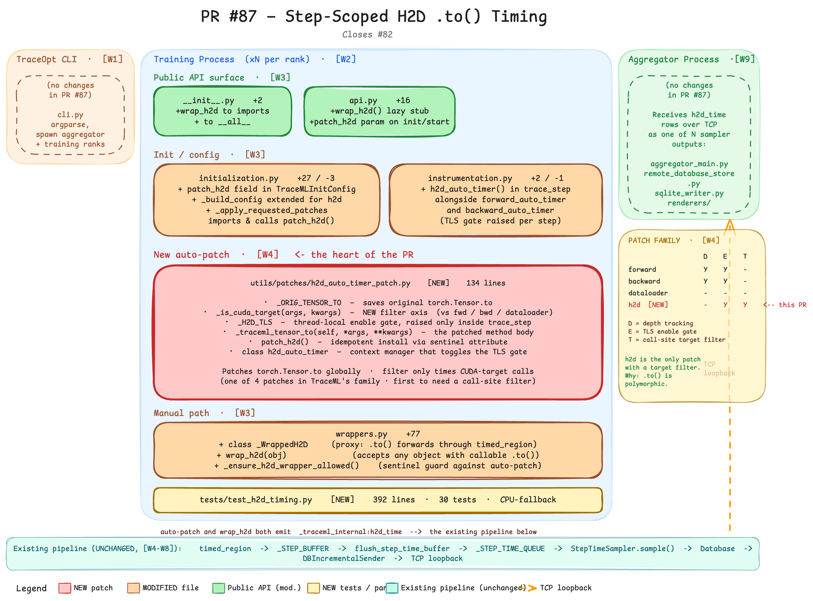

# PR #87 — Review re-read through your walkthroughs

> **Purpose.** This is the synthesis doc. You've built deep, structured architectural knowledge in three places — [traceml_pytorch_qa.md](../pytorch-qa.md), [traceml_learning_qa.md](../learning-qa.md), and [traceml_learning_code_walkthroughs.md](../code-walkthroughs.md). The original review (`PR_87_h2d_timing_review.md`) was written before that knowledge was visible. This doc re-reads the PR through the lens of what you actually know now.
>
> **What's different here.** Three things: (1) the per-file diff anchored to the W-section that explains its surroundings, (2) a consistency analysis across the four auto-patches now in TraceML's patch family, (3) every review finding sharpened with citations to your own docs and — in two cases — fundamentally re-framed because the walkthroughs reveal the original framing was incomplete or wrong.
>
> **Status of related docs.**
> - **This doc** — single source of truth for everything PR #87. Consolidates analysis, comment drafts, raw `/review` artifacts, local-setup commands, and the pedagogical telemetry-pipeline walkthrough. The earlier `PR_87_h2d_timing_review.md` and `PR_87_architecture_walkthrough.md` were retired into the appendices below.
>
> Q-references like `P3` point at PyTorch Q&A; `Q9` at TraceML learning Q&A; `W3` at code walkthroughs.

---

## 1. The PR re-anchored to your walkthroughs

PR #87 touches 7 files. For each, the W-section that explains the surrounding context, then what the PR adds, in your existing vocabulary.

### 1.0 Visual map

Before the per-file walkthrough, here's the whole PR rendered onto the same three-process physical view you mapped in [Architecture_physical_view.excalidraw](../../assets/architecture_physical_view.excalidraw):



> Excalidraw source: [Architecture_PR_87_h2d_timing.excalidraw](../../assets/architecture_pr_87_h2d_timing.excalidraw) — open and edit directly. Online editable copy: [excalidraw.com/#json=JNZ10IdB6CckPB4I6MBS4,1rKYfNvD4ppX8iFx-v6EWA](https://excalidraw.com/#json=JNZ10IdB6CckPB4I6MBS4,1rKYfNvD4ppX8iFx-v6EWA).

**How to read it.** Three columns mirror your physical view:

- **TraceOpt CLI (left, faded amber)** — no PR-touched files. Listed for context only; the dashed note explicitly scopes it to "no changes in PR #87."
- **Training Process (middle, blue zone)** — where every PR-touched source file lives. Five sections from top to bottom mirror §1.1–§1.6 below:
  - *Public API surface* (light green) — `__init__.py`, `api.py`. New user-facing symbol: `wrap_h2d`.
  - *Init / config* (light orange) — `initialization.py`, `instrumentation.py`. The patch policy state machine ([W3 lines 545–590](../code-walkthroughs.md)) accepts a new field; `trace_step` activates the new TLS gate.
  - *New auto-patch* (red, thick stroke — the heart of the PR) — `h2d_auto_timer_patch.py`, with all six internal components listed: `_ORIG_TENSOR_TO`, `_is_cuda_target`, `_H2D_TLS`, `_traceml_tensor_to`, `patch_h2d()`, `class h2d_auto_timer`.
  - *Manual path* (light orange) — `wrappers.py`. The `_WrappedH2D` proxy + `wrap_h2d()` + the `_ensure_h2d_wrapper_allowed()` guard.
  - *Tests* (light yellow) — `tests/test_h2d_timing.py` (NEW, 392 lines, 30 tests, CPU-fallback).
- **Aggregator Process (right, faded green)** — no PR-touched files; just receives `h2d_time` rows over TCP like any other sampler output.
- **Patch family panel (right margin, yellow)** — visual rendering of [§2 below](#2-patch-family-consistency-analysis). The 4×3 mini-table shows that `h2d` is the **first auto-patch in TraceML to need a call-site filter** (T column), and the second (after `dataloader`) without depth tracking (D column). The TLS enable gate (E column) is shared with `forward` and `backward` — that's why the TLS gating works for "skip during model.to() at setup" but not for "skip during model.to() inside a step" (§3.2).
- **Pipeline banner (bottom, teal)** — the unchanged downstream that every step-time event flows through. The PR's whole job is "emit `_traceml_internal:h2d_time` into this pipeline." It doesn't touch the pipeline itself; that's why it's marked UNCHANGED.
- **TCP arrow (right edge, orange dashed)** — where rows leave the training process for the aggregator. Loopback because aggregator and training run on the same machine.

**What this diagram does NOT show** (deliberately, to keep it readable):

- The four review change-requests from [§3 below](#3-issues-re-framed) — D2D misclassification, `Module.to` overcount, docstring inaccuracy, `wrap_h2d` race window. Those are *bugs to fix*, not architectural facts about what ships.
- Per-file diff content beyond the section summaries. Read §1.1–§1.6 below for the line-by-line view.
- Async GPU-event resolution mechanics (`try_resolve` polling, CUDA event pool, etc.). That all lives inside the "pipeline banner" abstraction; see [Appendix D](#appendix-d-pipeline-walkthrough-_traceml_internalh2d_time-end-to-end) Stations 1–3 if you want to trace one event end-to-end.

The diagram is a "what the PR ships" snapshot. The §1.1–§1.6 walkthroughs below are "what to think about each piece." Read the diagram first to orient, then drop into the per-file analysis.

### 1.1 `src/traceml/__init__.py` (+2 / -0) and `src/traceml/api.py` (+16 / -0)

**W-section:** [W3 lines 523–543](../code-walkthroughs.md). The pattern: `__init__.py` re-exports stubs from `api.py`, which lazy-imports the real implementation on first call. Cheap `import traceml`.

**The diff:**
- `__init__.py`: adds `wrap_h2d` to imports + `__all__`.
- `api.py`: adds a 3-line stub (`def wrap_h2d(*args, **kwargs): from traceml.wrappers import wrap_h2d as _wrap_h2d; return _wrap_h2d(*args, **kwargs)`) and threads `patch_h2d: Optional[bool]` through `init()` and `start()` signatures.

**Verdict:** Mechanical, follows the W3-documented pattern exactly. No issues.

### 1.2 `src/traceml/initialization.py` (+27 / -3)

**W-section:** [W3 lines 545–590](../code-walkthroughs.md). The patch policy state machine. `TraceMLInitConfig` is a frozen dataclass; `_build_config` enforces three rules; `_apply_requested_patches` lazy-imports each patch module and calls `patch_*()`. Idempotency lives in the patch modules, not here.

**The diff:**
- `TraceMLInitConfig` gains `patch_h2d: bool = False` (note the default — see §3.10 below)
- `_build_config` extends to handle `patch_h2d` in all three modes
- `_apply_requested_patches` lazy-imports `patch_h2d` from the new module
- `init()` and `start()` thread `patch_h2d` through to `_build_config`

**Verdict:** Faithful to the W3 state-machine model. The mode rules are extended consistently: `auto` → True, `manual` → False, `selective` → user-controlled. The `same_effective_configuration` check (W3 line 551) correctly ignores `source` and now compares `patch_h2d`.

**One small thing:** The error message at line ~117 is updated correctly to mention `patch_h2d`. No regression.

### 1.3 `src/traceml/instrumentation.py` (+2 / -1)

**W-section:** [W3 lines 592–627](../code-walkthroughs.md). `trace_step(model)` opens five nested concerns: `StepMemoryTracker`, `timed_region("step_time")`, `forward_auto_timer`, `backward_auto_timer`, optionally optimizer hook installation. The line that matters:

```python
with forward_auto_timer(), backward_auto_timer():
```

**The diff:** one line becomes:

```python
with forward_auto_timer(), backward_auto_timer(), h2d_auto_timer():
```

**Verdict:** Drops cleanly into the W3 nested-CM pattern. The `h2d_auto_timer` is a TLS enable-flag toggle (per W4's line 754 framing — "patch once, gate per-step"); entering `trace_step` raises the flag, exiting clears it. Consistent.

### 1.4 `src/traceml/utils/patches/h2d_auto_timer_patch.py` (+134, NEW)

**W-section:** [W4 lines 819–862](../code-walkthroughs.md). The 5-step recipe every patch follows:
1. Save the original method as a module-level constant.
2. Define a wrapper that consults a TLS enable flag (and possibly a TLS depth counter).
3. If disabled or non-outermost, delegate to the original.
4. Otherwise: increment depth, time via `timed_region`, decrement in `finally`.
5. `patch_*()` function replaces the class-level method exactly once via sentinel attribute.

**The diff vs. the recipe:**
- ✅ Step 1: `_ORIG_TENSOR_TO = torch.Tensor.to`
- ✅ Step 2 (partial): TLS enable flag (`_H2D_TLS._traceml_h2d_enabled`)
- ❌ Step 2 (partial): no TLS depth counter
- ✅ Step 3: enable check in `_traceml_tensor_to`
- ❌ Step 3 (partial): no depth check
- ✅ Step 4: `timed_region(name="_traceml_internal:h2d_time", scope="step", use_gpu=True)`. No depth tracking, so no try/finally for depth either.
- ✅ Step 5: idempotency via `torch.Tensor._traceml_h2d_patched` sentinel.

**Plus a new step Praneet introduces:** Step 2.5 — a **target-device filter** (`_is_cuda_target`) that fast-paths CPU-only `.to()` calls. This is novel; none of the W4-documented patches have an equivalent because their target classes don't have a "this call is uninteresting" axis (every forward is interesting; every backward is interesting; every dataloader fetch is interesting).

This new axis is conceptually clean but has its own bug surface — see §3.1, §3.4, and §3.9 below.

**Verdict:** Correct shape, but two of the omissions deserve scrutiny (next section).

### 1.5 `src/traceml/wrappers.py` (+77 / -0)

**W-section:** [W3 lines 655–697](../code-walkthroughs.md). The mirror universe of patches: per-instance proxies for users who can't or shouldn't use global monkey-patching. Key W3 distinctions:
- `_WrappedDataLoaderFetch` — proxy that returns wrapped iterators on `__iter__`. Forwards unknown attributes via `__getattr__`. Defines `__len__` explicitly (W3 line 681 — dunders need explicit forwarding).
- `_WrappedBackwardHandle` — wraps a loss tensor's `.backward()`. `__getattr__` forwards `.item()`, `.detach()`, `.cpu()`.
- `wrap_forward` / `wrap_optimizer` — in-place method reassignment, not proxy. Identity preservation matters (W3 lines 686–697).

**The diff:** adds `_WrappedH2D` (proxy class) + `wrap_h2d()` function + `_ensure_h2d_wrapper_allowed()` (sentinel check, identical pattern to the four existing `_ensure_*_wrapper_allowed` helpers).

**Verdict:** Architecturally aligned with W3's "proxy or in-place mutation" duality. The proxy choice is correct here — `wrap_h2d` accepts arbitrary objects (batch dicts, custom containers, tensors), so in-place mutation isn't an option. Two design issues surface in §3.4 (race window) and §3.5 (dunder forwarding gap relative to `_WrappedDataLoaderFetch`'s `__len__`).

### 1.6 `tests/test_h2d_timing.py` (+392, NEW)

No direct W-section. Exercises the surface from W3 (init config, public API) and W4 (TLS gate, idempotent patching, fast-path skipping).

**Coverage analysis using your model:**
- Tests `_is_cuda_target` truth table — string, `torch.device`, kwarg variants.
- Tests TLS enable/disable transitions through the context manager.
- Tests fast-path skip on disabled and on CPU target.
- Tests idempotency of `patch_h2d()`.
- Tests `wrap_h2d()` proxy behavior, dupe-guard, non-`.to()` rejection.
- Tests `init()` config across all three modes.

**What's missing** (anchored to W4 and W6):
- No D2D test (`cuda_tensor.to("cuda:1")`). See §3.1.
- No Module.to-inside-step test. See §3.2.
- No wrap-before-init race test. See §3.4.
- No GPU-event resolution test. The `try_resolve` path from W4 line 770 is not exercised.

**Verdict:** Solid breadth on the surface; thin on the architectural edge cases the walkthroughs surface as risky.

---

## 2. Patch-family consistency analysis

This is the angle the original review missed entirely. With four auto-patches now (`forward`, `backward`, `dataloader`, `h2d`), we can grade PR #87 against the family.

### 2.1 The four-patch table

| Aspect | `forward` | `backward` | `dataloader` | `h2d` (NEW) |
|---|---|---|---|---|
| **Target class/method** | `nn.Module.__call__` | `Tensor.backward` + `autograd.backward` | `DataLoader.__iter__` | `Tensor.to` |
| **Calls outside training?** | YES (model construction, `.apply()`, eval) | YES (validation, gradient probes) | NO (only training iterates loaders) | YES (model setup, checkpoint load) |
| **Needs TLS enable flag?** | YES | YES | NO (always-on by W4 line 893) | YES |
| **Has TLS enable flag?** | ✅ | ✅ | ✅ N/A | ✅ |
| **Calls nest naturally?** | YES (every submodule's `__call__`) | YES (higher-order grad, retain_graph) | NO (`__iter__` is leaf) | NO (`.to()` is leaf) |
| **Needs depth tracking?** | YES | YES | NO | NO |
| **Has depth tracking?** | ✅ | ✅ | ✅ N/A | ✅ N/A |
| **Sentinel attribute** | `nn.Module._traceml_forward_patched` | `torch._traceml_backward_patched` | `DataLoader._traceml_patched` | `torch.Tensor._traceml_h2d_patched` |
| **`use_gpu` in `timed_region`** | True | True | False (CPU-bound) | True |
| **Call-site filter?** | NO (every call is timed) | NO | NO | YES (`_is_cuda_target`) |

### 2.2 What this table reveals

**Every choice in PR #87 is consistent with the family axis it sits on.** The h2d patch:
- Has an enable flag because `.to()` happens at construction time → CORRECT, matches forward/backward rationale.
- Lacks depth tracking because `.to()` doesn't recurse → CORRECT, matches dataloader rationale.
- Adds a target filter because most `.to()` calls are CPU↔CPU or dtype-only → A new axis, justified.

This is a **better** consistency story than the original review told. The PR does not break the patch-family invariants; it correctly identifies which template to follow on each axis.

### 2.3 Where the original review went off course

The original review's §7.3 (now §3.3 below) said:

> "consider adding the same pattern here. Add a test: ResNet-sized module `.to()` inside a step emits exactly one event, not N."

**This recommendation was wrong**, and the table above shows why.

The Module.to overcount is **not a depth-tracking problem**. Depth tracking helps when ONE call **nests** into N calls (every submodule's `__call__` inside the top-level `model(x)`). Module.to doesn't nest — it iterates. From [P11](../pytorch-qa.md#p11-what-does-modeltodevice-do-as-it-traverses-the-module-tree):

> "`model.to(device)` walks the module tree depth-first and calls `.to(device)` on every parameter and buffer it finds (via the `_apply` helper)"

`_apply` calls `param.to(...)` once **per parameter**, sequentially. From `tensor.to`'s point of view, every one of those calls is at depth 0. Adding a depth counter changes nothing — every call would still increment 0→1, time, decrement 1→0.

**The right framing of the bug** (and the right fix) is in §3.2 below.

### 2.4 The new axis — target filter — has its own consistency question

`_is_cuda_target` is necessary because `.to()` is polymorphic in a way the other patched methods aren't (`tensor.to(torch.float16)` is a dtype cast, not a device move). But once you introduce a filter, you've taken on a contract: **the filter must correctly classify what counts as H2D**. PR #87's filter:
- ✅ Correctly skips dtype-only and CPU-only `.to()` calls.
- ❌ Incorrectly classifies D2D as H2D (§3.1).
- ❌ Doesn't disambiguate user-batch transfers from `_apply`-driven Parameter moves (§3.2).

So the new axis is the right idea but under-specified. The fix is to extend the filter, not to add a different patch-family mechanism (depth or otherwise).

---

## 3. Issues re-framed

Each finding from the original review's §7, now anchored to your docs and — in two cases — substantially re-framed.

### 3.1 D2D misclassified as H2D 🟠

**Original framing** (review §7.1): correct, just thin on supporting evidence.

**Re-framed.** [P3](../pytorch-qa.md#p3-what-does-todevice-actually-do-under-the-hood-and-is-the-copy-synchronous-or-asynchronous) gives the precise hardware story you can cite:

> "GPU → GPU, same node. `cudaMemcpyPeer` if the GPUs are peer-accessible (typically true within an NVLink/NVSwitch domain or even over PCIe). Async on the source stream."

So D2D goes through a **different DMA path** entirely — peer-to-peer over NVLink/PCIe, not the H2D PCIe-DMA-from-pinned-host path. Mixing the two into one metric isn't just imprecise naming; it's combining two physically different bottleneck classes. A user staring at `h2d_time = 50ms` who's actually got `cuda:0 → cuda:1 = 50ms` would chase the wrong fix (pin memory? bigger workers? — wrong, it's a multi-GPU sharding issue).

**Fix.** Source-device check at the top of `_traceml_tensor_to`:

```python
if self.is_cuda:
    return _ORIG_TENSOR_TO(self, *args, **kwargs)
```

Add test: `test_cuda_to_cuda_not_timed`. This also incidentally catches the `cuda_tensor.to("cuda")` no-op case.

**Citation gain for the comment:** Praneet has read P3-equivalent material (it's standard PyTorch knowledge); pointing at the `cudaMemcpyPeer` distinction makes the request structural, not stylistic.

### 3.2 Module.to overcount inside `trace_step()` 🟠 — RE-FRAMED

**Original framing** (review §7.2): "add depth tracking like forward/backward." **Wrong fix.**

**Re-framed using P11 + W4 + the §2 table.** From P11:

> "Under the hood, `nn.Module.to` is a thin wrapper that builds a per-tensor conversion function and hands it to `self._apply(fn)`. `_apply` recurses through `self.children()`, then for each parameter wraps the moved tensor in a fresh `Parameter` and reassigns into `self._parameters[key]`."

So the bug shape is:
- User puts `model.to(cuda)` inside `trace_step()` (probably by mistake — but the W3 framing is that we should fail-open, not fail-confusing).
- `nn.Module.to` → `self._apply(fn)` → `for param in self._parameters.values(): fn(param)` → calls our patched `tensor.to` once per Parameter.
- Each call is at TLS depth 0 — nothing nested. `n_calls` in the StepTimeBatch (W6) inflates by ~150 for a ResNet, ~12,000 for a 70B-param model.

**The aggregator partially absorbs this.** From [W6 line 1191+](../code-walkthroughs.md), `step_time_sampler` aggregates per-`(name, device, is_gpu)` key into one row with `sum_ms` and `n_calls`. So you don't get N rows per step — you get one row with `n_calls=N`. But:
- `sum_ms` is now genuinely huge (real cost of moving the whole model), which UI displays of "h2d cost this step" will show as a 50× spike.
- `n_calls` is corrupted as a "transfer count" signal.

**Right fix — three options, ranked:**

1. **Skip Parameter receivers:**
   ```python
   if isinstance(self, torch.nn.Parameter):
       return _ORIG_TENSOR_TO(self, *args, **kwargs)
   ```
   `nn.Module._apply` calls `fn(param)` where `param` is a `Parameter`; user batch tensors are plain `torch.Tensor`. This is the cleanest discriminator. Misses `_buffers` traversal (also goes through `_apply` but on plain tensors), but buffers are typically << parameters in count, so the tail noise is tolerable.

2. **TLS flag set by `nn.Module._apply`:** patch `_apply` (or `nn.Module.to` directly) to set `_H2D_TLS._in_module_apply = True` for the duration; `_traceml_tensor_to` short-circuits when set. Catches both Parameter and Buffer traversal cleanly. Minor: now we're patching two methods instead of one.

3. **Document and live with it:** call out in the docstring that `model.to(device)` inside `trace_step` will inflate the metric, and let users avoid the pattern. Weakest — relies on user discipline against a footgun.

**Recommendation:** option 1 in this PR; option 2 as a follow-up if Buffer overcount turns out to matter empirically.

**Test:** wrap an `nn.Linear(1024, 1024)` with `model.to("cuda")` inside `trace_step`, assert exactly one h2d_time event with `n_calls=1`.

### 3.3 Docstring understates `non_blocking=True` accuracy 🟠

**Original framing** (review §7.3): correct, citing `try_resolve()`.

**Re-framed** with [P3](../pytorch-qa.md#p3-what-does-todevice-actually-do-under-the-hood-and-is-the-copy-synchronous-or-asynchronous) for cross-validation. P3 explicitly states:

> "If the source is already pinned (`tensor.pin_memory()` or `DataLoader(pin_memory=True)`), the DMA engine reads directly from your buffer, and the Python call returns immediately while the GPU does the transfer in the background."

And [W4 line 770](../code-walkthroughs.md) on `try_resolve`:

> "`try_resolve` method is the non-blocking handoff. CUDA events can be queried for completion without forcing a stream synchronization (`gpu_end.query()` returns immediately with True/False). Only when the end-event has actually fired on the GPU do we (a) compute `gpu_start.elapsed_time(gpu_end)` (in milliseconds)..."

So **`elapsed_time` reads stream-side timestamps after the GPU has signalled completion of `gpu_end`** — meaning the elapsed includes everything between the two recorded points on the stream, including the async DMA. The docstring's claim that the events only "bound the time until the DMA is queued" contradicts both your own P3 understanding of how cudaMemcpyAsync works *and* W4's description of how try_resolve resolves elapsed time.

The docstring isn't just imprecise — it's actively wrong, and the correction is in your own notes.

**Fix:** rewrite the GPU timing paragraph to:
> "CUDA events are recorded on the current stream around the `.to()` call. `start.record()` enqueues a timestamp marker before the DMA op; `end.record()` enqueues one after. Once `end` fires (resolved later via `event.query()` in the sampler), `start.elapsed_time(end)` returns the GPU-side wall-clock duration between the two markers — including the asynchronous DMA itself. Accuracy is the same for `non_blocking=True` and `non_blocking=False`."

### 3.4 `wrap_h2d()` race window — RE-FRAMED as state-machine bug

**Original framing** (review §7.4): correct, narrative.

**Re-framed using W3's "patch policy state machine" lens.** W3 (lines 545–590) frames `_INIT_CONFIG` as a **frozen, process-wide invariant** — once set, never mutated. The implication: any check against it must be against the current value, not a snapshot.

`_ensure_h2d_wrapper_allowed()` snapshots the world at `wrap_h2d()` call time. The W3 invariant says: "patches are global per-process; wrappers are per-instance." Wrappers must therefore re-check global state at each operation — because the global state can advance (`_INIT_CONFIG` going from `None` to `auto`) between wrap and use.

The right place for the check is inside `_WrappedH2D.to()`, not in the constructor. Same as how `_ensure_dataloader_wrapper_allowed` (W3 line 55–70) actually classifies the input at wrap time *but* this isn't symmetric — there, the check is "is this object a torch DataLoader?" which doesn't change between wrap and iter. Here, the check is "is the global patch active?" which absolutely can.

**Fix:** the check moves into `_WrappedH2D.to()`:

```python
def to(self, *args, **kwargs) -> Any:
    if getattr(torch.Tensor, "_traceml_h2d_patched", False):
        # Auto-patch is active — let it time, don't double-count
        return self._obj.to(*args, **kwargs)
    with timed_region(...):
        return self._obj.to(*args, **kwargs)
```

Note this is *graceful degradation*, not a raise. If the user wrapped before init, they probably want the wrap to silently no-op once auto kicks in, not to crash mid-step.

**Test:** `test_wrap_then_init_auto_emits_one_event` — wrap, init(auto), .to(), assert n_calls=1.

**Mental-model anchor for Praneet:** "P11 says you must construct the optimizer after `model.to(device)` because Parameter identity changes; same shape of bug — wrap_h2d depends on patch state that can change."

### 3.5 `_WrappedH2D` missing dunder forwarding 🟡

**Original framing** (CLI review §6): correct.

**Re-framed using W3.** W3 line 681 explicitly notes that `_WrappedDataLoaderFetch` has `__len__` defined (not just `__getattr__`):

```python
class _WrappedDataLoaderFetch:
    def __len__(self) -> int:
        return len(self._loader)
```

This is because Python bypasses `__getattr__` for special methods on the class — `len(obj)` calls `type(obj).__len__`, not `obj.__len__`. `_WrappedH2D` has no `__len__`, no `__iter__`, no `__getitem__`, no `__contains__`. So:

```python
batch = traceml.wrap_h2d({"x": tensor, "y": tensor})
print(batch["x"])   # TypeError: '_WrappedH2D' object is not subscriptable
```

**Decision space:**
- Forward dunders (mirrors `_WrappedDataLoaderFetch`).
- Document that the proxy is single-purpose: call `.to()` immediately, don't inspect.

The W3 precedent suggests forwarding. Add `__len__`, `__iter__`, `__getitem__`, `__contains__` — five lines, matches the family.

### 3.6 Test isolation via `importlib.reload` is fragile 🟡

**Original framing** (CLI review §5): correct.

**Re-framed using W4.** W4 lines 821–826 establishes that patches are **idempotent global mutations** to a shared class object. The test's `_reload_h2d_patch()` re-executes the module, including:

```python
_ORIG_TENSOR_TO = torch.Tensor.to  # at module scope
```

If a prior test's teardown didn't reset `torch.Tensor.to` to the true original (or some test mutates it without restoring), the reloaded module captures the mutated function as `_ORIG_TENSOR_TO`. Future tests then chain patches.

The fix is exactly the W4-shape pattern that init.py uses: an autouse session-scoped fixture that snapshots `(torch.Tensor.to, torch.Tensor._traceml_h2d_patched)` at session start, restores at session end, and is the only authority for "what is the original method."

### 3.7 `scope="step"` (string) vs `scope=TimeScope.STEP` (enum) 🟡

**Walkthrough citation:** [W4 line 770](../code-walkthroughs.md) shows `timed_region` accepting `scope: TimeScope = TimeScope.STEP`. Both string and enum work because `TimeScope` is a `str`-subclass enum. Forward and backward patches use string literals; `wrappers.py` uses the enum. PR #87's auto-patch uses string; its `_WrappedH2D` uses enum. **Inconsistent within a single PR.**

Pick one. Enum is typo-safer; string is shorter. Either is fine; consistency matters.

### 3.8 No docs / examples / `__init__.py` docstring update 🟡

**Original framing** (CLI review §7): correct.

**Re-framed with W3.** Every other `wrap_*` API has a runnable example in `src/examples/` and a doc entry. The W3 walkthrough explicitly catalogs these as part of the public surface. Adding a short example showing `traceml.wrap_h2d(batch); batch = batch.to(device)` for the manual path makes the API discoverable.

### 3.9 `_is_cuda_target` substring match 🟡

**Walkthrough citation:** none directly — this is a local code-quality issue. The CLI review's proposed fix (use `torch.device(first)` parsing in a try/except) is the right shape.

### 3.10 Dataclass field default asymmetry 🟡

**Re-framed with W3.** W3 line 549 frames `TraceMLInitConfig` as a "frozen config record" that's the source of truth for both `instrumentation.py` and `wrappers.py`. The frozen invariant means the dataclass is constructed exactly twice in normal flow (once at `init`, possibly once at idempotent re-init). All construction goes through `_build_config`, which always passes every field explicitly.

So the default value `patch_h2d: bool = False` is dead code from the perspective of normal flow. It only matters if some external caller constructs the dataclass directly — which is undocumented and unsupported.

**Recommendation:** drop the default and pass explicitly everywhere. Or add a comment explaining why h2d is the only field with a default. Status quo is mildly confusing and provides no value.

### 3.11 No D2D test 🟡

Subset of §3.1's fix. Add the test.

### 3.12 No GPU-timing validation test 🟡

**Walkthrough citation:** [W4 line 800–804](../code-walkthroughs.md) explains the CUDA event pool — `enable_timing=True`, pool of 2000, recycle on resolve. None of the existing tests exercise the full path: pool acquire → `start.record()` → user code → `end.record()` → `try_resolve` returns True → `elapsed_time` returns a positive number → pool release.

This is consistent with the rest of the test suite (CPU-only CI), but the implication is that **CUDA event pool exhaustion is undetectable** from CI alone. Worth manual GPU-box validation.

### 3.13 Performance / API naming 🟡

Unchanged from the original review — minor.

---

## 4. New angles surfaced by the walkthroughs

Five things the original review didn't see.

### 4.1 The Module.to bug compounds with the CUDA event pool

**Walkthrough citation:** [W4 line 800–804](../code-walkthroughs.md). Pool is `deque(maxlen=2000)`. Forward + backward + h2d auto-patches consume 6 events per step from auto-patches alone (3 timed_region calls × 2 events each). Add per-layer hooks in deep mode → 100s more.

If a user mistakenly puts `model.to(cuda)` inside `trace_step()` for a model with 150 parameters, that's 300 extra events per step. Sustained over 100 steps → 30,000 events. The `maxlen=2000` deque drops older entries when full, but **events not yet returned to the pool are not in the deque** — they're held inside unresolved `TimeEvent`s in the queue. The aggregator sampler (W6 — drains queue, resolves, returns to pool) is the recycler.

Under sustained Module.to-inside-step pressure:
- Sampler can't keep up with event creation rate.
- Pool empties.
- `get_cuda_event()` falls back to `torch.cuda.Event(enable_timing=True)` allocation per call (driver call, not free).
- Now there's measurable per-step overhead from pool exhaustion.

So the §3.2 fix isn't just about UI numbers; it's about the per-rank overhead budget under user error. The fix-cost argument now has a perf dimension too.

### 4.2 The init/wrap state-machine has more than the wrap_h2d race

**Walkthrough citation:** [W3 lines 545–590](../code-walkthroughs.md). The state machine has three states: `_INIT_CONFIG = None`, `_INIT_CONFIG = X`, `_INIT_CONFIG = Y` (incompatible with X — raises). Wrappers must operate in all three.

Right now, `_ensure_h2d_wrapper_allowed` only checks "is the auto-patch installed?" That's correct for state 2 and 3 (after init). But state 1 (`_INIT_CONFIG = None`) is the race window — wrap was called, init hasn't been. Two fixes are possible:

- **Fix A** (§3.4): re-check at `.to()` time inside `_WrappedH2D`. Handles all three states.
- **Fix B**: refuse to construct `_WrappedH2D` until init has run. Stronger contract — but it imposes call ordering that other `wrap_*` functions don't impose. Asymmetric.

A is the right choice. But the framing is now: "wrappers are stateless reads of mutable global config; they must read at call time, not construction time." This is a principle worth writing down somewhere, either as a comment in `wrappers.py` or as a contributor note in `docs/developer_guide/`.

### 4.3 H2D is the first patch that needs *call-site filtering*, and that introduces a new failure mode

**Walkthrough citation:** §2 above + W4's 5-step recipe.

`forward_auto_timer`, `backward_auto_timer`, `dataloader_patch` all want to time **every** call to their patched method. PR #87 introduces the first patch that wants to time **some** calls. That changes the failure-mode taxonomy:

| Failure mode | forward/backward/dataloader | h2d |
|---|---|---|
| Patch fails to install | Visible — feature dead | Same |
| Patch over-times (false positive) | N/A — every call is interesting | Possible (D2D, dtype-only, no-op) |
| Patch under-times (false negative) | N/A — fast path is "we said this matters" | Possible (filter rejects valid H2D) |

The two new failure modes (over-timing and under-timing) live in `_is_cuda_target`. §3.1 is an over-timing case. §3.9 (substring match) could in principle be an under-timing case — `tensor.to(" cuda :0")` (whitespace) wouldn't match `"cuda" in s`... actually it would (`"cuda" in " cuda :0"` is True). Try `tensor.to("CUDA:0")` (uppercase) — that's `False`. Whether anyone writes that is debatable.

**Implication:** the filter deserves more test coverage than the existing patches' equivalents because the filter has more failure modes than the existing patches' on-off gates.

### 4.4 The `name` field of TimeEvent is the only thing TraceML uses to identify H2D in renderers

**Walkthrough citation:** [W6 (paraphrased — line ~80–100 of step_time_sampler.py)](https://github.com/Pendu/traceml/blob/main/src/traceml/samplers/step_time_sampler.py) — aggregation key is `(name, device, is_gpu)`. The string `_traceml_internal:h2d_time` is the only thing carrying H2D semantics through the pipeline.

Implications:
- If §3.1 is fixed by exclusion (skip D2D), the metric stays semantically clean.
- If §3.1 is fixed by renaming (`_traceml_internal:to_cuda_time`), every renderer / summary that displays this field needs to know the new name. There may not be any specialized renderer yet, but if/when one is added, the rename is sticky.
- Either way, **this field name is now a public-ish API.** Once it lands in user dashboards, renaming requires migration.

Argues for getting §3.1 right with the *exclusion* fix, not the rename.

### 4.5 The mode-validation rule the PR doesn't break (worth confirming)

**Walkthrough citation:** [W3 lines 557–562](../code-walkthroughs.md). `_build_config` enforces three rules; rule 3:
> "`selective` must enable at least one patch (lines 149–153) — passing all three as `False` is the same as `manual` and is rejected."

PR #87 extends this: `not any((dl, fwd, bwd, h2d))` instead of `not any((dl, fwd, bwd))`. So `mode='selective', patch_h2d=True` is now valid even with the others False. Good.

But: read the error message carefully. The original was "must enable at least one automatic patch." The new one (per the diff) is "must enable at least one automatic patch." Should be reviewed: with `patch_h2d` as the only enabled patch, does the error message stay sensible? Looking at the diff... yes, the message says "Use mode='manual' when you want zero automatic patches" — still correct.

Just a sanity check, not a finding.

---

## 5. Verification gates — what to confirm before approving

Before posting the comments, run these checks. Each is concrete and bounded.

### 5.1 Reproduce the Module.to overcount

```bash
git -C /teamspace/studios/this_studio/traceml checkout pr-87
cd /teamspace/studios/this_studio/traceml
```

Then a 30-line script:

```python
import traceml, torch
import torch.nn as nn

traceml.init(mode="auto")

model = nn.Sequential(*[nn.Linear(64, 64) for _ in range(10)])  # ~20 params

with traceml.trace_step(model):
    model.to("cuda")  # ← this is the bug trigger
    x = torch.randn(8, 64, device="cuda")
    out = model(x)
    out.sum().backward()

# Print the latest h2d_time row
from traceml.utils.timing import _STEP_TIME_QUEUE
# inspect; expect n_calls == 20 (or some inflated count)
```

If `n_calls > 1`, the bug is reproduced and §3.2 is concrete. (You'll need a CUDA box for this — Lightning Studio with GPU works.)

### 5.2 Confirm the docstring is wrong

```python
# Without GPU, just code-trace try_resolve in src/traceml/utils/timing.py
# Confirm the elapsed_time call happens AFTER end.query() returns True.
# Verify by reading lines 65–90.
```

This is a desk check, no execution needed. Cite §3.3 with the line numbers from W4.

### 5.3 Confirm the wrap_h2d race

Three-line script:

```python
import traceml, torch

x = torch.randn(8, 64)
wrapped = traceml.wrap_h2d(x)        # state 1: init not yet called → guard passes
traceml.init(mode="auto")            # state 2: patches install
y = wrapped.to("cuda")               # if both fire → double-count

# Inspect _STEP_TIME_QUEUE for n_calls on h2d_time. Expect 1; if 2, bug confirmed.
```

Note: this needs a `trace_step` wrapping the `.to()` for h2d_auto_timer's TLS to be enabled. Adjust accordingly.

### 5.4 Confirm dunder forwarding gap

```python
batch = traceml.wrap_h2d({"x": torch.zeros(4)})
batch["x"]   # expect TypeError
```

Trivial. Confirms §3.5.

### 5.5 (Optional) Run the existing test suite

```bash
cd /teamspace/studios/this_studio/traceml
pytest tests/test_h2d_timing.py -v
```

Should be green. Confirms the suite exists and passes; doesn't validate any of §5.1–§5.4.

---

## 6. Sharpened comment drafts (NOT final — you edit before posting)

Six drafts: four change-requests, two discussion. Each carries an "anchor" (what shared concept it leans on) so you can tune the language to your relationship with Praneet — co-founder review, not strict gatekeeping.

### Draft A — D2D misclassification (line comment on `_is_cuda_target`)

> The filter checks the destination device but not the source. If `self.is_cuda` is already True, this is a D2D copy (`cudaMemcpyPeer` over NVLink/PCIe — different hardware path from H2D's pinned-memory DMA), not host-to-device. Tagging it as `h2d_time` mixes two distinct bottleneck classes into one metric.
>
> Suggest a `if self.is_cuda: return` short-circuit before the filter, plus a test `test_cuda_to_cuda_not_timed`. Renaming the event to `to_cuda_time` is a fallback if you want to keep D2D in scope, but my hunch is users will trust the metric more if it stays narrow.

**Anchor:** P3's `cudaMemcpyPeer` distinction. Praneet probably has equivalent knowledge; this isn't a teach.

### Draft B — Module.to overcount (PR-level comment, not a line comment)

> One scenario worth handling: if a user does `model.to(device)` inside `trace_step()` (probably by mistake, but it happens), `nn.Module.to` will recurse via `_apply` and call `tensor.to` once per Parameter. For a non-trivial model that's hundreds of patched calls, all at TLS depth 0, all timed, all aggregated into `n_calls=N`, with `sum_ms` reflecting the real cost of moving the whole model in one step.
>
> Depth tracking the way `forward_auto_timer` and `backward_auto_timer` do it wouldn't help here — these calls aren't nested, they're sequential. Two cleaner options:
>
> - `if isinstance(self, torch.nn.Parameter): return _ORIG_TENSOR_TO(...)` — Parameters are what `_apply` traverses; user batch tensors are plain `torch.Tensor`. Misses Buffer traversal but those are typically << params.
> - Set a TLS flag from a patched `nn.Module.to` (or `_apply`) and short-circuit when set. Catches both Parameter and Buffer; trades for one more patched method.
>
> Test: `model.to("cuda")` inside `trace_step()` should produce one event with `n_calls=1`, not N. Worth at least picking a stance and writing it down — happy to discuss if the right answer is "document the footgun and move on."

**Anchor:** P11's `_apply` walkthrough. Sharper than the original review's framing.

### Draft C — Docstring on `non_blocking=True` accuracy (line comment on the GPU timing docstring)

> Small thing: the docstring says the events `bound the time until the DMA is queued on the current stream, which is a useful lower bound`. I don't think that's right — `try_resolve` in `utils/timing.py` calls `gpu_start.elapsed_time(gpu_end)` after `gpu_end.query()` returns True, which means we're reading stream-side timestamps after both events have completed. The elapsed includes everything the stream did between the two records, including the async DMA itself. So `non_blocking=True` should be measured with the same accuracy as `non_blocking=False`.
>
> If you agree, tightening the wording avoids users distrusting the metric on the exact use case it's most valuable for (pinned-memory + non-blocking pipelines).

**Anchor:** W4's description of `try_resolve` + P3's pinned-async semantics.

### Draft D — wrap_h2d race window (line comment on `_ensure_h2d_wrapper_allowed`)

> Edge case: this guard runs at wrap time. If a user does `wrapped = wrap_h2d(x); traceml.init(mode="auto"); wrapped.to(cuda)`, the guard passes (auto-patch wasn't installed yet at wrap time), then both timers fire at `.to()` time → double-count.
>
> Could the same check move into `_WrappedH2D.to()` and short-circuit silently if `torch.Tensor._traceml_h2d_patched` is True at call time? That way wrap-before-init becomes graceful no-op rather than a double event. The init module's patch policy is mutable global state by design; wrappers reading that state probably need to read at call time.
>
> Test: `wrap → init(auto) → trace_step → .to()` emits exactly one event.

**Anchor:** W3's "patches are global per-process; wrappers are per-instance" framing.

### Draft E — Dunder forwarding gap (line comment on `_WrappedH2D.__getattr__`)

> Heads-up: `__getattr__` doesn't catch dunders — Python dispatches `len(x)`, `x[k]`, `iter(x)` directly to the class. `_WrappedDataLoaderFetch` handles this with explicit `__len__`. If a user does `wrap_h2d({"x": tensor})` and then `batch["x"]`, this raises `TypeError`.
>
> Two paths: forward `__len__`, `__iter__`, `__getitem__`, `__contains__` explicitly (matches `_WrappedDataLoaderFetch`); or document that the proxy is single-use — call `.to()` immediately, don't introspect. I'd lean forwarding for consistency with the family.

**Anchor:** W3's `_WrappedDataLoaderFetch.__len__`.

### Draft F — Discussion: GPU validation pass (PR-level comment)

> Out of curiosity, did you run `pytest tests/test_h2d_timing.py` on a CUDA box, or is everything CPU-fallback? The full path through `cuda_event_pool → start.record() → end.record() → try_resolve → elapsed_time → return_cuda_event` isn't exercised in CPU-only CI. Not blocking — consistent with the rest of the suite — but worth a quick sanity check on a 256MB tensor moving to GPU to confirm the measured number is in the expected range.

**Anchor:** W4's CUDA event pool description.

---

## 7. Updated verdict

The original review's verdict was "request changes." That stands. But the *content* of the changes shifts:

| Item | Original framing | Updated framing |
|---|---|---|
| §3.1 D2D | Source check | Same fix; sharper rationale via P3's `cudaMemcpyPeer` |
| §3.2 Module.to | Add depth tracking ❌ | Parameter check or `_apply` TLS flag ✓ |
| §3.3 Docstring | Tighten wording | Same fix; cite `try_resolve` directly |
| §3.4 wrap_h2d race | Re-check at .to() | Same fix; framed as "wrappers must re-read mutable global state" |
| §3.5 Dunders | Add or document | Add (cite `_WrappedDataLoaderFetch.__len__` precedent) |

§3.2 is the only finding whose **fix direction** changes. The others gain support, not direction.

---

## 8. What I'm holding back from §6

Two things I haven't put into Draft B (the Module.to comment), because the right call depends on your relationship-side judgment, not technical analysis:

**(a)** Whether to mention `model.to(device)` inside `trace_step` is "user error." It probably is. But framing it that way might invite Praneet to ship the PR with a docstring caveat instead of a fix. If you want the fix, soft-pedal the "user error" framing.

**(b)** Whether to mention the CUDA event pool exhaustion compounding (§4.1). It strengthens the request but it's also a deep-cut systems argument that might come across as overreach if Praneet hasn't read W4. Up to you.

Both are pure positioning calls. I left them out of the draft so you decide.

---

## 9. Cross-references

**Source materials cited in this doc:**
- [traceml_pytorch_qa.md](../pytorch-qa.md) — P3 (`.to(device)` semantics), P11 (`model.to` traversal), P48 (`_call_impl` patching), P49 (hook firing order), P51 (CUDA API stability)
- [traceml_learning_qa.md](../learning-qa.md) — Q9 (hooks/in-process injection), Q15 (CUDA streams)
- [traceml_learning_code_walkthroughs.md](../code-walkthroughs.md) — W3 (user-facing API state machine), W4 (patches + timing primitives), W6 (samplers — partial)

If any citation looks off, it's either my paraphrase or a line-number drift; the underlying point should still hold. Push back hard on anything that doesn't match what you wrote.

---

## 10. Context for Abhinav

If you're looping Abhinav in, the one-paragraph summary:

> PR #87 closes issue #82. Praneet implemented both the auto-patch and `wrap_h2d(...)` wrapper paths, tight and consistent with the existing `forward` / `backward` / `dataloader` patch family. 30 tests cover TLS gating, CUDA target detection, init config. CI green across 3.10/3.11/3.12. Acceptance criteria all met. Review across three passes (manual + two `/review` runs + a re-read through deep-architecture walkthroughs) converged on four concrete items worth fixing before merge: (1) `_is_cuda_target` only checks the destination, so `cuda:0 → cuda:1` (D2D over `cudaMemcpyPeer`, hardware path different from H2D's pinned-DMA) gets recorded as `h2d_time`; (2) `nn.Module.to(device)` inside `trace_step()` would emit one event per Parameter via `_apply` traversal — fix is a `isinstance(self, nn.Parameter)` short-circuit, not depth tracking; (3) docstring claims `non_blocking=True` only bounds DMA-queueing time, but `try_resolve` actually captures full transfer time — wording fix; (4) `wrap_h2d()` duplicate-instrumentation guard runs at wrap time, so `wrap → init(auto) → .to()` double-counts — fix is to re-check inside `_WrappedH2D.to()`. All four fixes are localized; each needs one small test. Recommend **request changes**; once resolved, clean merge.

---

## Appendix A: local setup

The PR branch is already fetched locally as `pr-87`:

```bash
# Switch to review it
git -C /teamspace/studios/this_studio/traceml checkout pr-87

# Run the tests
pytest tests/test_h2d_timing.py -v

# Return to your working branch
git -C /teamspace/studios/this_studio/traceml checkout docs/dev-docs-site
```

---

## Appendix B: `/review` skill output (in-chat run, raw)

**Note:** `/ultrareview` is a billed feature not available in this environment. We ran the standard `/review` skill instead. Output from that pass captured verbatim below, before the analysis above was sharpened with the walkthrough re-read. Kept here as a reference artifact — useful for showing how a single `/review` pass frames the same PR.

---

# Code Review: PR #87 — `feat: add step-scoped H2D .to() timing`

**Author:** Praneth Paruchuri · **Closes:** #82 · **Stats:** +650/-4, 7 files · **CI:** all green

---

### Overview

Adds instrumentation for host-to-device transfers. Two paths, both emitting `_traceml_internal:h2d_time` events into the existing `StepTimeSampler` → SQLite pipeline:

1. **Automatic** — `torch.Tensor.to` is patched once at `traceml.init()`, gated by a thread-local flag that is only raised inside `trace_step()`. Setup transfers (model init, checkpoint load) are not measured.
2. **Manual** — `traceml.wrap_h2d(x)` returns a `_WrappedH2D` proxy; the next `.to()` call is timed, and the real tensor is returned. Any object with a callable `.to()` is accepted.

Architecture follows the existing `forward_auto_timer_patch.py` / `backward_auto_timer_patch.py` template — same TLS gate, same `timed_region(use_gpu=True)` call shape, same idempotent patch + context-manager-activator split.

---

### Code Quality & Style

**Strengths**
- Consistent with existing patch patterns — minimal cognitive overhead for future maintainers.
- Fast-path exits in the patched method: outside step or non-CUDA target → direct passthrough, zero allocation.
- Idempotent `patch_h2d()` guarded by `torch.Tensor._traceml_h2d_patched`.
- `wrap_h2d()` refuses to operate when the auto-patch is installed (via `_ensure_h2d_wrapper_allowed`) — prevents double counting.
- `_WrappedH2D.__getattr__` forwards unknown attributes so `proxy.shape` / `.dtype` work naturally before `.to()`.
- Proxy consumed on first `.to()` (returns real tensor, not another proxy) — avoids accretion bugs.
- Good module-level docstrings explaining rationale and caveats.

**Style issues**
- `TraceMLInitConfig.patch_h2d: bool = False` has a default, but `patch_dataloader`, `patch_forward`, `patch_backward` don't. Asymmetric. Either call out why in a comment, or give all four the same default.
- `api.py:wrap_h2d` signature is `(*args, **kwargs)` — typed loosely to match neighboring `wrap_*` stubs. Consistent, but worth noting as a project-wide weak spot.

---

### Correctness Issues

**🟠 1. Device-to-device (D2D) transfers misclassified as H2D**

`_is_cuda_target()` checks only the **destination**:

```python
# src/traceml/utils/patches/h2d_auto_timer_patch.py:63
if isinstance(first, torch.device) and first.type == "cuda":
    return True
```

If a tensor already on `cuda:0` is moved to `cuda:1` (D2D — different hardware path, different semantics), it will be recorded as `h2d_time`. Users debugging dataloader stalls via this metric will see D2D noise. Suggest an explicit source check:

```python
# conceptually
def _is_h2d(self, args, kwargs) -> bool:
    if self.is_cuda:
        return False  # source is already on GPU → D2D or no-op, not H2D
    return _target_is_cuda(args, kwargs)
```

Also catches the `cuda_tensor.to("cuda")` no-op case.

**🟠 2. Docstring understates CUDA event accuracy for `non_blocking=True`**

From `h2d_auto_timer_patch.py`:
> For `non_blocking=True` the events bound the time until the DMA is queued on the current stream, which is a useful lower bound.

This is incorrect. From `src/traceml/utils/timing.py:try_resolve()`:

```python
if self.gpu_end.query():
    self.gpu_time_ms = self.gpu_start.elapsed_time(self.gpu_end)
```

CUDA events record GPU-side timestamps on the stream. `start.elapsed_time(end)` reflects stream progression between them — **including the async DMA itself**, since the `end` event waits behind the DMA op on the stream. The measured time is the actual transfer duration, not a queueing lower bound. Tighten the docstring or users will distrust valid numbers.

**🟡 3. No re-entrance depth tracking**

`forward_auto_timer_patch` and `backward_auto_timer_patch` both track `_depth` to time only the OUTERMOST call. `h2d_auto_timer_patch` does not. For `torch.Tensor.to()` alone this is fine — it doesn't recurse. But a user container class with its own `.to()` that calls `.to()` on child tensors would cause nested events. Ask whether this was considered and rejected, or just not thought through.

**🟡 4. Loose substring match in CUDA target detection**

```python
if isinstance(first, str) and "cuda" in first:
    return True
```

Catches `"cuda"`, `"cuda:0"`, but also `"foo-cuda-bar"`. In practice `torch.device()` construction downstream would fail — so this is theoretical. Still, `first.startswith("cuda")` (or `torch.device(first).type == "cuda"`) is more defensible.

---

### Performance

- Fast path is clean: `if not _enabled() or not _is_cuda_target(args, kwargs): return _ORIG_TENSOR_TO(...)`. Both checks are cheap (attribute access + `in` / isinstance). No allocation on skip.
- Every timed call allocates two CUDA events via `timed_region`. Consistent with forward/backward; acceptable.
- TLS access is O(1); no lock contention.

No performance concerns.

---

### Test Coverage

- **30 tests, 392 lines** in `tests/test_h2d_timing.py`. Runs without a GPU (falls back to CPU wall-clock timing, events still emitted).
- Covers: `_is_cuda_target` truth table (strings, `torch.device`, kwargs, dtype-only, no-args, other-tensor form), TLS on/off correctness, patch idempotency, step-buffer integration (event recorded only inside `trace_step`), wrapper proxy behavior, duplicate guard, init config across all three modes.

**Gaps**
- **No D2D test.** Exactly the misclassification case above — add `test_cuda_tensor_to_cuda_returns_false_or_not_timed` and it would have caught it.
- **No GPU-timing validation test.** All timing paths use CPU fallback. Numbers on real CUDA hardware are verified only by manual inspection. Consistent with project posture, but worth asking the author to manually validate on a GPU box if not already done.
- Test at `test_patched_to_skips_timing_when_disabled` uses `side_effect` on `patch()` but the callback is structured unusually (function returning `@contextmanager`). Works, but harder to read than standard `MagicMock` + `__enter__` / `__exit__`.

---

### Security

- Patches `torch.Tensor.to` globally, mutates `torch.Tensor._traceml_h2d_patched`. Standard TraceML pattern; no new attack surface.
- No user-input parsing, no file I/O, no network, no subprocess. Nothing to evaluate from a security standpoint.
- TLS-scoped state; no cross-thread leakage.

No security concerns.

---

### Suggested Follow-ups

**Before merge (recommended):**
1. Add source-is-CPU check in `_is_cuda_target` (or rename to `_is_h2d_transfer`) — blocks D2D misclassification.
2. Tighten docstring on `non_blocking=True` accuracy — reflect actual CUDA event semantics per `try_resolve()`.
3. Add a D2D test case to lock in the corrected behavior.

**Optional / minor:**
4. Consider `startswith("cuda")` instead of `in` substring match.
5. Harmonize `patch_h2d` default with the other `patch_*` dataclass fields (or add a comment explaining the asymmetry).
6. If depth-tracking was considered and rejected, add a one-line comment in the patch module explaining why — future maintainers will ask.

**Not blockers:**
- Naming (`wrap_h2d` vs `wrap_host_to_device`) — bikeshed.
- GPU CI job — broader project concern.

---

### Verdict

**Approve with changes requested.** The architecture is correct, tests are thorough, and the PR meets every acceptance criterion in issue #82. Findings §1 (D2D misclassification) and §2 (misleading docstring) should be fixed before merge — both are small, localized changes. Findings §3–§4 are discussion items that can be addressed here or in a follow-up.

Once §1 and §2 are resolved and a D2D test is added, this is a clean merge.

---

## Appendix C: `/review` skill output (CLI run, second pass)

**Note:** This is a second `/review` run invoked from terminal Claude Code CLI, captured verbatim below. The richer findings compared to Appendix B illustrate the variance between LLM-driven review runs — different starting context, different model seed, and different search paths surface different items. Kept here as a reference artifact and as the direct source for the additions merged into §3 above.

---

### Code Review: PR #87 — step-scoped H2D .to() timing

#### Overview

Adds instrumentation for `torch.Tensor.to()` host-to-device transfers, scoped to active `trace_step()` regions. Three entry points: an auto-patch (`patch_h2d()` at init time), a manual wrapper (`wrap_h2d()`), and selective mode via `patch_h2d=True`. TLS-gated, CUDA-only, falls back to CPU wall-clock in GPU-less CI. 392-line test file, 30 tests.

#### Strengths

- Mirrors the `forward_auto_timer` / `backward_auto_timer` shape cleanly — new reviewers can pattern-match.
- `_ensure_h2d_wrapper_allowed()` prevents double-counting when the auto-patch is active.
- TLS gating avoids timing model init, checkpoint loads, dataloader-worker transfers.
- Tests run without CUDA and mock the original `.to()` so no real GPU is touched.
- Idempotent patch install via `_traceml_h2d_patched` sentinel.

#### Issues & risks

**1. `model.to(device)` inside `trace_step()` will overcount (medium)**

`torch.nn.Module.to()` recursively calls `tensor.to()` on every parameter and buffer. If a user mistakenly puts `model.to(device)` (or re-moves submodules) inside `trace_step`, one API call emits N events — once per parameter. Consider either:
- Gating on "top-level call only" via a re-entry flag on `_H2D_TLS`, or
- Documenting that `trace_step` blocks should contain no `Module.to` calls.

**2. `_is_cuda_target` substring match is loose (h2d_auto_timer_patch.py:348-356)**

```python
if isinstance(first, str) and "cuda" in first:
```

Matches `"cuda"`, `"cuda:0"`, but also `"not-cuda-but-cuda"` hypothetically, and misses `"cuda :0 "` whitespace. Safer and simpler:

```python
try:
    dev = torch.device(first) if isinstance(first, str) else first
    if isinstance(dev, torch.device) and dev.type == "cuda":
        return True
except (RuntimeError, TypeError):
    pass
```

Same fix for `kwargs["device"]`.

**3. D2D transfers counted as H2D (medium)**

The patch never inspects `self.device`. A `cuda_tensor.to("cuda:1")` (device-to-device) or `cuda_tensor.to("cuda:0")` (no-op) will both be timed as H2D. Either:
- Skip when `self.device.type != "cpu"` (renames "H2D" correctly), or
- Rename the event to `_traceml_internal:to_cuda_time` so the semantics match what's measured.

**4. `wrap_h2d` guard is race-window-only (wrappers.py:468-498)**

`_ensure_h2d_wrapper_allowed()` runs at wrap time. If a user does `wrapped = wrap_h2d(x); traceml.init(mode="auto"); wrapped.to(cuda)`, both timers fire and the event double-counts. Either re-check inside `_WrappedH2D.to()`, or document that `wrap_h2d` must be called after `init`.

**5. Test isolation via `importlib.reload` is fragile**

`_reload_h2d_patch()` re-executes `_ORIG_TENSOR_TO = torch.Tensor.to` at module scope. If a prior test left `torch.Tensor.to` patched, the reloaded module captures the patched function as "original" — subsequent tests then chain patches. The teardown flag reset in `TestWrapH2D` helps but isn't applied uniformly across all test classes. Consider a session-scoped autouse fixture that snapshots and restores `torch.Tensor.to` + the sentinel flag.

**6. Minor style / consistency**

- `h2d_auto_timer_patch.py:374` uses `scope="step"` (string); `wrappers.py:456` uses `scope=TimeScope.STEP` (enum). Pick one.
- Class `h2d_auto_timer` is lowercase — intentional to match `forward_auto_timer`/`backward_auto_timer`, but violates PEP8. Pre-existing convention, so leave it; just flagging.
- `_WrappedH2D` doesn't forward `__len__`, `__iter__`, `__getitem__`. If users wrap a batch dict/list and access it before `.to(...)`, indexing will fail. `__getattr__` only covers attribute access. Either document this or add the dunder proxies.

**7. Documentation / examples gap**

- No update to `docs/` for the new `wrap_h2d` public API or `patch_h2d` selective flag.
- No entry in `src/examples/` — other instrumentation features each have a runnable example.
- `src/traceml/__init__.py` exports `wrap_h2d` but the top-level docstring (if any) isn't updated.

#### Performance

Each `tensor.to()` now pays a TLS attribute lookup + (when enabled) an `_is_cuda_target` call. Negligible per-call, but heavy users of `.to()` in hot loops (unusual) should be aware. No concerns for typical training.

#### Test coverage

Solid breadth: TLS gating, CUDA/CPU target detection, idempotent install, proxy attribute forwarding, init-config error paths. Missing:
- D2D case (see issue 3) — add a test asserting the chosen semantics.
- Overcount guard for `Module.to` (see issue 1) — add once a decision is made.
- `wrap_h2d` called before `init(mode="auto")` — assert behavior (double-count vs. raise).

#### Security

Monkey-patching a public PyTorch symbol is the main risk surface. Nothing else touches I/O, network, or untrusted input.

#### Recommendation

**Request changes.** The core design is sound, but issues 1–3 materially affect what the reported `h2d_time` actually measures. Tighten `_is_cuda_target`, define the semantics for D2D and `Module.to`, and add tests for those cases before merging.

---

## Appendix D: Pipeline walkthrough — `_traceml_internal:h2d_time` end-to-end

**Note:** Originally a separate doc (`PR_87_architecture_walkthrough.md`), folded in here as a reference. This is the **learning dialogue** form — pedagogical, station-by-station, with checkpoint questions left in place. Useful when you (or future-you) want to re-build the mental map of TraceML's telemetry pipeline. **Stations 1–3 are written; Stations 4–7 are stubs** (covered in your own [W6–W9 walkthroughs](../code-walkthroughs.md), which are deeper anyway).

**Method.** Take one imaginary `.to("cuda")` call inside `trace_step()` and follow its corresponding `_traceml_internal:h2d_time` event from the moment it's born (inside the patched method) to the moment it renders as a number in someone's terminal. Every station = one architectural layer.

**Mode.** Bottom-up — start at the event, rise through the pipeline.

---

### D.0 Ground truth (the anchors)

#### The architecture diagram

[traceml/docs/assets/Architecture_excali_b.png](../../assets/Architecture_excali_b.png)

What the diagram asserts (verbatim):

1. **Three process groups**, launched by the CLI:
   - **CLI** (ephemeral) — parses args, spawns the other two, waits.
   - **Aggregator Process** (one, long-running) — Python core: `msgspec`, `Rich`, `NiceGUI`. Owns the SQLite table, live renderer, end-of-run summary.
   - **Training Processes (×N)** — one per rank (one per GPU in DDP). User code runs here. Python, PyTorch, `pynvml`, CUDA events.
2. **Per-rank internals** (the orange/amber box in the diagram):
   - User code thread → in-process telemetry queue → background runtime thread drains queue → ships batches over TCP.
3. **Inter-process wire format**: TCP, length-prefixed `msgspec`-encoded frames. Green dashed line in the diagram.
4. **Hardware sources** (at the bottom): GPU(s) + CUDA driver, CPU + host RAM, Filesystem.
5. **Three load-bearing principles** (the legend):
   - **Fail-open** — aggregator crash never crashes training.
   - **Zero-code** — one `import traceml` + `trace_step(model)` wrapper.
   - **DDP fan-in** — N ranks all feed a single aggregator.

#### The design principles from architecture.md

From [traceml/docs/developer_guide/architecture.md:45-48](../../developer_guide/architecture.md):

- **Fail-open** — training must never crash because telemetry broke.
- **Bounded overhead** — every sampler justifies its overhead; bounded deque tables evict oldest.
- **Process isolation** — no shared memory. TCP + env vars only.
- **Out-of-process UI** — aggregator crashes don't crash training.

These four principles will explain almost every design decision we hit in the code. Keep them in the back of your mind — when something seems over-engineered, it's usually one of these that forced the shape.

#### What PR #87 adds, mapped to the diagram

PR #87 adds a new **instrumentation site** (the patched `torch.Tensor.to`) inside Training Processes. Everything downstream of that — queue, background thread, TCP, aggregator, SQLite, renderer — is reused unchanged. The PR's whole job is "emit a new event name (`_traceml_internal:h2d_time`) into the existing pipeline." That's what makes it a good teaching vehicle: it forces us to see the pipeline exists.

---

### D.1 What we're tracing

The imaginary call we'll follow:

```python
# user script
import traceml

traceml.init(mode="auto")      # installs patch_h2d()

model = build_model()
loader = build_loader()

with traceml.trace_step(model):          # opens the step context
    batch = next(iter(loader))
    batch = batch.to("cuda")             # ← this is our `.to()` call
    out = model(batch)
    loss = out.loss
    loss.backward()
    optimizer.step()
# trace_step context exits → step boundary → flush
```

Inside the patched `torch.Tensor.to`, exactly one `_traceml_internal:h2d_time` event is born. Our job: follow it.

---

### D.2 The telemetry pipeline (bottom-up)

We'll hit 7 stations. The first three live inside the training process; stations 4–7 span the process boundary and live inside the aggregator.

```
[Training Process]
  Station 1 · timed_region() creates a TimeEvent → appended to _STEP_BUFFER
  Station 2 · trace_step() exits → flush_step_time_buffer() drains buffer into _STEP_TIME_QUEUE
  Station 3 · StepTimeSampler.sample() reads queue, resolves GPU events, aggregates per step, writes to in-memory Database
  Station 4 · DBIncrementalSender ships only new rows over TCP (msgspec framed)
         ─── TCP wire ───
[Aggregator Process]
  Station 5 · TCPServer receives frames, routes to RemoteDBStore (rank-aware)
  Station 6 · Renderer reads RemoteDBStore, produces Rich/Plotly output
  Station 7 · Live display driver flushes to terminal / NiceGUI
```

Stations 1–3 are written below. Stations 4–7 are sketched at the end; the deeper coverage lives in [W6](../code-walkthroughs.md), [W7](../code-walkthroughs.md), [W8](../code-walkthroughs.md), [W9](../code-walkthroughs.md) of your own walkthroughs.

---

#### Station 1 · `timed_region()` inside the patched `.to()`

**File:** [traceml/src/traceml/utils/timing.py:184-256](https://github.com/Pendu/traceml/blob/main/src/traceml/utils/timing.py#L184-L256)

When we're inside `trace_step()` and the patched method runs:

```python
# h2d_auto_timer_patch.py
with timed_region("_traceml_internal:h2d_time", scope="step", use_gpu=True):
    return _ORIG_TENSOR_TO(self, *args, **kwargs)
```

`timed_region` is a context manager. Here's what it does in order:

1. **Records CPU wall-clock start** (`cpu_start = time.time()`).
2. **Allocates two CUDA events** from a pool (`get_cuda_event()` — avoids `torch.cuda.Event()` malloc in hot loop) and records `start_evt.record()` on the current CUDA stream.
3. **Yields** — `_ORIG_TENSOR_TO` actually runs, kicking off the DMA.
4. **In the `finally` block**: records `end_evt.record()` on the stream, captures `cpu_end = time.time()`, constructs a `TimeEvent` dataclass:
   ```python
   evt = TimeEvent(
       name="_traceml_internal:h2d_time",
       device="cuda:0",
       cpu_start=..., cpu_end=...,
       gpu_start=start_evt, gpu_end=end_evt,   # still pending; GPU hasn't resolved them
       scope=TimeScope.STEP,
   )
   ```
5. Calls `record_event(evt)` which **appends to the module-global `_STEP_BUFFER: Deque[TimeEvent]`** (timing.py:111, 148-160).

**Design points worth noticing:**

- **CPU wall-clock AND GPU events are both captured.** GPU events are the accurate DMA timing; CPU wall-clock is the fallback when CUDA is unavailable (or for sanity-cross-checking). The `TimeEvent` carries both.
- **GPU events are recorded but NOT resolved here.** `start_evt.record()` just enqueues a timestamp-capture op onto the stream. Computing `elapsed_time(start, end)` would require the stream to finish, i.e. `torch.cuda.synchronize()` — and **synchronizing inside `.to()` would serialize training and destroy overhead budget.** So we defer resolution.
- **Every `timed_region` call is wrapped in try/except.** If CUDA event allocation fails, we fall back to CPU-only timing. If the teardown (the `finally`) throws, we log to stderr and eat it — "fail-open" from the principles.
- **`_STEP_BUFFER` is a plain `deque`, not thread-safe.** It's assumed to be written only from the main training thread (the one running user code). This matters when we look at the overcount bug in §3.2 of this doc.

**What exists after Station 1:**
- A `TimeEvent` sitting in the training-process `_STEP_BUFFER`
- Two pending CUDA events recorded on the current CUDA stream
- Training continues without a sync

#### Station 2 · `trace_step()` exits → flush to the queue

**Files:** [traceml/src/traceml/utils/timing.py:163-180](https://github.com/Pendu/traceml/blob/main/src/traceml/utils/timing.py#L163-L180), [traceml/src/traceml/instrumentation.py:140-160](https://github.com/Pendu/traceml/blob/main/src/traceml/instrumentation.py#L140-L160)

`trace_step(model)` is a context manager defined in `instrumentation.py`. When it exits (user exits the `with`-block at the end of their training step), it calls `flush_step_time_buffer(step)`:

```python
def flush_step_time_buffer(step: int) -> None:
    if TRACEML_DISABLED:
        return
    if not _STEP_BUFFER:
        return

    events: List[TimeEvent] = []
    while _STEP_BUFFER:
        evt = _STEP_BUFFER.popleft()
        evt.step = step
        events.append(evt)

    _enqueue_step_batch(StepTimeBatch(step=step, events=events))
```

What this does:

1. **Drains** the whole `_STEP_BUFFER` into a single `StepTimeBatch(step=N, events=[...])`. Multiple timed regions in the step (forward, backward, h2d_time, optimizer) are bundled into one batch per step.
2. **Enqueues the batch** onto `_STEP_TIME_QUEUE`, which is a `queue.Queue(maxsize=2048)` — thread-safe, cross-thread handoff primitive.

**Design points:**

- **Step batching is load-bearing.** "One batch per step" gives us a natural aggregation unit downstream — the sampler will collapse N repeated `h2d_time` events in the same step into a single row with `n_calls` and `sum_ms`.
- **`_enqueue_step_batch` uses `put_nowait` and logs-and-drops on `Full`** (timing.py:137-145). Under sustained overflow we lose batches rather than block training. Fail-open again.
- **CUDA events in the batch are still pending.** The main thread does NOT wait for GPU resolution. It just hands off the batch and returns to user code.

**What exists after Station 2:**
- A `StepTimeBatch` on `_STEP_TIME_QUEUE`, holding our `TimeEvent` plus all other events from the same step
- Training thread is already running step N+1
- The CUDA events are still pending on the GPU, possibly being resolved as we speak

#### Station 3 · `StepTimeSampler.sample()` — async GPU resolution + aggregation

**File:** [traceml/src/traceml/samplers/step_time_sampler.py](https://github.com/Pendu/traceml/blob/main/src/traceml/samplers/step_time_sampler.py)

The sampler runs in a **separate thread** inside the training process — a background thread spun up by the runtime layer. It polls at `TRACEML_INTERVAL` (default 1.0s). Every tick, `sample()` runs:

```python
def sample(self) -> None:
    self.sample_idx += 1
    try:
        self._ingest_queue()                        # drain _STEP_TIME_QUEUE into self._pending

        while self._pending:
            batch = self._pending[0]
            if not self._step_is_resolved(batch):   # CUDA events done?
                return                              # No → bail, retry next tick
            self._pending.popleft()

            ts, events = self._build_step_payload(batch)  # aggregate per-event-name
            self._save_step(
                step=int(batch.step),
                timestamp=ts,
                events=events,
            )
    except Exception as e:
        self.logger.error(f"[TraceML] StepTimeSampler error: {e}")
```

Three things happen:

**3a. Drain queue → local FIFO buffer.** `_ingest_queue` pulls everything off `_STEP_TIME_QUEUE` into `self._pending` (another deque). The split is deliberate: the sampler doesn't hold the global queue while it waits on GPU resolution.

**3b. Async GPU resolution via `try_resolve()`.** `_step_is_resolved` calls `evt.try_resolve()` on every event. From [timing.py:65-90](https://github.com/Pendu/traceml/blob/main/src/traceml/utils/timing.py#L65-L90):

```python
def try_resolve(self) -> bool:
    if self.resolved:
        return True
    if self.gpu_start and self.gpu_end:
        if self.gpu_end.query():                            # non-blocking!
            self.gpu_time_ms = self.gpu_start.elapsed_time(self.gpu_end)
            return_cuda_event(self.gpu_start)
            return_cuda_event(self.gpu_end)
            self.gpu_start = None
            self.gpu_end = None
            self.resolved = True
    else:
        self.resolved = True
    return self.resolved
```

The key call: `self.gpu_end.query()` — returns `True` if the event has already completed on the GPU, `False` otherwise. **No synchronization.** If the GPU is still busy, the sampler bails (`return`) and retries next tick. This is how TraceML times CUDA ops without blocking training.

Once resolved, CUDA events are **returned to the pool** (`return_cuda_event`), not freed — reuse keeps allocation out of the hot path.

**3c. Per-step aggregation.** `_build_step_payload` walks the batch's events and groups by `(name, device, is_gpu)`:

```python
for evt in batch.events:
    duration_ms = evt.gpu_time_ms if is_gpu else cpu_duration_ms(evt)
    key = (evt.name, evt.device, is_gpu)
    sum_ms[key]  += duration_ms
    n_calls[key] += 1
```

The output for one step is a dict like:

```python
{
    "_traceml_internal:forward_time": {"cuda:0": {"is_gpu": True, "duration_ms": 12.3, "n_calls": 1}},
    "_traceml_internal:backward_time": {"cuda:0": {"is_gpu": True, "duration_ms": 18.7, "n_calls": 1}},
    "_traceml_internal:h2d_time":      {"cuda:0": {"is_gpu": True, "duration_ms": 0.41, "n_calls": 1}},
    # ...
}
```

**One row per step**, summed across all invocations of the same event name. The row is wrapped in a `StepTimeEventSample` (wire format via `msgspec`) and written to the in-memory `Database` via `BaseSampler._add_record()`.

**Design points:**

- **`try_resolve()` is where the non-blocking GPU measurement lives.** This is the answer we verified in the review: `elapsed_time(start, end)` captures real DMA time because both events recorded timestamps on the stream, and we only *read* them once the GPU has signalled completion. No sync, full accuracy.
- **Why aggregation matters for the review.** Remember §3.2 of this doc (the `nn.Module.to()` overcount bug): if N parameters each emit one `h2d_time` event, the sampler will produce `n_calls=N` and `sum_ms=total`. The metric isn't corrupted — you can still recover per-call time as `sum_ms / n_calls`. But user-facing UIs typically show `sum_ms` as "how much time H2D cost this step"; an inflated `sum_ms` would distort it; an inflated `n_calls` (common if Module.to inside step) distorts per-call averages. That's why the bug is "medium" not "low".
- **The sampler never blocks.** If the GPU is slow → wait a tick. If the queue is empty → return. If a batch errors → log and continue.

**What exists after Station 3:**
- One row per step in the per-rank in-memory `Database` (table: `StepTimeTable`)
- CUDA events returned to pool
- `_STEP_TIME_QUEUE` drained

---

### D.3 Checkpoint questions (left for you to answer)

These were the comprehension checks before continuing to Stations 4–7. Still useful as self-tests.

**Question 1:** Why do you think TraceML uses a **three-way buffer chain** — `_STEP_BUFFER` (deque) → `_STEP_TIME_QUEUE` (threadsafe queue) → `self._pending` (deque) — rather than either (a) writing directly to a queue from `timed_region`, or (b) having the sampler drain `_STEP_BUFFER` itself? What does each hop *buy* you?

**Question 2 (optional):** If `try_resolve()` were removed and `torch.cuda.synchronize()` was called at the top of `sample()`, the code would still work and be simpler. What's the cost of that simplification? (Think about what `sample()`'s thread is doing while it waits for sync — and more importantly, what the *training thread* is doing.)

---

### D.4 Stations 4–7 (sketched only — see your own walkthroughs)

These were placeholders never expanded. Refer to the deeper coverage in your own walkthroughs:

- **Station 4** — `Database` (bounded deque per table) + `DBIncrementalSender` (ships only new rows via append counter). Inside the training process. → **[W7](../code-walkthroughs.md)**.
- **Station 5** — TCP wire (msgspec-framed). `TCPServer` in aggregator. Routing to `RemoteDBStore` (rank-aware wrapper that keeps rank 0, rank 1, ... separate). → **[W8](../code-walkthroughs.md)**.
- **Station 6** — Renderer subclasses (`StepTimeRenderer`) — read from `RemoteDBStore`, format for Rich or Plotly. → covered in **[W9](../code-walkthroughs.md)** (aggregator core).
- **Station 7** — Display driver (`CLIDisplayDriver` / `NiceGUIDisplayDriver`) — own the UI layout and event loop. → **[W9](../code-walkthroughs.md)**.

---

### D.5 Open questions (parking lot)

Stuff to clarify; some have been answered by the W3+W4 walkthroughs but kept here for trace.

- [x] How exactly does `trace_step()` know which step number to pass to `flush_step_time_buffer`? → `TraceState.step` class attribute, [W3 lines 596–600](../code-walkthroughs.md). Answered.
- [ ] What starts the sampler thread, and what's its lifecycle? → `TraceMLRuntime` in `src/traceml/runtime/`, partially in [W2](../code-walkthroughs.md).
- [ ] How does `_add_record` interact with the bounded deque — what's the eviction policy? → `maxlen` on the deque, see [W7](../code-walkthroughs.md).
- [ ] When does the aggregator write to SQLite? Every tick, or only at end-of-run? → see [W9](../code-walkthroughs.md).
- [ ] How does the renderer handle N ranks — one table N rows, or N tables? → `RemoteDBStore` keyed by `(rank, sampler)`, see [W7](../code-walkthroughs.md).

---

### D.6 Glossary

Terms from the walkthrough.

| Term | Meaning (working definition) |
|---|---|
| **TLS gate** | Thread-local flag that enables/disables instrumentation. `_H2D_TLS._traceml_h2d_enabled` is only `True` inside `trace_step()`. Means setup-time transfers aren't timed. |
| **CUDA event** | A GPU-side timestamp marker recorded on a stream. Doesn't block. Resolved later via `event.query()` (non-blocking) or `event.synchronize()` (blocking). |
| **Fast path** | The code path for "instrumentation is off" or "this call isn't interesting" — skips all timing work, just calls the original method. Preserves overhead budget. |
| **`TimeEvent`** | The raw timing record. Has CPU and GPU timestamps; GPU is pending-until-resolved. One per `timed_region` invocation. |
| **`StepTimeBatch`** | All `TimeEvent`s within a single optimizer step, bundled together for handoff. |
| **Fail-open** | A design principle. Instrumentation errors never propagate to user code. Log and continue. |
| **Async resolution** | Reading GPU timing *after* the GPU has completed the work, via polling `event.query()`, so the training thread never waits on GPU for telemetry. |
| **`_traceml_internal:*` namespace** | Event name convention for built-in timing events. `h2d_time`, `forward_time`, `backward_time`, etc. |
