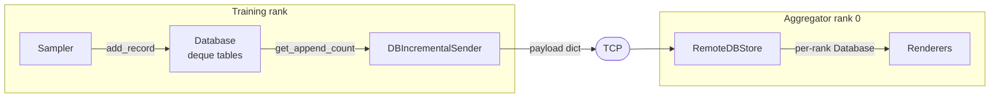

# Database

The `database` subsystem is TraceML's telemetry storage layer. It provides bounded, append-only in-memory tables on each training rank, a rank-aware aggregator-side store that holds telemetry received from every worker, and the incremental sender that bridges them over TCP. Everything is in-memory and fail-open — nothing in this layer blocks training, and nothing requires a disk or network round trip on the hot path.

## Role in the architecture

Every sampler running inside a training process owns a `Database` instance. Samplers append rows to named tables (for example `step_time_sampler` owns a `steps` table). These tables live entirely in memory, backed by fixed-capacity deques. When a table fills up, the deque silently evicts the oldest record. This keeps memory bounded for the length of a training job — a 24-hour run and a 10-minute run use the same amount of RAM per sampler.

On the aggregator process (rank 0 only), a single `RemoteDBStore` receives telemetry from all ranks over TCP and stashes it into per-`(rank, sampler)` `Database` instances. Because the exact same `Database` class is reused on both sides of the wire, renderers do not need to know whether they are reading local or remote data — the API is identical. The only difference is that the aggregator's store is rank-aware: `self._dbs[rank][sampler_name] -> Database`.

Bridging the two sides is the `DBIncrementalSender`. On each runtime tick, the sender inspects its local database, computes which rows are new since the previous flush, and ships them as a single payload. The payload travels over the TCP transport; on the other end, `RemoteDBStore.ingest()` routes it into the correct per-rank `Database`. The wire protocol is simple: rank, sampler name, timestamp, and a table-name-to-rows mapping.

The subsystem deliberately does not own its own threads or sockets. A `Database` is pure storage; a `DBIncrementalSender` is a pure cursor over that storage; the runtime decides when to flush and the transport layer decides how to move bytes. This keeps each class small and independently testable.



## Data in / data out

**In (on the training rank).** Samplers call `Database.add_record(table, record)`. Records are arbitrary Python objects — typically dicts or dataclasses — and the database does not inspect or validate them. Tables are created lazily: the first `add_record` for an unknown table auto-creates the deque. Every append also bumps a monotonic per-table counter used for incremental shipping (see [Incremental sending pattern](#incremental-sending-pattern)).

**Out (to the aggregator).** `DBIncrementalSender.collect_payload()` walks every table, computes `new_count = total_appends - last_sent_seq`, slices the tail of the deque, and returns a dict of the form:

```python
{
    "rank": 0,
    "sampler": "step_time_sampler",
    "timestamp": 1713456789.123,
    "tables": {
        "steps": [row, row, ...],
        "phases": [row, ...],
    },
}
```

Higher runtime layers may batch multiple sampler payloads into a `list[dict]` before handing them to the TCP transport; `RemoteDBStore.ingest()` accepts both the batched and single-dict shapes.

**Out (to disk, optionally).** Each `Database` owns a `DatabaseWriter` that persists new rows to length-prefixed msgpack files under `<logs_dir>/<session_id>/data/<rank_suffix>/<sampler_name>/<table>.msgpack`. It uses the same append-counter mechanism as the network sender and is throttled by `flush_every` (default: every 100 calls). This on-disk stream is append-only and crash-safe, but it is driven only when `config.enable_logging` is true; the core live-view path never depends on it.

!!! note "Not SQLite (at this layer)"
    Despite the `database` name, this subsystem has no SQL engine. Persistence here is length-prefixed msgpack frames — the name is shorthand for "tabular store", not for any particular DBMS. There *is* a separate SQLite-backed history that lives inside the aggregator process (`src/traceml/aggregator/sqlite_writer.py` and `aggregator/sqlite_writers/`); see [aggregator.md](aggregator.md) for that layer.

## Key classes

| Class | File | Role |
|---|---|---|
| `Database` | `src/traceml/database/database.py` | Bounded in-memory store of named tables. Each table is a `deque(maxlen=max_rows)`. Tracks a monotonic append counter per table. Exposes `add_record`, `get_table`, `get_last_record`, `get_append_count`. |
| `RemoteDBStore` | `src/traceml/database/remote_database_store.py` | Aggregator-side (rank-0 only) container keyed by `(rank, sampler_name)`. Lazily instantiates a `Database` for each new pair and routes incoming messages into it. Also tracks `last_seen(rank)` for liveness. |
| `DBIncrementalSender` | `src/traceml/database/database_sender.py` | Collects new rows since the last flush using the append counter, builds the wire payload, and hands it to a transport sender. Optional `max_rows_per_flush` knob caps per-flush volume. |
| `DatabaseWriter` | `src/traceml/database/database_writer.py` | Optional append-only msgpack file writer using the same incremental counter. One file per table; one directory per sampler; one rank suffix per worker. |

The `Database` owns its `DatabaseWriter` internally; the `DBIncrementalSender` is attached by the runtime layer, not by the database itself. This keeps the storage concern (persistence) inside the database, and the transport concern (network) outside it.

## Incremental sending pattern

A bounded deque cannot be addressed by index across time: once the deque is full, row `i` today may be row `i-1` tomorrow after an eviction. Tracking "send everything after index 527" is therefore unsafe. The database solves this with a **monotonic append counter** per table:

- Every `add_record` bumps `self._append_count[table]` by one.
- Eviction by the deque's `maxlen` has no effect on the counter.
- Consumers record the counter value they last observed and compare it against the current one on the next tick.

`DBIncrementalSender` keeps a `_last_sent_seq[table]` dict. On each flush:

```text
total     = db.get_append_count(table)       # monotonic, survives eviction
last_sent = self._last_sent_seq[table]       # what we shipped last time
new_count = total - last_sent
```

If `new_count <= 0`, the table is skipped. Otherwise the sender slices `new_count` rows off the tail of the deque (or the whole deque if `new_count` exceeds its current length, which happens on the first flush or after heavy eviction) and advances `_last_sent_seq` to `total`. `DatabaseWriter.flush()` does the same dance against `_last_written_seq` for the on-disk log.

Because each consumer tracks its own cursor and the sender advances it atomically as part of producing the payload, **no deduplication is needed downstream**. `RemoteDBStore.ingest()` appends every row it receives. If the sender ever repeats itself it would duplicate rows on the aggregator — but by construction it does not, because the cursor is advanced before the payload is returned.

!!! tip "Why deque, not a list?"
    `collections.deque(maxlen=N)` gives O(1) append and O(1) eviction of the oldest element. A list with manual trimming would force O(N) shifts on every eviction, which matters at sampler frequencies sustained for hours.

The `max_rows_per_flush` knob on the sender is a second safety valve. In the common case it is `-1` (send everything new). Under a slow consumer or a restart burst it can be set to a positive cap, in which case the sender ships only the *most recent* `N` rows per flush and still advances its cursor to `total` — so the aggregator sees recent data promptly at the cost of dropping the oldest unseen rows on the floor. That trade-off is deliberate: for a live bottleneck view, being current matters more than being complete.

### Lifecycle walkthrough

A typical per-tick sequence on a single rank:

1. The sampler's callback fires. It computes one or more records and calls `db.add_record("steps", record)`.
2. `add_record` looks up (or lazily creates) the deque for `"steps"`, appends the record, and increments `_append_count["steps"]`.
3. The runtime loop invokes `sender.flush()`. The sender compares `db.get_append_count("steps")` against its own `_last_sent_seq["steps"]`, slices the tail of the deque, builds the payload dict, advances the cursor, and hands the payload to the TCP client.
4. In parallel (and throttled), the `DatabaseWriter` attached to the database compares against `_last_written_seq` and appends the same new rows to the rank-local msgpack file.
5. On rank 0, the aggregator receives the payload, calls `RemoteDBStore.ingest(payload)`, and the rows land in `self._dbs[rank]["step_time_sampler"].add_record("steps", row)` — reaching a `Database` instance indistinguishable from the local one, which renderers then read.

## Design notes

**Bounded memory by construction.** `Database.DEFAULT_MAX_ROWS` is 3000 for per-rank stores and `RemoteDBStore` defaults to 500 rows per table. These caps are per table, so a sampler with five tables consumes roughly five-by-rows-by-record-size bytes per rank. The deque evicts oldest-first automatically; no sweeps, no GC tuning.

**O(1) hot path.** `add_record` is a deque append plus a dict increment. `get_append_count` is a dict lookup. `collect_payload` is linear in the number of *new* rows, not in the full table. Nothing on the sampler tick requires a lock, an allocation proportional to table size, or a syscall.

**Rank-aware, lazy creation.** `RemoteDBStore._get_or_create_db` creates a fresh `Database` the first time a `(rank, sampler)` pair is seen. Nothing needs to be pre-registered — if rank 3 joins late, it just shows up on the next ingest. `ranks()` returns the set of ranks that have ever sent data, and `last_seen(rank)` gives the aggregator a cheap liveness signal.

**Same class on both sides.** The local `Database` and the aggregator's remote-side `Database` are the same Python class with the same `max_rows` contract. This is deliberate: renderers are written once against `Database` and can consume either local (single-process) or remote (multi-rank) telemetry without caring.

**In-memory first, disk optional.** The live view — terminal and web — reads exclusively from memory. Disk persistence exists for post-hoc analysis and crash forensics, is off the critical path, and is throttled (`flush_every=100` by default). Disabling logging via `config.enable_logging` short-circuits the writer entirely.

**Fail-open everywhere.** `DBIncrementalSender.flush()` wraps the outbound `sender.send(payload)` call in a try/except and logs through `get_error_logger`. A dead aggregator, a broken socket, a bad serialization — none of it raises into the runtime loop. The training process keeps going with or without telemetry.

**No concurrency primitives.** `RemoteDBStore` documents its own assumption explicitly: ingestion happens on a single runtime thread on rank 0, and no internal locking is performed. Per-rank `Database` instances are touched only by the sampler thread that owns them. If this ever changes, the append counter is still safe for single-writer/single-reader — but for multi-writer the design would need revisiting.

**Records are opaque to storage.** `Database` stores whatever the sampler hands it. This keeps the class trivial but pushes schema discipline onto samplers and renderers: if a sampler emits a new key on one row and not another, only the renderer will notice. The upside is zero marshaling overhead on the hot path and the ability to evolve sampler payloads without touching storage.

## Non-goals

- **No querying.** `Database` is not a query engine. Callers iterate deques. Anything richer (filtering, aggregation, windowing) lives in the renderer or sampler that owns the table.
- **No cross-table joins.** Each table is independent; the append counter is per-table, and the wire payload groups rows by table, not by record identity.
- **No backpressure.** If the aggregator is slow, the TCP layer absorbs the pressure. The database itself never blocks a sampler.
- **No schema enforcement.** Records are arbitrary Python values. If a sampler needs validation, it does it before `add_record`.

## Reading back data

Renderers and diagnostic code walk the deques directly. A typical read pattern on the aggregator side:

```python
for rank in remote_store.ranks():
    db = remote_store.get_db(rank, "step_time_sampler")
    if db is None:
        continue
    steps = db.get_table("steps")
    if steps:
        latest = db.get_last_record("steps")  # O(1)
        # or iterate: for row in steps: ...
```

`get_table` returns the live deque without copying, which is fine for sequential reads but not safe under concurrent mutation — since ingestion and rendering share the runtime thread on the aggregator, this is a non-issue in practice.

On a training rank, a sampler rarely reads back its own data, but when it does (for example to compute a delta against the previous row) the pattern is identical: `db.get_last_record(table)` for the most recent row, or `db.get_table(table)[-1]` for direct access.

## Wire format and backward compatibility

The payload dict produced by `DBIncrementalSender.collect_payload()` is the subsystem's public contract with the transport and aggregator. Any change to its keys (`rank`, `sampler`, `timestamp`, `tables`) or to the nested `tables` shape is a wire-format change and must follow the project's backward-compatibility policy — existing v0.2.x users may be running older ranks against a newer aggregator or vice versa during rollout. Adding new optional top-level keys is safe; removing or renaming keys is not. `RemoteDBStore.ingest` already tolerates both the batched `list[dict]` form and the legacy single-dict form for exactly this reason.

## Cross-references

- [Samplers](samplers.md) — writers; call `Database.add_record` on every tick.
- [Transport](transport.md) — ships the payloads produced by `DBIncrementalSender`.
- [Aggregator](aggregator.md) — hosts `RemoteDBStore` and drives ingestion.
- [Renderers](renderers.md) — read-only consumers of the stored tables.
- [Runtime](runtime.md) — owns the sampler loop and wires each `Database` to a sender.
- [Architecture overview](../architecture.md) — end-to-end telemetry data flow.
