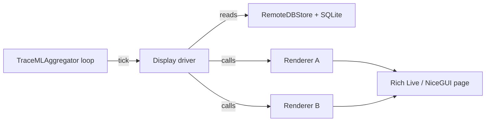

# Display drivers

Display drivers are the medium-specific wrappers that turn TraceML's unified telemetry into something a human can look at. They live inside the aggregator process, read from `RemoteDBStore` and the SQLite-backed history, and drive a periodic update loop against a concrete output surface — a Rich terminal dashboard, a NiceGUI browser page, or (for headless runs) nothing at all. Two decisions live here: which renderers to instantiate for the current profile, and how to lay their output out on the chosen medium.

## Role in the architecture

The aggregator owns the unified telemetry store. It does not, however, know anything about how that data should be displayed — rendering concerns are delegated entirely to a display driver instance chosen at construction time. `TraceMLAggregator` wires up a TCP server, a `RemoteDBStore`, a SQLite writer, and then looks up the driver class from a small registry keyed on `settings.mode` (`"cli"`, `"dashboard"`, or `"summary"`). The driver is constructed with the logger, store, and settings, and from that point on the aggregator only needs three verbs: `start()`, `tick()`, and `stop()`.

This narrow contract is what keeps the aggregator medium-agnostic. The aggregator loop wakes on incoming TCP frames, drains them into the store, and at most once per `render_interval_sec` calls `display_driver.tick()`. The driver decides what to compute, which renderers to query, and how to push the result into its UI primitives. If a driver tick raises, the `_safe` wrapper logs it and the aggregator keeps looping — the run is never lost because the UI stumbled.

The driver also picks its renderer set. CLI and NiceGUI drivers instantiate different subsets of renderers depending on the active profile (`watch`, `run`, `deep`) and wire each renderer to a named layout section. That wiring is the driver's second job: renderers expose data via `get_panel_renderable()` (Rich) or `get_dashboard_renderable()` (NiceGUI), and each renderer declares the section name it targets via `layout_section_name`.



## Base class contract

`BaseDisplayDriver` (`src/traceml/aggregator/display_drivers/base.py`) is an `ABC` with three abstract methods and a fixed constructor signature `(logger, store, settings)`. The docstring spells out the contract the aggregator depends on:

- `start()` — initialize UI resources. Best-effort: may allocate a Rich `Live`, spawn a NiceGUI server thread, or do nothing. Failures must not crash the aggregator.
- `tick()` — one UI update cycle. Must be safe to call repeatedly and must tolerate "no data yet" cleanly.
- `stop()` — release UI resources. Called during aggregator shutdown; also best-effort.

Drivers are free to add their own helpers on top (compute caches, subscriber maps, registration guards), but the aggregator only ever calls those three. The base constructor stores `logger`, `store`, and `settings` as `_logger`, `_store`, and `_settings` — subclasses typically read `settings.profile`, `settings.db_path`, and `settings.num_display_layers` from there when choosing renderers.

Concrete drivers are registered in `trace_aggregator.py`:

```python
_DISPLAY_DRIVERS = {
    "cli": CLIDisplayDriver,
    "dashboard": NiceGUIDisplayDriver,
    "summary": SummaryDisplayDriver,
}
```

Adding a new medium means implementing a new subclass and adding one entry to this dict.

## `CLIDisplayDriver`

Lives in `src/traceml/aggregator/display_drivers/cli.py` and renders a Rich `Live` dashboard to the current terminal. It is the default when the user runs `traceml watch|run|deep`.

**Renderer set.** The driver picks renderers based on the profile (`settings.profile`):

| Profile | Renderers |
|---|---|
| `watch` | System, Process, Stdout/Stderr |
| `run`   | Watch set + StepCombined (step timing) + StepMemory |
| `deep`  | Run set + LayerCombinedMemory + LayerCombinedTime |

Renderers that read SQLite history (system, process, step-time, step-memory, stdout/stderr) are constructed with `db_path`; layer renderers that still use the live remote store are given `remote_store` and a `top_n_layers` cap.

**Layout.** Each profile builds its own Rich `Layout` tree (`_create_watch_layout`, `_create_run_layout`, `_create_deep_layout`). Section names are constants from `layout.py` (`SYSTEM_LAYOUT`, `PROCESS_LAYOUT`, `MODEL_COMBINED_LAYOUT`, …) so renderers and the driver refer to the same string. The initial layout is pre-populated with "Waiting for …" placeholder panels so the dashboard is never visibly empty between `start()` and the first real tick.

**Wiring.** On the first tick, `_register_once()` walks the renderer list and builds a list of `_SectionBinding(section, render_fn)` pairs, skipping any renderer that is missing `get_panel_renderable()`, missing `layout_section_name`, or pointing at a section the current profile's layout does not contain (each mismatch is logged). Subsequent ticks just call each binding's `render_fn` and `layout[section].update(renderable)`.

**Update cadence.** The aggregator loop rate-limits ticks to `settings.render_interval_sec`. The driver uses `Live(auto_refresh=False)` and calls `self._live.refresh()` explicitly in `_refresh()`. Refresh is bracketed by `StreamCapture.redirect_to_original()` / `redirect_to_capture()` so that Rich's output does not get captured into the stdout/stderr panel it is about to render.

**Error handling.** Every per-section render is wrapped in `try/except`; on failure the section is replaced with a red "Render Error" panel and the exception is logged. One broken renderer never takes down the dashboard.

The driver's own `_safe(logger, label, fn)` helper mirrors the aggregator's pattern: execute, catch, log with a `[TraceML]` prefix, and return `None`. It is used for `Live.start()` and `Live.stop()` so that terminal quirks (non-TTY stdout, terminal resize during shutdown) degrade to log lines rather than tracebacks.

## `NiceGUIDisplayDriver`

Lives in `src/traceml/aggregator/display_drivers/nicegui.py` and serves a browser dashboard via [NiceGUI](https://nicegui.io). Selected with `--mode dashboard`.

**Threading model.** The driver separates compute from UI:

- The aggregator thread calls `tick()`, which calls `update_display()`. This invokes each registered layout's compute callback and swaps the resulting dict into `latest_data` under `_latest_data_lock`. Compute happens **outside** the lock; the lock is held only for the swap.
- A UI thread runs `_ui_update_loop()` on a `ui.timer(interval_s, ...)` — by default 0.75 s for the overview page and 1.0 s for the layers page. It snapshots `latest_data` and the subscriber map under the lock, then applies updates to widgets without holding anything.

This split keeps the aggregator loop free of NiceGUI calls (which are not thread-safe) and keeps the UI free of potentially slow renderer computations.

**Registration model.** NiceGUI supports multiple browser tabs subscribing to the same logical section, so the driver maintains two mappings:

- `_layout_content_fns: Dict[section, compute_fn]` — exactly one compute callback per section, registered once from `get_dashboard_renderable()` on each renderer.
- `_layout_subscribers: Dict[section, List[(client_id, cards, update_fn)]]` — many UI subscribers per section, registered from `define_pages()` via `subscribe_layout(...)`.

Compute runs once per tick per section; each subscribing UI region gets the same payload.

**Pages and sections.** `nicegui_sections/pages.py` defines the page tree. The overview page (`/`) lays out model diagnostics on a left rail and a two-row grid of system/process on top and model-combined/step-memory below. When the profile is `deep`, a second page (`/layers`) exposes the layer memory and layer timer tables; otherwise `/layers` redirects to `/`. Each `build_*_section()` returns a dict of NiceGUI handles (`cards`), and its sibling `update_*_section(cards, data)` mutates them when new payloads arrive.

A companion file, `page_layout.py`, declares a logical `TRACE_ML_PAGE` — a row-by-row grid of layout section names (system/process/step-timer on row 1, model-combined and diagnostics on row 2, layer tables on row 3). It is a data-only description of the intended page structure that layout code can reference without hard-coding the grid inline.

**Plotly / renderable integration.** Renderers expose `get_dashboard_renderable()` returning plain Python data (dicts, lists, Plotly figures). The dashboard's `update_fn` is responsible for turning that data into widget mutations — setting labels, refreshing tables, or replacing Plotly figures. The driver itself stays data-agnostic; it just moves payloads from compute to subscribers.

**Server lifecycle.** `start()` launches `ui.run(...)` in a daemon thread and blocks on a small poll loop until `define_pages()` sets `_ui_ready = True`. The server binds to port `8765` by default and opens the browser (`show=True`). If the server thread raises, `_ui_ready` stays `False`, and subsequent `tick()` calls become no-ops — training continues, just without the dashboard.

**Per-client timers.** NiceGUI timers are often client/session-bound; a single global "timer started" flag would prevent rescheduling after a reconnect and silently freeze the dashboard. `ensure_ui_timer()` tracks `_timer_clients: set[str]` and schedules a fresh timer once per client id.

!!! note "Why `_ui_update_loop` is paranoid"
    Some NiceGUI versions stop a timer permanently if its callback raises. The loop wraps the entire body in `try/except`, and individual subscriber updates are themselves wrapped so one broken section just shows `⚠️ Could not update` instead of stopping the timer for everyone.

## `SummaryDisplayDriver`

Lives in `src/traceml/aggregator/display_drivers/summary.py`. It is intentionally a no-op driver — `start()`, `tick()`, and `stop()` all return `None`. Telemetry ingestion and history persistence still run normally; the final end-of-run summary is produced by the aggregator's shutdown path, not by this driver. This keeps display concerns cleanly separated from run finalization: the summary is always an aggregator-owned artifact, regardless of whether a live UI was ever attached.

Use it for batch jobs, CI runs, or remote sessions where only the final artifacts matter. Because its lifecycle methods are unconditional no-ops, it also serves as a useful reference implementation when porting `BaseDisplayDriver` to a new medium: start with summary, then add start/tick/stop behavior incrementally.

## How one is selected

The display mode is chosen by the `--mode` flag on `traceml watch|run|deep`:

```bash
traceml run train.py --mode cli        # default; Rich terminal dashboard
traceml deep train.py --mode dashboard # NiceGUI browser dashboard, deep profile
traceml run train.py --mode summary    # headless; final summary only
```

`--mode` defaults to `cli`. The CLI writes it into `settings.mode`, and the aggregator's constructor looks it up in `_DISPLAY_DRIVERS`:

```python
driver_cls = _DISPLAY_DRIVERS.get(settings.mode)
if driver_cls is None:
    raise ValueError(f"Unknown display mode: {settings.mode!r}")
self._display_driver = driver_cls(logger, store, settings)
```

The `watch`, `run`, `deep` subcommands each translate to a `TRACEML_PROFILE` environment variable (`watch`, `run`, or `deep`). The profile is read by the driver through `settings.profile` and determines which renderers to instantiate and which layout to build. Mode and profile are orthogonal: `--mode dashboard` can be combined with any profile, and `--mode cli` can be combined with any profile.

## Design notes

**Non-blocking updates.** The aggregator loop never blocks on UI work. Tick failures are caught by a `_safe` wrapper; NiceGUI compute runs outside its lock; Rich refreshes are point-in-time calls against a pre-built layout tree.

**Resilience to missing data.** Placeholder panels ("Waiting for System Metrics…") mean the CLI dashboard is always coherent, even during the first few seconds before any samples arrive. Renderers that return `None` are silently skipped for that section. A single broken renderer shows a red error panel (CLI) or a `⚠️ Could not update` label (dashboard) — never a crash.

**Terminal capabilities.** The Rich driver assumes a TTY that supports ANSI cursor control. `Live(auto_refresh=False, transient=False, screen=False)` keeps the dashboard in the scrollback after the run ends. Stdout/stderr capture is carefully suspended during refresh so the logs panel does not recursively eat the dashboard it was trying to render.

**Profile coupling.** The driver is the single place that knows which renderers are relevant per profile. Samplers run unconditionally on the training side; if the aggregator is in `watch` mode, layer data simply is not displayed (and usually is not collected because the profile also gates samplers). This keeps the display layer the source of truth for "what the user sees".

**Extension points.** A new display medium is a new `BaseDisplayDriver` subclass plus one entry in `_DISPLAY_DRIVERS`. A new layout section is a new constant in `layout.py`, a corresponding renderer with a matching `layout_section_name`, a slot in the Rich `Layout` tree, and — for NiceGUI — a `build_*_section` / `update_*_section` pair plus a `subscribe_layout` call in `pages.py`.

**Startup ordering.** The aggregator's `start()` brings up the TCP server, then the SQLite writer, then the display driver, and finally the aggregator loop thread. The driver is therefore guaranteed to see telemetry only after its own `start()` returns. The NiceGUI driver additionally blocks its `start()` until the background server has finished `define_pages()` and flipped `_ui_ready = True`; this prevents a tick from firing before subscribers exist.

**Shutdown.** `stop()` is wrapped in `_safe` on the aggregator side, so a driver that hangs or throws during cleanup cannot block the final summary or prevent the process from exiting. The CLI driver tears down its `Live` and clears bindings; the NiceGUI driver clears compute callbacks, subscribers, and the timer-client set so repeated start/stop cycles (e.g. in tests) do not leak state.

## Cross-references

- [Aggregator](aggregator.md) — constructs and hosts the driver; owns the tick loop
- [Renderers](renderers.md) — the objects drivers compose; provide `get_panel_renderable()` / `get_dashboard_renderable()`
- [Database](database.md) — `RemoteDBStore` and the SQLite history that renderers read from
- [CLI](cli.md) — `--mode` flag and profile subcommands that pick the driver
- [Architecture overview](../architecture.md)
