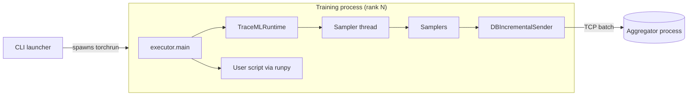

# Runtime

The runtime is TraceML's **per-rank in-process agent**. One instance lives inside every training process (one per rank under `torchrun`), running alongside the user's training code in the same Python interpreter. Its job is to execute the user script, drive the samplers on a background thread, and ship the resulting telemetry over TCP to the out-of-process aggregator — all without perturbing training. If anything in TraceML fails, the runtime is the layer that guarantees the training job keeps going.

Everything the runtime does is bounded to a single process. It does not manage other ranks, it does not own shared state across ranks, and it does not talk to the UI. All cross-rank coordination is delegated to the aggregator; all cross-process communication is TCP. This strict isolation is what lets TraceML survive an aggregator crash (telemetry just stops flowing), a user-script crash (the runtime cleans up and exits nonzero), and a sampler bug (the sampler gets logged and skipped).

## Role in the architecture

The CLI (`src/traceml/cli.py`) does not invoke user code directly. Instead, it spawns two peers: an aggregator process, and a `torchrun` worker group whose entry point is `src/traceml/runtime/executor.py`. Each worker imports the executor, reads TraceML configuration from the environment, starts a `TraceMLRuntime`, and then hands control to the user's training script via `runpy.run_path(...)`. From the user script's perspective, nothing is wrapping it: `__main__` behaves exactly as if they had run `python train.py`.

Once the user script is running, the runtime sits beside it as a small background agent. A single daemon sampler thread wakes on a fixed interval (`TRACEML_INTERVAL`, default 1.0 s), ticks each configured sampler, collects whatever rows are ready from each sampler's `DBIncrementalSender`, and issues one batched `TCPClient.send_batch(...)` per tick. Everything on that thread is wrapped in a `_safe(...)` helper that swallows exceptions into the runtime error log so a misbehaving sampler never takes down the training loop.

The runtime is deliberately an **agent only** — it does not host a TCP server, it does not own the unified store, and it does not render UI. Those responsibilities live in the aggregator process. Even on a single-rank run (`WORLD_SIZE=1`), rank 0 still sends its telemetry over loopback TCP through the same `DBIncrementalSender` path as worker ranks. This keeps the code path uniform and lets a future remote aggregator work without refactoring.



## Data in / data out

The runtime is driven entirely by environment variables set by the CLI launcher; user scripts are never touched. `executor.read_traceml_env()` is the single place that parses them.

**TraceML configuration (read by the executor):**

| Variable | Default | Purpose |
|---|---|---|
| `TRACEML_SCRIPT_PATH` | *(required)* | Absolute path of the user script to `runpy` |
| `TRACEML_PROFILE` | `run` | Sampler profile (`watch` / `run` / `deep`) |
| `TRACEML_UI_MODE` (or legacy `TRACEML_MODE`) | `cli` | Display mode (`cli` / `dashboard` / `summary`) |
| `TRACEML_INTERVAL` | `1.0` | Sampler tick interval (seconds) |
| `TRACEML_ENABLE_LOGGING` | `0` | Turn on the file-based error logger |
| `TRACEML_LOGS_DIR` | `./logs` | Root for session log directories |
| `TRACEML_NUM_DISPLAY_LAYERS` | `20` | Hint for layer-level renderers |
| `TRACEML_TCP_HOST` | `127.0.0.1` | Aggregator TCP host |
| `TRACEML_TCP_PORT` | `29765` | Aggregator TCP port |
| `TRACEML_REMOTE_MAX_ROWS` | `200` | Bound used by the aggregator's remote store |
| `TRACEML_SESSION_ID` | *(empty)* | Shared session id written by the CLI |
| `TRACEML_DISABLED` | `0` | If `1`, swap in `NoOpRuntime` and run natively |

**Distributed identity (read by the runtime via `transport.distributed.get_ddp_info`):** `RANK`, `LOCAL_RANK`, `WORLD_SIZE` — standard PyTorch DDP variables set by `torchrun`. These drive rank-aware decisions (e.g. only rank 0 runs `SystemSampler`).

**Outputs:**

- **Telemetry frames** — per tick, each sampler's `DBIncrementalSender` yields a payload of new rows (if any), and the runtime ships the list of payloads as a single batched `msgspec`-encoded frame to the aggregator.
- **Error logs** — two files under `<logs_dir>/<session_id>/`:
    - `torchrun_error.log` — user-script failures (unhandled exceptions, nonzero `SystemExit`, `KeyboardInterrupt`). Enriched with the last-known execution layer tag.
    - `runtime_error.log` — TraceML infrastructure failures (runtime start/stop errors, sampler exceptions that escape `_safe`).
- **Captured stdout/stderr** — in CLI mode only, `StreamCapture` redirects `sys.stdout`/`sys.stderr` into an in-memory buffer that the `StdoutStderrSampler` drains each tick. This keeps user prints from fighting with the Rich UI.

## Key classes and modules

- **`src/traceml/runtime/executor.py`** — process entrypoint for every `torchrun` worker. Reads env vars (`read_traceml_env`), starts/stops the runtime, runs the user script via `runpy`, classifies crashes, and writes structured error reports. Contains `main()`, `start_runtime()`, `stop_runtime()`, `run_user_script()`, and the `NoOpRuntime` fallback used when TraceML is disabled or fails to initialize.
- **`src/traceml/runtime/runtime.py`** — the `TraceMLRuntime` class. Owns the sampler list, the `TCPClient`, the stop `Event`, and the background sampler thread. `_build_samplers()` selects samplers based on profile and mode; `_attach_senders()` wires each sampler's `DBIncrementalSender` to the shared TCP client with its rank; `_tick()` runs one sample-and-send cycle; `_sampler_loop()` is the timed driver.
- **`src/traceml/runtime/settings.py`** — `TraceMLSettings` and `TraceMLTCPSettings` frozen dataclasses. The shared configuration schema used by the executor to construct the runtime and also consumed by the aggregator, so both sides agree on cadence, TCP endpoint, session id, and logs directory.
- **`src/traceml/runtime/stdout_stderr_capture.py`** — `StreamCapture`, a thread-safe `StringIO` that replaces `sys.stdout`/`sys.stderr` in CLI mode. Exposes `read_buffer()` for the stdout/stderr sampler to drain and class-level `redirect_to_capture` / `redirect_to_original` to toggle redirection on start/stop.
- **`src/traceml/runtime/config.py`** — tiny singleton (`config`) exposing a handful of legacy process-wide flags (`enable_logging`, `logs_dir`, `session_id`). The runtime populates this from `TraceMLSettings` at construction time so older code paths that read the global still work.
- **`src/traceml/runtime/session.py`** — `get_session_id()` helper that mints a timestamped session id (`session_<YYYYMMDD_HHMMSS>_<hex>`). Used when the CLI has not already assigned one.

## Entry points

The runtime has two distinct entrypoints: a process-level one invoked by `torchrun`, and an object-level one used by the executor.

**Process entrypoint — `executor.main()`**

`torchrun` launches each worker with the executor module as the script path (the CLI computes it as `<package>/runtime/executor.py` at launch time). `main()` runs a fixed six-step flow:

1. `read_traceml_env()` pulls configuration from the environment.
2. `extract_script_args()` splits `sys.argv` on `--` to forward user-script arguments.
3. `start_runtime(cfg)` builds `TraceMLSettings`, constructs a `TraceMLRuntime`, and calls `.start()`. On failure, it logs to `runtime_error.log` and returns a `NoOpRuntime` so the user script still runs.
4. `run_user_script(...)` executes the script in-process via `runpy.run_path(script, run_name="__main__")`, temporarily swapping `sys.argv`.
5. `stop_runtime(...)` is called in a `finally` block; it is best-effort and never raises.
6. The executor exits with the user script's exit code — `0` on clean completion, the user-provided code on `SystemExit(code)`, `130` on `KeyboardInterrupt`, or `1` on an unhandled exception. Crashes are persisted to `torchrun_error.log` before exit.

**Object entrypoint — `TraceMLRuntime.start()` / `.stop()`**

`start()` enables stdout/stderr capture (CLI mode only), then launches the daemon sampler thread. `stop()` sets the stop event, joins the thread with a `5 * interval` timeout, closes the TCP client, and restores the original stdout/stderr streams. Both methods are designed for a single start/stop cycle per process.

!!! note "Why `runpy` and not `subprocess`?"
    Running the user script in-process is a deliberate design choice. Hooks attach to the real Python objects that training code will use; stack traces refer to the user's source, not a wrapper module; and `EXECUTION_LAYER` thread-local context is shared between the user's step function and TraceML's timers. Spawning a child would break all three.

## Design notes

**Fail-open everywhere.** The entire runtime is structured so that a bug in TraceML cannot crash training. `start_runtime()` catches initialization errors and returns a `NoOpRuntime`. `stop_runtime()` swallows shutdown errors. Every sampler call, writer flush, and TCP send inside `_tick()` is wrapped in a `_safe(...)` helper that logs the exception to `runtime_error.log` and returns `None`. The only paths that deliberately raise are (a) the sampler thread start itself (considered fatal initialization), and (b) re-raising user-script exceptions so the process exits nonzero.

**User script execution is load-bearing.** `runpy.run_path(script, run_name="__main__")` is used specifically so that the user's `if __name__ == "__main__":` guard fires, the script's directory is added to `sys.path`, and `__main__` globals are populated correctly. `sys.argv` is rewritten to `[script_path, *user_args]` for the duration of the call and restored in a `finally` — this keeps TraceML's own CLI flags invisible to the user script.

**Crash classification.** `main()` distinguishes four crash types: clean exit (`SystemExit(0)` or fall-through), explicit nonzero `SystemExit`, `KeyboardInterrupt` (which maps to exit code `130`), and unhandled exceptions. Each case writes a header and optional traceback to `torchrun_error.log` with a UTC timestamp. The `include_execution_layer=True` branch also writes the value of `EXECUTION_LAYER.current` — the thread-local marker that samplers and decorators update — so post-mortem analysis can see which phase was active when the user script died (e.g. "forward", "optimizer").

**Terminal discipline.** `report_crash()` intentionally does not print tracebacks to `stderr`. The aggregator process owns the terminal UI in CLI mode and would overwrite any output; the session log files are the reliable surface for crash reports.

**Rank awareness.** `TraceMLRuntime.__init__` calls `get_ddp_info()` once and uses the result throughout:

- The sampler thread is named `TraceMLSampler(rank=<local_rank>)` so thread dumps are readable under DDP.
- `_build_samplers()` gates `SystemSampler` to rank 0 only — host-level CPU/GPU telemetry would double-count if every rank sampled it independently.
- `_attach_senders()` stamps every sender with the local rank so the aggregator's `RemoteDBStore` can route rows to the correct per-rank `Database`.

**Profile-driven sampler selection.** `_build_samplers()` is the single source of truth for what runs per profile. The breakdown:

- `watch` — `SystemSampler` (rank 0), `ProcessSampler`, and `StdoutStderrSampler` (CLI mode).
- `run` — everything in `watch` plus `StepTimeSampler` and `StepMemorySampler`.
- `deep` — everything in `run` plus all five layer samplers (`LayerMemorySampler`, forward/backward memory, forward/backward time).

**Batched telemetry send.** `_tick()` has two phases. First, every sampler is told to `sample()` and flush its local writer. Then the runtime walks all senders and calls `collect_payload()` on each; senders whose data is not yet ready (e.g. GPU events still pending) return `None` and are skipped until the next tick. All ready payloads are collected into one list and shipped with a single `TCPClient.send_batch(...)` call — one syscall per tick, regardless of how many samplers fired.

!!! warning "Legacy writer flush"
    `_tick()` still calls `db.writer.flush()` on every sampler. This is a legacy path from the SQLite-writer era and is marked for removal once all samplers migrate fully to the remote-store-only model.

**Disable switch.** Setting `TRACEML_DISABLED=1` causes `start_runtime()` to return a `NoOpRuntime` immediately, before any threads, samplers, or sockets are created. The executor still runs the user script and still writes user-script error logs, but no TraceML instrumentation is active. This is the escape hatch for users who suspect TraceML overhead without needing to uninstall.

**Shutdown ordering.** `stop()` follows a fixed order: signal the stop event, join the sampler thread (up to `5 * sampler_interval_sec`), close the TCP client, restore stdout/stderr. The thread's `_sampler_loop` runs a final tick after the stop event trips, so any rows generated during the last interval are sent before the socket closes. If the sampler thread fails to terminate within the timeout, a warning is logged but shutdown continues — the runtime does not block the executor's exit path.

## Lifecycle at a glance

Putting the pieces together, a single rank's timeline looks like this:

```
torchrun spawns worker
  -> executor.main()
       read_traceml_env()           # build cfg dict
       extract_script_args()        # slice sys.argv after --
       start_runtime(cfg)
         TraceMLSettings(...)       # frozen dataclass
         TraceMLRuntime(settings)
           get_ddp_info()            # RANK / LOCAL_RANK / WORLD_SIZE
           _build_samplers()         # profile-gated list
           TCPClient(TCPConfig(...))
           _attach_senders()         # stamp rank + client on each sender
         runtime.start()
           StreamCapture.redirect_to_capture()  # CLI mode
           sampler_thread.start()    # daemon, _sampler_loop
       run_user_script(...)          # runpy.run_path(script, run_name="__main__")
       stop_runtime(runtime, cfg)
         stop_event.set()
         sampler_thread.join(...)
         tcp_client.close()
         StreamCapture.redirect_to_original()
       report_crash(cfg, error)      # only on unhandled exception
       SystemExit(exit_code)
```

Everything after `run_user_script(...)` runs inside a `finally` block, which is why even a `KeyboardInterrupt` during training still lets the sampler thread drain its final tick and close cleanly.

## Cross-references

- [CLI](cli.md) — how the runtime gets spawned and which env vars the launcher sets.
- [Samplers](samplers.md) — what gets ticked on the sampler thread; the `BaseSampler` contract.
- [Transport](transport.md) — `TCPClient`, `TCPConfig`, DDP rank detection via `get_ddp_info`.
- [Database](database.md) — the per-sampler `Database` and `DBIncrementalSender` used for TCP shipping.
- [Architecture overview](../architecture.md) — the three-process picture and end-to-end data flow.
