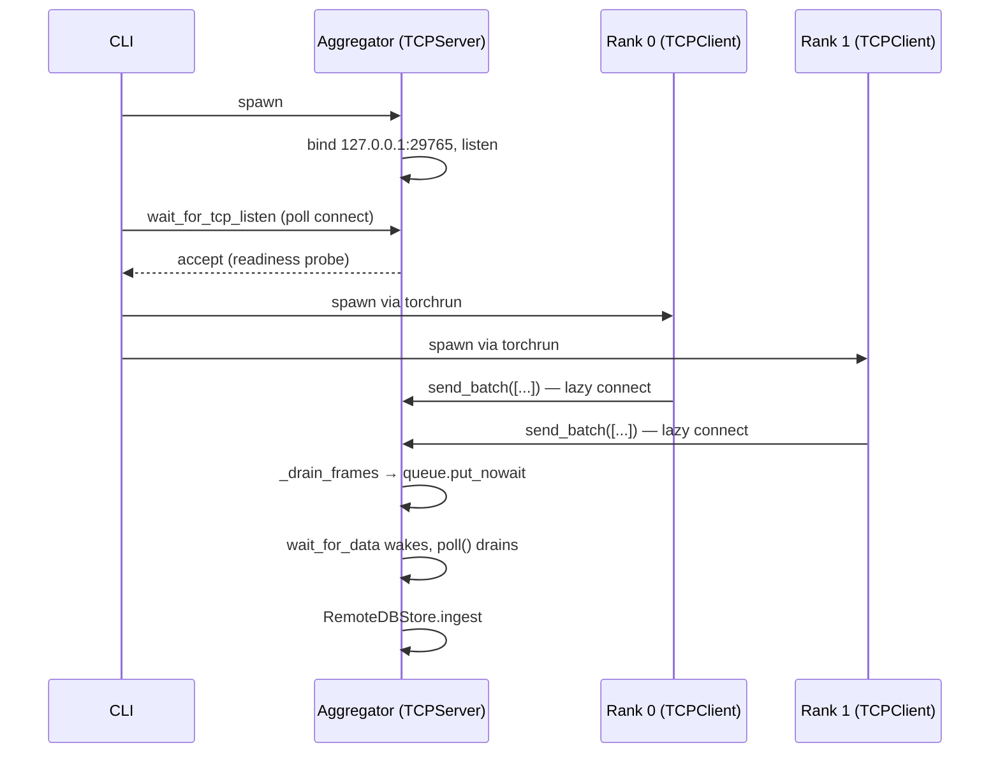

# Transport

The transport subsystem is the narrow waist of TraceML's runtime: everything the per-rank agent collects must cross it, and everything the aggregator shows must arrive through it. It provides a minimal, fail-open TCP link between training ranks and the aggregator process, plus a small helper for detecting whether we are running under DDP at all. No shared memory, no queues on disk, no external broker — just length-prefixed msgpack frames over a local loopback socket.

## Role in the architecture

TraceML splits a training job across two process groups: one or more **training ranks** (spawned under `torchrun`) and a single **aggregator** process. The training ranks run the user's script with TraceML samplers attached; the aggregator owns the unified telemetry store and the UI. Transport is the only wire between them.

Every rank constructs a [`TCPClient`][cli-ref] at runtime startup and uses it to ship each tick's batched payloads to the aggregator. The aggregator runs a [`TCPServer`][srv-ref] bound to `127.0.0.1`, accepts connections from ranks as they come online, and places decoded messages into an internal queue. The aggregator's main loop drains that queue and calls `RemoteDBStore.ingest()`, which routes each message into the correct per-rank, per-sampler `Database`. See [database.md](database.md) for how the store is partitioned and [aggregator.md](aggregator.md) for the drain loop.

The design is deliberately one-way at the application level: ranks push, the aggregator listens. There is no request/response and no acknowledgement. If the aggregator dies, the `TCPClient.send_batch()` call fails silently, the socket is closed, and the next tick will try to reconnect. Training never blocks on the transport layer.

[cli-ref]: #tcpclient
[srv-ref]: #tcpserver

## Wire format

Each message on the wire is a single **length-prefixed msgspec/MessagePack frame**:

```
 ┌───────────────────┬───────────────────────────────┐
 │  length (4 bytes) │  msgpack payload (N bytes)    │
 │  big-endian uint  │  dict or list of dicts        │
 └───────────────────┴───────────────────────────────┘
```

The length prefix is a 4-byte big-endian unsigned int (`struct.pack("!I", len(data))`). The payload is whatever `msgspec.msgpack.encode()` produces for a Python object, and is decoded on the server side with a reusable `msgspec.msgpack.Decoder()`.

Two payload shapes are currently used:

1. **Batch envelope** (the common case, from `TCPClient.send_batch()`):

    ```python
    [
        {"rank": 0, "sampler": "step_time",   "tables": {...}},
        {"rank": 0, "sampler": "step_memory", "tables": {...}},
        {"rank": 0, "sampler": "system",      "tables": {...}},
    ]
    ```

    The runtime collects one payload per sampler that has new rows, packs them into a list, and ships the whole list in a single TCP write. This replaces N per-sampler syscalls with one, which is meaningful under layer-level deep profiling where a tick can produce a half-dozen payloads.

2. **Single payload** (legacy, from `TCPClient.send()`):

    ```python
    {"rank": 0, "sampler": "step_time", "tables": {"step_time": [{...}, {...}]}}
    ```

    `RemoteDBStore.ingest()` type-checks `message` once at the top: `list` means batch, anything else is treated as a single payload. Both paths converge on `_ingest_one()`, so adding a new sender shape requires no wire changes.

Each inner payload carries three keys:

- `rank` — the originating local rank (set by the runtime from `get_ddp_info()`).
- `sampler` — the sampler's name, used as the sub-key under which tables are stored per rank.
- `tables` — a dict of table-name → list-of-row-dicts. Rows are opaque to transport; they are whatever the sampler chose to emit.

!!! note "No type discriminator"
    There is no explicit `type` or version field in the payload. The discriminator is structural: `isinstance(message, list)` selects batch vs. single. Changes to this contract are a breaking wire-format change — see [contributing.md](../contributing.md) before touching it.

## Framing on the receive side

The server accepts connections on a background thread (`_run`), and spawns a second thread per connection (`_handle_client`). The per-connection thread owns a `bytearray` buffer and an `expected: Optional[int]` header state:

```python
def _drain_frames(self, buffer, expected):
    # While we have at least 4 bytes, peel off the length header;
    # while we have at least `expected` bytes, peel off the payload;
    # stop when the buffer is shorter than the next thing we need.
```

This handles partial reads (a single `recv()` may deliver half a frame, or one-and-a-half frames) without ever copying the whole buffer. Offsets are tracked locally and the buffer is trimmed once per drain pass with a single `del buffer[:offset]`.

Decoded messages go into a `queue.Queue()` via `put_nowait()`, and a `threading.Event` (`_data_ready`) is set so the aggregator loop can wake up on data arrival instead of polling on a fixed interval. If the queue overflows, `queue.Full` is caught and the frame is dropped — telemetry loss is always preferred over blocking the receive thread.

## Key classes

### `TCPConfig`

A frozen dataclass with the connection parameters:

- `host` — default `"127.0.0.1"` (loopback only).
- `port` — default `29765`. Overridden via `--tcp-port` on the CLI, propagated through the `TRACEML_TCP_PORT` environment variable to both the aggregator and each rank.
- `backlog` — listen queue depth (default `16`; world sizes beyond this will still work but connects may retry).
- `recv_buf` — per-`recv()` buffer size (default `64 KiB`).

File: `src/traceml/transport/tcp_transport.py`.

### `TCPServer`

The aggregator side. Owns one listening socket plus an `accept` thread and one `recv` thread per client. Public surface:

- `start()` — bind, listen, spawn the accept thread.
- `stop()` — signal the stop event and close the listening socket; worker threads drain and exit on their next timeout.
- `poll() -> Iterator[dict]` — non-blocking drain of all currently-available messages. Safe to call from the aggregator's main loop.
- `wait_for_data(timeout) -> bool` — block until at least one message is available or the timeout expires, then clear the event. Used by the aggregator loop to avoid fixed-interval polling.

`SO_REUSEADDR` and `SO_REUSEPORT` are both set on the listener so a fast restart (common during development) doesn't hit `EADDRINUSE`.

File: `src/traceml/transport/tcp_transport.py`.

### `TCPClient`

The per-rank side. Lazy-connects on first `send()` or `send_batch()`, holds a `threading.Lock` around the socket, and never raises:

- `send(payload: dict)` — encode one dict, prepend the 4-byte header, `sendall()`. On any exception, close the socket; the next call will reconnect.
- `send_batch(payloads: list)` — encode the whole list as one frame and write it with a single `sendall()`. This is the hot path from `TraceMLRuntime._tick()`.
- `close()` — idempotent shutdown.

There is deliberately **no reconnect backoff and no buffering of failed sends**. If the aggregator is down, the tick's telemetry is lost and the next tick simply tries again. This keeps `TCPClient` small enough to reason about and avoids the subtle failure modes of a backlog that grows unbounded when the peer is dead.

File: `src/traceml/transport/tcp_transport.py`.

### `get_ddp_info()`

Rank detection helper. Reads `LOCAL_RANK`, `WORLD_SIZE`, `RANK` from the environment and optionally consults `torch.distributed.is_initialized()`. Returns a tuple:

```python
(is_ddp: bool, local_rank: int, world_size: int)
```

Used by the runtime to label outgoing payloads, by the error logger to pick a per-rank log file, and by a couple of renderers that need `world_size` to decide how many rank columns to draw.

File: `src/traceml/transport/distributed.py`.

## Rank awareness

TraceML does not implement its own DDP launcher — it trusts whatever launched the training process (`torchrun`, `mp.spawn`, Lightning's launcher, etc.) to set the standard PyTorch environment variables:

| Var          | Meaning                                  | Default if unset |
|--------------|------------------------------------------|------------------|
| `RANK`       | Global rank across all nodes             | `-1`             |
| `LOCAL_RANK` | Rank within the current node            | `-1`             |
| `WORLD_SIZE` | Total number of processes                | `1`              |

`get_ddp_info()` decides we are in DDP if any one of these conditions holds: `WORLD_SIZE > 1`, `LOCAL_RANK != -1`, `RANK != -1`, or `torch.distributed.is_initialized()` is true. That is deliberately broad — we would rather over-report DDP (and emit rank-labeled telemetry for a single-process run) than silently collapse multiple ranks onto the same rank-0 bucket.

When DDP is detected but `LOCAL_RANK` is missing (some `mp.spawn` paths set only `RANK`), it is derived as `RANK % torch.cuda.device_count()`, falling back to `0` if the CUDA call fails. In a plain single-process run — no torchrun, no DDP — the function returns `(False, -1, 1)` and the runtime tags everything as rank `-1`. Renderers treat `-1` the same as rank `0` for display purposes.

## Design notes

- **Loopback only.** The server binds to `127.0.0.1` by hard default in `TCPConfig`, and the CLI exposes `--tcp-host` but documents loopback as the intended value. There is no authentication, no TLS, and no origin check on accept: the security model is "only processes on this host can connect, and that's fine." If you need to run the aggregator on a different host, you are outside the supported envelope.

- **Non-blocking sends, best-effort delivery.** `TCPClient.send_batch()` catches every exception and closes the socket. The runtime wraps the call in `_safe(...)` so even a KeyboardInterrupt hitting mid-encode cannot propagate into the training loop. A lost tick is a lost tick; nothing is retried.

- **Background receive, event-driven drain.** The server pushes into a queue and sets `_data_ready`. The aggregator's main loop blocks on `wait_for_data(timeout)` rather than spinning or sleeping on a fixed interval, which keeps the aggregator responsive without burning CPU at idle.

- **Bounded work, unbounded queue.** The internal `queue.Queue()` has no `maxsize`, but the producer catches `queue.Full` anyway — a defensive choice that makes the code robust to any future change that caps the queue. If the aggregator falls behind, memory grows; in practice the drain loop is much faster than the send rate.

- **Framing, not streaming.** Every message is a complete msgpack object. There is no partial-message consumer API; a frame either arrives whole or does not arrive at all. This makes `RemoteDBStore.ingest()` trivial and lets us drop corrupted frames without losing sync.

- **Readiness polling from the CLI.** The CLI starts the aggregator first, then calls `wait_for_tcp_listen(host, port, proc, timeout_sec=15.0)` before spawning `torchrun`. That helper does `socket.create_connection()` in a 50 ms loop until either the port accepts, the deadline expires, or the aggregator process exits. Only once the port is up does training start — so the first rank's `TCPClient` should always find a listener on its first `send()`. See [cli.md](cli.md) for the full launch sequence.



## Cross-references

- [runtime.md](runtime.md) — how `TraceMLRuntime` builds a `TCPClient` and ticks it via `send_batch()`.
- [aggregator.md](aggregator.md) — how the aggregator drains `TCPServer` and routes messages.
- [database.md](database.md) — `RemoteDBStore.ingest()` and the per-rank/per-sampler partitioning.
- [cli.md](cli.md) — `wait_for_tcp_listen` and the `--tcp-host` / `--tcp-port` flags.
- [../architecture.md](../architecture.md) — where transport sits in the overall data flow.
